# Angular/NGRX - ясное и чёткое введение

[Оригинал статьи]() [репозиторий GitHub]()

Цель этой статьи - дать ясное и понятное введение в ngrx. Чтобы достичь этого, я объясню, что вам нужно знать об ngrx, а затем проиллюстрирую это с помощью нескольких простых и понятных примеров кода.
В конце я собираюсь предоставить ссылку на репозиторий GitHub, чтобы вы могли поиграться с кодом.

Вот список тем, которые мы собираемся обсудить в этой статье:
* Что такое ngrx
* Преимущества использования ngrx
* Минусы использования ngrx
* Когда использовать ngrx
* Действия, Редукторы, Селекторы, Хранилище и Эффекты
* Пример NGRX
* Что такое NGRX

**NGRX** - это группа библиотек, «вдохновленная» шаблоном Redux, который, в свою очередь, «вдохновлен» шаблоном Flux. Будучи немного более кратким, это означает, что шаблон Redux является упрощенной версией шаблона Flux, а NGRX является angular/rxjs версией шаблона redux.

> Что я подразумеваю под «angular/rxjs» версией redux… «Angular» - потому что ngrx - это библиотека для использования в Angular приложениях. «rxjs» - потому что реализация ngrx работает вокруг жизненного цикла rxjs. Это означает, что он работает с использованием наблюдаемых(observables) потоков и различных наблюдаемых операторов, предоставляемых «rxjs».

**Основная цель этого шаблона - предоставить контейнер предсказуемого состояния, основанный на трех основных принципах.**

Давайте пройдемся по трем принципам шаблона Redux и укажем на наиболее важные преимущества, которые они предоставляют.

## Единственный источник правды

Для архитектуры `redux/ngrx` это означает, что состояние всего вашего приложения хранится в древовидном объекте, в одном хранилище.

`В одном хранилище? Позже мы поговорим о хранилищах, но в общем случае они несут ответственность за сохранение состояния и применение к нему изменений, когда им говорят об этом (когда отправляется действие, мы также собираемся поговорить о них. потом).`

Преимущества наличия единственного источника правды более чем [достаточны](https://redux.js.org/introduction/threeprinciples), но для меня более интересно (поскольку он будет влиять на любое приложение `angular`) следующее:

* Когда вы создаете приложение angular, вы обычно разделяете состояние и обрабатываете его в разных сервисах. По мере того как ваше приложение растёт, отслеживание изменения состояния становится беспорядочным, его трудно отлаживать и поддерживать. Наличие единственного источника правды решает эту проблему, поскольку состояние обрабатывается только в одном объекте и в одном месте, поэтому отладка или добавление изменений становится намного проще.

## Состояние только для чтения

Вы никогда не изменяете состояние (state) напрямую, вместо этого вы отправляете действия (dispatch actions). Эти действия описывают, что происходит (например: получение, добавление, удаление, обновление состояния).

> Отправка действия? … Мы поговорим о действиях позже, но в основном они являются идентификаторами операции в вашем приложении, и могут быть вызваны/отправлены (triggered/dispatched), чтобы попросить приложение выполнить операцию, которую описывает действие.

Избегая обновления состояния из разных мест, и имея централизованное место для внесения изменений, которое реагирует на конкретные действия, вы получаете много преимуществ. Вот самые важные из них:

* Вы знаете, что любое изменение в состоянии произойдет только в одном месте. Это оказывает большое влияние на отладку и тестирование.
* Вы знаете, что при отправке определенного действия операция в состоянии всегда одинакова. Опять же, это влияет непосредственно на отладку и тестирование.

## Изменения сделаны чистыми функциями

Операция, инициируемая отправкой действия, будет чистой функцией, называемой в архитектуре с избыточностью редукторами.

Эти редукторы (помните, что они просто чистые функции) получают действие и состояние, в зависимости от отправленного действия (обычно с оператором switch), они выполняют операцию и возвращают новый объект состояния.

`Состояние в redux приложении является неизменным (immutable)! Поэтому, когда редуктор (reducer) изменяет что-либо в состоянии, он возвращает новый объект состояния.`

Преимущества использования чистых функций хорошо известны, например то что они сразу готовы к тестированию. Если вы передадите те же аргументы, то получите тот же результат.
Этот подход также позволяет нам перемещаться между различными экземплярами нашего состояния с помощью инструментов разработки Redux/ngrx и видеть, что изменилось между экземплярами, кто их изменил, и многое другое. Поэтому использование чистых функций и возвращение новых экземпляров состояния также значительно облегчает отладку.

Но главное преимущество, на мой взгляд, заключается в том, что, привязав все входные данные наших компонентов к свойствам состояния (state), мы можем изменить стратегию обнаружения изменений на onPush, и это улучшит производительность приложения.

## Отлично … так каковы же преимущества использования NGRX

Мы уже упоминали большинство из них, когда говорили о принципах шаблона Redux. Но давайте отметим наиболее важные преимущества использования шаблона Redux в приложении (на взгляд автора):

* Поскольку у нас есть один источник правды, и вы не можете напрямую изменить состояние, приложения будут работать более согласованно.
* Использование шаблона Redux дает нам много интересных функций, облегчающих отладку.
* Тестирование приложений становится проще, поскольку мы вводим чистые функции для обработки изменений состояния, а также потому, что и ngrx, и rxjs, имеют множество замечательных возможностей для тестирования.
* Как только вы почувствуете себя комфортно при использовании ngrx, понимание потока данных в ваших приложениях станет невероятно простым и предсказуемым.

## … и минусы

* У NGRX, конечно, есть кривая обучения. Не большая, но и не такая маленькая, и я думаю, что это требует некоторого опыта или глубокого понимания некоторых программных шаблонов. Это не является проблемой для любого разработчик среднего уровня, но младший может поначалу немного запутаться.
* Для меня это ощущается немного многословно. Поэтому каждый раз, когда вы добавляете какое-либо свойство в состояние, вам нужно добавлять действия, диспетчеры (dispatchers), вам может потребоваться обновить или добавить селекторы, эффекты, если таковые имеются, обновить хранилище. А также вы начинаете выстраивать конвейер (pipe) операторов rxjs и наблюдаемых потоков (observables) везде где это потребуется.
* NGRX не является частью библиотек Angular core и не поддерживается Google, по крайней мере, не напрямую, потому что у ngrx есть разработчики из команды Angular. Это ещё один момент для обдумывания, так как вы добавляете библиотеку, которая будет большой зависимостью для вашего приложения.

## Когда использовать NGRX

Итак, по общему мнению, ngrx следует использовать в средних/крупных проектах, так как управление состоянием становится трудным в обслуживании. Некоторые другие люди, фанатеющие по шаблонам, скажут что-то вроде «если у вас есть состояние, у вас есть NGRX».

Я согласен, что его следует использовать в средних или крупных проектах, когда у вас есть значительное состояние и множество компонентов, использующих это состояние, но вы должны учитывать, что Angular сам по себе предоставляет множество решений для управления состоянием, и если у вас есть сильная команда разработчиков, то, возможно, вам не нужно беспокоиться о ngrx.

При этом я считаю, что сильная команда разработчиков Angular может также решить включить ngrx в решение, потому что они знают всю мощь шаблона Redux, а также мощность, добавляемую операторами rxjs, и они чувствуют себя комфортно, работая с обоими…

> Если вы ожидали простого ответа, чтобы решить, когда использовать ngrx, вы не получите его и не доверяете никому, кто дает вам этот ответ за пределами вашей организации или команды. Решение зависит от изучения плюсов и минусов, понимания вашей команды и учета их мнения.

## Действия(actions), редукторы(reducer), селекторы(select), хранилище(store) и эффекты(effects) NGRX

Это основные строительные единицы потока ngrx. Каждый из них берет на себя часть процесса от запуска операции до изменения нашего состояния и извлечения данных.

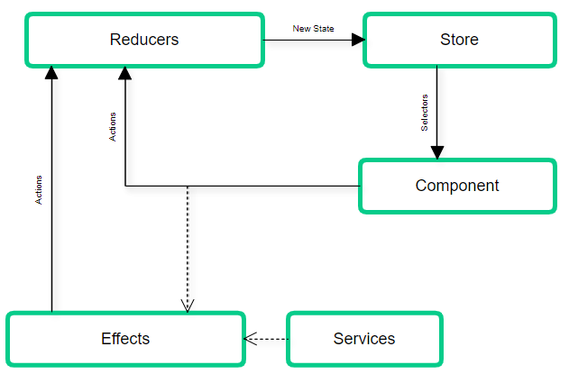

На изображении мы видим жизненный цикл ngrx. Давайте разберём его …

1. В наиболее распространенном сценарии все начинается в представлении компонента. Взаимодействие с пользователем может привести к тому, что компонент отправит действие (dispatch action).

> Действия (actions)…
В объекте хранилища (store) у вас есть функция для отправки/запуска (dispatch/trigger) действий. Действия - это классы, которые реализуют интерфейс действий NGRX/Actions. Эти классы действий имеют два свойства (давайте возьмем в качестве примера класс действия с именем GetUserName):
>
> тип (type): это строка только для чтения, описывающая, что означает действие. Например: '[Пользователь] Получить имя пользователя'
>
> Полезная нагрузка (payload): тип этого свойства зависит от того, какой тип данных это действие необходимо отправить редуктору (reducer). В случае с предыдущим примером это будет строка, содержащая имя пользователя. Не все действия требуют полезной нагрузки.

2.1. Если это действие не вызывает эффект (trigger effect), то редуктор проанализирует действие (обычно с помощью оператора switch) и вернёт новое состояние, которое будет результатом слияния старого состояния со значением, которое изменилось после вызова действия.

> Редукторы (reducers)…
Редукторы - это чистые функции, принимающие два аргумента: предыдущее состояние и действие. Когда отправляется действие, ngrx проходит через все редукторы, передавая в качестве аргументов предыдущее состояние и действие, в порядке, в котором редукторы были созданы, пока не найдет обработчик для этого действия.

2.2. Если эффект вызван отправкой действия, то это связано с тем, что некоторые побочные эффекты должны быть вызваны до вызова редуктора. Это может быть что-то вроде вызова службы HTTP для получения данных.

> Эффекты (effects)…
Эффекты в экосистеме библиотек ngrx позволяют нам иметь дело с побочными эффектами, вызванными отправкой действия вне угловых компонентов или хранилища ngrx.
Эффекты прослушивают, если отправлено какое-либо действие, затем, подобно тому, что делают редукторы, проверяет, является ли действие одним из типов действий, для которых оно имеет дело.
>
> Затем выполняется побочный эффект, обычно получение или отправка данных в API.
Наконец, будет выдано другое действие, обычно действие, относящееся к результирующему состоянию побочного эффекта (успех, ошибка и т. д.), Затем редуктор будет входить в сцену, как мы уже упоминали в потоке ngrx.

2.2.1. После того, как эффект отработал (побочные эффекты закончены), новое действие «состояние-результат» запускается эффектом (побочные эффекты могут быть успешными или неудачными), и мы вернулись к пункту 2.1.

3. Теперь у хранилища новое состояние. Состоянием может быть большим деревом - объектом, поэтому ngrx вводит селекторы, чтобы иметь возможность использовать только те фрагменты объекта, которые нам нужны в конкретном компоненте.

> Селекторы (select) …
>
> Как мы упоминали ранее, дерево состояний может стать довольно большим объектом, и не имеет смысла размещать весь этот объект там, где нужна только его часть.
>
> Хранилище NGRX предоставляет нам функцию «селектор» для получения кусочков нашего хранилища. А если нам нужно применить некоторую логику к этому кусочку перед использованием данных в компонентах?
>
> Здесь селекторы входят в игру. Они позволяют нам отделить любое преобразование данных кусочка состояния от компонентов. Функция «select» хранилища принимает в качестве аргумента чистую функцию, она и является нашим селектором.
>
> Хранилище (store)…
>
> Хранилище - это объект (экземпляр класса ngrx/Store), который объединяет вещи, о которых мы упоминали ранее (действия, редукторы, селекторы). Например, когда отправляется действие (с использованием функции отправки объекта хранилища), хранилище находит и выполняет соответствующий редуктор.
Оно также содержит состояние приложения.

## NGRX example

Отлично… итак, мы закончили с теорией, представив жизненный цикл и участников ngrx, теперь пришло время посмотреть на это в действии. Из этого легко сделать другую статью. Но, на мой взгляд, нет смысла объяснять всё то, что мы объяснили без примера кода, где мы можем видеть всё в действии, и что вы можете скачать, чтобы поиграть с ним.

В нашем примере будет список пользователей, страница сведений о пользователе и некоторая начальная информация о конфигурации, которую вы должны получить при запуске приложения. Мы собираемся реализовать некоторые важные этапы жизненного цикла ngrx.

Вот что мы собираемся реализовать:

* Установка библиотеки
* Структура папок для хранилища
* Создать состояние (State) и начальные значения
* Создать действия (Actions)
* Создать редукторы (Reducers)
* Создать эффекты (Effects)
* Создать селекторы (Selectors)
* Настроить всё вместе
* Использовать хранилище в некоторых компонентах

Итак, приступим …

## Установка библиотеки

Мы собираемся использовать Angular Cli для создания проекта, а затем добавить библиотеки ngrx.

Давайте создадим проект:

```ng new angular-ngrx - style = scss
```

Давайте добавим библиотеки ngrx, которые мы будем использовать:

```npm install @ngrx/core @ngrx/store @ngrx/Effects @ngrx/store-devtools @ngrx/router-store --save
```

Мы устанавливаем почти все библиотеки экосистемы ngrx. Большинство из них совершенно ясно представляют их назначение. Например, ядро(core), хранилище, эффекты. Но есть пара, которая может удивить вас своим предназначением.

* store-devtools - мощная утилита для отладки.
* router-store - сохраняет состояние маршрутизатора Angular в хранилище.

## Структура папок хранилища

Давайте начнем с обсуждения файловой структуры хранилища. Эта файловая структура и вся конфигурация хранилища должны быть в основном (core) модуле вашего приложения. Но в нашем примере у нас его нет, поэтому хранилище будет существовать в нашем модуле приложения (шаги в значительной степени совпадают, если вы расположите его в вашем основном модуле).

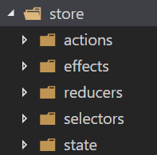

Структура папок представляет фактическую структуру объекта хранилища. У вас будет главная папка с названием «store» и пять вложенных папок, которые представляют каждого из ключевых игроков хранилища: «Actions», «Effects», «Redurs», «Selectors» и «State».

## Создание состояния и начальных значений

Как мы уже упоминали ранее, в нашем приложении будет две основных структуры: пользователи и конфигурация. Для них обоих нам нужно создать объект состояния и начальное значение, а также сделать то же самое для структуры приложения.

Мы создали два интерфейса для определения объекта пользователя и конфигурации. У нас также есть ещё один для результата HTTP запроса получения объекта пользователя, это просто массив IUser.

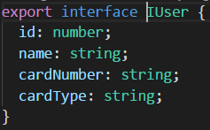

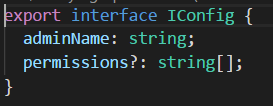

Начнём с состояния пользователя: `store/state/user.state.ts`

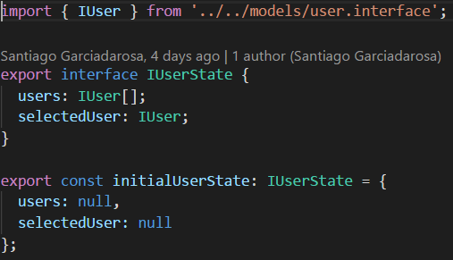

То, что мы сделали здесь очевидно:

* Мы создаем и экспортируем интерфейс со структурой состояния пользователя.
* Мы делаем то же самое с начальным значением состояния пользователя, которое реализует (implement) созданный интерфейс.

Для состояния конфигурации мы делаем то же самое `store/states/config.state.ts`:

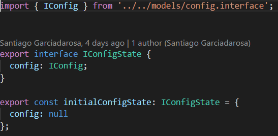

Наконец, нам необходимо сгенерировать состояние приложения `store/states/app.state.ts`

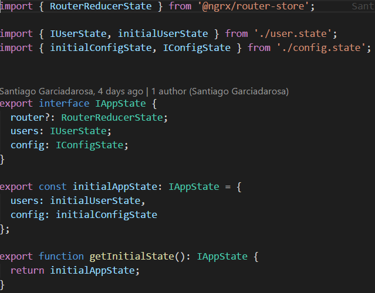

1. Состояние приложения содержит состояние пользователя и конфигурации, а также состояние 2. маршрутизатора.
3. Затем у него есть начальное значение состояния приложения.
Наконец, экспортирует функцию, чтобы получить значение начального состояния (мы будем использовать это позже).

## Создание действия

> Обязательно прочитайте определение действия, которое мы обсуждали в этой статье.

Нам нужно создать действия для пользователей и настройки. Начнем с действий пользователя `store/actions/user.actions.ts`:

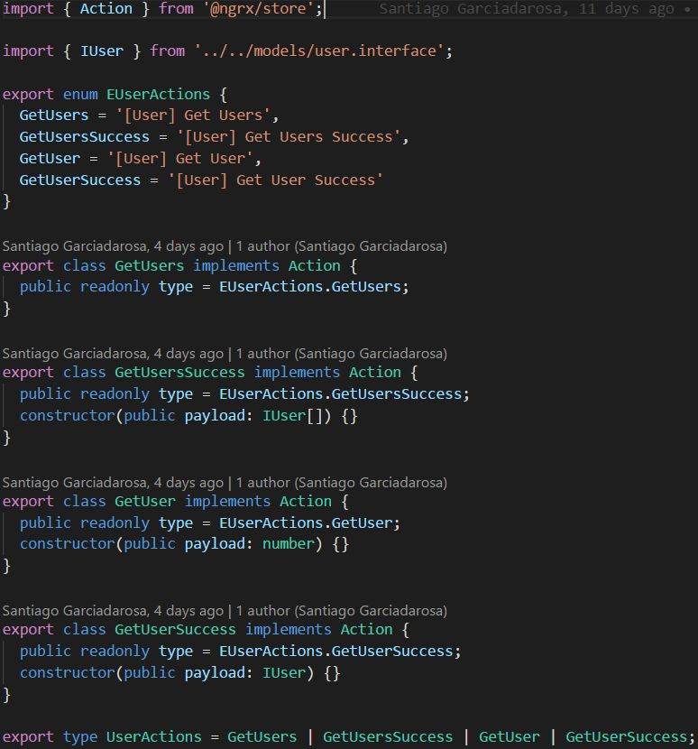

Так что это хороший пример действий, которые создаются для функции или сущности (entity) в нашем приложении. Давайте немного пройдемся по коду:

1. Мы экспортируем объект перечисляемого типа (enum), содержащий определение для типов действий. Таким образом, мы избегаем использования и дублирования строк для типов действий. Этот процесс может легко порождаться ошибками.
2. Мы создаем и экспортируем класс для каждого из ваших действий. Все они должны реализовывать интерфейс ngrx/Action. Наконец, мы устанавливаем тип (type) действия в одно из значений перечисляемого (enum) объекта, и если вам нужна полезная нагрузка (payload) действия, вы добавляете его в конструктор класса.
3. Наконец, мы экспортируем тип, содержащий наши классы действий. Это обеспечит нам проверку типов (typescript), которую мы можем использовать, например, в наших редукторах.

Ну вот всё … создавать действия просто. Давайте посмотрим, как выглядят действия конфигурации `store/actions/config.actions.ts`:

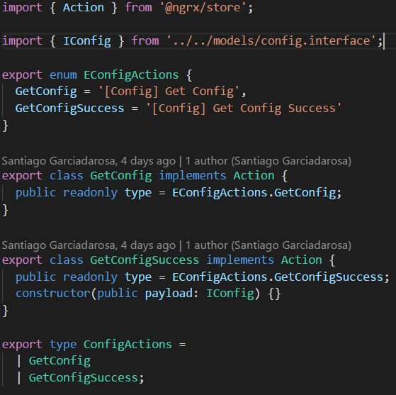

Здесь нет ничего нового, и вы, скорее всего, теперь можете легко понять содержимое файла.

Отлично, мы уже определили состояние и действия … давайте создадим редукторы!

## Создание редукторов (reducers)

> Обязательно прочтите определение редукторов, которое мы обсуждали в этой статье.

У нас будут редукторы, реагирующие на некоторые действия, потому что другие будут обрабатываться эффектами, которые мы собираемся реализовать позже.

Нам понадобится редуктор для пользователей и другой для конфигурации, но нам также понадобится генерировать редукторы приложений, давайте начнем с рассмотрения редукторов пользователей `store/reducers/user.reducers.ts`:

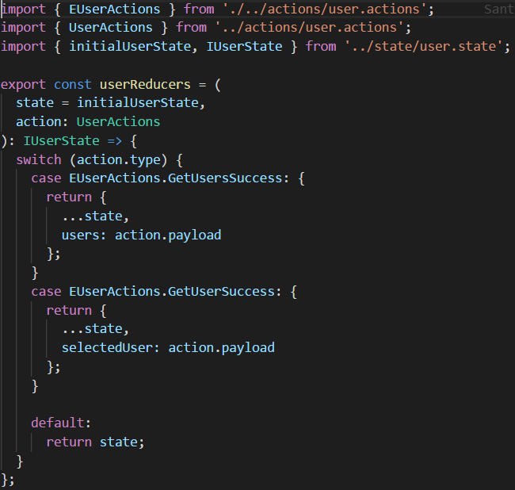

Давайте обсудим реализацию:

1. Объявление редуктора получает состояние. В этом случае оно также получает действия пользователя, и возвращает состояние реализующее интерфейс IUserState.
2. Используя оператор switch, мы генерируем обработчики для каждого возможного типа действия.
3. Каждый случай возвращает новый объект, который является результатом слияния старого состояния и нового значения.
4. У каждого редуктора есть результат по умолчанию, который просто возвращает состояние без каких-либо изменений.

И это всё. Вы не найдёте ничего иного в редукторе. Давайте посмотрим на редукторы конфигурации state/redurs/config.reducers.ts:

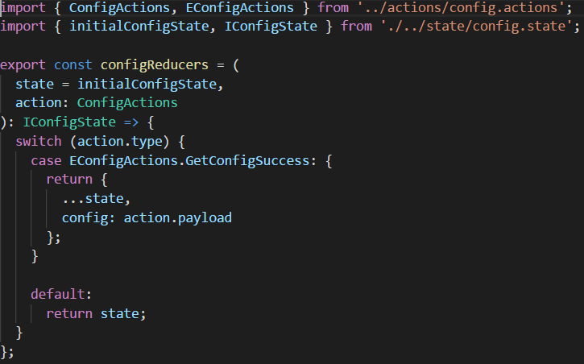

Глядя на этот код, вы, вероятно, легко его понимаете, т. к. мы уже это всё обсуждали.

Наконец, давайте посмотрим на редукторы приложения (хранилище):

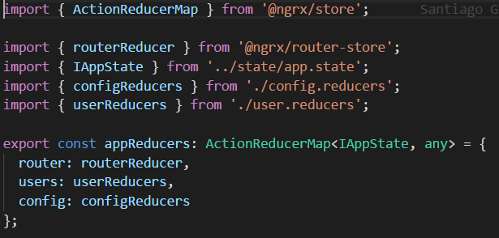

Здесь мы добавляем все редукторы в связанный список (reducer map), обрабатывающий действия приложения. Мы используем связанный список редуктора действий для добавления проверки типов действий. Позже мы предоставим (provide) редукторы этого приложения в модуле (angular module) хранилища.

Отлично!… Теперь у нас есть наше состояние, наши действия, наши редукторы, но нам всё ещё нужны эффекты и селекторы. Давайте добавим наши эффекты …

## Создание эффектов

> Обязательно прочтите определение «Эффектов», которое мы уже обсуждали в этой статье.

Вы, наверное, уже заметили, что в редукторах мы не обрабатываем все действия, которые мы создали. Это потому, что мы собираемся обработать пропущенные действия в эффектах, потому что эти действия имеют побочные эффекты.

Давайте начнем с пользовательских эффектов store/effects/user.effects.ts:

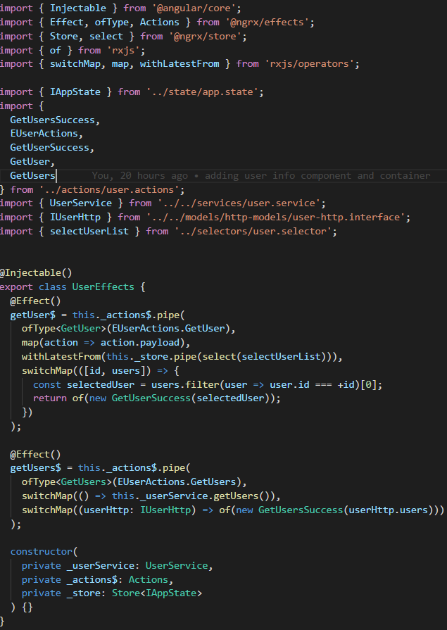

В этом файле у нас много чего происходит. Давайте попробуем объяснить это:

1. Мы объявляем наши пользовательские эффекты с помощью декоратора внедряемых зависимостей (injectable decorator).
2. Мы объявляем наши эффекты, используя декоратор эффектов, предоставленный библиотекой ngrx/Effects.
3. Используя действия, предоставляемые ngrx/Effects, мы собираемся запустить конвейер (pipe) нашего оператора для этого эффекта.
4. Следующим шагом является определение типа действия в эффекте с помощью оператора ofType.
5. Следующие части представляют собой операторы rxjs, которые мы используем для получения того, что нам нужно (у нас уже есть ссылка на документацию по rxjs в этой статье).
6. Наконец, в последнем операторе Effect собирается отправить другое действие
7. В конструкторе мы внедряем сервисы, которые собираемся использовать, действия для ngrx/effects и, в данном случае, хранилище (учтите, что это демонстрационная версия, и мы получаем выбранного пользователя из списка пользователей в наше хранилище)

Это в значительной степени та же самая структура, которую вы увидите в любом описании эффекта. В этом случае мы отправляем только успешное действие, но мы можем отправлять ошибки или любое другое состояние, которое мы хотим обработать в наших редукторах приложений.

Давайте посмотрим на эффекты конфигурации store/effects/config.effects.ts:

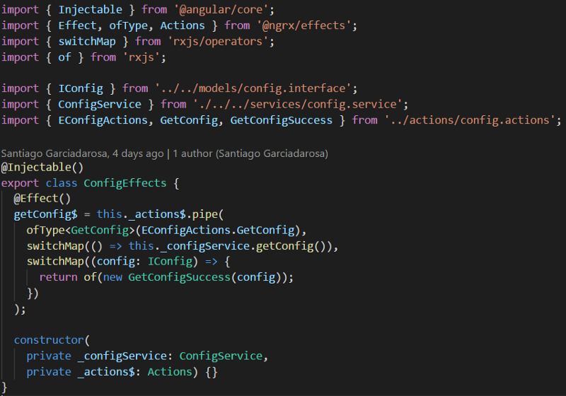

И снова, вы, вероятно, чувствуете себя комфортно читая этот код.

Теперь пришло время поговорить о селекторах …

## Создание селекторов (selectors)

> Обязательно прочитайте определение Селекторов, которое мы обсуждали в этой статье.

Нет смысла повторять выборки фрагмент (slices) нашего состояния повсеместно, поэтому давайте создадим некоторые селекторы, которые мы можем использовать повторно.

Как всегда, давайте сначала увидим пользовательские селекторы store/selectors/user.selectors.ts:

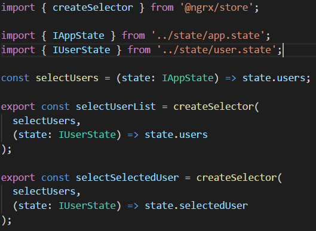

Этот код просто понять, потому что мы не делаем никаких преобразований данных в наших селекторах, вместо этого мы возвращаем фрагмент хранилища, на который ссылается селектор, используя функцию createSelector из ngrx/store.

Первый параметр - это фрагмент хранилища, которое будет использоваться для получения данных (это может быть массив с несколькими объектами состояния), второй параметр - это анонимная функция, которая будет решать, какой селектор возвращать.

Вот так создаются селекторы. Давайте посмотрим на хранилище настроек `config/selectors/config.selectors.ts`:

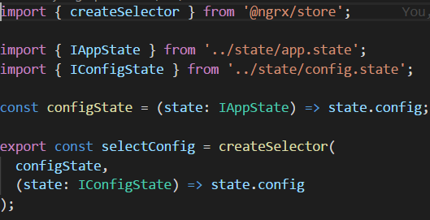

Как и раньше, вы уже чувствуете себя комфортно читая этот код.

Мы уже создали все необходимое для хранилища, но нам нужно собрать всё это вместе. Для этого давайте посмотрим на следующий раздел.

## Настроить всё вместе

Отлично, мы создали все, что нужно нашему хранилищу, но нам пока не хватает одной вещи - собрать всё воедино. Я собираюсь сделать это в модуле приложения, но вы можете применить то же самое в основном модуле вашего приложения.

Давайте посмотрим модуль приложения:

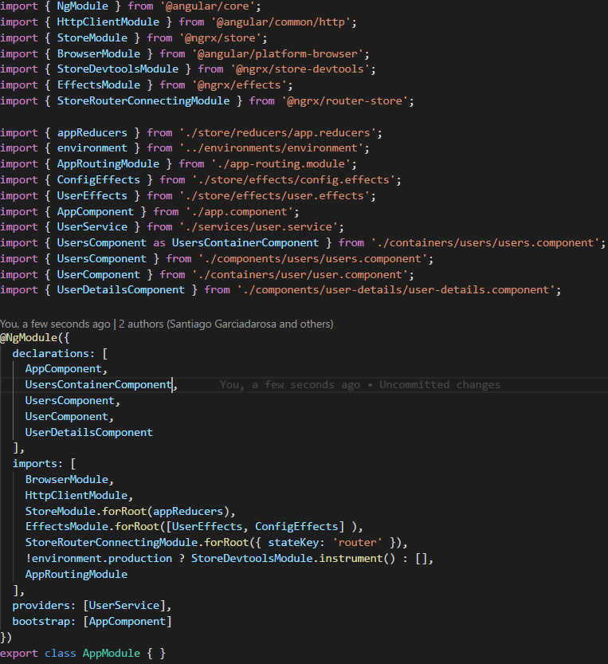

Давайте перечислим то, что необходимо для настройки нашего хранилища:

1. Мы импортируем наши редукторы и предоставляем их в forRoot модуля хранилища.
2. Мы импортируем наши эффекты и предоставляем их внутри массива в forRoot модуля эффектов.
3. Мы устанавливаем конфигурацию для модуля состояния маршрутизатора, предоставляющего маршрутизатор stateKey.
4. И мы добавляем инструменты разработчика хранилища для среды разработки.

Первые два шага необходимы, в то время как шаги 3 и 4 я настоятельно рекомендую, но они не являются обязательными.

Теперь мы наконец закончили … мы можем использовать хранилище в наших компонентах!

## Использование хранилища в некоторых компонентах

Может быть, сейчас вы думаете:

> Великий Санти, я потратил 20 минут, читая твою статью, я знаю, что мне нужно знать о ngrx: что это такое, когда его использовать, как его настроить … и это здорово, но не могли бы вы показать мне сейчас, как я могу это использовать!

Да, я могу! Пожалуйста, не теряйте интерес, мы приближаемся к концу! Давайте посмотрим, как использовать наше хранилище …

Во-первых, давайте получим конфигурацию при запуске приложения:

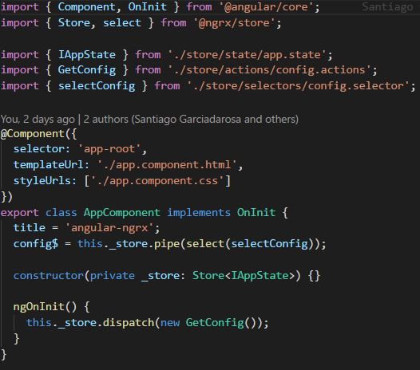

1. Мы добавляем хранилище в наш app.component.
2. Мы устанавливаем для свойства компонента значение селектора в конфигурации, потому что мы хотим показать часть этой информации в HTML.
3. В ngOnInit мы отправляем действие, чтобы получить конфигурацию.

Вот и всё … Мы уже написали код эффекта, который будет обрабатывать это действие, и редуктор, который будет обрабатывать успех этого эффекта. Как только хранилище приобретёт новое состояние, селектор изменит значение нашего свойства. Удивительно!

Вот как мы связываем HTML:

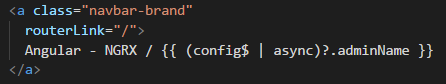

Как только у config$ изменится значение, мы увидим его в HTML.

Теперь давайте посмотрим список пользователей `container/users/users.component.ts`:

> Я использую концепции компонентов контейнеров и презентационных компонентов. Если вы не знакомы с этим подходом, посмотрите [здесь](https://medium.com/@dan_abramov/smart-and-dumb-components-7ca2f9a7c7d0).


1. Подобно тому, как мы управляем конфигурацией, мы собираемся получить список пользователей. Сначала мы внедряем хранилище в компонент пользователя.
2. На onInit мы отправляем действие, чтобы получить пользователей.
3. Мы создаем свойство для компонента и присваиваем ему список пользователей, используя селектор списка пользователей.

HTML выглядит так:

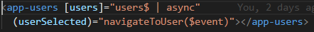

Мы отображаем список пользователей в презентационном компоненте, отправляя список и привязываем выбранного пользователя к функции навигации, которую мы видим в компоненте контейнера пользователя выше.

Отлично… а как мы показываем выбранного пользователя?…

Давайте посмотрим на компонент пользовательского контейнера:

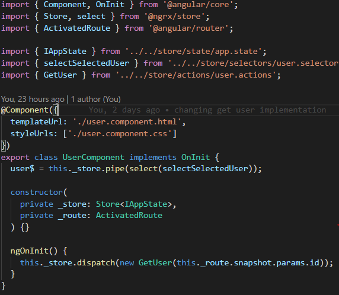

Этот компонент получает параметр id из активированного маршрута, а с остальным вы, вероятно, уже знакомы. Отправление id в качестве параметра, выбор выбранного пользователя…
Если вы хотите увидеть весь код, просто зайдите в репозиторий GitHub.
Если вы отлаживаете приложение, вы можете увидеть инструменты разработчика, которые довольно просты в использовании… но мы достаточно подробно рассмотрели эту статью, и я надеюсь, что вы без труда разберетесь с этими инструментами.

## Заключение

В этой статье я попытался предоставить ясное и чёткое введение в ngrx, описав всё, что вам нужно знать, чтобы войти в этот мир.

Мы начали объяснять понятия, разбираться, как это работает, зачем оно используется, и, наконец, мы рассмотрели полный базовый пример.

[Вот репозиторий GitHub…](https://github.com/SantiagoGdaR/angular-ngrx)

Я рекомендую вам скачать его и немного поиграть с кодом.

Я действительно надеюсь, что эта статья поможет вам понять шаблон работы ngrx.

## Немного благодарностей…

Спасибо [@leosvel.perez.espinosa](https://medium.com/@leosvel.perez.espinosa) за то, что он уделил некоторое время обсуждению со мной некоторых функций ngrx и [@fevialmeida](https://medium.com/@fevialmeida) за этот невероятный баннер!

> Примечание переводчика: примеры кода дополнены комментариями, исправлены незначительные ошибки, текст незначительно сокращён для более литературно красивого перевода.
