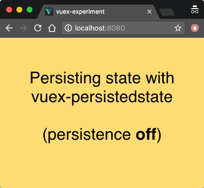
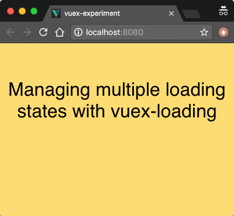

# Пять плагинов Vuex

*Перевод статьи [Anthony Gore](https://twitter.com/anthonygore): [5 Vuex Plugins For Your Next VueJS Project](https://vuejsdevelopers.com/2017/09/11/vue-js-vuex-plugins/). Опубликовано с разрешения автора.*

***

Можно привести много доводов использования Vuex в целях управления состоянием приложения.

Одним из таких доводов можно назвать возможность расширения возможностей Vuex при помощи дополнительных плагинов.

Разработчиками из сообщества Vuex было создано огромное количество бесплатных плагинов. Эти плагины могут расширить функционал Vuex настолько, насколько позволит воображение обычного разработчика. А некоторые из них даже выходят за пределы воображения некоторых разработчиков.

В этой статье будет дан краткий обзор пяти плагинов под Vuex, которые вы сможете добавить в свой следующий проект:

  * Сохранение state приложения
  * Синхронизация state между вкладками
  * Локализация приложения
  * Управление state приложения
  * Кэширование actions

## Сохранение state приложения

Плагин [vuex-persistedstate](https://github.com/robinvdvleuten/vuex-persistedstate "Persist Vuex state with localStorage") использует localStorage браузера для сохранения текущего состояния приложения (state) между сессиями.

Другими словами, обновление страниц или закрытие вкладок браузера не позволит потерять уже введенные данные.

Показательным примером работы данного плагина может послужить интернет-магазин: если пользователь вдруг случайно закроет вкладку браузера, то можно снова открыть её и все ранее введенные данные останутся сохраненными:



## Синхронизация state между вкладками

Плагин [vuex-shared-mutations](https://github.com/xanf/vuex-shared-mutations) позволяет синхронизировать состояние проекта (state) между открытыми вкладками нескольких запущенных браузеров.

Такой метод осуществляется благодаря сохранению мутации (mutation) в local storage. Возникающее событие в storage запускает процесс обновления во всех остальных вкладках/окнах, что в свою очередь запускает мутацию.

Таким образом выполняется синхронизация состояния (state) приложения.


## Локализация приложения

При помощи плагина [vuex-i18n](https://github.com/dkfbasel/vuex-i18n "vuex-i18n") можно выполнять локализацию приложения путём сохранения контента в многоязычном формате. Когда плагин настроен и подключен, то переключить язык контента в приложении - очень простая задача.

Замечательной особенностью плагина является возможность сохранения строк контента совместно с токенами (tokens), например так:

```js
Hello {name}, this is your Vue.js app.
```

Все переводы могут храниться в виде строк с одним и тем же токеном:


## Управление state приложения

С помощью плагина [vuex-loading](https://github.com/f/vuex-loading) можно управлять несколькими состояниями (states) приложения. Удобство использования данного плагина очевидно при разработке приложения, в котором часто меняются состояния (states), которые можно легко отследить:



## Кэширование actions

Плагин [vuex-cache](https://github.com/superwf/vuex-cache "vuex-cache") может кэшировать действия (actions) Vuex. К примеру, если приложение получает данные с сервера, то плагин может сохранять первоначально полученные результаты и выдавать их при соответствующих запросах.

Если есть необходимость удалить кэшированные данные - это можно сделать очень просто.


В заключение я хотел бы услышать о ваших любимых Vuex-плагинах в комментариях к этой статье.

***
