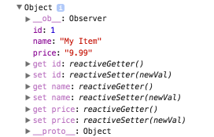

# Реактивность Vue.js

*Перевод статьи  [Anthony Gore](https://twitter.com/@anthonygore): [Reactivity In Vue.js (And Its Pitfalls)](https://vuejsdevelopers.com/2017/03/05/vue-js-reactivity/).*

В статье рассматривается система реактивности Vue.js и приводится пример того, когда эта система не работает.

Также даются **два способа** решения этой проблемы, один из которых  —  использование встроенного метода [Vue.set](https://vuejs.org/v2/api/#Vue-set).

---

Одна из возможностей, за которую мы любим Vue.js - это система **реактивности**. Для наглядного примера такой реактивности Vue.js можно привести нижеследующий код.

В этом примере первоначально в шаблоне генерируется вывод текста "Hello World". Затем по истечении 2 секунд текст в шаблоне меняется на "Goodbye World":

```js
var app = new Vue({
  el: '#app',
  data: {
    message: 'Hello World'
  }
})

setTimeout (() => {
  app.message = 'Goodbye World'
}, 2000)

<div id="app">
  {{ message }}
</div>
```

В приведенном выше примере ключ `message` объекта `data` является **реактивным**. Это означает, что при любом изменении значения ключа `message` происходит автоматическое изменение выводимого значения в шаблоне.

## Ловушка системы реактивности

Фреймворк Vue.js сконфигурирован таким образом, чтобы автоматически добавлять возможность реактивности для любого из создаваемых в модели данных свойств: `data`, `computed property`, `props` и т. п.

Такая автоматизация предоставляет ряд несомненных преимуществ при создании приложений на Vue.js:

  * сокращает время на разработку приложения
  * делает исходный код приложения более лаконичным
  * помогает минимизировать когнитивную нагрузку разработчика

Другими словами - делает жизнь разработчика более простой.

Однако, такая простота имеет свою обратную сторону медали. Подвох в данном случае подобен аналогии автомобилю с автопилотом.

Автоматическая реактивность делает нас как разработчиков *ленивыми*. И когда что-то работает не так, как мы бы этого ожидали - *мы не знаем*, в чем причина того, что так произошло.

## Когда реактивность оборачивается злом

Один из студентов курса [Ultimate Vue.js Developers](https://www.udemy.com/vuejs-2-essentials/) столкнулся с интересной проблемой и поделился ею со мной. Этот студент работает над проектом [Vue.js Poster Shop](http://vuejs-poster-shop.vuejsdevelopers.com/) - первый учебный проект данного курса.

В этом проекте есть задача - создание объектов `shopping cart` при помощи Vue.js. Такой объект `cart` отображается в действующем проекте как обычный JavaScript-объект:

```js
var myProduct = {
  id: 1,
  name: 'myProduct',
  price: 9.99
}
```

Однако, в объекте `myProduct` также присутствует свойство `quantity`, которое добавляется в этот объект динамически при помощи метода `addToCart`:

```js
function addToCard (id) {
  var item = this.cart.findById(id)
  if (item) {
    item.quantity += 1
  } else {
    item.quantity = 1
    this.cart.push(item)
  }
}
addToCard(myProduct.id)
```

Логика этого метода следующая:

  * проверить существование объекта в коллекции объектов `cart`
  * если объект уже существует в коллекции `cart`, то изменить значение свойства `quantity` данного объекта
  * если такого объекта не существует, то создать такой объект и присвоить ему свойство `quantity` со значением `1`; затем добавить созданный объект в коллекцию объектов `cart`

## Появляется проблема

Коллекция объектов `cart` представляет из себя простой список объектов в шаблоне:

```html
<ul class="shopping-cart">
  <li v-for="item in cart", :key="item.id">
    {{ item.name }} x {{ item.quantity }}
  </li>
</ul>
```

Проблема заключается в том, что в шаблоне значение ключа `quantity` **всегда** будет выводиться как `1`. Другими словами, вне зависимости от того, изменилось ли значение ключа `quantity` или просто этому ключу было присвоено значение `1` - **в любом случае** в шаблоне будет выведено значение `1`.

Моей первой мыслью было, что логика метода `addToCard` имеет в себе ошибку.

Но после непродолжительной отладки кода я обнаружил, что метод `addToCard` работает правильно и значение ключа `quantity` в действительности изменяется каждый раз, когда вызывается метод `addToCard`.

Так что проблема была не здесь.

## Как реактивность работает "под капотом"

Как уже упоминалось ранее, побочным следствием автоматической работы системы реактивности Vue.js является тот факт, что если код работает не так, как было задумано, разработчику трудно понять, что является причиной такого поведения.

Однако, такой ситуации можно избежать, если понимать, как в действительности работает система реактивности Vue.js.

### Getters и setters

Стандартное поведение JavaScript-объекта, когда производится извлечение значения или изменение значения какого-либо ключа этого объекта - вопрос однозначный.

К примеру, имеется такой JavaScript-объект:

```js
var myObj = {
  a: 'Hello World'
}
``` 

Извлечение значения ключа `a` объекта `myObj` можно выполнить таким образом:

```bash
console.log(myObj.a) // => 'Hello World'
```

Однако, если для данного объекта задать псевдо-свойства `get` и `set`, то эти методы переопределят стандартное поведение данного объекта. Для более подробной информации об обоих псевдо-свойствах можно перейти по ссылкам - [getter](https://developer.mozilla.org/en-US/docs/Web/JavaScript/Reference/Functions/get) и [setter](https://developer.mozilla.org/en-US/docs/Web/JavaScript/Reference/Functions/set).

Когда происходит **первоначальное** создание экземпляра Vue, то для каждого свойства - `data`, `computed property` и т. п. Vue.js автоматически создает пару getter/setter.

Такой набор из getter и setter позволяет Vue автоматически отслеживать любое изменение в любом свойстве и также автоматически отображать эти изменения в шаблоне.

### reactiveSetter()

Вернемся назад, к JavaScript-объекту `myProduct`:

```js
var myProduct = {
  id: 1,
  name: 'myProduct',
  price: 9.99
}
```

После того, как экземпляр Vue был инициализирован, можно открыть консоль браузера и увидеть, что для каждого ключа этого объекта Vue.js создал пару getter/setter:




Эти функции getter и setter выполняют большой объем работы (посмотрите [исходный код](https://github.com/vuejs/vue)).

Наиболее примечательной в нашем случае является функция `reactiveSetter()`, задача которой  - уведомлять об изменениях, результатом чего является обновление данных в шаблоне.

### Подробнее

Vue.js является отличным фреймворком, за исключением одного случая.

Если в **существующий** объект добавить или удалить свойство **после того**, как этот объект был инициализирован системой Vue.js, то Vue ничего не будет **знать** об этом вновь добавленном свойстве.

Например, добавим с JavaScript-объект `myProduct` новое свойство `quantity` **после того**, как Vue.js выполнил инициализацию этого объекта:

```js
myProduct.quantity = 1
```

Если снова откроем консоль браузера и посмотрим на объект `myProduct`, то увидим следующую картину.

Свойство `quantity` было добавлено в объект, но у свойства `quantity` **нет пары** getter/setter, в отличие от остальных свойств этого объекта.

## Обновление реактивных объектов

В примере с объектом `myProduct` проблему обновления реактивного объекта можно решить **двумя способами**.

**Первый способ** - это **создать новый объект** и затем добавить его в коллекцию уже существующих объектов.

Такой подход даёт гарантию того, что у Vue.js будет возможность создать пару getter/setter для каждого свойства вновь создаваемого объекта.

Например, так:

```js
function addToCard (id) {
  var item = this.cart.findById(id)
  if (item) {
    item.quantity += 1
  } else {
    var newItem = {
      id: item.id,
      name: item.name,
      price: item.price,
      quantity: 1
    }
    this.cart.push(item)
  }
}
addToCard (myProduct.id)
```

## Метод Vue.set

**Второй способ** обновления реактивного объекта - это использование метода `Vue.set`.

Данный метод гарантирует, что для вновь создаваемого свойства в уже существующем реактивном объекте будут создана пара getter/setter и данное свойство также станет **реактивным**.

В примере ниже свойство `quantity` добавляется в объект `item` не напрямую - `item.quantity = 1`, а используется встроенный метод `Vue.set`, который принимает на вход **три аргумента**:

 * объект, в который будет добавляться новое свойство
 * имя нового свойства
 * значение нового свойства

Метод `Vue.set` добавит в объект `item` новое свойство `quantity` и автоматически создаст для этого свойства пару getter/setter, тем самым сделав свойство `quantity` **реактивным**:

```js
function addToCard (id) {
  var item = this.cart.findById(id)
  if (item) {
    item.quantity += 1
  } else {
    Vue.set(item, 'quantity', 1)
    this.cart.push(item)
  }
}
addToCard (myProduct.id)
```

## Массивы

Подобно объектам, массивы также являются реактивными в системе Vue.js и благодаря этому могут отслеживать факт наличия изменений.

Также как и с объектами, в массив нельзя добавить новый элемент "напрямую" и ожидать реактивности от нового элемента.

Например, добавление в массив нового элемента по индексу не даст желаемого результата:

```js
app.myArr[index] = value
```

Вместо этого нужно использовать метод `Vue.set`:

```js
Vue.set(app.myArr, index, value)
```

---

*Слушайте наш подкаст в [iTunes](https://itunes.apple.com/ru/podcast/девшахта/id1226773343) и [SoundCloud](https://soundcloud.com/devschacht), читайте нас на [Medium](https://medium.com/devschacht), контрибьютьте на [GitHub](https://github.com/devSchacht), общайтесь в [группе Telegram](https://t.me/devSchacht), следите в [Twitter](https://twitter.com/DevSchacht) и [канале Telegram](https://t.me/devSchachtChannel), рекомендуйте в [VK](https://vk.com/devschacht) и [Facebook](https://www.facebook.com/devSchacht).*

[Статья на Medium](https://goo.gl/YYrFU8)


