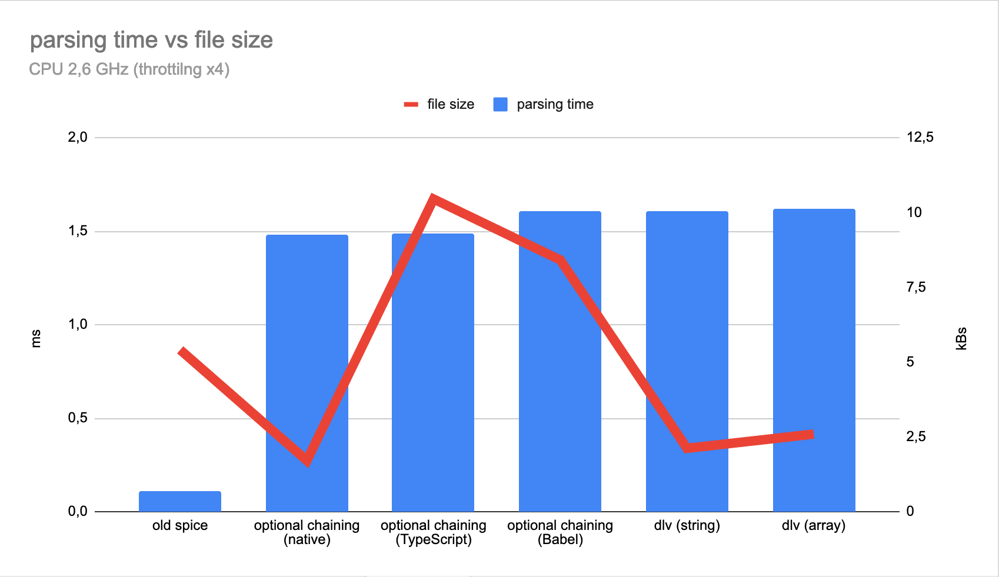

# Производительность optional chaining в JavaScript

*Перевод статьи [Eryk Napierała](https://github.com/erykpiast): [Performance of JavaScript optional chaining](https://allegro.tech/2019/11/performance-of-javascript-optional-chaining.html)*


Одной из самых крутых возможностей, добавленных в [только что анонсированный TypeScript 3.7](https://devblogs.microsoft.com/typescript/announcing-typescript-3-7/) стал синтаксис `optional chaining`. Он предлагает гораздо более короткий и удобочитаемый код для работы с глубоко вложенными структурами данных. Как эта классная новая фича может повлиять на производительность вашего проекта?

На первый взгляд, синтаксис `optional chaining` может значительно сократить код. Вместо написания такого чудовищного кода, как этот:

```js
foo && foo.bar && foo.bar.baz && foo.bar.baz.qux
```

вы можете написать это

```js
foo?.bar?.baz?.qux;
```

19 символов вместо 48. Вполне лаконично!

## Размер бандла

Дело в том, что очень маловероятно, что новым синтаксисом сможет воспользоваться конечный пользователь. На момент написания поста только [Chrome 80](https://www.chromestatus.com/feature/5668249494618112) поддерживает его. Так что, по крайней мере, сейчас транспиляция обязательна.

Как выглядит вышеприведённое выражение на [чистом JavaScript](https://www.typescriptlang.org/play/index.html?ssl=1&ssc=1&pln=1&pc=20#code/GYexH4DoCMEMCcpwF5QI4FcAeBuIA)?

```js
var _a, _b, _c;
(_c = (_b = (_a = foo) === null || _a === void 0 ? void 0 : _a.bar) === null || _b === void 0 ? void 0 : _b.baz) === null || _c === void 0 ? void 0 : _c.qux;
```

Ну, это гораздо больше, чем 19 символов, даже больше, чем 48, которые вы могли видеть в изначальном варианте. Чтобы быть точным, здесь 172 символа! Минификация уменьшает это число, но это всё ещё 128, что в 6 раз больше по сравнению с исходным кодом.

```js
var _a,_b,_c;null===(_c=null===(_b=null===(_a=foo)||void 0===_a?void 0:_a.bar)||void 0===_b?void 0:_b.baz)||void 0===_c||_c.qux;
```

К счастью, компилятор TypeScript - не единственный вариант, которым мы располагаем. [Babel поддерживает `optional chaining`](https://babeljs.io/docs/en/babel-plugin-proposal-optional-chaining) так же хорошо.

Давайте проверим, [как это работает с новым синтаксисом](https://babeljs.io/repl#?babili=false&browsers=&build=&builtIns=false&spec=false&loose=false&code_lz=GYexH4DoCMEMCcpwF5QI4FcAeBuIA&debug=false&forceAllTransforms=false&shippedProposals=false&circleciRepo=&evaluate=false&fileSize=false&timeTravel=false&sourceType=module&lineWrap=false&presets=&prettier=false&targets=&version=7.7.1&externalPlugins=%40babel%2Fplugin-proposal-optional-chaining%407.6.0%2Cbabel-plugin-syntax-optional-chaining%407.0.0-alpha.13). Это лучше, чем TypeScript? Что-то не похоже! 244 символа.

```js
var _foo, _foo$bar, _foo$bar$baz;

(_foo = foo) === null || _foo === void 0 ? void 0 : (_foo$bar = _foo.bar) === null || _foo$bar === void 0 ? void 0 : (_foo$bar$baz = _foo$bar.baz) === null || _foo$bar$baz === void 0 ? void 0 : _foo$bar$baz.qux;
```

Однако, после запуска Terser, код стал меньше, чем минифицированная версия TypeScript - 82 символа.

```js
var l,n;null==u||null===(l=u.bar)||void 0===l||null===(n=l.baz)||void 0===n||n.qux
```

Так что, в лучшем случае, у нас приходится около 4 символов в финальном бандле на каждый символ в исходном коде. Сколько раз вы могли бы использовать `optional chaining` в проекте среднего размера? 100? Если перейдете на новый синтаксис таким образом, вы просто добавите 3,5 КБ в финальный бандл. Что выглядит так себе.

## Альтернативы

Давайте вернемся немного назад. Идея `optional chaining` совсем не нова. Решения проблем невероятно && длинных && цепочек && из двойных амперсандов && существуют уже достаточно давно. Решение Джейсона Миллера [dlv](https://github.com/developit/dlv) лишь одно из многих.

```js
dlv(foo, 'bar.baz.qux');
```

К тому же, этот подход не так хорош, как новый синтаксис, потому что он небезопасный с точки зрения типов, для него требуется немного больше кода - 25 символов. Кроме того, вы должны импортировать функцию из библиотеки. Но как код выглядит в финальном бандле?

```js
d(u,'bar.baz.qux');
```

Вот так сюрприз! 19 символов, на столько же кратко, как и в синтаксисе `optional chaining`.

Если вам некомфортно работать со строками, вы можете передать в функцию массив строк. И хотя как в исходном так и в конечном коде символов больше, возможно стоит это сделать. Вы увидите позже почему.

```js
dlv(foo, ['bar', 'baz', 'qux']);
```

Реализация самой функции занимает всего 101 символ после минификации.

```js
function d(n,t,o,i,l){for(t=t.split?t.split("."):t,i=0;i<t.length;i++)n=n?n[t[i]]:l;return n===l?o:n}
```

Это означает, что достаточно использовать `optional chaining`, транспилированный при помощи Babel дважды, и вы получите больше кода, чем с помощью функции `dlv`. Получается новый синтаксис бесполезен?

## Время парсинга (синтаксического анализа)

Количество кода влияет не только на загрузку файла, но и на время его парсинга. С помощью [estimo](https://www.npmjs.com/package/estimo) мы можем оценить (😉) это значение. Ниже представлены медианные результаты запуска инструмента около 1000 раз для всех вариантов, каждый из которых содержит 100 равных `optional chainings`.



Похоже, что время парсинга зависит не только от размера кода, но и от используемого синтаксиса. Относительно большой "проверенный временем" вариант занимает значительно меньше времени на парсинг, чем все остальные, даже, чем самый маленький вариант (нативный `optional chaining`).

Но это только из любопытства. Как видите при таком масштабе различия незначительны. Все варианты парсятся меньше, чем за 2 мс. Это происходит максимум один раз во время загрузки страницы, так что практически это бесплатная операция. Если в вашем проекте встречается намного больше конструкций `optional chaining`, допустим десять тысяч, или вы запускаете код на очень медленных устройствах - тогда результаты могут иметь значение. Иначе, наверное, не стоит беспокоиться об этом.

## Производительность в рантайме

Однако производительность зависит не только от размера бандла. Насколько быстрой является конструкция `optional chaining`, когда дело доходит до исполнения кода? Ответ следующий: невероятно быстрой. Использование нового синтаксиса, даже транспилированного в ES5 код, может дать прирост в скорости до 30x (!) по сравнению с `dlv`. И всего 6x, если вы используете массивы вместо строк.


Не важно работаете ли вы с [пустым объектом](https://jsperf.com/optional-chaining-empty-object), [заполненным](https://jsperf.com/optional-chaining-full-path) или [с объектом, свойство которого имеет значение null](https://jsperf.com/optional-chaining-null-inside), подходы, не использующие функцию доступа, гораздо более эффективны.

## Заключение

Так всё же, конструкция `optional chaining` быстрая или медленная? Ответ понятен и не удивляет: зависит от обстоятельств. Вам нужно 150 миллионов операций в секунду в вашем приложении или достаточно 25? Может ли более медленная реализация уменьшить FPS ([кадровая частота](https://ru.wikipedia.org/wiki/%D0%9A%D0%B0%D0%B4%D1%80%D0%BE%D0%B2%D0%B0%D1%8F_%D1%87%D0%B0%D1%81%D1%82%D0%BE%D1%82%D0%B0)) ниже 60? Имеет ли смысл бороться с этими несколькими килобайтами, получившимися в результате транспиляции? Возможно ли, что время загрузки приложения значительно увеличивается из-за этого роста?

Теперь у вас есть все данные, решать вам.

- - - -

*Слушайте наш подкаст в [iTunes](https://itunes.apple.com/ru/podcast/девшахта/id1226773343) и [SoundCloud](https://soundcloud.com/devschacht), читайте нас на [Medium](https://medium.com/devschacht), контрибьютьте на [GitHub](https://github.com/devSchacht), общайтесь в [группе Telegram](https://t.me/devSchacht), следите в [Twitter](https://twitter.com/DevSchacht) и [канале Telegram](https://t.me/devSchachtChannel), рекомендуйте в [VK](https://vk.com/devschacht) и [Facebook](https://www.facebook.com/devSchacht).*

*Если вам понравилась статья, внизу можно поддержать автора хлопками 👏🏻 Спасибо за прочтение!*
