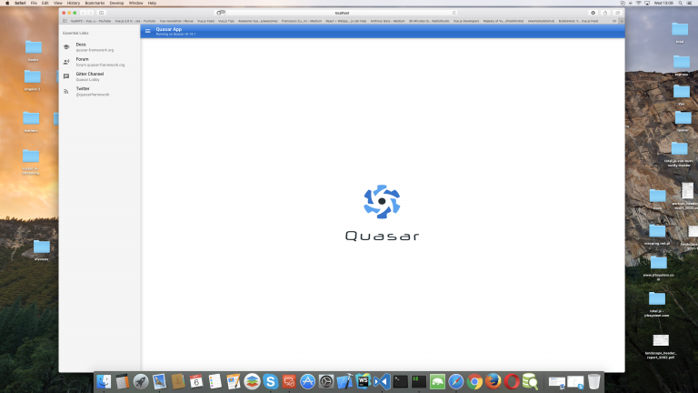
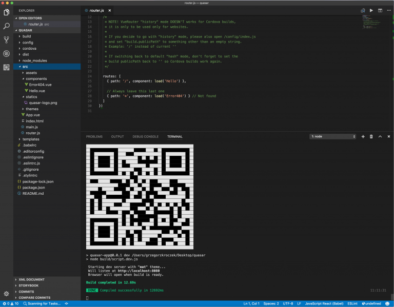
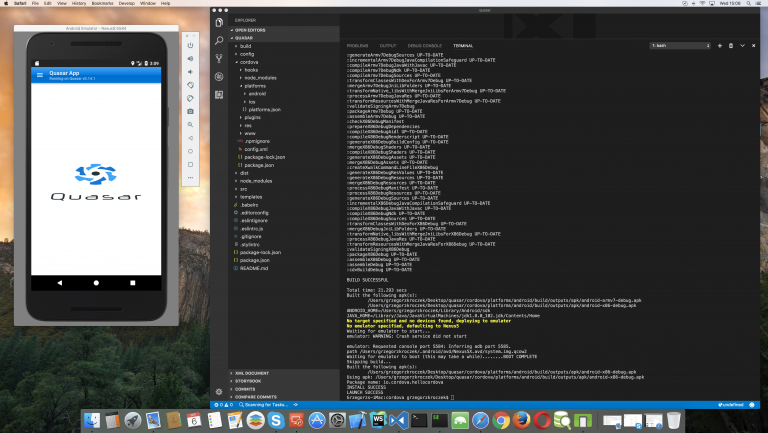
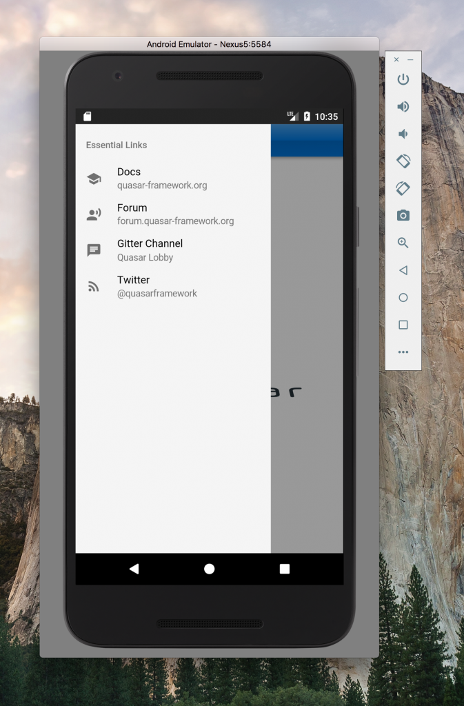
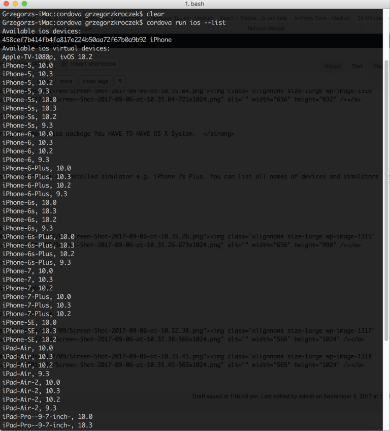
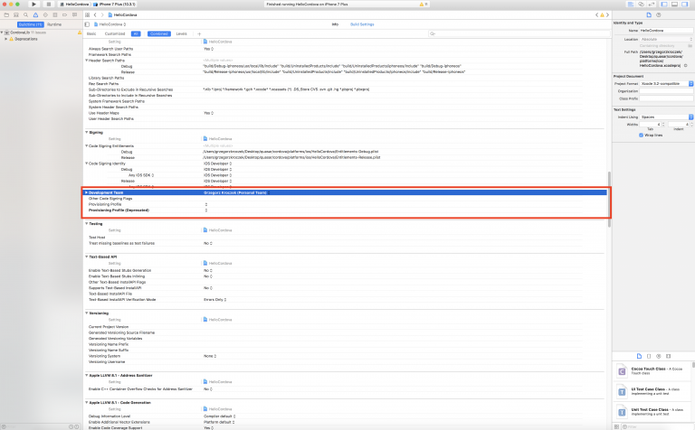
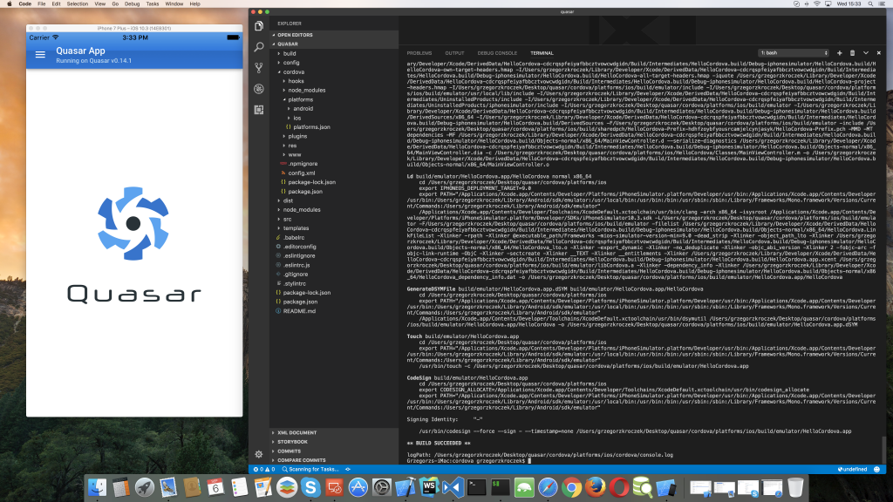
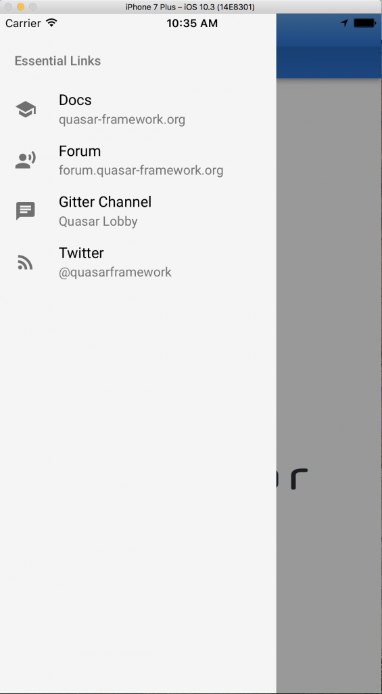
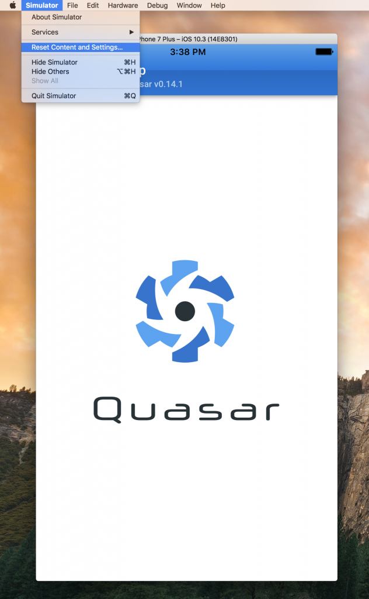

# Quasar Framework - универсальный Vue-фреймворк

*Перевод статьи [Vue2 and Quasar Framework – one source code for browser and Mobile applications (.ipa – IOS and .apk – Android)](http://maxprog.net.pl/vue-js/1298/ "Vue2 and Quasar Framework – one source code for browser and Mobile applications (.ipa – IOS and .apk – Android)"). С разрешения автора [Greg Kroczek](https://twitter.com/gregkroczek "Greg Kroczek").*

***

Несколько дней назад я был занят проблемой поиска фреймворка под [Vue.js](https://vuejs.org/ "Vue.js"), на котором можно было бы создавать один исходный код - как для веб-приложения, так и для мобильного приложения (как под iOS, так и под Android-устройство).

Моей основной целью было свести к минимуму время для написания кода приложения, которое работало бы как на мобильных устройствах, так и в браузерах.

Мы просмотрели множество ресурсов с описанием профессиональных инструментов подобного рода. Во многих сравнительных описаниях на первом месте фигурировал [Weex](https://weex.incubator.apache.org/ "Weex"). Однако мое внимание привлек другой фреймворк - [Quasar Framework](http://quasar-framework.org/ "Quasar Framework"), возможности которого мне показались несравненно большими, нежели у Weex.

Вот почему я решил пожертвовать день на написание статьи о Quasar Framework. Целью статьи является создание приложения, которое могло бы одинаково работать на различных устройствах. Мне было интересно посмотреть, как приложение, собранное из одного исходного кода, будет работать в качестве мобильного приложения как под iOS, так и под Android.

    Вопрос - почему [Cordova](https://cordova.apache.org/ "Cordova") работает под Quasar Framework без каких-либо проблем? Секрет заключается в отлично написанной оболочке фреймворка Quasar Framework. Данная оболочка отвечает за генерирование Cordova-приложения из исходных файлов проекта Quasar Framework.

Ниже представлен пример готового приложения, которое одинаково хорошо работает как в обычном веб-браузере, так и под Andoid-устройством и iOS-устройством.


## Quasar Framework - создание веб-приложения

Для начала давайте создадим обычное веб-приложение на Vue.js, используя Quasar Framework.

Данный фреймворк имеет в своём составе консольную утилиту *quasar-cli* для быстрого развертывания проекта на Quasar Framework.

Чтобы воспользоваться этой утилитой, её необходимо первоначально установить (глобально) как обычный npm-пакет:

```bash
$ npm install -g quasar-cli
```

Теперь можно развернуть новый проект на Quasar Framework под именем *my-project*:

```bash
$ quasar init my-project
```

Затем переходим в директорию проекта и устанавливаем все зависимости из файла *package.json*:

```bash
$ cd my-project
$ npm install
```

Примерный вид сгенерированного проекта представлен ниже:


Фреймворк Quasar Framework поддерживает **два режима** работы.

1. **Debug mode** - режим отладки Vue.js-приложения с поддержкой *hot reload*. Для запуска проекта в этом режиме нужно указать ключ *dev* в консольной утилите *quasar*.

Помимо этого, Quasar Framework поддерживает **две темы** оформления - [Material Design](https://material.io/ "Material Design") и тема оформления iOS.

Для запуска проекта с поддержкой Material Design запускаем команду:

```bash
$ quasar dev
```

или

```bash
$ quasar dev mat
```

... что одинаково по результату. Команда *quasar dev* является сокращением команды *quasar dev mat*.

Для запуска проекта с поддержкой темы оформления iOS нужна команда:

```bash
$ quasar dev ios
```

Так выглядит разрабатываемый проект на Quasar Framework в браузере:



2. **Release mode** - режим сборки приложения. В этом режиме в папку */dist* производится генерация готового кода приложения. Фреймворк оптимизирует код приложения и соединяет все части в единое целое. Производится минификация кода, проверка вендорных префиксов, очистка кэша браузера и многие другие вещи.

Команда для запуска сборки готового приложения:

```bash
$ quasar build
```

Также можно запустить сборку приложения с указанием определенной темы оформления:

```bash
$ quasar build mat
```

... или:

```bash
$ quasar build ios
```

В соответствии с официальной документацией фреймворка Quasar Framework, можно локально запускать сервер статических файлов прямо из директории. При этом в браузере будут автоматически отображаться все изменения в текущем проекте.

Для запуска в этом режиме нужно выполнить команду:

```bash
$ quasar serve
```

Можно также запустить команду с указанием относительного или абсолютного пути (*три варианта на выбор*):

```bash
$ quasar serve dist
$ quasar serve ./dist
$ quasar serve /work/quasar-app/dist
```


## Quasar Play App

При разработке проекта на Quasar Framework можно воспользоваться мобильным приложением [Quasar Play][3]. Цель создания этого приложения - возможность тестирования разрабатываемого проекта непосредственно на мобильном устройстве.

Приложение создано под Android и доступно для установки с [Google Play](https://play.google.com/store "Google Play"). Преимущество использования Quasar Play заключается в том, что можно тестировать создаваемое приложение на "настоящем" устройстве.

Для запуска проекта с возможностью тестирования в Quasar Play нужно ввести команду:

```bash
$ quasar dev --play
```



После установки приложения Quasar Play на мобильном устройстве нужно его запустить. Затем сканировать QR-код, который сгенерируется в терминале командой *quasar dev --play* (см. скриншот выше). Тем самым приложение Quasar Play получает ссылку на запущенный сервер разрабатываемого проекта. Результатом является вид создаваемого приложения прямо на физическом Android-устройстве.

Можно ввести ссылку на работающий сервер проекта вручную, но это не так удобно, конечно же.

## Создание приложения под iOS и Android

В данном разделе необходимо акцентировать внимание на наиболее важных моментах разработки приложения под Android и iOS.

Предполагается, что пакеты приложений [Android Studio](https://developer.android.com/studio/index.html "Android Studio") и [Xcode](https://developer.apple.com/xcode/ "Xcode") уже установлены и правильным образом настроены на локальной машине, на которой производится разработка приложения. За более подробной информацией можно обратиться на страницу официальной документации Quasar Framework - [Cordova App Wrapper](http://quasar-framework.org/guide/cordova-wrapper.html "Cordova App Wrapper").

Для генерирования мобильной версии разрабатываемого приложения используется платформа Cordova Platform. Первоначально её необходимо установить глобально (ключ *-g*) на локальной машине с помощью менеджера пакетов *npm*:

```bash
$ npm install -g cordova
```

Затем при помощи команды:

```bash
$ quasar wrap cordova
```

... из текущего Quasar-проекта создаётся Cordova-приложение.

В дополнение к платформе Cordova крайне рекомендуется установить в текущем проекте плагин [Crosswalk WebView Cordova](https://github.com/crosswalk-project/cordova-plugin-crosswalk-webview "Crosswalk WebView Cordova"). Цель данного плагина - предотвращение возможных проблем, связанных с ошибками поведения более старых Android-платформ.

Для установки плагина нужно перейти в директорию *cordova* текущего проекта:

```bash
$ cd cordova
```

... и установить плагин *cordova-plugin-crosswalk-webview* командой:

```bash
$ cordova plugin add cordova-plugin-crosswalk-webview
```

Затем добавляем платформу Android:

```bash
$ cordova platform add android
```

... и запускаем эмулятор:

```bash
$ cordova run android
```






## Создание Android-версии приложения

Для сборки готового приложения под Android можно воспользоваться командой:

```bash
$ cordova build --release android
```

Готовый файл приложения располагается по пути:

```bash
cordova > platforms > android > build > outputs > apk > android-arm7-release.apk
```

Этот файл является готовым приложением, которое работает под операционной системой Android.

Теперь самое время перейти к вопросу создания версии приложения под iOS. **Важное замечание - для создания ios-пакета в текущий проект необходимо добавить поддержку операционной системы iOS!**

Для этого в платформу Cordova добавляем поддержку системы iOS:

```bash
$ cordova platform add ios
```

Перед запуском разрабатываемого проекта необходимо подключить к проекту существующее физическое устройство или запустить в консоли симулятор этого устройства, например iPhone 7s Plus. Список всех поддерживаемых устройств и их симуляторов можно получить командой:

```bash
$ cordova run ios --list
```

В приведенном ниже скриншоте обратите внимание на первую строку после команды *cordova run ios --list*. Эта строка означает, что к локальной машине iMac подключено реальное физическое устройство iPhone, на котором можно тестировать текущий проект!



Важно - для запуска или развертывания разрабатываемого приложения на физическом устройстве необходимо иметь зарегистрированный профиль разработчика по адресу *https://developer.apple.com*. Это понадобится для подписывания готового приложения:



Для запуска iOS-версии разрабатываемого приложения в симуляторе нужно запустить команду:

```bash
$ cordova run ios --target="iPhone-7-Plus"
```

Для запуска iOS-версии разрабатываемого приложения на физическом устройстве (например, iPhone) требуется команда:

```bash
$ cordova run ios --device
```






## Сборка iOS-версии приложения

Для запуска процесса сборки iOS-версии приложения на физическом устройстве (например, iPhone) нужно запустить команду:

```bash
$ cordova run ios --device
```

Эта команда запустит сборку .ipa-пакета для физического устройства, к примеру - iPhone 7s Plus. Если используется Cordova версии и более поздняя, то для процесса сборки .ipa-пакета можно использовать команду без каких-либо дополнительных зависимостей:

```bash
$ cordova build ios --device --release
```

Для запуска процесса сборки в корне текущего проекта потребуется файл *build.json*:

```js
{
  "ios": {
    "debug": {
      "codeSignIdentity": "iPhone Developer",
      "provisioningProfile": "your-dev-provisioning-profile-UUID-here"
    },
    "release": {
      "codeSignIdentity": "iPhone Distribution",
      "provisioningProfile": "your-distribution-provisioning-profile-UUID-here"
    }
  }
}
```

Если на локальной машине, где производится сборка проекта, установлен пакет Xcode версии 8 или более поздней, то в файле *build.json* потребуются два дополнительных поля *developmentTeam* и *packageType*. Также отпадает необходимость в зарегистрированном профиле Apple-разработчика, так как его можно заменить дополнительным полем *iPhone Developer* для отладки приложения и размещения приложения:

```js
{
    "ios": {
        "debug": {
            "codeSignIdentity": "iPhone Developer",
            "developmentTeam": "UUIDDevTeam",
            "packageType": "development"
        },
        "release": {
            "codeSignIdentity": "iPhone Developer",
            "developmentTeam": "UUIDDevTeam",
            "packageType": "app-store"
        }
    }
}
```

Готовый .ipa-файл сборки располагается по адресу:

```bash
cordova > platforms > ios > build > device
```

Этот файл является готовым приложением, которое работает под устройством iPhone 7 Plus.

В процессе разработки и тестирования приложения под iOS можно столкнуться с некоторыми ошибками. Решение этих ошибок представлено ниже.

Ошибка *“Cannot read property ‘replace’ of undefined*. Для решения проблемы нужно запустить установку пакета *ios-sim*:

```bash
$ npm i -g ios-sim
```

Ошибка *The operation couldn’t be completed. (FBSOpenApplicationErrorDomain error 1.)*. Можно предложить несколько способов решения этой проблемы.

1. Убедиться, что используется последняя версия симулятора (v10 и выше):

```bash
$ cd cordova
$ cordova plugin add cordova-plugin-crosswalk-webview
```

2. Выгрузить приложение из симулятора и затем перезапустить его:



После этого удалить приложение из симулятора.

## Заключение

В качестве подведения итогов и ответа на возможные вопросы читателей можно привести краткий список с небольшим заголовком - *В процессе написания данной статьи*:

	* все пакеты генерировались без каких-либо проблем
	* Quasar Framework сэкономил мне много времени
	* оба созданных приложения успешно работают

***
