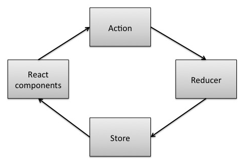

# Изучаем Redux на примере создания мини-Redux

*Перевод статьи [Jakob Lind](https://twitter.com/karljakoblind): [Learn Redux by coding a Mini-Redux](http://blog.jakoblind.no/2017/03/13/learn-redux-by-coding-a-mini-redux)*

Есть множество ресурсов по изучению Redux: официальная документация, примеры, руководства, блоги, шаблоны, Youtube видео, подкасты и так далее. Список можно продолжать. И хотя у нас есть так много замечательных ресурсов для изучения, появляющиеся новички по-прежнему впадают в замешательство. Из-за огромного количества материала, может быть сложно найти действительно стоящий.

Другая стратегия обучения — самостоятельное написание простой реализации Redux для развития глубокого понимания основополагающих принципов библиотеки. Для меня это был настоящий прорыв в моём процессе обучения. Теперь я чувствую, что знаю Redux, потому что я написал похожий код самостоятельно.

**Не беспокойтесь, это не сложно**. Ядро Redux удивительно простое. Вы увидите это в ходе чтения и написания кода по этой статье.

Прежде, чем мы начнём, нам необходимо общее представление о том, что же делает Redux.

## Что делает Redux?
Суть Redux — иметь единственный источник состояния вашего приложения. Состояние хранится как обычный JavaScript объект в одном месте: в Redux **Store** (*хранилище*). Объект с состоянием доступен только для чтения. Если вы хотите изменить состояние, то вам необходимо эмитировать **Action** (*действие*), представляющий собой обычный JavaScript объект.

Ваше приложение может **подписаться**, чтобы получить уведомление об изменении хранилища. Когда Redux используется с React, компоненты React уведомляются об изменении состояния и могут перерисовываться на основе нового контента в хранилище.



Хранилищу необходим способ понять, как ему обновить своё состояние, когда он получает действие. Для этого оно использует обычную JavaScript функцию, которую Redux называет **reducer** (*редьюсер*). Редюсер передаётся при создании хранилища.

## Начнём программировать!
Подводя итог, мы должны иметь возможность делать с нашим хранилищем три вещи:

1. Получать текущее состояние хранилища
2. Передавать действие в качестве аргумента к редьюсеру, чтобы обновить состояние в хранилище
3. Подписаться на события изменения хранилища

Мы также должны определить редюсер и начальное состояние на момент запуска. Давайте с этого и начнём:

```js
function createStore(reducer, initialState) {
    const currentReducer = reducer;
    let currentState = initialState;
}
```

### 1. Получение состояния
Итак, мы создали функцию, которая просто сохраняет начальное состояние и редюсер как локальные переменные. Сейчас давайте реализуем возможность получать состояние нашего хранилища.

```js
function createStore(reducer, initialState) {
    const currentReducer = reducer;
    let currentState = initialState;

    return {
        getState() {
            return currentState;
        }
    };
}
```

Теперь мы можем получать объект состояния с помощью `getState()`! Это было несложно.

### 2. Передача действия
Следующий шаг - внедрить поддержку передачи действия.

```js
function createStore(reducer, initialState) {
    const currentReducer = reducer;
    let currentState = initialState;

    return {
        getState() {
            return currentState;
        },
        dispatch(action) {
            currentState = currentReducer(currentState, action);
            return action;
        }
    };
}
```

Функция `dispatch` передаёт текущее состояние и передаёт действие через редьюсер, который мы определили при инициализации. Затем она перезаписывает старое состояние новым состоянием.

### 3. Подписка на события
Теперь мы можем получать текущее состояние и обновлять его! Последний шаг — научиться слушать изменения:

```js
function createStore(reducer, initialState) {
    const currentReducer = reducer;
    let currentState = initialState;
    let listener = () => {};

    return {
        getState() {
            return currentState;
        },
        dispatch(action) {
            currentState = currentReducer(currentState, action);
            listener(); // Заметьте, что мы добавили эту строку!
            return action;
        },
        subscribe(newListener) {
            listener = newListener;
        }
    };
}
```

Теперь мы можем вызвать `subscribe` c функцией обратного вызова в качестве параметра, которая будет вызываться всякий раз, когда происходит передача действия.

## Мы закончили. Воспользуемся этим!

*Вот и вся реализация мини-Redux*! На самом деле, это урезанная версия настоящего кода Redux.

В [официальном репозитории Redux](https://github.com/reactjs/redux) есть пример использования Redux. Мы можем скопировать и вставить этот пример, чтобы проверить нашу собственную реализацию Redux:

```js
function counter(state = 0, action) {
  switch (action.type) {
  case 'INCREMENT':
    return state + 1;
  case 'DECREMENT':
    return state - 1;
  default:
    return state;
  }
}

let store = createStore(counter);

store.subscribe(() =>
  console.log(store.getState())
)

store.dispatch({ type: 'INCREMENT' })
store.dispatch({ type: 'INCREMENT' })
store.dispatch({ type: 'DECREMENT' })
```

Получить полный код для запуска на вашем компьютере вы можете [здесь](https://gist.github.com/jakoblind/6b90d0b677d26effcebbed69b24cb05f).

## Заключение
Мы реализовали полностью рабочую версию Redux в восемнадцати строках кода! Довольно впечатляюще!

Код, который мы написали, само собой, **не подходит для production**. По сравнению с "реальным" Redux мы убрали обработку ошибок, не реализовали поддержку нескольких слушателей, не реализовали поддержку промежуточного ПО (*middlewares*) и так далее.

Теперь вы знаете основные принципы работы Redux и будете лучше подготовлены, продолжая ваше учебное путешествие!

В следующей [статье](http://blog.jakoblind.no/2017/03/20/learn-react-redux-by-coding-the-connect-function-yourself/) мы будем реализовывать функцию connect, связывающую хранилище Redux c React компонентами.

- - - -

*Слушайте наш подкаст на [SoundCloud](https://soundcloud.com/devschacht), читайте на [Medium](https://medium.com/devschacht), контрибьютьте на [GitHub](https://github.com/devSchacht), общайтесь в [группе Telegram](https://t.me/devSchacht), следите в [Twitter](https://twitter.com/DevSchacht) и [канале Telegram](https://t.me/devSchachtChannel), рекомендуйте в [VK](https://vk.com/devschacht) и [Facebook](https://www.facebook.com/devSchacht).*

[Статья на Medium](https://medium.com/devschacht/jakob-lind-learn-redux-by-coding-a-mini-redux-d1a58e830514)
