# Отладка JavaScript в Google Chrome и Visual Studio Code

_Перевод статьи [James Quick](https://twitter.com/jamesqquick): [Debugging JavaScript in Google Chrome and Visual Studio Code](https://scotch.io/tutorials/debugging-javascript-in-google-chrome-and-visual-studio-code). Опубликовано с разрешения автора._

---

Способность отладки кода является важным навыком разработчика. Важно понимать и использовать широкий спектр инструментов отладки, которые существуют для конкретного языка программирования.

К сожалению, отладка может показаться не столь очевидной при работе с JavaScript за пределами полноценной среды IDE. По крайней мере — на первый взгляд.

В данной статье будет рассмотрен вопрос, как можно выполнять отладку JavaScript-кода в инструменте [Google Chrome Dev Tools](https://developers.google.com/web/tools/chrome-devtools/) и в редакторе кода [Visual Studio Code](https://code.visualstudio.com/).

> Примечание переводчика: перейдя по этой ссылке, можно ознакомиться с видеоверсией данной статьи [Debugging JavaScript in Google Chrome and Visual Studio Code](https://www.youtube.com/watch?v=AX7uybwukkk&feature=youtu.be) на английском языке.

## Предустановки

В этой статье процесс отладки будет рассмотрен на примере тестового приложения под названием «Quick Chat»:

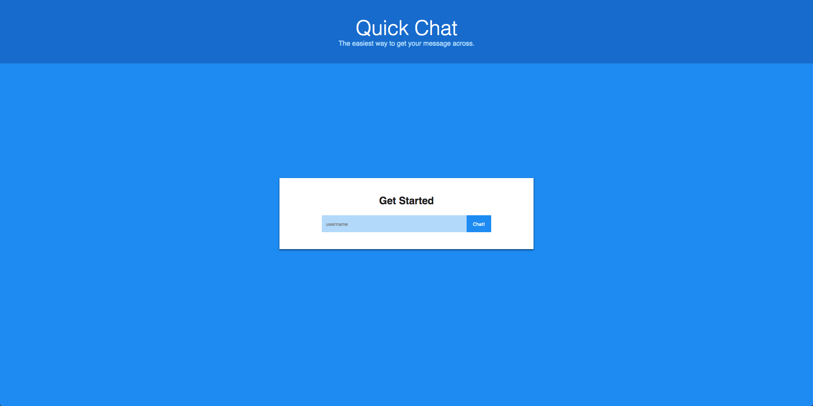

У вас есть два способа работы с этим приложением. Вы можете самостоятельно создать его, воспользовавшись этой [серией видеоуроков](https://www.youtube.com/watch?v=-0j_9LqsOkQ&list=PLDlWc9AfQBfbyGwhSlxg16mQGpGnauCwq). Или же вы можете использовать [исходный код](https://github.com/jamesqquick/Design-and-Build-a-Chat-Application-with-Socket.io) уже готового приложения «Quick Chat»:

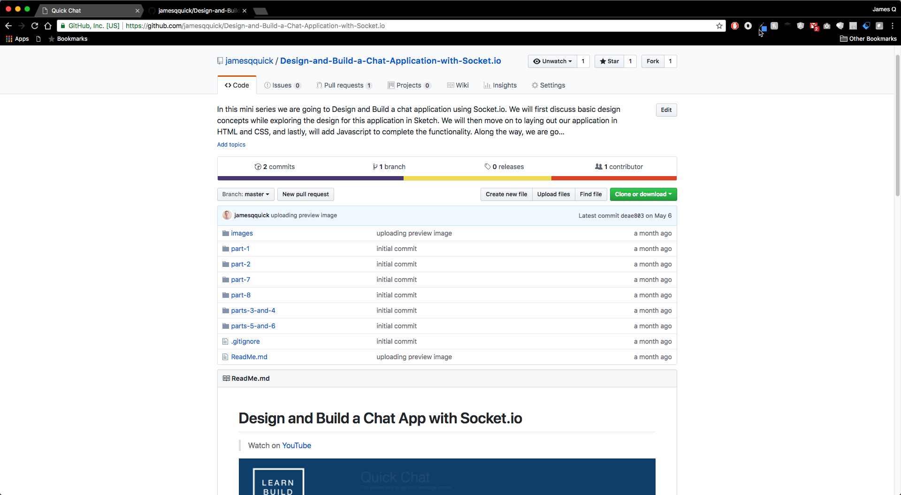

Какой бы вариант вы не выбрали, вам потребуется локально запустить приложение «Quick Chat».

Вы можете запустить приложение из-под [Node.js](https://nodejs.org/en/) (_как это делаю я_). Или воспользоваться плагином под Visual Studio Code под названием [Live Server](https://marketplace.visualstudio.com/items?itemName=ritwickdey.LiveServer).

Если вы новичок в работе с этим плагином, то можете научиться работать с ним при помощи этого видео - [Live Server Extension in Visual Studio Code](https://www.youtube.com/watch?v=WzE0yqwbdgU).

> Примечание переводчика: видео на английском языке.

В процессе создания данной статьи я добавил в приложении «Quick Chat» небольшую _намеренную_ ошибку, которая не позволяет зарегистрировать пользователя после его входа в систему.

С технической точки зрения я неправильно получаю имя пользователя, используя для этого `usernameInput.text` вместо правильного варианта `usernameInput.value`. Если бы я допустил такую ошибку в реальной жизни, моей первой мыслью было бы воспользоваться инструментом `console.log()`.

Но это не совсем тот случай, который мог бы мне помочь, как вы можете увидеть на изображении ниже. Если же использование `console.log()` было также вашей первой мыслью - вы попали по адресу и правильно делаете, что читаете эту статью!

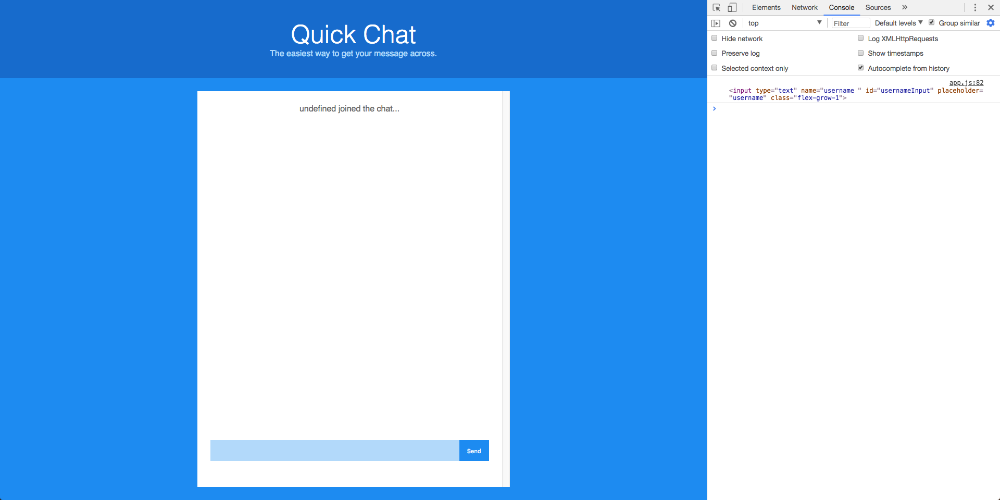

## Основы отладки

Начнем с основ. Идея отладки заключается в том, что внутри программного кода можно устанавливать так называемые точки останова (_breakpoints_) для того, чтобы остановить выполнение программы в определенном месте.

Это дает вам, как разработчику, возможность взглянуть на текущее состояние приложения и проверить, например, значения переменных в нём. Вы даже можете сделать еще больше и отследить любые переменные по своему выбору, чтобы всякий раз, когда приложение останавливается, вы могли проверить значения этих переменных.

После установки точки останова (_breakpoint_) в коде, как правило, есть несколько вариантов дальнейших действий:

-   продолжить выполнение программы
-   пошагово пройтись по всем этапам выполнения программы — строка за строкой
-   выйти из текущей функции, в которой вы находитесь
-   перейти к выполнению следующей функции

У вас также будет доступ к просмотру стека вызовов (_call stack_). Другими словами, поскольку в программе функции могут вызывать на исполнение другие функции, то можно просмотреть _историю вызовов_ этих функций.

## Отладка в Google Chrome

Чтобы начать отладку приложения в браузере ​​[Google Chrome](https://ru.wikipedia.org/wiki/Google_Chrome), добавьте в обработчике события кнопки `clickBtn` _оператор_ `debugger`, как показано ниже:

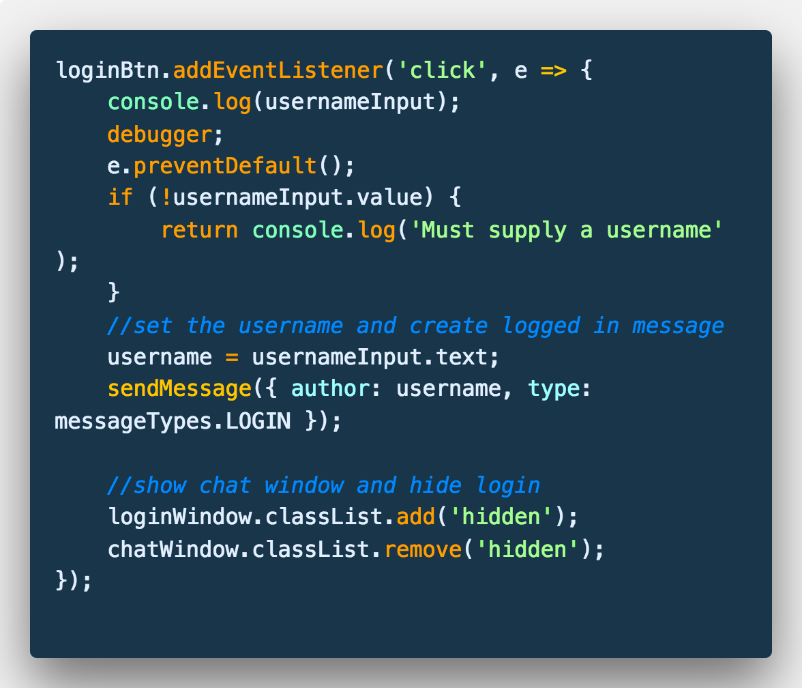

Когда выполнение программы дойдет до строки с оператором `debugger`, приложение будет приостановлено и автоматически активируются инструменты отладки браузера Google Chrome.

Обратите внимание, что приложение в окне браузера закрашено серым цветом, чтобы показать, что оно приостановлено. Также обратите внимание, что вкладка `Sources` в Chrome Dev Tools открылась автоматически:

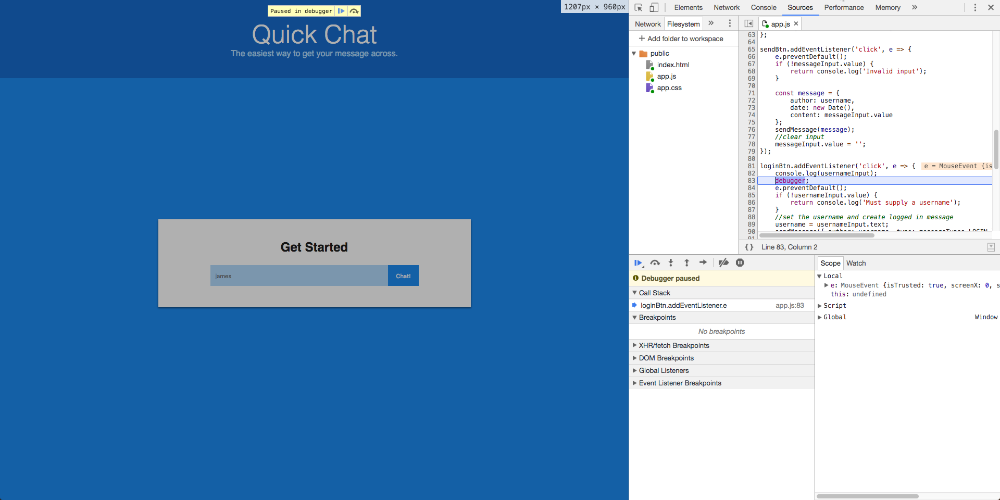

Давайте разберемся, что мы видим на вкладке `Sources`.

## Вкладка Sources

Первое, что вы могли заметить на этой вкладке — это копию исходного кода приложения. Это код, который браузер загрузил и с которым он работает.

Вы также можете заметить, что строка кода с оператором `debugger` подсвечена синим цветом, чтобы сообщить нам, что выполнение приложения остановлено на данном участке кода:

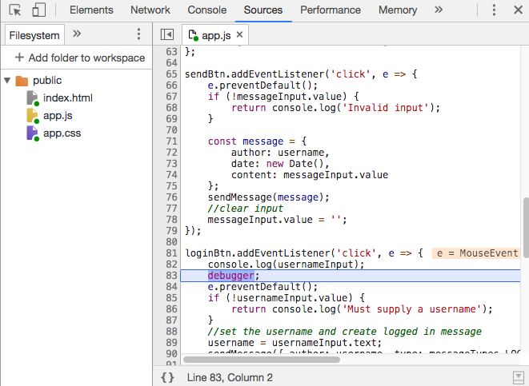

Браузер Google Chrome предоставляет нам возможность просматривать исходный код приложения. Имея перед собой исходный код, можно установить в нем _точки останова_.

[Точка останова](https://ru.wikipedia.org/wiki/%D0%A2%D0%BE%D1%87%D0%BA%D0%B0_%D0%BE%D1%81%D1%82%D0%B0%D0%BD%D0%BE%D0%B2%D0%B0) предназначена для обозначения места, на котором нужно остановить выполнение программы. _Оператор_ `debugger`, который мы использовали в примере выше, функционирует как _точка останова_, но в исходном коде приложения такая _точка останова_ необязательно должна быть только одной.

> Точка останова — преднамеренная остановка или приостановка выполнения программы

Чтобы добавить _точку останова_, нужно выполнить клик мыши на `gutter` — поле слева от нумерации строк кода. Как только вы выполните это действие, то заметите, что браузер Google Chrome автоматически добавил эту _точку останова_ в список «Breakpoints»:

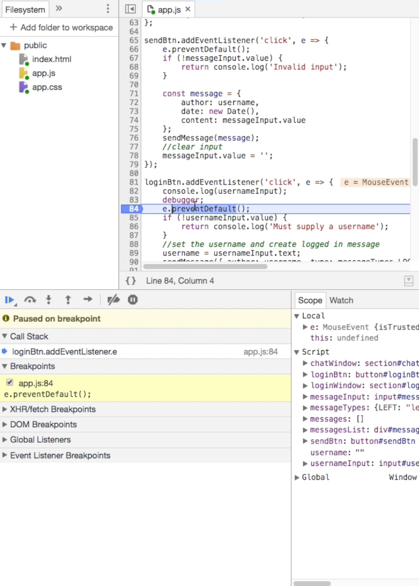

## Вкладка Scope

На вкладке «Scope» вы можете отслеживать переменные в своем приложении. Обратите внимание, что на этой вкладке есть три раздела: локальная область видимости (_Local_), глобальная область видимости (_Global_) и раздел сценариев (_Script_).

В разделе сценариев вы можете отслеживать переменные в области видимости текущего скрипта:

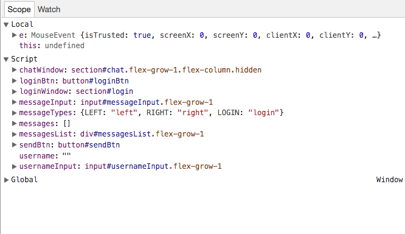

Большую часть времени процесса отладки приложения вы будете проводить именно в этой вкладке. Это гораздо более эффективная альтернатива использованию многочисленным `console.log()`.

## Вкладка Watch

Как уже упоминалось ранее, помимо просмотра переменных на вкладке «Scope», вы также можете определить переменные, значения которых вы хотели бы отслеживать на всем этапе выполнения программы.

Добавляя переменную на вкладке «Watch», каждый раз, когда вы устанавливаете точку останова, вы можете быстро проверить значение этой переменной (которая может иметь значение `undefined` в зависимости от того, где вы находитесь в коде).

Нажмите значок плюса и введите имя переменной, которую необходимо отслеживать, в нашем случае это `usernameInput`:

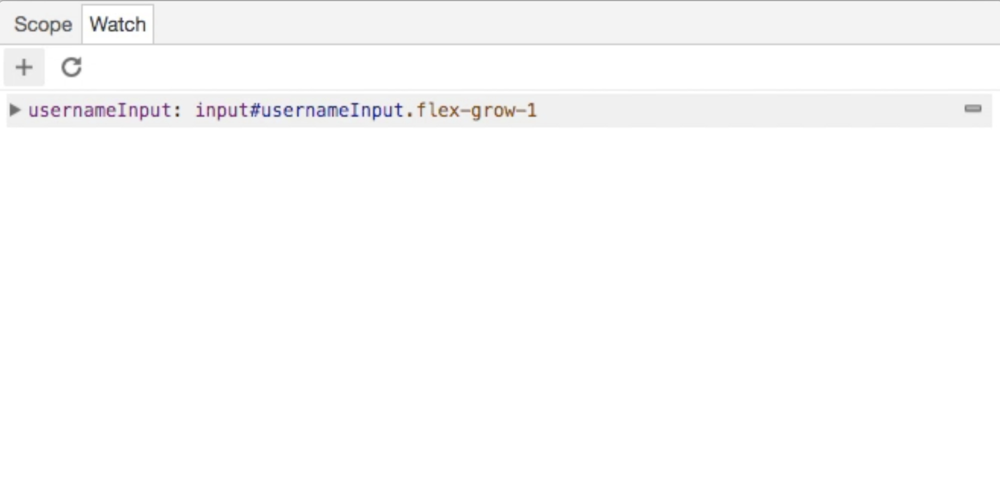

## Пошаговое выполнение, стек вызовов и список точек останова

Раздел вкладки «Sources», расположенный в левом нижнем углу окна отладчика, позволяет просмотреть список точек останова, стек вызовов (_call stack_) и т. д.

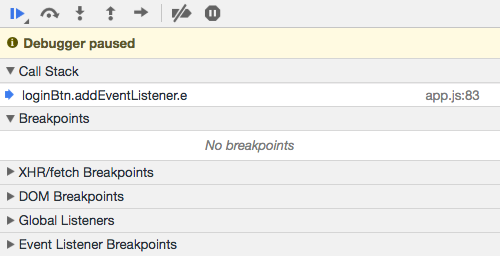

В _стеке вызовов_ есть только одна функция, которая является обработчиком события для кнопки входа. Функция указана, потому что это единственная функция, которая была вызвана на данный момент. Поскольку одни функции могут вызывать на исполнение другие функции, то эта цепочка будет обновляться соответствующим образом.

Также обратите внимание на кнопки со стрелками в верхней части экрана. Они соответствуют функциям, указанным выше, для продолжения выполнения вашего кода или прохождения по нему по строкам (_stepping_). Я бы рекомендовал протестировать немного эти кнопки, чтобы привыкнуть к тому, каким образом можно осуществлять выполнение кода.

Наконец, существуют различные типы точек останова, которые могут быть заданы. Давайте рассмотрим пример создания условной точки останова (_conditional breakpoint_), которая будет срабатывать только при выполнении определенного условия.

Например, предположим, что мы хотим предотвратить обработку события на кнопке входа в систему только тогда, когда пользователь пытается войти в систему без ввода имени пользователя.

Мы можем сделать это, щелкнув правой кнопкой мыши на поле `gutter` и создав _точку останова_ со следующим условием — `usernameInput.text === ''`:

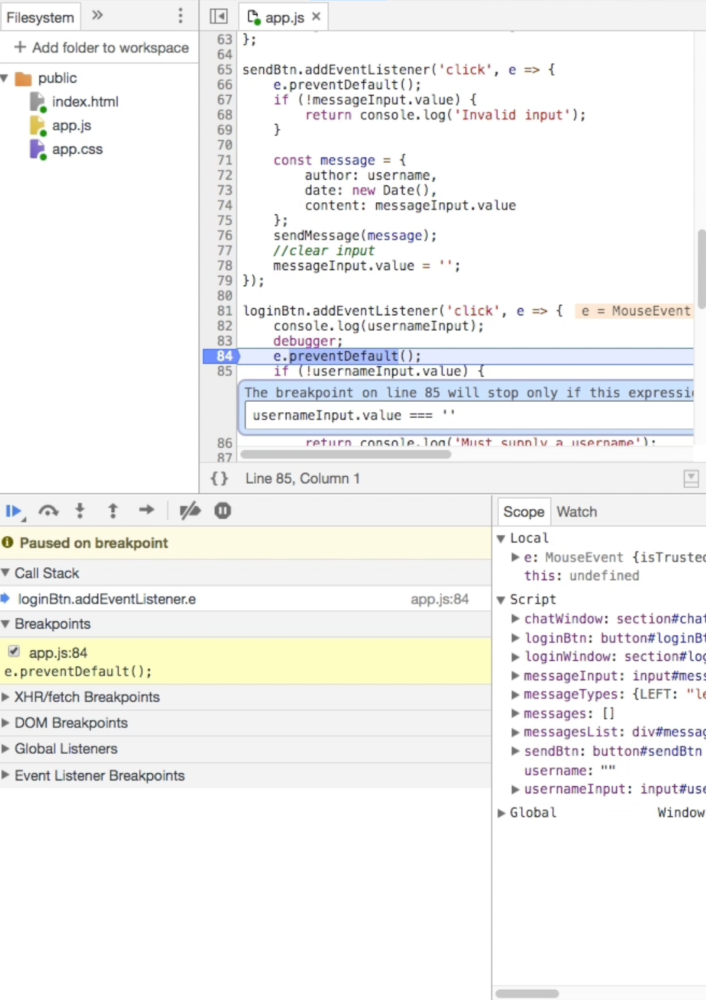

В случае отладки приложения `Quick Chat`, если вы нажмете кнопку входа в систему без имени пользователя, будет запущена эта _точка останова_. В противном случае код будет продолжать выполняться как обычно.

Обратите внимание, что существует ещё больше доступных вариантов _точек останова_, которые не рассматриваются в данной статье.

## Отладка в Visual Studio Code

Инструмент [Chrome Developer Tools](https://developers.google.com/web/tools/chrome-devtools/) является одним из лучших в своем роде. Как вы уже видели, он предлагает отличные возможности и функционал для отладки приложения.

Однако командой разработчиков Visual Studio Code была проделана большая работа для того, чтобы сделать процесс отладки в этом редакторе ещё более совершенным.

Мне очень нравится Visual Studio Code и я провожу в нем больше времени, чем в каком-либо другом редакторе кода. Этот процесс включает в себя и отладку.

Чтобы начать отладку кода в VS Code, вам нужно будет установить плагин `Debugger for Chrome`:

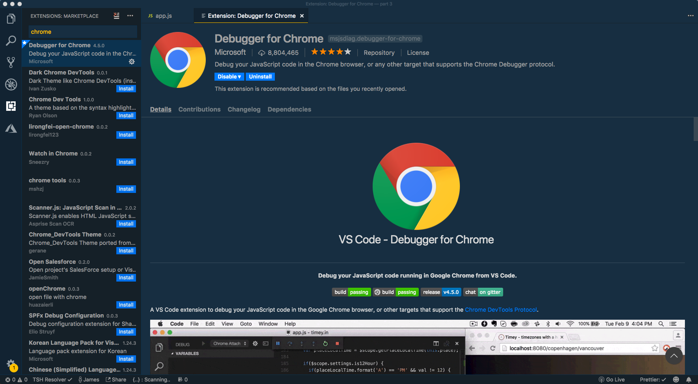

Давайте познакомимся с вкладкой `Debug`. По умолчанию она расположена на боковой панели редактора. Откройте эту вкладку, нажав на значок, который выглядит как жучок (_bug_).

Открыв эту панель, вы увидите инструменты, очень похожие на те, что мы видели в браузере Google Chrome — _переменные_, _стек вызовов_, _точки останова_:

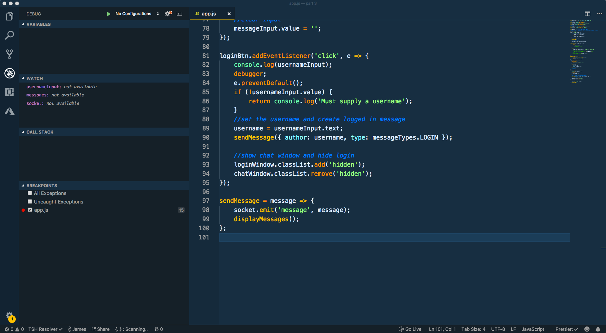

> Большинство функциональных возможностей, с которыми мы имели дело в Chrome Dev Tools, также доступны в VS Code.

Теперь, когда мы познакомились с вкладкой `Debug`, нам необходимо создать конфигурацию, которая укажет редактору VS Code, как ему отлаживать наше приложение.

VS Code хранит конфигурацию отладки в файле `launch.json` внутри папки `.vscode`. Чтобы VS Code создал этот файл для нас, в меню редактора откройте выпадающий список «Нет конфигураций» («No Configurations») и выберите «Добавить конфигурацию» («Add Configuration»).

> VS Code хранит конфигурацию отладки в файле с именем `launch.json` внутри папки `.vscode`

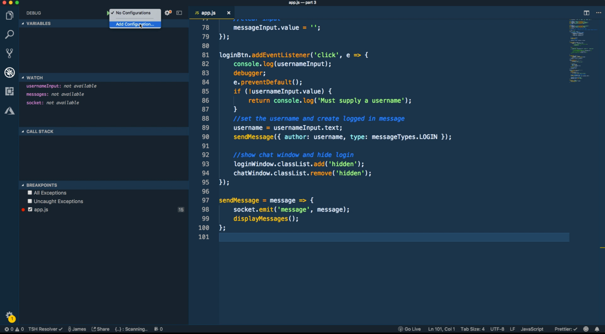

Затем из этого списка выберите пункт «Chrome»:

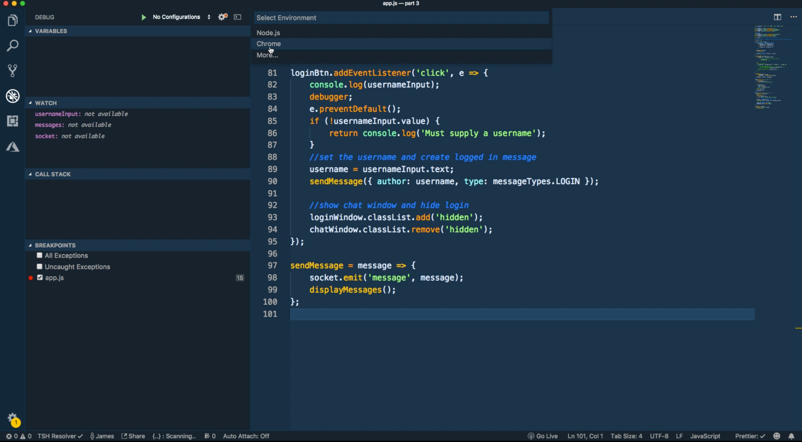

Из раскрывающегося списка выберите конфигурацию «Chrome: Launch»:

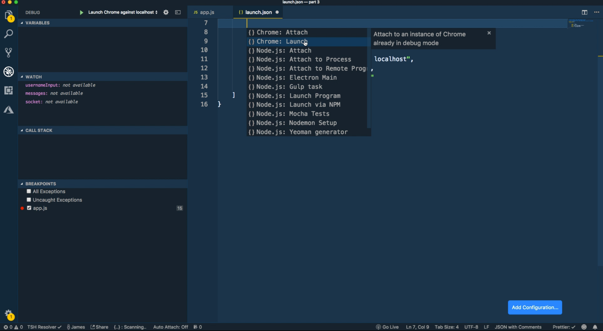

Конфигурация, которую мы только что создали, будет автоматически подключаться к приложению на определенном порту.

Нам нужно внести небольшое изменение в эту конфигурацию — правильно указать на исходный код тестируемого приложения. Исходный код приложения находится в каталоге `public`, поэтому необходимо изменить значение свойства «webRoot».

Чтобы это сработало, что приложение уже должно быть запущено локально на определенном порту:

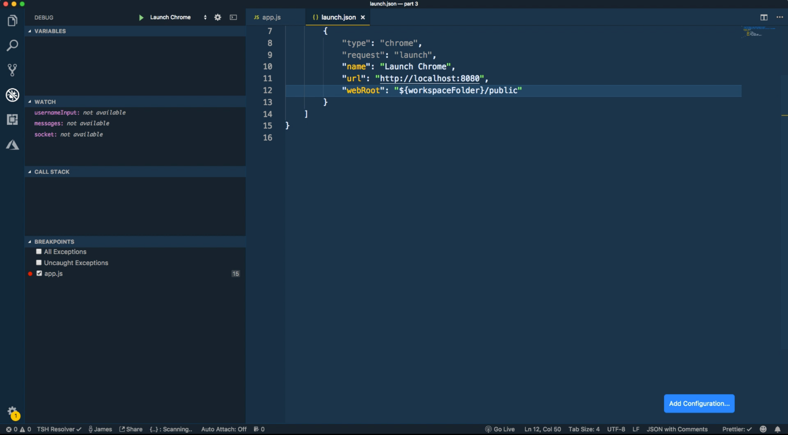

Когда конфигурация настроена, можно начать сеанс отладки, нажав зеленую кнопку «Run Code». Приложение должно открыться в окне браузера Google Chrome, как показано ниже.

Обратите внимание на _меню отладки_ кода, которое появилось в фоновом режиме редактора VS Code. С помощью этой панели можно остановить, перезапустить, продолжить выполнение кода или использовать пошаговые возможности для навигации по коду и взаимодействия с отладчиком:

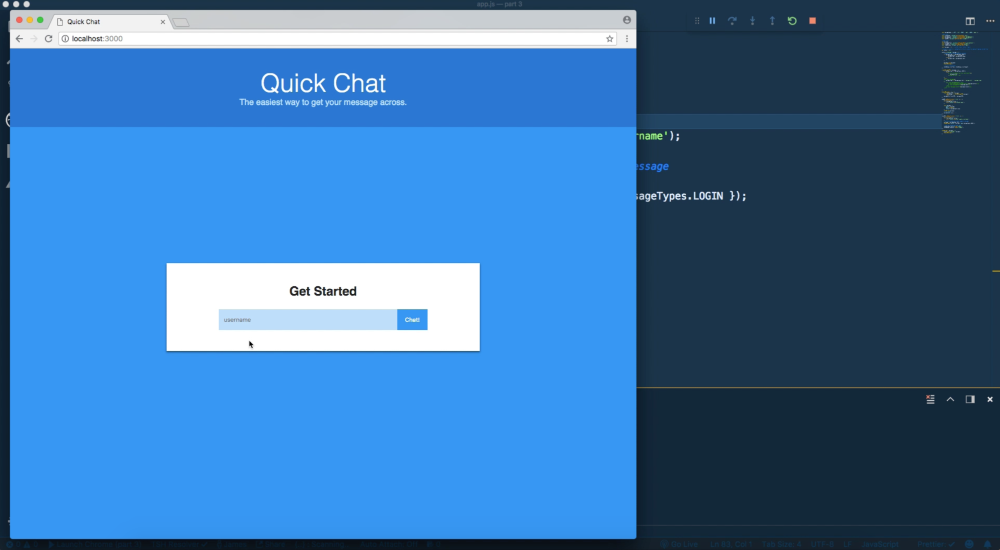

С запущенным отладчиком вы можете установить контрольную точку в коде так, как мы это делали в Google Chrome. Для этого нажмите на поле `gutter` рядом с номером нужной строки. Я устанавливаю точку останова в том же месте, что и раньше, внутри обработчика события входа в систему.

Теперь если попытаться войти в систему без заданного имени пользователя, точка останова должна инициировать переход в редактор VS Code для дальнейшего анализа кода приложения:

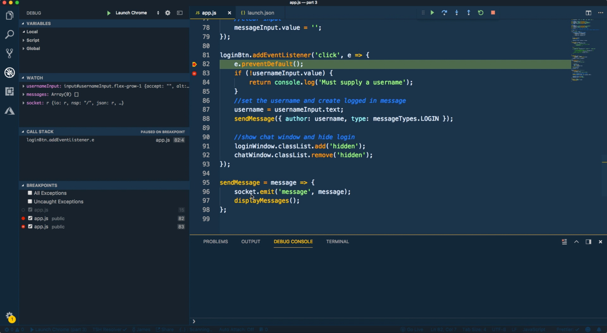

Вся функциональность отладчика кода, которую мы рассмотрели в браузере Google Chrome, аналогична той, что и в редакторе VS Code.

Если вы хотите добавить условную точку останова, щелкните правой кнопкой мыши на поле `gutter` и выберите «условная точка останова» с определенным условием.

Если вы хотите отследить значения какой-либо переменной, нажмите знак «плюс» чтобы добавить новую переменную и введите имя этой переменной.

Если вы хотите изучить переменные, перейдите на вкладку переменных и исследуйте их!

## Вывод

Как уже говорилось ранее, сделать следующий шаг во своем развитии как разработчику означает нечто большее, чем просто писать хороший код. Это означает использование экосистемы инструментов для тестирования языка программирования, который вы используете.

Отладка — одна из тех тем, для изучения которой потребуется время и силы, прежде чем начинать работу. Но в конечном итоге потраченные усилия однозначно окупят себя.

Моя рекомендация — потратить некоторое время на изучение отладки как в браузере Google Chrome, так и в редакторе Visual Studio Code и посмотреть, что вам больше нравится. Если у вас есть какие-либо вопросы или комментарии, [найдите меня в Twitter](https://twitter.com/jamesqquick).

## Дополнительные ресурсы

-   [Отладка в браузере Chrome](https://learn.javascript.ru/debugging-chrome)
-   [Подробное руководство по отладке кода на JavaScript в Chrome Devtools](https://proglib.io/p/devtools-debug/)
-   [Отладка в VS Code и Chrome](https://ru.vuejs.org/v2/cookbook/debugging-in-vscode.html)

---

_Слушайте наш подкаст в [iTunes](https://itunes.apple.com/ru/podcast/девшахта/id1226773343) и [SoundCloud](https://soundcloud.com/devschacht), читайте нас на [Medium](https://medium.com/devschacht), контрибьютьте на [GitHub](https://github.com/devSchacht), общайтесь в [группе Telegram](https://t.me/devSchacht), следите в [Twitter](https://twitter.com/DevSchacht) и [канале Telegram](https://t.me/devSchachtChannel), рекомендуйте в [VK](https://vk.com/devschacht) и [Facebook](https://www.facebook.com/devSchacht)._
