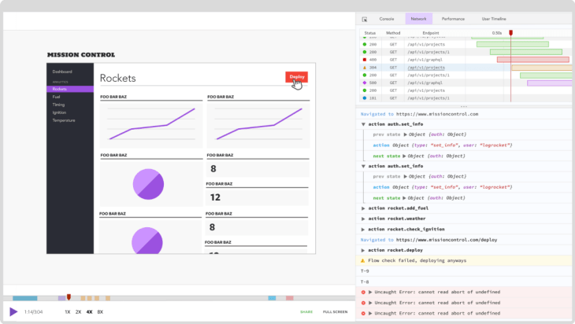

# Обработка естественного языка в Node.js

*Перевод статьи [Jordan Irabor](https://twitter.com/JordanIrabor): [Natural language processing for Node.js](https://dev.to/bnevilleoneill/natural-language-processing-for-node-js-5am9)*


## Введение

Интернет способствует бесконечному созданию больших объёмов неструктурированных текстовых данных. К счастью, сейчас у нас есть системы, способные понять такой тип данных.

Современные компьютерные системы могут понимать естественные языки благодаря базовой технологии, называемой NLP ([обработка естественного языка](https://en.wikipedia.org/wiki/Natural_language_processing)). Эта технология, способна обрабатывать человеческий язык в качестве входных данных и выполнять следующие операции:

- [Анализ тональности текста](https://en.wikipedia.org/wiki/Sentiment_analysis) (Является ли предложение позитивным или негативным?)
- Классификация текстовых документов (О чём это?)
- Решить, какие действия следует предпринять, опираясь на определённое заявление
- [Извлечение намерений](http://nlp_architect.nervanasys.com/intent.html) (Какова цель этого предложения?)

> [Обработка естественного языка (NLP)](https://en.wikipedia.org/wiki/Natural_language_processing) это подобласть [лингвистики](https://en.wikipedia.org/wiki/Linguistics), [компьютерных наук](https://en.wikipedia.org/wiki/Computer_science), [информационной инженерии](https://en.wikipedia.org/wiki/Information_engineering_(field)) и [искусственного интеллекта](https://en.wikipedia.org/wiki/Artificial_intelligence), имеющая дело с взаимодействиями между компьютерами и человеческими (естественными) языками, в частности, как программировать компьютеры для обработки и анализа больших объёмов данных на [естественных языках](https://en.wikipedia.org/wiki/Natural_language).

Значимые реализации NLP не так уж и далеки от нас сегодня, так как большинство наших устройств объединяют в себе AI ([искусственный интеллект](https://en.wikipedia.org/wiki/Artificial_intelligence)), ML ([машинное обучение](https://en.wikipedia.org/wiki/Machine_learning)) и NLP, чтобы укрепить связи между человеком и машиной. Вот несколько наиболее распространённых примеров реализации NLP:

1. **Поисковые движки**: Одной из самых полезных технологий является движок [Google Search](https://www.google.com/search). Вы вводите текст и получаете в ответ миллион связанных результатов. Такое возможно благодаря технологии NLP, которая способна понять введённый текст и произвести серию логических операций. Это также то, что позволяет Google Search понимать ваше намерение и предлагать его исправленный вариант, если вы написали поисковый запрос некорректно.
2. **Умные виртуальные ассистенты (помощники)**: Виртуальные ассистенты, такие как [Siri](https://www.apple.com/siri/), Alexa и [Google Assistant](https://assistant.google.com/) демонстрируют высокий уровень реализации NLP. После получения от вас устной команды, они способны распознать намерения, выполнить операцию и отправить ответ на естественном языке.
3. **Умные чат-боты**: Чат-боты могут анализировать большое количество информации текстовых данных и давать различные ответы на основе больших данных и их способности определять намерения. Это даёт ощущение естественного разговора, а не общения с машиной.
4. **Спам-фильтры**: Заметили ли вы, что почтовые клиенты постоянно совершенствуются в фильтрации спам-писем? Это возможно, потому что механизмы фильтрации способны понять содержание электронных писем — в основном, используя [Байесовскую фильтрацию спама](https://en.wikipedia.org/wiki/Naive_Bayes_spam_filtering) — и решить, является ли письмо спамом или нет.

Примеры, представленные выше, показывают, что AI, ML и NLP уже широко используются в интернете. Поскольку люди взаимодействуют с веб-сайтами, используя естественные языки, мы должны создавать наши сайты с возможностями NLP.

Python, как правило, является основным языком, когда речь заходит об NLP (или ML и AI) из-за богатства представленных пакетов для языковой обработки, таких как [Natural Language Toolkit](https://www.nltk.org/#natural-language-toolkit). Однако, JavaScript очень быстро развивается, и наличие NPM ([Node Package Manager](https://en.wikipedia.org/wiki/Npm_(software))) предоставляет разработчикам доступ к большому количеству пакетов, включая пакеты для работы с NLP для разных языков.

В этой статье мы сконцентрируемся на том, как начать работу с NLP с помощью Node. Мы будем использовать JavaScript библиотеку, называемую [natural](https://www.npmjs.com/package/natural). После добавления в проект библиотеки **natural**, наш код будет способен анализировать, интерпретировать, воздействовать и понимать естественные языки на основе вводимых пользователем данных.

Эта статья едва коснётся самых основ NLP. Пост будет полезен разработчикам, которые уже используют NLP с Python, но хотят получить те же результаты при помощи Node. Новички также узнают много нового про технологию NLP и про то, как её использовать при помощи Node.

## Необходимые условия

1. Базовые знания Node.js
2. Система, настроенная на запуск кода в [Node](https://nodejs.org/en/)

Чтобы повторить код из этой статьи, вам необходимо создать `index.js` файл, вставить в него фрагмент кода, который вы хотите попробовать, затем запустить файл в интерактивной среде Node.

Давайте начнём.

## Установка

Мы можем установить **natural**, запустив следующую команду:

```bash
npm install natural
```

Исходный код для каждого из представленных здесь примеров доступен на [Github](https://github.com/Jordanirabor/nlp-node-natural-article). Вы можете совершенно свободно его склонировать, форкнуть или отправить ишью.

## Использование

Давайте узнаем, как выполнять некоторые основные, но важные задачи NLP, используя библиотеку **natural**.

## Лексический анализ (токенизация)

> [Лексический анализ](https://en.wikipedia.org/wiki/Lexical_analysis#Tokenization) — это процесс разбора и классификации частей входной последовательности символов в строке. Полученные [токены](https://en.wikipedia.org/wiki/Lexical_analysis#Token) затем передаются дальше, в другую форму обработки. Этот процесс можно считать подзадачей [парсинга](https://en.wikipedia.org/wiki/Parsing) входных данных.<br><br>
> Например, в текстовой [строке](https://en.wikipedia.org/wiki/String_(computer_science)): `The quick brown fox jumps over the lazy dog`<br><br>
Строка не разделяется неявно на пробелы, как это сделал бы носитель [естественного языка](https://en.wikipedia.org/wiki/Natural_language). Необработанные данные, 43 символа, должны быть явно разделены на 9 токенов с пробелами в качестве разделителя (то есть, соответствие строке `" "` или регулярному выражению `/\s{1}/`).

[Natural](https://www.npmjs.com/package/natural) предоставляет ряд интеллектуальных алгоритмов лексического анализа, которые могут разбивать текст на массив токенов. Вот фрагмент, кода, показывающий использование токенизатора Word:

```js
// index.js

var natural = require('natural');
var tokenizer = new natural.WordTokenizer();

console.log(tokenizer.tokenize("The quick brown fox jumps over the lazy dog"));
```

Запустив этот код в среде Node, на выходе имеем массив слов (токенов):

```js
[ 'The',
  'quick',
  'brown',
  'fox',
  'jumps',
  'over',
  'the',
  'lazy',
  'dog' ]
```

## [Стемминг](https://en.wikipedia.org/wiki/Stemming)

Стемминг подразумевает сведение слов к их [основам](https://en.wikipedia.org/wiki/Word_stem) (также известных как база или [корень](https://en.wikipedia.org/wiki/Root_(linguistics))). Например, такие слова, как *кошки*, *кошачьи* и *кошатники* будут сведены к корню — *кот*.

**Natural** в настоящее время поддерживает два алгоритма стемминга - [алгоритм стеммера Портера](http://tartarus.org/martin/PorterStemmer/index.html) и [алгоритмы стеммеров Ланкастерского университета](http://www.comp.lancs.ac.uk/computing/research/stemming/) (Paice/Husk). Ниже представлен фрагмент кода, реализующий стемминг с использованием алгоритма Портера:

```js
// index.js

var natural = require('natural');

natural.PorterStemmer.attach();
console.log("I can see that we are going to be friends".tokenizeAndStem());
```

В этом примере мы используем метод `attach()`, который патчит методы `stem()` и `tokenizeAndStem()` к `String`, являясь сокращением для `PorterStemmer.stem(token).tokenizeAndStem()`. Результатом является разбиение текста на отдельные слова, после чего будет возвращён массив сгенерированных токенов:

```js
[ 'go', 'friend' ]
```

Заметьте: в вышеприведённом результате [шумовые слова или стоп-слова](https://en.wikipedia.org/wiki/Stop_words) были удалены алгоритмом. Стоп-слова - это слова, которые отфильтровываются перед обработкой естественного языка (например, *он, она, и, к**, это всё стоп-слова).

*<small>*Примечание переводчика: это так называемые общие стоп-слова, к которым можно отнести предлоги, суффиксы, причастия, междометия, цифры, частицы и т. п.</small>*

## Нахождение сходства между словами (разница между строками)

**Natural** предоставляет реализацию четырёх алгоритмов для нахождения **разницы между строками**, [Расстояние Хэмминга](https://en.wikipedia.org/wiki/Hamming_distance), [Сходство Джаро — Винклера](https://en.wikipedia.org/wiki/Jaro%E2%80%93Winkler_distance), [Расстояние Левенштейна](https://en.wikipedia.org/wiki/Levenshtein_distance), [Коэффициент Дайса](https://en.wikibooks.org/wiki/Algorithm_Implementation/Strings/Dice%27s_coefficient). Используя эти алгоритмы, мы можем сказать совпадают ли две строки или нет. В нашем проекте мы будем использовать **расстояние Хэмминга**.

**Расстояние Хэмминга** измеряет расстояние между двумя строками одинаковой длины путем подсчёта количества различных символов. Третий параметр указывает, следует ли игнорировать регистр. По умолчанию алгоритм чувствителен к регистру.

Вот фрагмент кода, показывающий использование **алгоритма Хемминга** для вычисления **разницы между строками**:

```js
// index.js

var natural = require('natural');

console.log(natural.HammingDistance("karolin", "kathrin", false));
console.log(natural.HammingDistance("karolin", "kerstin", false));
console.log(natural.HammingDistance("short string", "longer string", false));

```

Результат:

```js
3
3
-1
```

Первые два сравнения возвращают `3`, потому что различаются три буквы. Последний возвращает `-1` потому что длина сравниваемых строк различна.

## Классификация текстовых документов

Классификация текстовых документов, также известная как маркировка текста, представляет собой процесс классификации текста на организованные группы. То есть, если у нас есть новое неизвестное предложение, наша система обработки может решить, к какой категории оно подходит больше всего, основываясь на его содержании.

Некоторые из наиболее распространённых вариантов применения автоматической классификации текстов включают в себя:

- Анализ тональности
- Определение тем
- Определение языка

`Natural` на данный момент поддерживает два классификатора - [Наивный байесовский классификатор](http://en.wikipedia.org/wiki/Naive_Bayes_classifier) и [логистическую регрессию](http://en.wikipedia.org/wiki/Logistic_regression). Следующие примеры показывают применение класса — `BayesClassifier`:

```js
// index.js

var natural = require('natural');

var classifier = new natural.BayesClassifier();
classifier.addDocument('i am long qqqq', 'buy');
classifier.addDocument('buy the q\'s', 'buy');
classifier.addDocument('short gold', 'sell');
classifier.addDocument('sell gold', 'sell');
classifier.train();

console.log(classifier.classify('i am short silver'));
console.log(classifier.classify('i am long copper'));
```

В примере, представленном выше, мы обучили классификатор на образцах текста. Он будет использовать допустимые значения по умолчанию для токенизации и стемминга текста. На основе образцов текста, консоль выведет следующее:

```js
sell
buy
```

## Анализ тональности текста

> [Анализ тональности текста](https://en.wikipedia.org/wiki/Sentiment_analysis) (также известный как **opinion mining** или **emotion AI**) применяется в обработке естественного языка, анализе текстовых данных, компьютерной лингвистике и биометрии для систематической идентификации, извлечения, количественной оценки и изучения аффективных состояний и субъективной информации. Анализ тональности текста широко применяется в озвучке таких материалов, как обзоры и ответы на опросы, онлайн- и социальные сети, а также материалы о здоровье в приложениях, которые используются в сфере клиентского обслуживания и даже в клинической медицине.

**Natural** поддерживает алгоритмы, которые могут вычислить эмоциональную окраску каждого фрагмента текста, суммируя полярность каждого слова и нормализуя его по длине предложения. Если встречается отрицание, результат становится отрицательным.

Вот пример использования анализа:

```js
// index.js

var natural = require('natural');
var Analyzer = natural.SentimentAnalyzer;
var stemmer = natural.PorterStemmer;
var analyzer = new Analyzer("English", stemmer, "afinn");

// getSentiment ожидает массив строк
console.log(analyzer.getSentiment(["I", "don't", "want", "to", "play", "with", "you"]));
```

Конструктор принимает три параметра:

- Язык
- Стеммер — можно передать его для увеличения охвата анализатором
- Словарь — устанавливает тип словаря. `"afinn"`, `"senticon"` или `"pattern"` — допустимые значения

Выполнение этого кода даёт следующий результат:

```js
0.42857142857142855 // указывает на относительно отрицательное утверждение
```

## Фонетическое соответствие

Благодаря **natural**, мы можем сравнивать два слова, которые пишутся по-разному, но звучат похоже, используя фонетическое соответствие. Пример использования метода `metaphone.compare()`:

```js
// index.js

var natural = require('natural');
var metaphone = natural.Metaphone;
var soundEx = natural.SoundEx;

var wordA = 'phonetics';
var wordB = 'fonetix';

if (metaphone.compare(wordA, wordB))
    console.log('They sound alike!');

// Мы также можем получить необработанную фонетику слова используя process()
console.log(metaphone.process('phonetics'));
```

Мы также получили необработанную фонетику слова с помощью `process()`. Вот результат после запуска вышеприведённого кода:

```js
They sound alike!
FNTKS
```

## Проверка орфографии

Пользователям свойственно иногда делать опечатки при вводе данных в панели поиска или поле ввода веб-приложения. У **Natural** есть вероятностная проверка орфографии, которая может предложить исправления для слов с ошибками, используя массив токенов из [корпуса текстов](https://en.wikipedia.org/wiki/Text_corpus).

Давайте рассмотрим пример, используя массив из двух слов (также известный как корпус) для простоты:

```js
// index.js

var natural = require('natural');

var corpus = ['something', 'soothing'];
var spellcheck = new natural.Spellcheck(corpus);

console.log(spellcheck.getCorrections('soemthing', 1));
console.log(spellcheck.getCorrections('soemthing', 2));
```

Он предлагает корректировки (отсортированные по вероятности в порядке убывания), которые находятся на максимальном расстоянии редактирования от входного слова. Максимальное расстояние 1 покроет от 80% до 95% орфографических ошибок. После установки расстояния 2 он становится очень медленным.

Вот результат после запуска кода:

```js
[ 'something' ]
[ 'something', 'soothing' ]
```

## Заключение

Подведём итоги. Из этой статьи мы узнали что:

- Компьютерные системы с каждым днём становятся всё умнее и могут извлекать смысл из большого объёма неструктурированных текстовых данных благодаря использованию NLP
- Python имеет множество интеллектуальных пакетов для выполнения задач AI, ML и NLP, но JavaScript развивается очень быстро, и его пакетный менеджер содержит внушительное количество пакетов, способных обрабатывать естественный язык.
- Пакет JavaScript **Natural** надёжен в операциях, связанных с NLP и имеет ряд альтернативных алгоритмов для каждой задачи

Исходный код для каждого из представленных здесь примеров доступен на [Github](https://github.com/Jordanirabor/nlp-node-natural-article). Вы можете совершенно свободно его склонировать, форкнуть или отправить ишью.

## Plug: LogRocket, видеорегистратор для веб-приложений



[LogRocket](https://logrocket.com/signup/) представляет собой решение для мониторинга приложений, которое позволяет воспроизводить проблемы, как если бы они возникали в вашем браузере. Вместо того, чтобы гадать, почему происходят ошибки, или запрашивать у пользователей скриншоты и дампы журналов, LogRocket позволяет вам воспроизвести сеанс, чтобы быстро понять, что пошло не так. Он отлично работает с любым приложением, независимо от фреймворка, и имеет плагины для логирования дополнительного контекста из Redux, Vuex и @ ngrx/store.

Помимо логирования экшенов и состояния в Redux, LogRocket записывает логи консоли, ошибки JavaScript, трассировки стека, сетевые запросы/ответы с заголовком + телом, метаданными браузера и пользовательскими логами. Он также позволяет записывать HTML и CSS на странице, воссоздавая pixel-perfect видео даже самых сложных одностраничных приложений.

[Попробуйте бесплатно](https://logrocket.com/signup/)

- - - -

*Слушайте наш подкаст в [iTunes](https://itunes.apple.com/ru/podcast/девшахта/id1226773343) и [SoundCloud](https://soundcloud.com/devschacht), читайте нас на [Medium](https://medium.com/devschacht), контрибьютьте на [GitHub](https://github.com/devSchacht), общайтесь в [группе Telegram](https://t.me/devSchacht), следите в [Twitter](https://twitter.com/DevSchacht) и [канале Telegram](https://t.me/devSchachtChannel), рекомендуйте в [VK](https://vk.com/devschacht) и [Facebook](https://www.facebook.com/devSchacht).*

*Если вам понравилась статья, внизу можно поддержать автора хлопками 👏🏻 Спасибо за прочтение!*
