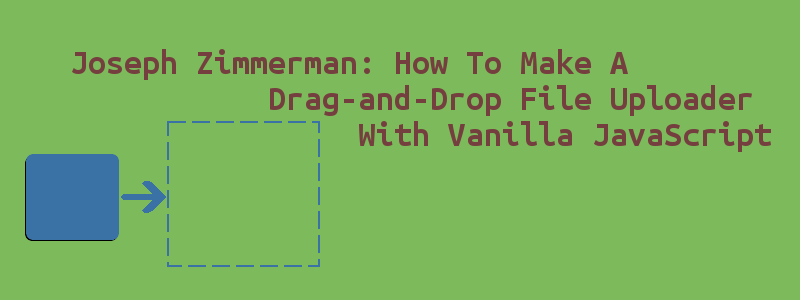

# Как сделать Drag-and-Drop загрузчик файлов на чистом JavaScript



*Перевод статьи [Joseph Zimmerman](https://twitter.com/joezimjs): [How To Make A Drag-and-Drop File Uploader With Vanilla JavaScript](https://www.smashingmagazine.com/2018/01/drag-drop-file-uploader-vanilla-js/)*. Переведено с согласия автора.

Известный факт, что поле для загрузки файлов трудно стилизовать так, как хочется разработчику. Многие просто скрывают его и добавляют кнопку, которая открывает диалог выбора файлов. Однако, теперь у нас появился даже ещё более модный способ обработки выбора файлов: drag and drop.

Технически это уже было возможно сделать, потому что большинство (если не все) реализации поля выбора файлов позволяли перетаскивать файлы для их выбора, но это требовало от вас показывать элемент с типом `file`. Итак, давайте по-настоящему использовать API, которое даёт нам браузер, для реализации выбора файлов через drag-and-drop и их загрузки на сервер.

В этой статье мы будем использовать чистый ES2015+ JavaScript (без фреймворков или библиотек) для выполнения этого проекта, и это предполагает, что у вас есть опыт работы с JavaScript в браузере. Этот пример — помимо ES2015+ синтаксиса, который можно легко изменить на синтаксис ES5 или транспилировать с помощью Babel — должен быть совместим со всеми вечнозелёными браузерами + IE 10 и 11.

Ниже можете видеть пример того, что должно получиться:


*Демонстрационная страница, на которой можно загрузить файлы с помощью drag and drop с немедленным предварительным просмотром изображений и демонстрацией индикатора прогресса загрузки.*

## События Drag-and-Drop

Первое, что мы должны обсудить, это события связанные с перетаскиванием, потому что они движущая сила этого функционала. В общем, есть восемь событий, срабатывающих в браузере и связанных с перетаскиванием: `drag`, `dragend`, `dragenter`, `dragexit`, `dragleave`, `dragover`, `dragstart` и `drop`. Мы не будем проходиться по ним всем, потому что события `drag`, `dragend`, `dragexit` и `dragstart` срабатывают на элементе, который перетаскивают, а это не наш случай, мы будем перетаскивать файлы из нашей файловой системы вместо DOM-элементов, так что эти события никогда не сработают.

Если вам стало интересно почитать об этих событиях, то вы можете изучить [документацию связанную с ними на MDN](https://developer.mozilla.org/en-US/docs/Web/API/HTML_Drag_and_Drop_API#Drag_Events).

Как и следовало ожидать, вы можете навесить обработчики для нужных событий таким же образом, каким происходит регистрация обработчиков большинства браузерных событий: с помощью `addEventListener`.

```javascript
let dropArea = document.getElementById('drop-area')
dropArea.addEventListener('dragenter', handlerFunction, false)
dropArea.addEventListener('dragleave', handlerFunction, false)
dropArea.addEventListener('dragover', handlerFunction, false)
dropArea.addEventListener('drop', handlerFunction, false)
```

Ниже приведена небольшая таблица, описывающая, что эти события делают. Используем `dropArea` из примера кода выше для того, чтобы сделать описание понятнее:

| **Событие**     | **Когда оно срабатывает?**|
| ------------- |:-------------:|
| `dragenter`     | Перетаскиваемый объект перетаскивается над `dropArea`, делая `dropArea` целью события `drop`, если пользователь перетащит его туда. |
| `dragleave`     | Перетаскиваемый объект перетащили за пределы `dropArea` на другой элемент, делая его целью события `drop` вместо `dropArea`.      |
| `dragover`      | Срабатывает каждые несколько сотен миллисекунд, пока объект перетаскивают над `dropArea`.     |
| `drop`          | Пользователь отпустил кнопку мыши, перетаскиваемый объект перетащили на `dropArea`. |

Стоит отметить, что при перетаскивании объекта над элементом, являющимся дочерним для `dropArea`, событие `dragleave` сработает над `dropArea`, а событие `dragenter` на дочернем элементе, потому что он становится `target`. Событие `drop` всплывёт до элемента `dropArea` (конечно, если до этого всплытие не остановит другой обработчик событий), таким образом событие сработает на `dropArea`, несмотря на то, что `target` у него будет другим.

Также обратите внимание, что для реализации пользовательского интерфейса с drag-and-drop, вам необходимо вызывать `event.preventDefault()` на каждом из слушателей этих событий. Если вы этого не сделаете, то браузер в конечном итоге откроет файл, который вы перетаскиваете, вместо того, чтобы отправить его в обработчик события `drop`.

## Настраиваем нашу форму

До того как мы начнём добавлять функциональность drag-and-drop, нам надо добавить базовую форму со стандартным полем типа `file`. Технически это не обязательно, но рекомендуется предоставить такую альтернативу пользователям, чей браузер не поддерживает drag-and-drop API.

```html
<div id="drop-area">
  <form class="my-form">
    <p>Загрузите изображения с помощью диалога выбора файлов или перетащив нужные изображения в выделенную область</p>
    <input type="file" id="fileElem" multiple accept="image/*" onchange="handleFiles(this.files)">
    <label class="button" for="fileElem">Выбрать изображения</label>
  </form>
</div>
```

Довольно простая структура. Вы можете заметить обработчик события `onchange` на `input`. Посмотрим на него позже. Было бы также хорошей идеей добавить `action` к тегу `form` и кнопку `submit`, чтобы помочь людям, у которых выключен JavaScript. Затем можно использовать JavaScript для того, чтобы избавиться от них, почистить форму. В любом случае, вам *понадобится* серверный скрипт для загрузки файлов, неважно написан ли он собственными силами или вы используете сервис, такой как [Cloudinary](https://cloudinary.com/documentation/javascript_image_and_video_upload). Кроме этого, здесь нет ничего особенного, так что давайте набросаем стили:

```css
#drop-area {
  border: 2px dashed #ccc;
  border-radius: 20px;
  width: 480px;
  font-family: sans-serif;
  margin: 100px auto;
  padding: 20px;
}
#drop-area.highlight {
  border-color: purple;
}
p {
  margin-top: 0;
}
.my-form {
  margin-bottom: 10px;
}
#gallery {
  margin-top: 10px;
}
#gallery img {
  width: 150px;
  margin-bottom: 10px;
  margin-right: 10px;
  vertical-align: middle;
}
.button {
  display: inline-block;
  padding: 10px;
  background: #ccc;
  cursor: pointer;
  border-radius: 5px;
  border: 1px solid #ccc;
}
.button:hover {
  background: #ddd;
}
#fileElem {
  display: none;
}
```

Многие из этих стилей пока не используются, но это нормально. Основным моментом является то, что поле `file` скрыто, а его подпись `label` стилизована так, чтобы выглядеть как кнопка, таким образом люди поймут, что кликнув по нему вызовется диалог выбора файлов. Кроме того, мы следуем соглашению, согласно которому область, куда следует перетащить файл, обозначается пунктирной линией.

## Добавляем функциональность Drag-and-Drop

Теперь можем перейти к сладкому: drag and drop. Давайте напишем скрипт внизу страницы или в отдельном файле, смотря как вам больше нравится. Первое, что нам понадобится — это ссылка на область, куда предстоит тащить файл. Так мы сможем обрабатывать нужные нам события на ней:

```javascript
let dropArea = document.getElementById('drop-area')
```

Теперь давайте добавим сами события. Начнём с добавления обработчиков для всех событий, чтобы предотвратить поведение по умолчанию и остановить всплытие выше необходимого:

```javascript
;['dragenter', 'dragover', 'dragleave', 'drop'].forEach(eventName => {
  dropArea.addEventListener(eventName, preventDefaults, false)
})

function preventDefaults (e) {
  e.preventDefault()
  e.stopPropagation()
}
```

Теперь давайте добавим индикатор, который позволит пользователям понять, что они действительно перетаскивали элементы над нужной областью, используем CSS для изменения цвета границы области для перетаскивания. Стили уже описаны выше для селектора `#drop-area.highlight`, так что давайте используем JavaScript для добавления и удаления класса `highlight`, когда это необходимо.

```javascript
;['dragenter', 'dragover'].forEach(eventName => {
  dropArea.addEventListener(eventName, highlight, false)
})

;['dragleave', 'drop'].forEach(eventName => {
  dropArea.addEventListener(eventName, unhighlight, false)
})

function highlight(e) {
  dropArea.classList.add('highlight')
}

function unhighlight(e) {
  dropArea.classList.remove('highlight')
}
```

Мы использовали оба события `dragenter` и `dragover` для подсвечивания области для перетаскивания по причинам, о которых я говорил ранее. Если вы начинаете перетаскивать непосредственно над `dropArea` и затем перешли на дочерний элемент, то сработает событие `dragleave` и подсвечивание области пропадёт. Событие `dragover` сработает после событий `dragenter` и `dragleave`, так что подсветка вернётся обратно на `dropArea` до того, как мы увидим, что она пропала.

Мы также убираем подсветку, когда перетаскиваемый элемент покидает обозначенную область и когда его перетаскивают в неё.

Теперь всё что нам нужно, это выяснить что делать, когда файлы будут перетащены:

```javascript
dropArea.addEventListener('drop', handleDrop, false)

function handleDrop(e) {
  let dt = e.dataTransfer
  let files = dt.files

  handleFiles(files)
}
```

Код выше не приближает нас к цели, но делает две важные вещи:

01. Демонстрирует, как получить данные о файлах, которые перетащили.
02. Приводит нас в то же место, что и поле `input` с типом `file` и обработчиком на событие `onchange`: `handleFiles`.

Помните о том, что `files` это не массив, а `FileList`. Таким образом, при реализации `handleFiles`, нам нужно преобразовать `FileList` в массив, чтобы более легко было его итерировать:

```javascript
function handleFiles(files) {
  ([...files]).forEach(uploadFile)
}
```

Это было скучно (*That was aniticlimactic*). Перейдём к `uploadFile`, где будут *действительно* крутые штуки (*real meaty stuff*).

```javascript
function uploadFile(file) {
  let url = 'ВАШ URL ДЛЯ ЗАГРУЗКИ ФАЙЛОВ'
  let formData = new FormData()

  formData.append('file', file)

  fetch(url, {
    method: 'POST',
    body: formData
  })
  .then(() => { /* Готово. Информируем пользователя */ })
  .catch(() => { /* Ошибка. Информируем пользователя */ })
}
```

Здесь мы используем `FormData` — встроенный браузерный API для создания форм с данными для отправки на сервер. Для этого мы используем `fetch` API, чтобы действительно отправить изображения на сервер. Убедитесь, что вы изменили URL для работы с вашим сервером или сервисом, с помощью `formData.append` можете добавить к форме любые дополнительные данные, которые могут потребоваться для работы с вашим сервером. Как альтернатива, если вы хотите поддерживать Internet Explorer, вы можете захотеть использовать `XMLHttpRequest`, это значит, что ваш `uploadFile` будет выглядеть так:

```javascript
function uploadFile(file) {
  var url = 'ВАШ URL ДЛЯ ЗАГРУЗКИ ФАЙЛОВ'
  var xhr = new XMLHttpRequest()
  var formData = new FormData()
  xhr.open('POST', url, true)

  xhr.addEventListener('readystatechange', function(e) {
    if (xhr.readyState == 4 && xhr.status == 200) {
      // Готово. Информируем пользователя
    }
    else if (xhr.readyState == 4 && xhr.status != 200) {
      // Ошибка. Информируем пользователя
    }
  })

  formData.append('file', file)
  xhr.send(formData)
}
```

В зависимости от настроек вашего сервера, вы можете проверять различные значения `status`, отличные от `200`, но для наших нужд это сработает.

## Дополнительные возможности

Это вся базовая функциональность, но часто требуется её расширить. Конкретно в этом руководстве, мы добавим панель предпросмотра, где будут показаны выбранные изображения, также добавим индикатор прогресса, который будет показывать пользователю статус загрузки. Итак, давайте начнём с предпросмотра изображений.

### Предпросмотр изображений

Есть несколько способов сделать это: вы можете ждать пока изображения загрузятся и запросить у сервера URL для картинок, но это означает что вам придётся ждать пока выполняется загрузка, а временами изображения могут быть довольно большими. Альтернатива, которую мы будет исследовать сегодня — это использовать [FileReader API](https://developer.mozilla.org/en-US/docs/Web/API/FileReader) с данными файлов, которые мы получили из события `drop`. Это работает асинхронно, но вы можете использовать синхронную альтернативу [FileReaderSync](https://developer.mozilla.org/en-US/docs/Web/API/FileReaderSync), но пользователи могут попробовать прочитать несколько больших файлов подряд, таким образом, это может заблокировать поток выполнения на длительное время и по-настоящему испортить впечатления пользователя от сервиса. Что же, давайте создадим функцию `previewFile` и посмотрим как это работает:

```javascript
function previewFile(file) {
  let reader = new FileReader()
  reader.readAsDataURL(file)
  reader.onloadend = function() {
    let img = document.createElement('img')
    img.src = reader.result
    document.getElementById('gallery').appendChild(img)
  }
}
```

Здесь мы создали `new FileReader` и вызвали метод `readAsDataURL` для объекта `File`. Как уже упоминалось, это работает асинхронно, поэтому нужно добавить обработчик события `onloadend` для обработки результата чтения файла. После этого используем base64 URL для атрибута `src` нового элемента `` и добавляем его в элемент `gallery`. Есть только две вещи, которые надо сделать, чтобы всё было готово и работало: добавить элемент `gallery` и вызов функции `previewFile`.

Во-первых, добавим HTML, который приведен ниже, сразу после закрывающего тега `form`:

```html
<div id="gallery"></div>
```

Ничего особенного, это просто `div`. Стили уже заданы для него и изображений в нём, так что больше здесь ничего делать не надо. Теперь изменим функцию `handleFiles` на следующую:

```javascript
function handleFiles(files) {
  files = [...files]
  files.forEach(uploadFile)
  files.forEach(previewFile)
}
```

Есть несколько способов сделать это, например композиция или простой колбэк `forEach`, в котором запускается `uploadFile` и `previewFile`, и это тоже сработает. Таким образом, когда вы перетащите или выбираете несколько изображений, они будут показаны почти мгновенно ниже формы. Интересная мысль по этому поводу: в некоторых приложениях вы можете не захотеть действительно загружать изображения на сервер, а вместо этого хранить ссылки на них в `localStorage` или в каком-нибудь другом кеше на стороне пользователя, чтобы приложение имело к ним доступ позже. Я лично не могу придумать хорошие сценарии использования этого, но я готов поспорить, что такие есть.

**Примечание переводчика**: *от себя добавлю, что для реализации предпросмотра неграфических файлов, было бы неплохо подготовить изображения-заглушки, которые будут показаны при добавлении таких файлов.  Такая картинка в дальнейшем может быть заменена другой, которую подготовит сервер уже после загрузки файла.*

### Отслеживание прогресса

Если что-нибудь занимает некоторое время, индикатор прогресса помогает пользователю понять, что процесс идёт, и показывает, как долго это что-нибудь будет выполняться. Добавить индикатора прогресса довольно легко благодаря HTML5 тегу `progress`. Давайте начнём с добавления его в HTML-код.

```html
<progress id="progress-bar" max=100 value=0></progress>
```

Вы можете вставить его сразу после элемента `label` или между элементами `form` и `div` для предпросмотра изображений, как больше нравится. Вообще, вы можете добавить его куда захотите в пределах тега `body`. Стили для этого примера не добавлены, так что будет отрисован браузерный элемент по умолчанию, который вполне пригоден. Теперь давайте добавим JavaScript. Сначала рассмотрим реализацию с использованием `fetch`, а затем покажем версию для `XMLHttpRequest`. Для начала нам понадобится пара новых переменных в верхней части скрипта:

```javascript
let filesDone = 0
let filesToDo = 0
let progressBar = document.getElementById('progress-bar')
```

При использовании `fetch` мы только можем определить, когда загрузка завершена, так что единственная информация, которую мы отслеживаем: сколько файлов выбрано для загрузки (переменная `filesToDo`) и количество уже загруженных файлов (переменная `filesDone`). Также мы храним ссылку на элемент `#progress-bar`, чтобы мы могли быстро обновлять его. Теперь давайте создадим пару функций для управления прогрессом:

```javascript
function initializeProgress(numfiles) {
  progressBar.value = 0
  filesDone = 0
  filesToDo = numfiles
}

function progressDone() {
  filesDone++
  progressBar.value = filesDone / filesToDo * 100
}
```

Когда мы только начинаем загрузку, вызовем функцию `initializeProgress` для сброса состояния индикатора. Затем, с каждой выполненой загрузкой, мы вызываем функцию `progressDone` для увеличения числа загруженых файлов на единицу и обновления индикатора для демонстрации прогресса. Итак, добавим вызовы этих функций, обновив пару старых:

```javascript
function handleFiles(files) {
  files = [...files]
  initializeProgress(files.length) // <- Добавили эту строку
  files.forEach(uploadFile)
  files.forEach(previewFile)
}

function uploadFile(file) {
  let url = 'ВАШ URL ДЛЯ ЗАГРУЗКИ ФАЙЛОВ'
  let formData = new FormData()

  formData.append('file', file)

  fetch(url, {
    method: 'POST',
    body: formData
  })
  .then(progressDone) // <- Добавим вызов `progressDone` здесь
  .catch(() => { /* Ошибка. Сообщаем пользователю */ })
}
```

И на этом всё. Теперь пришло время посмотреть как будет выглядеть реализация с `XMLHttpRequest`. Мы могли бы просто сделать быстрое обновление в `uploadFile`, но `XMLHttpRequest` фактически даёт нам больше возможностей чем `fetch`, а именно: мы можем добавить обработчик события для отслеживания прогресса загрузки на каждом запросе, который будет периодически давать информацию о прогрессе. Исходя из этого, нам нужно отслеживать процентную готовность каждого запроса вместо количества выполненных запросов. Итак, давайте начнём с замены объявлений переменных `filesDone` и `filesToDo` на следующий код:

```javascript
let uploadProgress = []
```

Тогда нам нужно обновить и наши функции. Переименуем `progressDone` в `updateProgress` и изменим её код как показано ниже:

```javascript
function initializeProgress(numFiles) {
  progressBar.value = 0
  uploadProgress = []

  for(let i = numFiles; i > 0; i--) {
    uploadProgress.push(0)
  }
}

function updateProgress(fileNumber, percent) {
  uploadProgress[fileNumber] = percent
  let total = uploadProgress.reduce((tot, curr) => tot + curr, 0) / uploadProgress.length
  progressBar.value = total
}
```

Теперь `initializeProgress` инициализирует массив с длиной, равной `numFiles`, который заполнен нулями, означающими, что каждый файл загружен на 0%. В `updateProgress` мы видим какое из изображений обновляет свой прогресс и изменяем значение элемента с нужным индексом на предоставленный `percent`. Затем мы вычисляем общий процент выполнения как среднее среди всех процентов и обновляем индикатор прогресса, чтобы отобразить вычисленное значение. Мы по-прежнему вызываем `initializeProgress` в `handleFiles` также, как делали это в примере с `fetch`. Таким образом, всё что нам нужно, это обновить `uploadFile`, добавив вызов `updateProgress`.

```javascript
function uploadFile(file, i) { // <- Добавили параметр `i`
  var url = 'ВАШ URL ДЛЯ ЗАГРУЗКИ ФАЙЛОВ'
  var xhr = new XMLHttpRequest()
  var formData = new FormData()
  xhr.open('POST', url, true)

  // Добавили следующие слушатели
  xhr.upload.addEventListener("progress", function(e) {
    updateProgress(i, (e.loaded * 100.0 / e.total) || 100)
  })

  xhr.addEventListener('readystatechange', function(e) {
    if (xhr.readyState == 4 && xhr.status == 200) {
      // Готово. Сообщаем пользователю
    }
    else if (xhr.readyState == 4 && xhr.status != 200) {
      // Ошибка. Сообщаем пользователю
    }
  })

  formData.append('file', file)
  xhr.send(formData)
}
```

Первое, что нужно отметить, это то, что мы добавили параметр `i`. Это индекс файла в списке файлов. Нам не нужно обновлять `handleFiles` для передачи этого параметра, потому что он использует `forEach`, который уже передаёт индекс элемента вторым параметром в колбэк. Также мы добавили слушатель события `progress` в `xhr.upload`, чтобы можно было вызвать `updateProgress` со значением прогресса. Объект события (`e` в нашем коде) имеет два информативных поля: `loaded` — количество уже загруженных байтов, и `total` — общее количество байтов.

Выражение `|| 100` нужно потому, что иногда, при возникновении ошибки, `e.loaded` и `e.total` будут равны нулю, что значит, что вычисления с ними дадут `NaN`, таким образом `100` используется вместо отчёта о выполнении загрузки. Вы можете также использовать `0`. В любом случае ошибки будут отображаться в обработчике события `readystatechange`, и вы можете сообщить о них пользователю. Это сделано просто для предотвращения исключений, связанных с попытками вычислений с `NaN`.

*Примечание редактора: Такой подход к подавлению ошибок не очень правильный, и, к тому же, приводит к скачкам индикатора загрузки. Гораздо надёжнее заранее проверить значения на корректность и в случае ошибки не менять значение индикатора загрузки.*

## Заключение

Это последняя часть. Теперь у нас есть страница, на которой можно загружать изображения с помощью drag and drop, есть мгновенный предпросмотр изображений и отображение прогресса загрузки с помощью индикатора. Вы можете посмотреть окончательную версию (с использованием `XMLHttpRequest`) в действии на [CodePen](https://codepen.io/joezimjs/pen/yPWQbd), но помните, что сервис, через который я загружаю файлы, имеет ограничения, и если много людей будут его использовать одновременно, то он может быть недоступен некоторое время.

---

*Слушайте наш подкаст в [iTunes](https://itunes.apple.com/ru/podcast/девшахта/id1226773343) и [SoundCloud](https://soundcloud.com/devschacht), читайте нас на [Medium](https://medium.com/devschacht), контрибьютьте на [GitHub](https://github.com/devSchacht), общайтесь в [группе Telegram](https://t.me/devSchacht), следите в [Twitter](https://twitter.com/DevSchacht) и [канале Telegram](https://t.me/devSchachtChannel), рекомендуйте в [VK](https://vk.com/devschacht) и [Facebook](https://www.facebook.com/devSchacht).*
