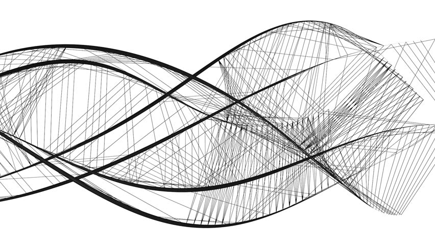

# Справочник современных концепций JavaScript: часть 2

*Перевод заметки [Kim Maida](https://twitter.com/KimMaida): [Glossary of Modern JavaScript Concepts: Part 2](https://auth0.com/blog/glossary-of-modern-javascript-concepts-part-2/).*



##### Изучите область видимости, замыкания, потоки данных и концепции, широко используемые в современных JavaScript фреймворках и приложениях

**Кратко:** В [первой части серии «Справочник современных концепций JavaScript»](https://medium.com/devschacht/glossary-of-modern-javascript-concepts-1198b24e8f56) мы узнали о функциональном, реактивном и функциональном реактивном программировании. Во **второй части** мы познакомимся с понятиями *область видимости*, *замыкания*, *tree shaking*, *компоненты* и другими, а также из темы JavaScript приложений: *поток данных* и *обнаружение изменений*.

- - - -

### Введение

За последние годы JavaScript сильно развился и не думает на этом останавливаться. Однако множество концепций, рождающихся в JavaScript блогах и документациях, так и остаются невостребованными широким кругом разработчиков интерфейсов. В настоящей серии статей мы изучим концепции, требующие как среднего, так и продвинутого уровней подготовки, а также рассмотрим, как они вписываются в современный JavaScript: фреймворки и приложения.

### Концепции

В этой статье мы рассмотрим концепции, имеющие решающее значение для понимания современного JavaScript и JavaScript приложений, включая **область видимости и замыкания, поток данных, обнаружение изменений, компоненты, компиляцию и многие другие**.

Отсюда вы можете напрямую перейти к каждой концепции или продолжить чтение по порядку.

* [Область видимости (глобальная, локальная, лексическая) и замыкания](https://github.com/devSchacht/translations/tree/master/kim-maida-glossary-of-modern-javascript-concepts-part-2#Область-видимости-глобальная-локальная-лексическая-и-замыкания)
* [Однонаправленный поток данных и двухсторонняя привязка данных](https://github.com/devSchacht/translations/tree/master/kim-maida-glossary-of-modern-javascript-concepts-part-2#Однонаправленный-поток-данных-и-двухсторонняя-привязка-данных)
* [Обнаружение изменений в JavaScript фреймворке: грязная проверка, аксессоры, виртуальный DOM](https://github.com/devSchacht/translations/tree/master/kim-maida-glossary-of-modern-javascript-concepts-part-2#Обнаружение-изменений-в-javascript-фреймворке-грязная-проверка-аксессоры-виртуальный-dom)
* [Веб-компоненты](https://github.com/devSchacht/translations/tree/master/kim-maida-glossary-of-modern-javascript-concepts-part-2#Веб-компоненты)
* [Умные и глупые компоненты](https://github.com/devSchacht/translations/tree/master/kim-maida-glossary-of-modern-javascript-concepts-part-2#Умные-и-глупые-компоненты)
* [JIT (Just-In-Time) компиляция](https://github.com/devSchacht/translations/tree/master/kim-maida-glossary-of-modern-javascript-concepts-part-2#jit-just-in-time-компиляция)
* [AOT (Ahead-of-Time) компиляция](https://github.com/devSchacht/translations/tree/master/kim-maida-glossary-of-modern-javascript-concepts-part-2#aot-ahead-of-time-компиляция)
* [Tree shaking](https://github.com/devSchacht/translations/tree/master/kim-maida-glossary-of-modern-javascript-concepts-part-2#tree-shaking)

### Область видимости (глобальная, локальная, лексическая) и замыкания

Объяснение замыканий - печально известный технический вопрос о JavaScript. Правда в том, что многие опытные разработчики JavaScript не могут объяснить замыкания, даже если они концептуально понимают (и даже используют) их. Давайте немного уйдем в сторону и прежде всего поговорим о концепциях, необходимых для объяснения замыканий.

#### Область видимости

Для того, чтобы разобраться с замыканием, нам нужно сначала понять **область видимости**. Область видимости - это просто контекст нашего кода: там, где доступны переменные и функции.

Следующий пример демонстрирует **глобальную** и **локальную** области видимости:

```js
// Глобальная область видимости
var globalVar = 'Hello, ';
console.log(localVar); // Uncaught ReferenceError: localVar is not defined

someFunction() {
  // Локальная область видимости
  var localVar = 'World!';
  console.log(globalVar + localVar); // 'Hello, World!'
}
```

Весь код имеет доступ к **глобальной области видимости**. Если мы откроем пустой `.js` файл и наберем `var globalVar`, эта переменная будет доступна для всего, что мы напишем далее. Если мы выполним файл в браузере, глобальной областью видимости `globalVar` будет `window`.

**Примечание:** Если мы объявим новую переменную без ключевого слова `var`, она будет помещена в глобальную область видимости независимо от того, где она находится в коде. Возможно, вы уже с этим сталкивались.

Функция `someFunction` создает свою собственную **локальную область видимости**. Она также имеет доступ к глобальной области видимости: внутри `someFunction` мы можем без ограничений использовать `globalVar`. Тем не менее, глобальная область видимости не имеет доступа к вложенным контекстам, таким как локальная область видимости `someFunction`. Если мы попытаемся залогировать `localVar` из глобальной области видимости, мы получим ошибку, потому что `localVar` не определен в глобальной области видимости.

Если вкратце, вложенные функции имеют свою область видимости. Функции, объявленные внутри другой функции, имеют доступ к областям видимости родительских функций. Это называется цепочкой областей видимости.

**Лексическая область видимости** (или статическая область видимости) закрепляет то, что каждая вложенная функция может обращаться к родительским функциям.

Рассмотрим следующий пример:

```js
// Лексическая область видимости
// и цепочка областей видимости
var a = 1;

function outerFunc() {
  var b = 2;
  console.log(a + b);

  function middleFunc() {
    var c = 3;
    console.log(a + b + c);

    function innerFunc() {
      var d = 4;
      console.log(a + b + c + d);
    }

    innerFunc(); // выводит 10 (1 + 2 + 3 + 4)
  }

  middleFunc(); // выводит 6 (1 + 2 + 3)
}

outerFunc(); // выводит 3 (1 + 2)
```

Этот код доступен в [JSFiddle: JS Scope](https://jsfiddle.net/kmaida/7frrzym4/) (откройте консоль браузера, чтобы увидеть результат).

`innerFunc` - самая внутренняя функция. Она объявлена внутри `middleFunc`, которая, в свою очередь, объявлена в `outerFunc`.

Функция `innerFunc` может обращаться к переменным, объявленным во всех родительских областях видимости. Эта цепочка областей видимости обеспечивает доступ к:

* `a` из глобальной области видимости;
* `b` из `outerFunc`;
* `c` из `middleFunc`;
* `d` из собственной локальной области видимости `innerFunc`.

Это работает только в сторону углубления во вложенные функции, а не наоборот. Например, переменная `d` с локальной областью видимости объявлена в `innerFunc` и недоступна для `middleFunc`, `outerFunc` или глобальной области видимости.

#### Замыкания

В [первой части Справочника современных концепций JavaScript](https://medium.com/devschacht/glossary-of-modern-javascript-concepts-1198b24e8f56) мы узнали о функциях и функциях высшего порядка в качестве объектов первого класса. Если звучит незнакомо, найдите минутку, чтобы ознакомиться с разделом о функциях высшего порядка.

Теперь давайте перейдем к примеру функции высшего порядка, который мы видели в первой части:

```js
// Функция высшего порядка
function whenMeetingJohn() {
  return function() {
    alert('Hi!');
  }
}
var atLunchToday = whenMeetingJohn();

atLunchToday(); // выводит "Hi!"
```

Это функция, возвращающая другую функцию. Давайте обновим пример, чтобы добавить аргумент `salutation` и переменную `greeting` в локальную область видимости `whenMeetingJohn`. Мы также назовем ранее анонимную возвращаемую функцию `alertGreeting`, чтобы нам было проще к ней обращаться:

```js
// Замыкания
function whenMeetingJohn(salutation) {
  var greeting = salutation + ', John!';

  function alertGreeting() {
    alert(greeting);
  }
  return alertGreeting;
}
var atLunchToday = whenMeetingJohn('Hi');

atLunchToday(); // выводит "Hi, John!"
whenMeetingJohn('Whassup')(); // выводит "Whassup, John!"
```

Этот код доступен в [JSFiddle: JS Closures](https://jsfiddle.net/kmaida/c9wuupz8/).

**Замыкание** создается, когда функция (`alertGreeting`), объявленная внутри внешней функции (`whenMeetingJohn`), ссылается на переменные из локальной области видимости внешней функции (такие как переменная `greeting`).

Замыканием называется функция, связанная с функцией и лексическим окружением (любые локальные переменные, которые были в области видимости при создании замыкания), в которых она была объявлена.

Когда мы вызываем `atLunchToday()`, мы получаем `alert` с аргументом, переданным при присвоении `whenMeetingJohn('Hi')` (в данном случае `'Hi'`), и переменной `greeting`, доступной в лексическом окружении `alertGreeting`.

**Примечание:** Мы также можем вызвать возвращаемую функцию (`alertGreeting`), не присваивая её. Делается это так: `whenMeetingJohn('Whassup')()`.

Надеюсь, вы можете оценить важность замыканий, глядя на этот простой пример. Мы можем приветствовать Джона несколькими различными приветствиями. Каждый раз мы создаём замыкание с доступом к конкретным данным приветствия в области видимости на момент создания.

В другом распространенном примере, демонстрирующем замыкания, используется простое выражение сложения:

```js
// Замыкания
function addCreator(x) {
  return function(y) {
    alert(x + y);
  }
}
var add1 = addCreator(1);
var add5 = addCreator(5);

add1(2); // выводит 3
add5(2); // выводит 7
```

Этот код в [JSFiddle: JS Closures - Adder](https://jsfiddle.net/kmaida/qfvyofcs/).

Оба `add1` и `add5` - замыкания с различными лексическими окружениями, хранящими разные значения для аргумента `x`. Эти значения защищены тем, что они «заключены» в лексическое окружение каждого замыкания. Мы могли бы использовать фабричную функцию `addCreator(x)` для создания стольких функций `add_`, сколько нам потребуется.

#### Подводя итог: область видимости и замыкания

Область видимости - это то, что многие разработчики JavaScript изучают раньше всего, но не могут объяснить словами или конкретными примерами. Понимание области видимости важно для написания хорошего JavaScript.

**Примечание:** Здесь мы обговорили далеко не все об области видимости. Для более глубокого понимания, особенно в отношении [ключевого слова this](https://developer.mozilla.org/en-US/docs/Web/JavaScript/Reference/Operators/this), существует несколько отличных ресурсов. Больше ссылок ищите ниже.

Замыкания связывают данные с функцией, использующей лексическое окружение, в котором функция была объявлена.

Дополнительную информацию об **области видимости и замыканиях** (и `this`) можно найти на следующих ресурсах:

* [Все, что вы хотели знать об области видимости JavaScript](https://toddmotto.com/everything-you-wanted-to-know-about-javascript-scope/)
* [Объяснение области видимости JavaScript и замыканий](https://robertnyman.com/2008/10/09/explaining-javascript-scope-and-closures/)
* [Область видимости в JavaScript](http://www.digital-web.com/articles/scope_in_javascript/)
* [Что такое лексическое окружение?](http://stackoverflow.com/a/1047491)
* [MDN: Замыкание](https://developer.mozilla.org/ru/docs/Web/JavaScript/Closures)
* [Что такое this?](https://howtonode.org/what-is-this)
* [MDN: this](https://developer.mozilla.org/ru/docs/Web/JavaScript/Reference/Operators/this)
* [Овладение JavaScript this с ясностью и мастером](http://javascriptissexy.com/understand-javascripts-this-with-clarity-and-master-it/)
* [JavaScript: Как работает ключевое слово this?](http://stackoverflow.com/a/3127440)

### Однонаправленный поток данных и двухсторонняя привязка данных

С распространением фреймворков JavaScript и одностраничных приложений (SPA) для разработчиков JavaScript стало особенно важно понимать такие понятия как поток и привязка данных, а также то, как используемые нами инструменты работают с ними.

#### Однонаправленный поток данных

Приложение или среда с **однонаправленным потоком данных** использует модель как единственный источник правды. [React](https://facebook.github.io/react/) - яркий представитель однонаправленного потока данных (или *односторонней привязки данных*). Сообщения отправляются из пользовательского интерфейса в форме событий, чтобы оповестить модель и она обновилась.

Взгляните на следующий пример на React:

```
// Однонаправленный поток данных с React
class OneWay extends React.Component {
  constructor() {
    super();
    this.handleChange = this.handleChange.bind(this);
    // при инициализации this.state.text - пустая строка
    this.state = {
      text: ''
    };
  }
  handleChange(e) {
    // получает новое значение инпута из события
    // и обновляет состояние
    this.setState({
      text: e.target.value
    });
  }
  render() {
    return (
      <div>
        <input type="text" onChange={this.handleChange} />
        <p>Text: {this.state.text}</p>
      </div>
    );
  }
}
```

Этот код в [JSFiddle: React One-Way Data Flow](https://jsfiddle.net/kmaida/045znrsf/).

Мы видим, что `state` (объект модели) задается в функции-конструкторе. Начальное значение `this.state.text` - пустая строка. В нашей функции `render()` мы добавляем обработчик `onChange` к элементу `<input>`. Мы используем этот обработчик для `setState()`, оповещая `state`, что необходимо обновить свойство `text` новым значением из инпута.

Данные текут только в одном направлении: от модели вниз. Инпут не имеет прямого доступа к модели. Если мы хотим обновить состояние в ответ на изменения из пользовательского интерфейса, инпут должен отправить сообщение со всей необходимой информацией. Единственный способ, которым пользовательский интерфейс может влиять на модель, - это событие и [метод setState()](https://facebook.github.io/react/docs/react-component.html#setstate). Пользовательский интерфейс никогда магическим образом не обновляет модель.

**Примечание:** Чтобы пользовательский интерфейс отобразил произошедшие в модели изменения, React создает новый виртуальный DOM и сопоставляет его со старым виртуальным DOM. Затем в реальном DOM отображаются только изменения. Мы поговорим об этом подробнее в разделе об [обнаружении изменений](https://github.com/devSchacht/translations/tree/master/kim-maida-glossary-of-modern-javascript-concepts-part-2#Обнаружение-изменений-в-javascript-фреймворке-грязная-проверка-аксессоры-виртуальный-dom).

#### Двусторонняя привязка данных

При **двусторонней привязке данных** данные передаются в обоих направлениях. Это означает, что обновить модель может как JavaScript, так и пользовательский интерфейс. Наиболее ярким примером такого подхода является [AngularJS](https://angularjs.org/).

**Примечание:** В этой статье под *AngularJS* подразумевается версия 1.x, в то время как под *Angular* - версии 2.x и выше в соответствии с [руководством по брендингу для Angular](http://angularjs.blogspot.com/2017/01/branding-guidelines-for-angular-and.html).

Давайте реализуем верхний пример, но с помощью AngularJS и двухсторонней привязки данных:

```js
// Двухсторонняя привязка данных на AngularJS
// script.js
(function() {
  angular
    .module('myApp', [])
    .controller('MyCtrl', function($scope) {
      // при инициализации $scope.text - пустая строка
      $scope.text = '';
      // наблюдаем за изменениями $scope.text
      $scope.$watch('text', function(newVal, oldVal) {
        console.log(`Old value: ${oldVal}. New value: ${newVal}`);
      });
    });
}());
```

```html
<!-- Двухсторонняя привязка данных на AngularJS -->
<!-- index.html -->
<body ng-app="myApp">
  <div ng-controller="MyCtrl">
    <input type="text" ng-model="text" />
    <p>Text: {{text}}</p>
  </div>
</body>
```

Этот код в [Plunker: AngularJS Two-Way Binding](http://plnkr.co/edit/guuX5XYIYwI7OcoflTur?p=preview).

В нашем контроллере мы настроили модель `$scope.text`. В шаблоне мы связываем эту модель с `<input>`, используя `ng-model="text"`. Когда мы меняем значение инпута в пользовательском интерфейсе, модель также обновляется в контроллере. Это можно увидеть в `$watch()`.

**Примечание:** Использование `$watch()` в контроллере - дискуссионная практика. Здесь мы сделали это для примера. В своих приложениях AngularJS учтите, что существуют альтернативы использованию `$watch()` в контроллерах (например, события), и если вы все-таки используете `$watch()`, всегда [отменяйте своих наблюдателей $onDestroy](https://www.bennadel.com/blog/2480-unbinding-watch-listeners-in-angularjs.htm).

Это двухсторонняя привязка данных в AngularJS. Как вы можете видеть, мы не настраивали какие-либо события или обработчики, чтобы явно сигнализировать контроллеру, что модель была обновлена ​​в пользовательском интерфейсе. Привязка данных `text` в шаблоне автоматически использует [наблюдателя](https://medium.com/@kentcdodds/counting-angularjs-watchers-11c5134dc2ef) для отображения изменений в модели. Мы также можем наблюдать (`$watch()`) модель. Обычно наблюдение должно выполняться в службах или в директивных функциях `link`, а не в контроллерах.

**Примечание:** Для сравнения нового значения с предыдущим AngularJS использует так называемый [цикл дайджеста](https://docs.angularjs.org/api/ng/type/$rootScope.Scope#$digest) (грязную проверку). Вы можете больше узнать о грязной проверке в AngularJS в разделе об [обнаружении изменений](https://github.com/devSchacht/translations/tree/master/kim-maida-glossary-of-modern-javascript-concepts-part-2#Обнаружение-изменений-в-javascript-фреймворке-грязная-проверка-аксессоры-виртуальный-dom).

#### Дополнительная информация: Двухсторонняя привязка данных в Angular

Но подождите! У [Angular](https://angular.io/) (v2 +) есть «банан в коробке» `[(ngModel)]`, верно ведь? На первый взгляд, это может показаться продолжающейся магией двусторонней привязки данных. Однако это не так. [Синтаксис двухсторонней привязки Angular - [()]](https://angular.io/docs/ts/latest/guide/template-syntax.html#!#two-way) просто сокращает для вас свойство и привязку события в шаблоне, а [директива `ngModel`](https://angular.io/docs/ts/latest/api/forms/index/NgModel-directive.html) предоставляет вам событие `ngModelChange`. Чтобы глубже в этом разобраться, ознакомьтесь [со статьей о двухсторонней привязке в Angular](https://blog.thoughtram.io/angular/2016/10/13/two-way-data-binding-in-angular-2.html).

Следующий пример функционально эквивалентен и демонстрирует директиву `ngModel`:

```
// директива ngModel: синтакс двухсторонней привязки
<input [(ngModel)]="text" />
<p>{{text}}</p>

// ngModel свойство и привязка события
<input [ngModel]="text" (ngModelChange)="text=$event" />
<p>{{text}}</p>
```

[Документация Angular по двухсторонней привязке](https://angular.io/docs/ts/latest/guide/template-syntax.html#!#two-way) отлично описывает этот синтаксис.

#### Подводя итог: однонаправленный поток данных и двухсторонняя привязка данных

Многие современные JavaScript фреймворки и библиотеки используют однонаправленный поток данных ([React](https://facebook.github.io/react/), [Angular](https://angular.io/), [Inferno](http://infernojs.org/), [Redux](http://redux.js.org/) и так далее). Почему? Однонаправленный поток данных поддерживает архитектуру в чистоте, уделяя внимание тому, как приложение работает с данными. Управление состоянием приложения также становится проще, обновления более предсказуемы, а производительность возрастает.

Хотя магия двухсторонней привязки данных была одной из самых популярных функциональностей демоверсий [AngularJS](https://angularjs.org/) ещё в 2009 году, [Angular](https://angular.io/) оставил её в прошлом. В начале некоторые разработчики Angular жаловались на это, но в конечном итоге многие согласились, что прирост производительности и больший контроль перевешивают удобство «магии».

Как мы видели в приведенном выше примере по React, важно помнить, что однонаправленный поток данных не означает, что обновление состояния из пользовательского интерфейса затруднительно. Это означает только то, что такие обновления делаются намеренно, с определенной целью. Это менее волшебно, но гораздо более управляемо.

**Примечание:** Обычно, когда разработчики упоминают «внедрение двухсторонней привязки данных» в фреймворках с однонаправленным потоком данных (например, React), они имеют ввиду действия, которые необходимо предпринять для уведомления модели об изменении пользовательского интерфейса. Они не имеют ввиду способ реализации магии двухсторонней привязки.

Дополнительную информацию об **однонаправленном потоке данных и двухсторонней привязке данных** можно найти на следующих ресурсах:

* [Видео: введение в однонаправленный поток данных](https://www.sitepoint.com/video-introducing-one-way-data-flow/)
* [Диаграммы сравнения односторонней и двусторонней привязки данных](http://stackoverflow.com/a/37566693)
* [Почему React выделяет однонаправленный поток данных и архитектуру Flux?](https://hashnode.com/post/why-does-react-emphasize-on-unidirectional-data-flow-and-flux-architecture-ciibz8ej600n2j3xtxgc0n1f0)
* [Привязка данных в 9 фреймворках JavaScript (2015 год, но все же стоит посмотреть)](http://engineering.paiza.io/entry/2015/03/12/145216)
* [Двусторонняя привязка данных в Angular (v2+)](https://blog.thoughtram.io/angular/2016/10/13/two-way-data-binding-in-angular-2.html)
* [Документация AngularJS - привязка данных](https://docs.angularjs.org/guide/databinding)
* [Мысли React](https://facebook.github.io/react/docs/thinking-in-react.html)

### Обнаружение изменений в JavaScript фреймворке: грязная проверка, аксессоры, виртуальный DOM

Обнаружение изменений важно для любого динамического одностраничного приложения (SPA). Когда пользователь что-то обновляет, у приложения должен быть способ обнаружить и отреагировать на это изменение соответствующим образом. Поэтому для SPA-структур жизненно важно выявлять изменения.

Давайте на довольно высоком уровне рассмотрим несколько методов обнаружения изменений, используемых сегодня в популярных фреймворках JavaScript.

#### Грязная проверка

Хотя уже существует [Angular](https://angular.io/), на [AngularJS](https://angularjs.org/) все ещё работает или прямо сейчас находится разработке множество приложений. Для обнаружения изменений в приложении AngularJS использует так называемый [цикл дайджеста](https://docs.angularjs.org/api/ng/type/$rootScope.Scope#$digest). Под капотом цикл дайджеста использует грязную проверку. Что же это значит?

**Грязная проверка** осуществляет глубокое сравнение, выполняемое для всех моделей в представлении, чтобы проверить измененное значение. Цикл дайджестов AngularJS добавляет наблюдателя для каждого свойства, которое мы добавляем к `$scope` и привязываем в пользовательском интерфейсе. Ещё один наблюдатель добавляется, когда мы отслеживаем значения изменений с помощью `$scope.$watch()`.

> «AngularJS запоминает значение и сравнивает его с предыдущим значением. Это стандартная грязная проверка. Если изменение в значении есть, то он запускает событие изменения», - [Мишко Хевери](https://twitter.com/mhevery), создатель AngularJS и Angular

Цикл дайджеста - это цикл. AngularJS запускает свой список наблюдателей и проверяет, не изменилась ли какая-либо из наблюдаемых переменных `$scope` (иначе они «грязные»). Если переменная не изменилась, он переходит к следующей наблюдаемой переменной. Если он находит «грязную» переменную, он запоминает новое значение и снова входит в цикл. Когда никакие новые изменения не обнаружены во всем списке наблюдения, обновляется DOM.

Основными преимуществами грязной проверки являются простота и предсказуемость: нет расширения объектов и не нужно пользоваться никаким API. Однако она неэффективна. Всякий раз, когда что-либо меняется, запускается цикл дайджеста. Поэтому при создании наблюдателей в AngularJS очень важно соблюдать осторожность. Каждый раз, когда свойство `$scope` привязывается к пользовательскому интерфейсу, добавляется наблюдатель. Каждый раз, когда используется `$watch()`, добавляется ещё один наблюдатель. Многие директивы также добавляют наблюдателей, а также переменные области видимости, фильтры и повторители.

Хотя грязная проверка достаточно быстра в простом приложении, ситуация легко может выйти из-под контроля в сложной реализации. Это привело к таким статьям, как [11 советов по улучшению производительности AngularJS: 1. минимизация/избегание наблюдателей](https://www.alexkras.com/11-tips-to-improve-angularjs-performance/#watchers) и [Ускорение цикла дайджеста в AngularJS](https://coderwall.com/p/d_aisq/speeding-up-angularjs-s-digest-loop).

**Примечание:** Angular (v2+) [больше не](https://gofore.com/en/angular-2-change-detection-part-2/) [использует](https://blog.thoughtram.io/angular/2016/02/22/angular-2-change-detection-explained.html) [грязную проверку](https://vsavkin.com/change-detection-in-angular-2-4f216b855d4c).

#### Аксессоры

[Ember](https://emberjs.com/) и [Backbone](http://backbonejs.org/) используют **аксессоры к данным** (*геттеры* и *сеттеры*) для обнаружения изменений. [Объекты Ember](https://emberjs.com/api/classes/Ember.Object.html) наследуются от API Ember и имеют методы [get()](https://emberjs.com/api/classes/Ember.Object.html#method_get) и [set()](https://emberjs.com/api/classes/Ember.Object.html#method_set), используемые для обновления моделей с привязкой данных. Это позволяет связать пользовательский интерфейс и модель данных, чтобы Ember узнал, что именно изменилось. В свою очередь, только модифицированные данные производят события для обновления приложения.

**Примечание:** В Backbone это делается с помощью [моделей Backbone](http://backbonejs.org/#Model) с методами [get()](http://backbonejs.org/#Model-get) и [set()](http://backbonejs.org/#Model-set).

Такой подход очень прост и требует, чтобы автор приложения хорошо продумывал свои привязки данных. Однако, с другой стороны, иногда это может приводить к путанице, потому что `Ember.Object` используются только при привязке данных к шаблонам. Если привязки данных пользовательского интерфейса не было, обновления не используют `Ember.Objects`. Такой смешанный подход может привести к тому, что разработчик в недоумении чешет голову, когда что-то не обновляется из-за забытого сеттера или геттера.

#### Виртуальный DOM

В качестве реализации обнаружения изменений [React](https://facebook.github.io/react/) и [Inferno.js](https://infernojs.org/) используют **виртуальный DOM**. React не пытается определить каждое отдельное изменение. Вместо этого при изменении [виртуальный DOM](https://medium.com/@rajikaimal/react-js-internals-virtual-dom-d054347b7f00) сравнивает предыдущее состояние пользовательского интерфейса и новое. React уведомляется об этих изменениях с помощью метода [setState()](https://facebook.github.io/react/docs/react-component.html#setstate), который запускает метод [render()](https://facebook.github.io/react/docs/react-component.html#render) для восполнения разницы.

Виртуальный DOM (иногда называемый V-DOM) представляет собой модель данных JavaScript, представляющую реальное дерево DOM.После генерации виртуального DOM, в браузере ничего не отображается. [Старая модель сравнивается с новой моделью](https://facebook.github.io/react/docs/reconciliation.html) и после того, как React определит, какие части виртуального DOM были изменены, только они исправляются в реальном DOM.

#### Подводя итог: обнаружение изменений в JavaScript фреймворке

Есть много способов, которыми JavaScript фреймворки управляют обнаружением изменений, включая [такие](https://vuejs.org/v2/guide/reactivity.html#How-Changes-Are-Tracked), которые [не были](https://www.polymer-project.org/2.0/docs/devguide/observers) [рассмотрены здесь](https://auth0.com/blog/understanding-angular-2-change-detection/). У каждого из них есть свои сильные и слабые стороны, но современная тенденция направлена ​​на более продуманные и менее автоматические методы, многие из которых используют под капотом [паттерн наблюдателя](https://addyosmani.com/resources/essentialjsdesignpatterns/book/#observerpatternjavascript).

Дополнительную информацию об **обнаружении изменений в JavaScript фреймворке** можно найти на следующих ресурсах:

* [Изменение и его обнаружение в JavaScript фреймворке](https://teropa.info/blog/2015/03/02/change-and-its-detection-in-javascript-frameworks.html)
* [Обзор обнаружений изменений](https://gofore.com/en/change-detection-overview-part-1/)
* [Грязная проверка в AngularJS](http://stackoverflow.com/questions/9682092/how-does-data-binding-work-in-angularjs/9693933#9693933)
* [Цикл дайджеста и метод $apply()](https://www.ng-book.com/p/The-Digest-Loop-and-apply/)
* [Класс Ember.Object](https://emberjs.com/api/classes/Ember.Object.html)
* [Аксессоры против грязной проверки в JavaScript фреймворках](http://blog.bguiz.com/2013/08/05/accessors-vs-dirty-checking-in-javascript-frameworks/)
* [Внутренности React.JS: виртуальный DOM](http://reactkungfu.com/2015/10/the-difference-between-virtual-dom-and-dom/)
* [Разница между виртуальными DOM и DOM](http://reactkungfu.com/2015/10/the-difference-between-virtual-dom-and-dom/)
* [React: сверка данных](https://facebook.github.io/react/docs/reconciliation.html)
* [Виртуальный DOM](https://github.com/Matt-Esch/virtual-dom)
* [VueJS: как отслеживаются изменения](https://vuejs.org/v2/guide/reactivity.html#How-Changes-Are-Tracked)
* [Polymer 2.0: наблюдатели и вычислительные свойства](https://www.polymer-project.org/2.0/docs/devguide/observers)
* [Понимание обнаружения изменений в Angular 2](https://auth0.com/blog/understanding-angular-2-change-detection/)
* [Объяснение обнаружения изменений в Angular 2](https://blog.thoughtram.io/angular/2016/02/22/angular-2-change-detection-explained.html)

### Веб-компоненты

**Веб-компоненты** представляют собой инкапсулированные, многоразовые виджеты, основанные на API веб-платформы. Они базируются на четырёх стандартах:

* [Пользовательские элементы](https://w3c.github.io/webcomponents/spec/custom/)
* [HTML шаблоны](https://html.spec.whatwg.org/multipage/scripting.html#the-template-element)
* [Теневой DOM](https://w3c.github.io/webcomponents/spec/shadow/)
* [HTML импорты](https://w3c.github.io/webcomponents/spec/imports/)

Веб-компоненты позволяют нам создавать и импортировать пользовательские элементы, автоматически связывающие JavaScript с шаблонами и использующие теневой DOM для инкапсуляции DOM и CSS.

Веб-компоненты состоят из связки различных [API веб-платформы](https://www.w3.org/standards/techs/components). Существуют библиотеки (такие как [Polymer](https://www.polymer-project.org/)) и полифилы (например, [webcomponents.js](https://github.com/webcomponents/webcomponentsjs)) для устранения разрыва между текущей и будущей [поддержкой браузеров](http://jonrimmer.github.io/are-we-componentized-yet/).

Предположим, мы хотим создать простой веб-компонент (`my-component`), показывающий статический текст. Мы хотели бы использовать атрибуты HTML, чтобы заставить компонент менять цвет текста и выводить что-нибудь в консоль. Для отображения нашего пользовательского элемента `<my-component>` на нашем сайте или в приложении, мы можем его импортировать и использовать вот так:

```html
<!-- index.html -->
<html>
  <head>
    ...
    <script src="https://cdnjs.cloudflare.com/ajax/libs/webcomponentsjs/0.7.24/webcomponents.min.js"></script>
    <link rel="import" href="my-component.html">
  </head>
  <body>
    <my-component color="red" log="Hello"></my-component>
    ...
```

Чтобы создать компонент `my-component` с использованием теневого DOM, наш `my-component.html` может выглядеть примерно так:

```html
<!-- my-component.html -->
<template>
  <style>
    .my-component {
      display: block;
      padding: 20px;
    }
  </style>

  <div class="my-component">
    <p>This is a custom element!</p>
  </div>
</template>

<script>
  (function(window, document, undefined) {
    var doc = document;
    // my-component документ
    var self = (doc._currentScript || doc.currentScript).ownerDocument;
    var template = self.querySelector('template').content;

    // ShadowCSS shim, если потребуется
    if (window.ShadowDOMPolyfill) {
      WebComponents.ShadowCSS.shimStyling(template, 'my-component');
    }

    class MyComponent extends HTMLElement {
      constructor() {
        super();
      }
      connectedCallback() {
        // получаем атрибуты
        var color = this.getAttribute('color');
        var log = this.getAttribute('log');
        // используем теневой DOM
        var shadowRoot = this.attachShadow({mode:'open'});
        var clone = doc.importNode(template, true);
        var myComponent;

        shadowRoot.appendChild(clone);
        myComponent = shadowRoot.querySelector('.my-component');

        // стилизуем с color и выводим log
        myComponent.style.color = color;
        console.log(log);
      }
    }
    window.customElements.define('my-component', MyComponent);
  }(window, document));
</script>
```

Этот код в [Plunker: Web components](http://embed.plnkr.co/6uAQPXbFbjQIIYRqX1cS/).

`<template>` определяет CSS стиль и HTML разметку элемента. Затем, чтобы воспользоваться преимуществами теневого DOM и функциональности JavaScript, мы добавляем тег `<script>` в наш файл `my-component.html` после закрывающего тега `</ template>` и реализуем желаемую JavaScript функциональность пользовательского элемента для получения и использования атрибутов элемента для изменения цвета текста и вывода нашего сообщения.

При отладке с помощью Chrome devtools наш компонент выглядит так:


Для большего погружения в тему ознакомьтесь с «[Веб-компоненты: как создавать собственные пользовательские компоненты](https://auth0.com/blog/web-components-how-to-craft-your-own-custom-components/)».

Веб-компоненты привносят в браузер мощные возможности фреймворков. Спецификация и поддержка все ещё на стадии становления, но эти концепции вдохновили, например, [Angular](https://angular.io/docs/ts/latest/api/core/index/Component-decorator.html) (который первоначально пытался использовать API веб-компонентов, но в итоге получил свою собственную реализацию). Многие фреймворки JavaScript ([Angular](https://angular.io/docs/ts/latest/api/core/index/Component-decorator.html), [React](https://facebook.github.io/react/docs/react-component.html), [Ember](https://www.emberjs.com/api/classes/Ember.Component.html), [Vue](https://vuejs.org/v2/guide/components.html)) используют концепцию компонентности с различной степенью сходства с API веб-компонентов.

#### Подводя итог: веб-компоненты

Веб-компоненты позволяют нам создавать и использовать пользовательские HTML элементы с JavaScript. Они также могут использовать теневой DOM для обеспечения инкапсуляции DOM и CSS. Сами по себе веб-компоненты не заменяют всей функциональности инфраструктуры SPA. Однако их основные концепции в значительной степени лежат в основе многих современных фреймворков, а их будущее во фронтенд разработке открывает множество возможностей для [растущего сообщества](https://www.webcomponents.org/).

Дополнительную информацию о **веб-компонентах** можно найти на следующих ресурсах:

* [Текущее состояние веб-компонентов W3C](https://www.w3.org/standards/techs/components)
* [webcomponents.org](https://www.webcomponents.org/introduction)
* [Веб-компоненты: как создавать собственные пользовательские компоненты](https://auth0.com/blog/web-components-how-to-craft-your-own-custom-components/)
* [MDN: веб-компоненты](https://developer.mozilla.org/ru/docs/Web/Web_Components)
* [Использование веб-компонентов в React](https://facebook.github.io/react/docs/web-components.html)
* [Создайте своё первое приложение с помощью Polymer и веб-компонентов](https://auth0.com/blog/build-your-first-app-with-polymer-and-web-components/)
* [Разве мы все ещё компонезируем?](http://jonrimmer.github.io/are-we-componentized-yet/)
* [webcomponent.js on GitHub](https://github.com/webcomponents/webcomponentsjs)
* [Google Polymer](https://www.polymer-project.org/)

### Умные и глупые компоненты

Как мы упоминали выше, некоторые современные JavaScript фреймворки сильно завязаны на компонентах. Это приводит нас к концепциям компонентной архитектуры и компонентным связям. В некоторых случаях (например, в [React](https://facebook.github.io/react/) и [Angular](https://angular.io/)) компонентная архитектура использует **умные и глупые компоненты**. Они также называются «контейнеры» (*умные*) и «презентационные» (*глупые*) компоненты.

#### Умные компоненты

**Умные компоненты**, также известные как *контейнеры*, могут управлять взаимодействием с [состоянием](https://medium.com/devschacht/glossary-of-modern-javascript-concepts-1198b24e8f56) и данными приложения. Они обрабатывают бизнес-логику и реагируют на события, испускаемые детьми (как часто называют глупые компоненты).

#### Глупые компоненты

Также известные как *презентационные* компоненты, **глупые компоненты** полагаются на исходные данные, предоставленные их родителями, и ничего не знают о состоянии приложения. Иногда их можно ассоциировать с [чистотой](https://medium.com/devschacht/glossary-of-modern-javascript-concepts-1198b24e8f56), модульностью и переиспользуемостью. Они могут общаться со своими родителями, когда реагируют на событие, но сами это событие они не обрабатывают.

#### Презентационные компоненты и контейнеры в React

[Дэн Абрамов](https://github.com/gaearon), соавтор [Redux](http://redux.js.org/), [Create React App](https://github.com/facebookincubator/create-react-app), [React Hot Loader](https://github.com/gaearon/react-hot-loader) и многого другого, изначально писал о [презентационных компонентах и контейнерах](https://medium.com/@dan_abramov/smart-and-dumb-components-7ca2f9a7c7d0) и ​​их значении в [React](https://facebook.github.io/react/), особенно при использовании с управлением состоянием через Flux или Redux. Вкратце, концепции можно обобщить следующим образом:

Презентационные (*глупые*) компоненты:
* Сосредоточены на «*Как это выглядит*»
* Разрешают вложение с помощью `this.props.children`
* Никаких зависимостей от остальной части приложения (то есть никаких действий или хранилищ Flux или Redux)
* Только получать данные; не загружать и не мутировать
* Обычно являются [функциональными](https://facebook.github.io/react/blog/2015/10/07/react-v0.14.html#stateless-functional-components) (с исключениями)

Контейнеры (*умные*):
* Сосредоточены на «*Как все работает*»
* Предоставляют данные и поведение другим компонентам
* Обычно не имеют или имеют очень мало разметки DOM, и никогда не имеют стилей
* Часто источники данных с сохранением состояния
* Обычно генерируются из [компонентов высшего порядка](https://medium.com/@dan_abramov/mixins-are-dead-long-live-higher-order-components-94a0d2f9e750)

Ознакомьтесь с [его статьей](https://medium.com/@dan_abramov/smart-and-dumb-components-7ca2f9a7c7d0) для получения более подробной информации и объяснений.

#### Пример: умные и глупые компоненты в Angular

Для быстрого примера, не связанного с контейнером состояния, давайте с помощью [Angular](https://angular.io/)  посмотрим на некоторые простые умные и глупые компоненты. В браузере все будет выглядеть так:


Умный компонент (*контейнер*) выглядит следующим образом:

```js
// app/smart.component.ts
import { Component } from '@angular/core';
import { DumbComponent } from './dumb.component';

@Component({
  selector: 'my-smart-cmpnt',
  template: `
    <h1>I'm sorry for what I said when I was {{selectedOption}}.</h1>

    <my-dumb-cmpnt
      [options]="optionsArr"
      (changedOption)="onOptionChange($event)"></my-dumb-cmpnt>
  `
})
export class SmartComponent {
  optionsArr = ['hungry', 'tired', 'debugging'];
  selectedOption = '______';

  onOptionChange(e: string) {
    this.selectedOption = e;
  }
}
```

Компонент управляет всеми данными, необходимыми для этой функциональности. Он предоставляет параметры для `optionsArr`, а затем обрабатывает, когда пользователь выбирает опцию (`onOptionChange()`). Он сохраняет `selectedOption`, передаёт параметры в глупый компонент и устанавливает выбранную опцию, когда глупый компонент генерирует событие `changedOption`.

```js
// app/dumb.component.ts
import { Component, Input, Output, EventEmitter } from '@angular/core';

@Component({
  selector: 'my-dumb-cmpnt',
  template: `
    <div *ngFor="let option of options">
      <button (click)="select(option)">{{option}}</button>
    </div>
  `
})
export class DumbComponent {
  @Input() options: Array;
  @Output() changedOption = new EventEmitter();

  select(option) {
    this.changedOption.emit(option);
  }
}
```

В свою очередь, глупый компонент принимает массив параметров в качестве входных данных и выполняет итерацию по каждому элементу, чтобы создать кнопки для выбора опции. При щелчке по элементу испускается событие `changedOption` с выбранным параметром в качестве данных. Затем родительский умный компонент обрабатывает это событие и устанавливает его `selectedOption` для отображения в пользовательском интерфейсе.

Этот код в [Plunker: Angular Smart and Dumb Components](https://embed.plnkr.co/OeUYze7djU90AWmc2Sno/).

#### Подводя итог: умные и глупые компоненты

Умные компоненты (*контейнеры*) управляют данными, реализуют бизнес-логику и обрабатывают события. Глупые (*презентационные*) компоненты принимают входные данные и могут генерировать события, обрабатывающиеся родительским умным компонентом. Глупые компоненты являются модульными и могут быть повторно использованы во всех приложениях из-за отсутствия у них состояния. При использовании контейнеров состояния, таких как `Redux` или `ngrx/store`, только умные компоненты будут отправлять действия или взаимодействовать с хранилищем.

Дополнительную информацию об **умных и глупых компонентах** можно найти на следующих ресурсах:

* [Контейнеры](https://medium.com/@learnreact/container-components-c0e67432e005)
* [Презентационные компоненты и контейнеры](https://medium.com/@dan_abramov/smart-and-dumb-components-7ca2f9a7c7d0)
* [Презентационные компоненты против контейнеров](https://twitter.com/dan_abramov/status/711614407537774594?lang=en)
* [React в Preact: умные компоненты](https://preact.gitbooks.io/react-book/content/jsx/smart.html)
* [Реагировать на Preact: глупые компоненты](https://preact.gitbooks.io/react-book/content/jsx/dumb.html)
* [Умные компоненты против презентационных в Angular: в чем разница, когда использовать каждый и почему?](http://blog.angular-university.io/angular-2-smart-components-vs-presentation-components-whats-the-difference-when-to-use-each-and-why/)
* [Управление состоянием в Angular с ngrx/store](https://auth0.com/blog/managing-state-in-angular-with-ngrx-store/)

### JIT (Just-In-Time) компиляция

**Компиляция на лету** (*Just-In-Time - JIT*) - это процесс перевода кода, написанного на языке программирования, в машинный код во время выполнения программы или приложения. Во время выполнения кода доступна определенная динамическая информация, например, идентификация типа. JIT-компилятор ищет в коде функции или циклы, выполняющиеся несколько раз (этот код считается *«теплым»*), после чего эти фрагменты кода компилируются. Если они довольно часто выполняются (*«горячие»*), JIT-компилятор оптимизирует их, а также сохраняет оптимизированный, скомпилированный код для выполнения.

Когда компилятор оптимизирует горячий код, он делает предположения о его типах и структуре на основе предыдущих исполнений. На любой итерации, если эти допущения оказываются неточными, оптимизированный код отбрасывается.

[Браузеры используют](https://softwareengineering.stackexchange.com/a/291343) [JIT-компиляцию для запуска JavaScript](https://hacks.mozilla.org/2017/02/a-crash-course-in-just-in-time-jit-compilers/). В современных JavaScript фреймворках, подобных Angular, JIT-компиляторы могут использоваться для компиляции TypeScript и Angular кода в машинный код во время выполнения при локальной разработке, компилируя каждый файл отдельно. Это обеспечивает определенные преимущества, такие как отсутствие необходимости пересобирать проект, чтобы увидеть результат изменения кода, и более быстрая первая сборка проекта.

#### Подводя итог: JIT компиляция

JIT компиляция используется браузерами для компиляции JavaScript во время выполнения, а также такими фреймворками, как Angular, чтобы обеспечить быструю локальную разработку.

Дополнительную информацию о **JIT компиляции** можно найти на следующих ресурсах:

* [Что делает компилятор на лету (JIT)?](http://stackoverflow.com/a/95679)
* [Обзор JIT-компилятора](https://www.ibm.com/support/knowledgecenter/SSYKE2_7.0.0/com.ibm.java.win.70.doc/diag/understanding/jit_overview.html)
* [1/3 Мультипликационное вступление к WebAssembly](https://hacks.mozilla.org/2017/02/a-cartoon-intro-to-webassembly/)
* [2/3 Интенсив по компиляторам на лету (JIT)](https://hacks.mozilla.org/2017/02/a-crash-course-in-just-in-time-jit-compilers/)
* [3/3 Интенсив по ассемблеру](https://hacks.mozilla.org/2017/02/a-crash-course-in-assembly/)
* [Гонка за скорость, часть 2: как работают компиляторы JavaScript](http://creativejs.com/2013/06/the-race-for-speed-part-2-how-javascript-compilers-work/)
* [Mozilla TraceMonkey](https://wiki.mozilla.org/JavaScript:TraceMonkey)
* [Как работает движок V8?](http://thibaultlaurens.github.io/javascript/2013/04/29/how-the-v8-engine-works/)
* [JIT против AOT в Angular2 и как его использовать](https://pub.scotch.io/@kashyapmukkamala/jit-vs-aot-in-angular2-and-how-to-use-it)

### AOT (Ahead-of-Time) компиляция

**Компиляция перед исполнением** (*Ahead-Of-Time - AOT*) - это процесс перевода кода, записанного на языке программирования, в машинный код перед выполнением (в отличие от [компиляции во время выполнения](https://github.com/devSchacht/translations/tree/master/kim-maida-glossary-of-modern-javascript-concepts-part-2#jit-just-in-time-компиляция)). Это уменьшает накладные расходы во время выполнения и компилирует все файлы вместе, а не по отдельности.

Относительно JavaScript приложений [AOT, как его использует Angular](https://angular.io/docs/ts/latest/cookbook/aot-compiler.html), означает встраивание HTML и CSS c возможностью развертывания без компилятора, сохраняя размер приложения. Браузер также может отображать приложение сразу после его предварительной компиляции.

Существует несколько преимуществ AOT для боевых сборок приложений:

* Меньше асинхронных запросов: шаблоны и стили встроены в JavaScript
* Меньше размер загрузки: компилятор не нужно загружать, если приложение уже скомпилировано
* Раннее обнаружение ошибок шаблона: компилятор обнаруживает ошибки во время сборки, а не во время выполнения
* Улучшенная безопасность: сборка уже выполнена, что снижает вероятность инъекции

AOT также позволяет осуществлять [tree shaking](https://github.com/devSchacht/translations/tree/master/kim-maida-glossary-of-modern-javascript-concepts-part-2#tree-shaking). Приложение, собранное с помощью AOT, в браузере способствует сокращению общего времени загрузки благодаря предварительной компиляции. Начальное время рендеринга также уменьшается, потому что требуется анализировать меньшее количество кода.

Тем не менее, AOT увеличит время сборки, в сравнении с JIT, и для любых изменений потребуется полная перекомпиляция всего приложения.

#### Подводя итог: AOT компиляция

Компиляция AOT выполняется перед запуском и объединяет все файлы вместе. Это позволяет осуществлять tree shaking, уменьшить время загрузки приложения и улучшить его безопасность по сравнению с JIT.

Дополнительную информацию об **AOT компиляции** можно найти на следующих ресурсах:

* [Angular: стоит ли использовать AOT?](https://blog.nrwl.io/angular-is-aot-worth-it-8fa02eaf64d4)
* [Компиляция перед исполнением в Angular](http://blog.mgechev.com/2016/08/14/ahead-of-time-compilation-angular-offline-precompilation/)
* [Компиляция перед исполнением](https://ru.wikipedia.org/wiki/AOT-компиляция)
* [IBM: компилятор перед исполнением](https://www.ibm.com/support/knowledgecenter/en/SSSTCZ_2.0.0/com.ibm.rt.doc.20/realtime/aot.html)

### Tree shaking

**Tree shaking** (*встряхивание дерева*) - термин объединения модулей JavaScript, обозначающий статический анализ всего импортированного кода и исключение того, что на самом деле не используется.

Для более прямолинейной аналогии рассмотрим живое дерево. Дерево встряхивается, и это заставляет мертвые листья отваливаться, оставляя только живые. В основе tree shaking лежит концепция живого включения кода (*live code inclusion*): мы включаем части, необходимые для начала, в отличие от удаления ненужных частей в конце - устранения «мертвого кода» (*dead code elimination*).

Tree shaking зависит от `import` и `export` модулей ES2015. Выражения `import` и `export` составляют [статическую структуру модуля](http://exploringjs.com/es6/ch_modules.html#static-module-structure) приложения. Когда модули объединяются для развертывания приложения, tree shaker анализирует статическую структуру модуля, чтобы исключить неиспользуемый экспорт, уменьшив размер окончательного пакета.

ES2015 позволяет указывать явный импорт. Например, вместо импорта всей библиотеки RxJS мы можем импортировать именно то, что хотим:

```js
import { BehaviorSubject } from 'rxjs/BehaviorSubject';
```

Это отличается от динамического выражения `require`, используемого CommonJS или AMD. Tree shaking использует этот принцип для перемещения по  зависимостям и исключения ненужных зависимостей для уменьшения размера приложения.

Принцип tree shaking не нов, но он только недавно был популяризирован с помощью сборщика [rollup.js](https://rollupjs.org/), объединяющего модули приложения. [Webpack 2](https://webpack.js.org/guides/tree-shaking/) также использует tree shaking. Концепция tree shaking также распространена в [Angular с](https://angular.io/docs/ts/latest/cookbook/aot-compiler.html#!#tree-shaking) [компиляцией AOT](https://github.com/devSchacht/translations/tree/master/kim-maida-glossary-of-modern-javascript-concepts-part-2#aot-компиляция-ahead-of-time).

#### Подводя итог: tree shaking

Tree shaking - живое включение кода JavaScript в сборщиках, использующих статические `import` и `export` [ES2015](https://auth0.com/blog/a-rundown-of-es6-features/) для «вытряхивания» ненужных зависимостей.

Дополнительную информацию о **tree shaking** можно найти на следующих ресурсах:

* [Tree shaking против устранения «мертвого кода»](https://medium.com/@Rich_Harris/tree-shaking-versus-dead-code-elimination-d3765df85c80)
* [rollup.js](https://rollupjs.org/)
* [Tree shaking с помощью webpack](https://webpack.js.org/guides/tree-shaking/)
* [Tree shaking с помощью webpack 2 и babel 6](http://2ality.com/2015/12/webpack-tree-shaking.html)
* [Документация Angular: tree shaking](https://angular.io/docs/ts/latest/cookbook/aot-compiler.html#!#tree-shaking)
* [Пользовательский интерфейс Kendo для Angular: tree Shaking](http://www.telerik.com/kendo-angular-ui/components/framework/tree-shaking/)
* [Как очистить свою сборку JavaScript с tree shaking](https://blog.engineyard.com/2016/tree-shaking)

### Заключение

С быстрым развитием JavaScript фреймворков для SPA и основанных на компонентах парадигм важно понимать области видимости, потоки данных, компоненты, компиляцию и сборку.

С этим справочником в качестве отправной точки вы можете начать использовать эти концепции и парадигмы программирования для повышения своего мастерства в JavaScript. Если что-то из этих тем все ещё не ясно, обратитесь к ссылкам в каждом разделе за дополнительной информацией. Вы также можете ознакомиться с [первой частью справочника современных концепций JavaScript](https://medium.com/devschacht/glossary-of-modern-javascript-concepts-1198b24e8f56), чтобы узнать о концепциях, необходимых для понимания функционального программирования, реактивного программирования и функционального реактивного программирования.

- - - -

*Слушайте наш подкаст в [iTunes](https://itunes.apple.com/ru/podcast/девшахта/id1226773343) и [SoundCloud](https://soundcloud.com/devschacht), читайте нас на [Medium](https://medium.com/devschacht), контрибьютьте на [GitHub](https://github.com/devSchacht), общайтесь в [группе Telegram](https://t.me/devSchacht), следите в [Twitter](https://twitter.com/DevSchacht) и [канале Telegram](https://t.me/devSchachtChannel), рекомендуйте в [VK](https://vk.com/devschacht) и [Facebook](https://www.facebook.com/devSchacht).*

[Статья на Medium](https://medium.com/devschacht/kim-maida-glossary-of-modern-javascript-concepts-part-2-8ecf07f3f36a)
