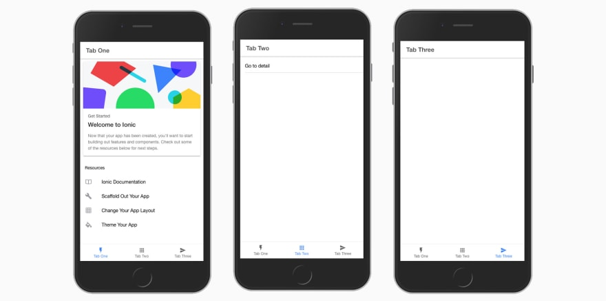
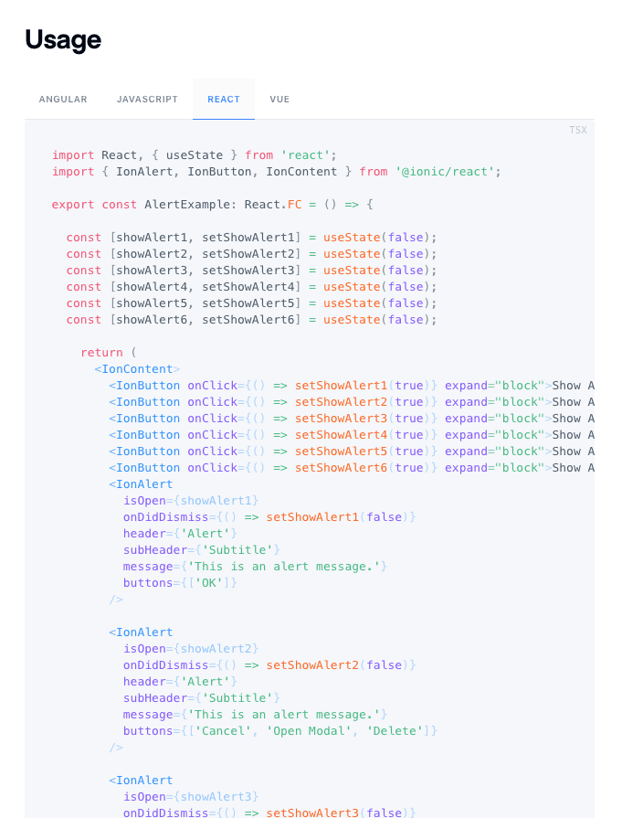

# Ionic React — Первый взгляд

*Перевод статьи [Nader Dabit](https://twitter.com/dabit3): [Ionic React — First Look](https://dev.to/dabit3/ionic-react-first-look-104l)*


## Ionic теперь официально предоставляет первоклассную поддержку библиотеки React

Ionic — это платформа разработки приложений для веб-разработчиков, которая позволяет создавать гибридные кроссплатформенные мобильные приложения, веб-приложения и приложения для настольных компьютеров с единой кодовой базой и открытыми веб-стандартами.

Ionic использовал Cordova исключительно в качестве API-прослойки для взаимодействия с нативными API, но теперь поддерживает как Cordova, так и Capacitor, новый кроссплатформенный движок, созданный внутри Ionic.

Цитируя их [вступительный пост в блоге](https://ionicframework.com/blog/announcing-ionic-react/):

> Хотя он вдохновлен Cordova, на практике опыт разработки сильно отличается. Capacitor доступен как современный JS API, который вы можете импортировать напрямую в ваше приложение, с простыми в использовании программными интерфейсами для буквально всего: от управления файлами до геолокации, от обмена сообщениями между приложениями до пуш- и локальных уведомлений. И предоставление нового встроенного SDK для Capacitor стало невероятно простым, требуя для этого всего лишь немного кода-обёртки с первоклассной поддержкой для Swift на iOS (Java на Android).

Долгие годы Ionic поддерживал только Angular, но 14 октября поддержка [React вышла из бета-стадии](https://ionicframework.com/blog/announcing-ionic-react/) (и их документация говорит, что версия с поддержкой Vue также уже доступна).

Теперь, инициализируя новый проект, вы получаете возможность использовать либо React, либо Angular:

```bash
$ npm i -g ionic

$ ionic start myapp

Please select the JavaScript framework to use for your new app. To bypass this prompt next time, supply a value for the
--type option.

? Framework: (Use arrow keys)
  Angular | https://angular.io
❯ React   | https://reactjs.org
```

Вам будет предложено несколько вариантов того, с каким типом стартового проекта вы хотели бы работать:

```bash
? Starter template: (Use arrow keys)
  blank      | A blank starter project
  sidemenu   | A starting project with a side menu with navigation in the content area
❯ tabs       | A starting project with a simple tabbed interface
  conference | A kitchen-sink application that shows off all Ionic has to offer
```

Затем будет скачан базовый проект со всеми зависимостями, и вы будете готовы протестировать его:

```bash
ionic serve
```



## TypeScript

Ionic построит приложение с использованием и поддержкой TypeScript из коробки, но если вы хотите использовать JavaScript, вы можете просто удалить весь TypeScript код и переименовать файлы в файлы с расширением `.js`.

## Стилизация

Если вы использовали React Native или даже просто React, вы, вероятно, привыкли к CSS-in-JS. Ionic использует сочетание обычного CSS, предварительно стилизованных компонентов и файла темы, содержащего базовую тему, которую можно довольно легко настроить.

## Компоненты / Документация

Одним из основных преимуществ использования Ionic является его встроенная библиотека компонентов. Просматривая компоненты вы заметите, что все они теперь имеют React версии и документированы наравне с другими платформами:



Чтобы использовать любой из компонентов, вам достаточно импортировать его из @ionic/react:

```js
import { IonItem, IonLabel, IonDatetime, IonContent } from '@ionic/react';
```

## React Native или Ionic

Вашим пользователям скорее всего всё равно.


Вы можете задаться вопросом "зачем мне использовать Ionic, если я могу использовать Expo или React Native", или наоборот.

Ответ довольно прост (и это лишь моё мнение): React Native предназначен для разработки приложений с действительно _нативноподобным_ интерфейсом (а также всё, что вы хотели бы отправить в магазин приложений, если вы предпочитаете RN), в то время как Ionic может использоваться для любых других типов мобильных приложений / PWA, которые вы хотели бы разрабатывать. Я также считаю, что на данный момент, легче начать работать с Ionic, чем с React Native.

Могут ли приложения, разработанные на Ionic подобраться так же близко к нативным приложениям, как приложения, созданные с использованием React Native? Наверное, нет, но я не уверен, потому что не пробовал в последнее время. Поскольку он по-прежнему использует веб-технологии, веб-интерфейсы и, в конечном счёте, DOM под капотом, шансы быть наравне с React Native для всех API невелики.

React Native также позволит максимально близко приблизиться к нативным приложениям, но по настоящему нативные приложения всегда будут немного более производительными (потому что RN — это в конце концов всего лишь абстракция над нативным API).

Ответ заключается не в том, какой фреймворк обеспечивает действительно нативный опыт, или нативный API, или React Native, или Ionic. На мой взгляд, он заключается скорее в наибольшей отдаче при наименьших затратах, скорости разработки и, в конечном итоге, получении высококачественных приложений.

Наряду с тем, как нативные платформы продолжают совершенствоваться и добавлять всё больше и больше отлаженных API, и как React Native продолжает совершенствоваться с каждым месяцем, становясь всё лучше и лучше, веб-платформа также продолжает улучшаться.

Скорее всего (для большинства приложений) вы можете использовать либо React Native, либо Ionic, либо нативные платформы для создания вашего следующего приложения, и обычный пользователь не сможет заметить разницу. Фактор, действительно имеющий влияние — это тип и профессионализм разработчиков вашей команды, а также количество усилий, затраченных на выпуск окончательного продукта.

Если вы хотите получить опыт наиболее приближенный к "нативному", но у вас в команде только JavaScript-разработчики, или вы стремитесь к скорости разработки и кроссплатформенному решению, приглядитесь к React Native.

Если вы разрабатываете PWA-приложения, стремитесь к скорости разработки и кроссплатформенным решениям, или у вас есть разработчики в команде, которые, возможно, не могут эффективно работать с нативным API, тогда выбирайте Ionic.

Если вы разрабатываете кроссплатформенные решения и предпочитаете API React Native, то платформа Expo предоставляет возможность создавать веб + мобильные решения с помощью [Expo Web](https://github.com/expo/examples).

Если вы компания с миллиардными доходами, и можете позволить себе тратить деньги, в том числе и на разработчиков, чтобы создавать приложения на обеих платформах, то переходите на нативные решения.

Кстати, давайте не будем забывать, что у нас также есть Flutter. В последние несколько лет компания Google приложила немало усилий, чтобы дать нам ещё один кроссплатформенный инструмент, который, хотя и не настолько зрелый, как React Native, предлагает аналогичные решения, если вы можете писать приложение на языке Dart.

В конце концов, никогда не было лучшего времени, чтобы быть разработчиком. У нас есть бесчисленное количество инструментов и библиотек, которые облегчают нашу жизнь, и они становятся лучше с каждым днём. Выбирайте то, что лучше всего подходит вам.

[Nader Dabit](https://dev.to/dabit3)  
Веб- и мобильный разработчик, специализирующийся на разработке кроссплатформенных и облачных приложений.

[@dabit3](https://dev.to/dabit3 "dev.to") [dabit3](http://twitter.com/dabit3 "twitter") [dabit3](http://github.com/dabit3 "github") [naderdabit.me](http://naderdabit.me/ "blog")

- - -
*Слушайте наш подкаст в [iTunes](https://itunes.apple.com/ru/podcast/девшахта/id1226773343) и [SoundCloud](https://soundcloud.com/devschacht), читайте нас на [Medium](https://medium.com/devschacht), контрибьютьте на [GitHub](https://github.com/devSchacht), общайтесь в [группе Telegram](https://t.me/devSchacht), следите в [Twitter](https://twitter.com/DevSchacht) и [канале Telegram](https://t.me/devSchachtChannel), рекомендуйте в [VK](https://vk.com/devschacht) и [Facebook](https://www.facebook.com/devSchacht).*
