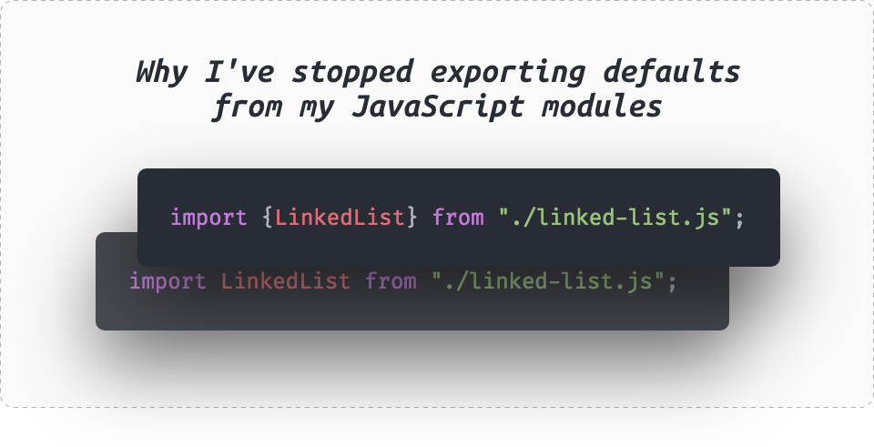

# Почему я перестал использовать экспорт по умолчанию в моих JavaScript-модулях

_Перевод блог-поста [Nicholas C. Zakas](https://twitter.com/slicknet): [Why I've stopped exporting defaults from my JavaScript modules](https://humanwhocodes.com/blog/2019/01/stop-using-default-exports-javascript-module/)._



После нескольких лет борьбы с экспортом по умолчанию (export default), я переосмыслил свои подходы.

На прошлой неделе я написал в Твиттере кое-что, что получило немало неожиданных ответов.

Я написал это после того как понял, что большое количество моих проблем с JavaScript-модулями могут быть связанны с экспортом по умолчанию. И нет разницы, использовал ли я модули JavaScript (так называемые ECMAScript-модули) или CommonJS-модули, я все еще спотыкался об импорты из модулей с дефолтными экспортами. Я получил множество ответов на твит, многие из которых спрашивали как я пришел к такому решению. Этот пост — попытка прояснить мои мысли.

## Несколько уточнений

Как и большинство твитов, мой твит задумывался как отпечаток (снимок) моего мнения на тот момент, а не как развернутая мысль. И это уточнение нескольких мыслей, которые смутили людей в Твиттере:

-   Тот случай, когда непонятно, чем является экспортируемое значение, функцией или классом. _Это и не только_ решают именованные экспорты.
-   С этой проблемой сталкиваешься не только в своих проектах, но и в библиотеках, автором которых не являешься. Это значит, что соглашения об именовании файлов не решают все прооблемы.
-   Я не говорю, что все должны отказаться от дефолтных экспортов. Я говорю о том, что я предпочту не использовать дефолтные экспорты в своих модулях. Вы можете делать по другому и это нормально.

Надеюсь, что этих уточнений достаточно, чтобы избежать путаницу в оставшейся части поста.

## Экспорт по умолчанию: пример

Насколько мне известно, дефолтные экспорты были популяризованы в CommonJS, где модуль может экспортировать дефолтное значение, например:

```js
class LinkedList {}
module.exports = LinkedList;
```

Этот код экспортирует класс `LinkedList` но не указывает имя, которое будет использовано пользователем модуля. Предпологая, что имя файла `linked-list.js`, дефолтное значение можно импортировать в другой CommonJS модуль вот так:

```js
const LinkedList = require("./linked-list");
```

Функция `require()` возвращает значение, которое я назвал `LinkedList`, чтобы оно совпадало с тем, что находится в файле `linked-list.js`, но я мог и назвать его `foo` или `Mountain`, или любой другой идентификатор.

Популярность дефолтных экспортов в CommonJS означала что модули в JavaScript были разработаны с целью поддержки этого шаблона:

> _ES6 поддерживает стиль одиночного/дефолтного экспорта и предоставляет приятный синтаксис для  экспорта по умолчанию._
>
> — Дэвид Херман (David Herman) [19 июня 2014](https://mail.mozilla.org/pipermail/es-discuss/2014-June/037905.html)

Поэтому, в JavaScript-модулях можно использовать дефолтный экспорт:

```js
export default class LinkedList {}
```

А затем, импортировать:

```js
import LinkedList from "./linked-list.js";
```

Еще раз, имя переменной `LinkedList` — это произвольный выбор пользователя (если он не аргументированный), оно может быть как `Dog`, так и `simphony`.

## Альтернатива: именованные экспорты

CommonJS и JavaScript-модули, в добавок к дефолтным экспортам, поддерживают и именованные экспорты.

В CommonJS именнованный экспорт создается при помощи добавления имени к объекту экспорта, например так:

```js
exports.LinkedList = class LinkedList {};
```

Затем можно импортировать в другой файл:

```js
const LinkedList = require("./linked-list").LinkedList;
```

Это значит, что имя, которое я использовал с ключевым словом `const` может быть каким угодно, но я назвал его так, чтобы оно совпадало с экспортируемым именем `LinkedList`.

В JavaScript модулях, именнованный экспорт выглядит так:

```js
export class LinkedList {}
```

А импорт — так:

```js
import { LinkedList } from "./linked-list.js";
```

В этом коде, `LinkedList` не может быть случайно выбранным идентификатором и должен совпадать с именованным экспортом `LinkedList`. Это и есть существенное отличие от CommonJS.

Итак, возможности обоих модулей позволяют использовать как и дефолтные, так и именованные экспорты.

## Персональные предпочтения

Прежде чем читать дальше, будет полезно узнать некоторые мои предпочтения при написании кода. Это основные принципы, которые я применяю к своему коду, несмотря на используемый язык программирования:

1. **Явное лучше неявного.** Я не люблю код с секретами.
2. **Имена должны быть консистентны во всех файлах.** Если что-то является яблоком (`Apple`) в одном файле, то я не должен называть это апельсином (`Orange`) в другом файле. Яблоко (`Apple`) всегда должно оставаться яблоком (`Apple`).
3. **Обрабатывайте ошибки сразу и чаще.** Если чего-то может не быть, то лучше узнать об этом как можно раньше, и в лучшем случае, вернуть ошибку, которая укажет о проблеме. Я не хочу ждать, пока код закончит выполнение и потом обнаружить, что что-то пошло не так и искать проблему.
4. **Меньше решений — быстрее разработка.** Каждое принимаемое решение замедляет тебя, поэтому мы считаем, что такие вещи, как правила написания кода ускоряют разработку. Я хочу решать вещи сразу и идти дальше.
5. **«Прогуляться по коду» замедляет разработку.** Под «Прогуляться по коду» я подразумеваю тот случай, когда приходится останавливаться и искать что-то в другом куске кода. Иногда это необходимо, но бывает, что можно обойтись и без этого, тем самым не замедлять процесс. Я пытаюсь писать код, в котором мало таких вещей.
6. **Ненужная когнитивная нагрузка тормозит разработку.** Проще говоря: чем больше деталей необходимо запомнить, чтобы писать продуктивно, тем медленнее будет разработка

> **Примечание**
>
> Акцент на скорости разработки является главным для меня. Так как я боролся со здоровьем годами, количество энергии на написание кода продолжало уменьшаться. Ключевой целью было всё, что помогало мне уменьшить количество времени на разработку, при этом достигая того же результата.

## Сложности, с которыми я столкнулся

Учитывая все это, вот главные проблемы, с которыми я столкнулся используя дефолтные экспорты и почему я считаю, что именнованные экспорты лучше во большинстве случаев.

### Что это за штука?

Как я и отметил в своем твите, мне было сложно определить что я импортирую из модуля в котором используется дефолтный экспорт. При работе с незнакомым модулем или файлом может быть сложно определить, чем является импорт, например:

```js
const list = require("./list");
```

Чем является `list` в этом случае? Маловероятно, что это будет примитив, но это может быть функцией, классом или любым другим объектом. Как я могу знать наверняка? Мне потребуется «прогуляться по коду»:

-   Если я автор `list.js`, то я могу открыть файл и посмотреть его экспорт.
-   Если автором `list.js` являюсь не я, то я могу почитать документацию.

В обоих случаях, это становится дополнительной информацией, которую необходимо запомнить, чтобы избежать повторной «прогулки по коду» когда потребуется опять импортировать из `list.js`. Если вы импортируете много дефолтных экспортов из модулей, тогда или ваша когнитивная нагрузка, или количество «прогулок по коду» увеличивается. Оба варианта не оптимальны и могут быть неприятными.

Некоторые скажут, что IDE решает все проблемы, что IDE должны быть достаточно умными, чтобы узнать, что импортируется. Хотя я и за умные IDE в помощь разработчикам, но я считаю, что требовать эффективного использования особенностей языка проблематично.

### Проблемы соответствия имен

Именованные экспорты требуют от потребителей модулей указания имени того, что они импортируют из модуля. Польза в том, что я могу легко найти использования каждого `LinkedList` в кодовой базе и знать, что все это является одинаковыми `LinkedList`. Поскольку дефолтные экспорты не предписывают имена, используемые для их импорта, появляется ненужная когнитивная нагрузка для каждого разработчика. Необходимо определить правильное соглашение об именовании, и в качестве дополнительной нагрузки придется следить за тем, чтобы каждый разработчик будет использовать одно и то же имя для одной и той же вещи. (Конечно, можно разрешить разработчикам использовать разные имена для одной и той же вещи, но это приведет к еще большей когнитивной нагрузке на команду.)

Импорт именованного экспорта означает, что по крайней мере ссылка на каноническое имя будет везде, где он используется. Даже если вы решите переименовать импорт, решение будет явным, и не может быть принято без ссылки на каноническое имя каким-либо образом. Например, в CommonJS:

```js
const MyList = require("./list").LinkedList;
```

В JavaScript модулях:

```js
import { LinkedList as MyList } from "./list.js";
```

В обоих видах модулей, придется явно указать, что `LinkedList` теперь будет называться `MyList`

Когда именование постоянно во всей кодовой базе, легко делать такие вещи, как:

1. Поиск по кодовой базе с целью найти информацию об использовании
2. Рефакторинг имени чего-либо во всей кодовой базе

Можно ли делать это, используя дефолтные экспорты и произвольные имена? Я думаю, да, но я также думаю, что это будет намного сложнее и будет больше ошибок.

### Импорт не того

Именованные экспорты в JavaScript-модулях имеют значимое преимущество перед дефолтными экспортами в том, что ошибка будет видна при попытке импорта того, чего не существует в модуле. Рассмотрим код:

```js
import { LinkedList } from "./list.js";
```

Если `LinkedList` не существует в `list.js`, то ошибка будет видна. Кроме того, инструменты как IDE и ESLint<sup>1</sup> могут с легкостью обнаружить отсутствующую ссылку еще до исполнения кода.

## Поддержка хуже

Если говорить об IDE, WebStorm может писать `import` за вас.<sup>2</sup>. При написании идентификатора, который не был объявлен в файле, WebStorm выполнит поиск модулей в проекте, чтобы определить является ли идентификатор именованным экспортом в другом файле. В этом случае WebStorm сделает одно из двух действий:

1. Подчеркнет идентификатор, у которого нет определения и покажет `import`, который пофиксит это исправит.
2. Автоматическое добавление правильного `import`'а (если у вас включены автоматические импорты) может автоматически добавить `import` на основе введенного идентификатора.

Существует плагин для Visual Studio Code<sup>3</sup>, который предоставляет аналогичный функционал. Такой функционал невозможен при использовании дефолтных экспортов, потому что не существует канонического имени для вещей, которые вы хотите импортировать.

## Вывод

У меня были некоторые проблемы с продуктивностью при использовании дефолтных экспортов в проектах. Хотя ни одна из этих проблем не может быть преодолена, использование именованных импортов и экспортов, кажется, лучше соответствует моим предпочтениям в коде. Явные вещи и сильный упор на инструменты делают меня продуктивным кодером, и поскольку именные экспорты помогают мне в этом, я предпочту их в обозримом будущем. Конечно, я не могу контролировать то, как сторонние модули, которые я использую, экспортируют их функциональность, но я определенно сделаю выбор в пользу именованных экспортов в своих модулях.

Как и ранее, я напоминаю, что это всего лишь моё мнение и вы можете не посчитать мои доводы убедительными. Эта запись не предназначаалась для того, чтобы убедить кого-либо прекратить использовать дефолтные экспорты, а скорее для того, чтобы объяснить тем, кто заинтересовался, почему я перестану использовать дефолтные экспорты в своих модулях.

## Ссылки

1. [esling-plugin-import `import/named` rule](https://github.com/benmosher/eslint-plugin-import/blob/master/docs/rules/named.md)
2. [WebStorm: Auto Import in JavaScript](https://www.jetbrains.com/help/webstorm/javascript-specific-guidelines.html#ws_js_auto_import)
3. [Visual Studio Extension: Auto Import](https://marketplace.visualstudio.com/items?itemName=NuclleaR.vscode-extension-auto-import)

---

_Если этот пост показался полезным, то вы можете поддержать [автора](https://humanwhocodes.com/):_

-   _[пожертвование через Github](https://github.com/users/nzakas/sponsorship)_
-   _[пожертвование через PayPal](https://www.paypal.com/donate/?token=QV5gLG9Q5szfku7XrfOVQLxk25R5wYQgS5Li_q0si6WRF_XYkhpV6DM0pTIkyQtXDW00tW&country.x=US&locale.x=UShttps://www.paypal.com/donate/?token=QV5gLG9Q5szfku7XrfOVQLxk25R5wYQgS5Li_q0si6WRF_XYkhpV6DM0pTIkyQtXDW00tW&country.x=US&locale.x=US)_

---

_Слушайте наш подкаст в [iTunes](https://itunes.apple.com/ru/podcast/девшахта/id1226773343) и [SoundCloud](https://soundcloud.com/devschacht), читайте нас на [Medium](https://medium.com/devschacht), контрибьютьте на [GitHub](https://github.com/devSchacht), общайтесь в [группе Telegram](https://t.me/devSchacht), следите в [Twitter](https://twitter.com/DevSchacht) и [канале Telegram](https://t.me/devSchachtChannel), рекомендуйте в [VK](https://vk.com/devschacht) и [Facebook](https://www.facebook.com/devSchacht)._
