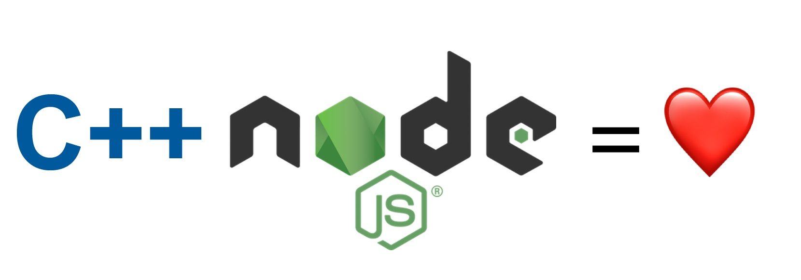

# Как я портировал bcrypt на новое N-API
*Перевод статьи [Nicola Del Gobbo](https://medium.com/@nicknaso): [How I ported bcrypt to new N-API](https://medium.com/@nicknaso/how-i-ported-bcrypt-to-new-n-api-d0b8c9fe6136). Опубликовано с разрешения автора.*



Для простоты нативные модули можно рассматривать как C/C++ код, который вызывается из JavaScript.

Они являются мостом между привычным нам языком программирования JavaScript и родной средой, полностью написанной на C/C++.

Они позволяют нам вызывать функции и методы C/C++ непосредственно из JavaScript.


 *Нативные модули Node.js*

Одной из наиболее важных экспериментальных функций, объявленных в Node.js 8, была поддержка [N-API](https://nodejs.org/dist/latest/docs/api/n-api.html), направленная на снижение затрат на обслуживание нативных модулей Node.js.

> Это API не зависит от среды исполнения JavaScript (V8) и поддерживается как часть самого Node.js.
> 
> Это API будет стабильным на уровне бинарного интерфейса приложений (**Application Binary Interface** или **ABI**) между версиями Node.js. Оно предназначено для изоляции модулей от изменений в движке JavaScript и позволяет использовать нативные модули различными версиями Node.js без перекомпиляции.
> 
> Такие модули создаются/упаковываются с использованием того же самого подхода и инструментов, описанных в разделе [C++ Addons](https://nodejs.org/dist/latest/docs/api/addons.html). Единственное отличие — это набор API, использующихся нативным кодом. Вместо использования API V8 или [Native Abstractions](https://github.com/nodejs/nan) используются функции, доступные в N-API.

Как вы можете понять из документации по N-API, **оно не зависит от версии движка JavaScript и совместимость API и ABI между различными версиями Node.js гарантируется**. Поэтому, если вы переключитесь на другую версию Node.js, вы не должны переустанавливать и перекомпилировать нативные модули.

Я был в восторге от N-API, особенно после того, как я посмотрел доклад, Майкла Доусона на Node Interactive 2017:

[N-API — Next Generation Node API for Native Modules](https://www.youtube.com/watch?v=-Oniup60Afs&feature=youtu.be)

Я обнаружил, что есть обёртка над N-API для C++, называемая [**node-addon-api**](https://github.com/nodejs/node-addon-api), поэтому я просто начал экспериментировать с ней и через четыре или пять дней своего свободного времени я портировал [**bcrypt**](https://www.npmjs.com/package/bcrypt) на N-API.

Я начал с изменения файла `package.json`, в который я добавил необходимые зависимости, как указано [в документации](https://github.com/nodejs/node-addon-api/blob/master/doc/setup.md).

```javascript
...
"scripts": {
    "test": "npm install --build-from-source && nodeunit test",
    "install": "node-gyp rebuild"
  },
  "dependencies": {
    "bindings": "1.3.0",
    "node-addon-api": "1.1.0"
  },
  "gypfile": true,
  "devDependencies": {
    "nodeunit": "~0.9.1"
  }
...
```
*https://gist.github.com/NickNaso/56d61bbf824077f2d084a5f14f794e61#file-package-json*
*package.json*

Следующим шагом было изменение файла [binding.gyp](https://github.com/nodejs/node-addon-api/blob/master/doc/node-gyp.md), который содержит конфигурацию сборки для модуля **bcrypt**.

```javascript
{
  'targets': [
    {
      'target_name': 'bcrypt_napi',
      'sources': [
        'src/blowfish.cc',
        'src/bcrypt.cc',
        'src/bcrypt_node.cc'
      ],
      'cflags!': [ '-fno-exceptions' ],
      'cflags_cc!': [ '-fno-exceptions' ],
      'include_dirs' : [
          "<!@(node -p \"require('node-addon-api').include\")"
      ], 
      'dependencies': ["<!(node -p \"require('node-addon-api').gyp\")"],
      'conditions': [
        ['OS=="win"', {
          "msvs_settings": {
            "VCCLCompilerTool": {
              "ExceptionHandling": 1
            }
          },
          'defines': [
            'uint=unsigned int',
          ]
        }],
        ['OS=="mac"', {
          "xcode_settings": {
            "CLANG_CXX_LIBRARY": "libc++",
            'GCC_ENABLE_CPP_EXCEPTIONS': 'YES',
            'MACOSX_DEPLOYMENT_TARGET': '10.7'
          }
        }]
      ]
    }
  ]
}
```
*https://gist.github.com/NickNaso/7c512d06eb6bec27fce972df89fbc0ab#file-binding-gyp*
*binding.gyp*

Модуль **bcrypt** состоит из двух частей, одна написана на C++, вторая на JavaScript, и, как правило, JavaScript-часть использует нативный код. Я не хотел изменять JavaScript API, предоставляемый **bcrypt**, поэтому я сосредоточился на C++ части и изменил код, следуя документации [node-addon-api](https://github.com/nodejs/node-addon-api).

Я начал с кода, который отвечает за регистрацию модуля с именем **bcrypt_napi**, и, кроме того, этот код гарантирует вызов функции `init` при подключении модуля.

```javascript
Napi::Object init(Napi::Env env, Napi::Object exports) {
    exports.Set(Napi::String::New(env, "gen_salt_sync"), Napi::Function::New(env, GenerateSaltSync));
    exports.Set(Napi::String::New(env, "encrypt_sync"), Napi::Function::New(env, EncryptSync));
    exports.Set(Napi::String::New(env, "compare_sync"), Napi::Function::New(env, CompareSync));
    exports.Set(Napi::String::New(env, "get_rounds"), Napi::Function::New(env, GetRounds));
    exports.Set(Napi::String::New(env, "gen_salt"), Napi::Function::New(env, GenerateSalt));
    exports.Set(Napi::String::New(env, "encrypt"), Napi::Function::New(env, Encrypt));
    exports.Set(Napi::String::New(env, "compare"), Napi::Function::New(env, Compare));
    return exports;
};

NODE_API_MODULE(bcrypt_napi, init);
```
*https://gist.github.com/NickNaso/c97df8ef7482bf3202520bf0af87d1cd#file-bcrypt_node-cc*
*Код инициализации*

**bcrypt** предоставляет синхронное и асинхронное API, поэтому метод за методом я проделал рефакторинг, и теперь код выглядит так, как показано ниже.

```javascript
class SaltAsyncWorker : public Napi::AsyncWorker {
    public:
        SaltAsyncWorker(Napi::Function& callback, std::string seed, ssize_t rounds)
            : Napi::AsyncWorker(callback), seed(seed), rounds(rounds) {
        }

        ~SaltAsyncWorker() {}

        void Execute() {
            char salt[_SALT_LEN];
            bcrypt_gensalt((char) rounds, (u_int8_t *)&seed[0], salt);
            this->salt = std::string(salt);
        }

        void OnOK() {
            Napi::HandleScope scope(Env());   
            Callback().Call({Env().Undefined(), Napi::String::New(Env(), salt)});
        }

    private:
        std::string seed;
        std::string salt;
        ssize_t rounds;
        
};

Napi::Value GenerateSalt(const Napi::CallbackInfo& info) {
    if (info.Length() < 3) {
        throw Napi::TypeError::New(info.Env(), "3 arguments expected");
    }
    if (!info[1].IsBuffer() || (info[1].As<Napi::Buffer<char>>()).Length() != 16) {
        throw Napi::TypeError::New(info.Env(), "Second argument must be a 16 byte Buffer");
    }
    const int32_t rounds = info[0].As<Napi::Number>();
    Napi::Function callback = info[2].As<Napi::Function>();
    Napi::Buffer<char> seed = info[1].As<Napi::Buffer<char>>();
    SaltAsyncWorker* saltWorker = new SaltAsyncWorker(callback, std::string(seed.Data(), 16), rounds);
    saltWorker->Queue();
    return info.Env().Undefined();
}

Napi::Value GenerateSaltSync (const Napi::CallbackInfo& info) {
    if (info.Length() < 2) {
        throw Napi::TypeError::New(info.Env(), "2 arguments expected");
    }
    if (!info[1].IsBuffer() || (info[1].As<Napi::Buffer<char>>()).Length() != 16) {
        throw Napi::TypeError::New(info.Env(), "Second argument must be a 16 byte Buffer");
    }
    const int32_t rounds = info[0].As<Napi::Number>();
    Napi::Buffer<u_int8_t> buffer = info[1].As<Napi::Buffer<u_int8_t>>();
    u_int8_t* seed = (u_int8_t*) buffer.Data();
    char salt[_SALT_LEN];
    bcrypt_gensalt(rounds, seed, salt);
    return Napi::String::New(info.Env(), salt, strlen(salt));
}

/* ENCRYPT DATA - USED TO BE HASHPW */

class EncryptAsyncWorker : public Napi::AsyncWorker {
  public:
    EncryptAsyncWorker(Napi::Function& callback, std::string input, std::string salt)
        : Napi::AsyncWorker(callback), input(input), salt(salt) {
    }

    ~EncryptAsyncWorker() {}

    void Execute() {
        if (!(ValidateSalt(salt.c_str()))) {
            error = "Invalid salt. Salt must be in the form of: $Vers$log2(NumRounds)$saltvalue";
        }
        char bcrypted[_PASSWORD_LEN];
        bcrypt(input.c_str(), salt.c_str(), bcrypted);
        output = std::string(bcrypted);
    }

    void OnOK() {
        Napi::HandleScope scope(Env());  
        if (!error.empty()) {
            Callback().Call({
                Napi::Error::New(Env(), error.c_str()).Value(),
                Env().Undefined()                       
            });
        } else {
            Callback().Call({
                Env().Undefined(), 
                Napi::String::New(Env(), output)
            });
        }   
    }

  private:
    std::string input;
    std::string salt;
    std::string error;
    std::string output;
};

Napi::Value Encrypt(const Napi::CallbackInfo& info) {
    if (info.Length() < 3) {
        throw Napi::TypeError::New(info.Env(), "3 arguments expected");
    }
    std::string data = info[0].As<Napi::String>();;
    std::string salt = info[1].As<Napi::String>();;
    Napi::Function callback = info[2].As<Napi::Function>();
    EncryptAsyncWorker* encryptWorker = new EncryptAsyncWorker(callback, data, salt);
    encryptWorker->Queue();
    return info.Env().Undefined();
}

Napi::Value EncryptSync(const Napi::CallbackInfo& info) {
    Napi::Env env = info.Env();
    if (info.Length() < 2) {
        throw Napi::TypeError::New(info.Env(), "2 arguments expected");   
    }
    std::string data = info[0].As<Napi::String>();;
    std::string salt = info[1].As<Napi::String>();;
    if (!(ValidateSalt(salt.c_str()))) {
        throw Napi::Error::New(info.Env(), "Invalid salt. Salt must be in the form of: $Vers$log2(NumRounds)$saltvalue");
    }
    char bcrypted[_PASSWORD_LEN];
    bcrypt(data.c_str(), salt.c_str(), bcrypted);
    return Napi::String::New(env, bcrypted, strlen(bcrypted));
}

/* COMPARATOR */

bool CompareStrings(const char* s1, const char* s2) {

    bool eq = true;
    int s1_len = strlen(s1);
    int s2_len = strlen(s2);

    if (s1_len != s2_len) {
        eq = false;
    }

    const int max_len = (s2_len < s1_len) ? s1_len : s2_len;

    // to prevent timing attacks, should check entire string
    // don't exit after found to be false
    for (int i = 0; i < max_len; ++i) {
      if (s1_len >= i && s2_len >= i && s1[i] != s2[i]) {
        eq = false;
      }
    }

    return eq;
}

class CompareAsyncWorker : public Napi::AsyncWorker {
  public:
    CompareAsyncWorker(Napi::Function& callback, std::string input, std::string encrypted)
        : Napi::AsyncWorker(callback), input(input), encrypted(encrypted) {
        result = false;
    }

    ~CompareAsyncWorker() {}

    void Execute() {
        char bcrypted[_PASSWORD_LEN];
        if (ValidateSalt(encrypted.c_str())) {
            bcrypt(input.c_str(), encrypted.c_str(), bcrypted);
            result = CompareStrings(bcrypted, encrypted.c_str());
        }
    }

    void OnOK() {
        Napi::HandleScope scope(Env());   
        Callback().Call({Env().Undefined(), Napi::Boolean::New(Env(), result)});      
    }

  private:
    std::string input;
    std::string encrypted;
    bool result;
};

Napi::Value Compare(const Napi::CallbackInfo& info) {
    if (info.Length() < 3) {
        throw Napi::TypeError::New(info.Env(), "3 arguments expected");
    }
    std::string input = info[0].As<Napi::String>();
    std::string encrypted = info[1].As<Napi::String>();
    Napi::Function callback = info[2].As<Napi::Function>();
    CompareAsyncWorker* compareWorker = new CompareAsyncWorker(callback, input, encrypted);
    compareWorker->Queue();
    return info.Env().Undefined();
}

Napi::Value CompareSync(const Napi::CallbackInfo& info) {
    Napi::Env env = info.Env();
    if (info.Length() < 2) {
        throw Napi::TypeError::New(info.Env(), "2 arguments expected");    
    }
    std::string pw = info[0].As<Napi::String>();
    std::string hash = info[1].As<Napi::String>();
    char bcrypted[_PASSWORD_LEN];
    if (ValidateSalt(hash.c_str())) {
        bcrypt(pw.c_str(), hash.c_str(), bcrypted);
        return Napi::Boolean::New(env, CompareStrings(bcrypted, hash.c_str()));
    } else {
        return Napi::Boolean::New(env, false);
    }
}

Napi::Value GetRounds(const Napi::CallbackInfo& info) {
    Napi::Env env = info.Env();
    if (info.Length() < 1) {
        throw Napi::TypeError::New(info.Env(), "1 argument expected");    
    }
    Napi::String hashed = info[0].As<Napi::String>();
    std::string hash = hashed.ToString();
    const char* bcrypt_hash = hash.c_str();
    u_int32_t rounds;
    if (!(rounds = bcrypt_get_rounds(bcrypt_hash))) {
        throw Napi::Error::New(info.Env(), "invalid hash provided");
    }
    return Napi::Number::New(env, rounds);
}
```
*https://gist.github.com/NickNaso/3a7d1997be59c010c6cde4353d873f14#file-bcrypt_node-cc*

Последний шаг состоял в том, чтобы прогнать весь набор тестов, и к моему удовольствию все тесты прошли успешно, и они были выполнены быстрее, чем у модуля, созданного с использованием [NAN](https://github.com/nodejs/nan). В ближайшие дни я буду прогонять самые эффективные тесты производительности, после чего я разверну своё первое Node.js-приложение, которое будет использовать эту версию **bcrypt**, поэтому следите за обновлениями.

Для тех из вас, кто хочет начать писать свои собственные Node.js-аддоны с использованием N-API, я оставлю список полезных ресурсов, которые мне очень помогли:

* [C++ Addons](https://nodejs.org/dist/latest/docs/api/addons.html)
* [C++ Addons N-API](https://nodejs.org/dist/latest/docs/api/n-api.html) 
* [Node Addon API](https://github.com/nodejs/node-addon-api)
* [N-API the next API for Native Addons](https://youtu.be/-Oniup60Afs)

---

*Слушайте наш подкаст в [iTunes](https://itunes.apple.com/ru/podcast/%D0%B4%D0%B5%D0%B2%D1%88%D0%B0%D1%85%D1%82%D0%B0/id1226773343) и [SoundCloud](https://soundcloud.com/devschacht), читайте нас на [Medium](https://medium.com/devschacht), контрибьютьте на [GitHub](https://github.com/devSchacht), общайтесь в [группе Telegram](https://t.me/devSchacht), следите в [Twitter](https://twitter.com/DevSchacht) и [канале Telegram](https://t.me/devSchachtChannel), рекомендуйте в [VK](https://vk.com/devschacht) и [Facebook](https://www.facebook.com/devSchacht).*

[Статья на Medium](https://medium.com/devschacht/how-i-ported-bcrypt-to-new-n-api-d004b1d3a8c8)
