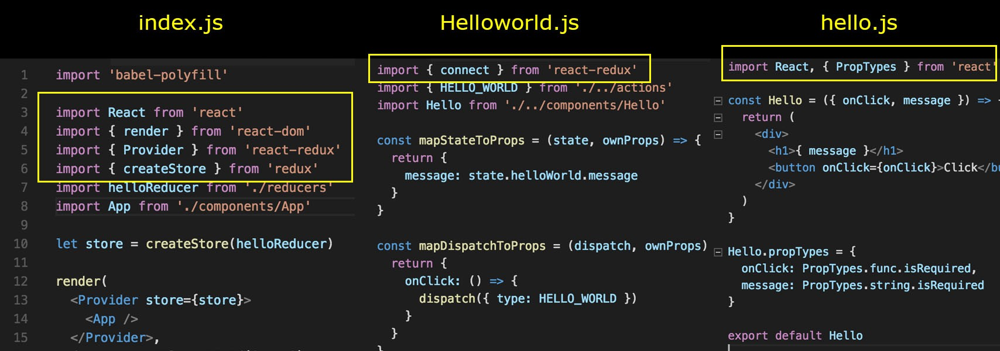

# Укрощаем изоморфный и универсальный шаблон: серверный рендеринг на React-Redux

*Перевод статьи [Peter Chang](https://hackernoon.com/@peterchang_82818): [Break Down Isomorphic and Universal Boilerplate: React-Redux server rendering](https://hackernoon.com/isomorphic-universal-boilerplate-react-redux-server-rendering-tutorial-example-webpack-compenent-6e22106ae285).*


<p style="text-align: center;">Серверный рендеринг с помощью React Redux</p>

> Ищите шаблон на React-Redux? Если да, то вряд ли у вас проблемы с поиском. Потому что вы нашли ТОННЫ шаблонов. [Andrew Farmer](https://www.andrewhfarmer.com/starter-project/)

## Вам также может понравиться
* [Isomorphic Application: Best Practice](https://hackernoon.com/react-redux-isomorphic-boilerplate-best-practice-example-tutorial-learning-rendering-reducer-action-8a448d0dbddb)
* [Isomorphic learn by doing: Adding new page](https://hackernoon.com/node-javascript-react-redux-isomorphic-boilerplate-tutorial-example-adding-new-page-component-router-match-f0347ad42c67)

---

С момента релиза React и Redux я находился на седьмом небе от счастья потому что **1) Изоморфность React** даёт преимущества к *скорости загрузки* и SEO при серверном рендеренге и позволяет рендерить компоненты на клиенте уже после загрузки страницы и **2) Идеи [Flux-архитектуры](http://facebook.github.io/flux/)** расширяют компоненты React с помощью использования однонаправленного потока данных.

Однако, после анализа тысячи шаблонов, мне пришлось выпить не одну чашку чая, чтобы успокоиться. Потому что ни один из шаблонов не оказался простым в освоении. Так что мне пришлось изучать разработку шаблонов с нуля. Эта статья представляет собой заметку, где я пояснил, как разбить шаблон на понятные части шаг за шагом. В конце концов, я выделил пять пунктов и они являются причиной такого большого разнообразия изоморфных шаблонов:

1. **Dev-сервер и сборка проекта**

Настройка и создание среды разработки для решения таких проблем, как горячее обновление (*HMR*), *слежение за изменением файлов*, *сборка бандлов* и так далее. Популярные инструменты для этого: webpack, gulp, nodenpm, broserify, grunt.

2. **React-Redux-компоненты и поток данных**

3. **Роутинг**

Чтобы решить, какую иерархию роутинга использовать, нужно ответить на вопросы: это SPA? Должен ли сервер иметь CORS? Может быть стоит запускать приложение внутри express-сервера, а не на клиенте?

4. **Общие редюсеры/ создатели экшенов**

Зависит от роутинга

5. **Тесты**

Пока будем говорить о втором пункте, потому что он является неизменным от шаблона к шаблону. Остальные пункты меняются в зависимости от предпочтений разработчиков. **SSR**, **общие компоненты** и **Redux модули** — это ядро изоморфной flux-архитектуры - причина того, почему в каждом шаблоне используются пакеты react, redux и react-redux.

Склонируйте из [репозитория](https://github.com/wahengchang/react-redux-boilerplate) helloWorld-пример на React-Redux. Мы будем разбивать его на части, чтобы понять, как работает каждый файл:


<p style="text-align: center;">Серверный рендеринг с помощью React Redux</p>

Выше представлена структура работы приложения. Приложение использует Express, который работает только с одним роутом, отображая с помощью функции `res.sendFile` `index.html` в браузере. Особое внимание следует уделить части, обведенной голубым контуром. Там показано взаимодействие React, Redux, корневого компонента, стора и редюсера.


<p style="text-align: center;">React-Redux-структура данных, стора, пропсов, стейта и компонентов</p>

Это пример, предоставленный [официальной документацией](http://redux.js.org/docs/basics/UsageWithReact.html), Facebook даёт некоторые советы по организации иерархии компонентов: использование «умных» и «глупых» компонентов, использование `connect()` вместо `store.subscribe()` и так далее.

`index.js` — это вершина иерархии, корневой компонент, содержащий в себе все остальные компоненты в виде виртуального DOM, также это единственный компонент, использующий большое число зависимостей. Помимо этого, другие компоненты также включают в себя сторонние зависимости, обеспечивающие чистоту кода.

До сих пор я чувствую, как много Facebook сделал для нас, разработчиков.



*Ниже расположены функции, играющие ключевую роль в React-Redux-компонентах:*

## Provider

Этот компонент [волшебным образом](https://reactjs.org/docs/context.html) делает **стор** доступным сразу во **всех умных компонентах**, не передавая его явно напрямую.

``` javascript
import { Provider } from 'react-redux'
let store = createStore(todoApp)
render(
  <Provider store={store}>
    <App />
  </Provider>,
  document.getElementById('root')
)
```

## connect(...)

**Подключает React-компонент к Redux**, позволяя компоненту использовать стор верхнего уровня. При этом отпадает необходимость получать стор в виде пропсов от родителя. ([взято отсюда](https://medium.com/@firasd/quick-start-tutorial-using-redux-in-react-apps-89b142d6c5c1)).

Условно работу `connect(...)` можно разбить на следующие стадии:

1. **Передача стора внутрь корневого компонента**

Чтобы начать подключать компоненты, нужно обернуть корневой компонент в `Provider` и передать в него переменную `store`:

```javascript
  import helloReducer from './reducers'
  import { Provider } from 'react-redux'
  import { createStore } from 'redux'
  let store = createStore(helloReducer)
  render(
   <Provider store={store}>
      <App />
   </Provider>,
   document.getElementById('root')
)
```

2. **Подключение стора к умным компонентам**

Документация React-Redux описывает множество способов использования `connect`. Для моей цели понадобятся только `mapStateToProps` и `mapDispatchToProps`, чтобы покрыть всю функциональность.

- преобразование стейта в пропсы (`mapStateToProps`) позволит компоненту *Hello* использовать `this.props.message` из **Redux-стора**.

- преобразование диспатчинга экшенов (`mapDispatchToProps`) для **HELLO_WORLD** позволяет использовать `this.props.onClick`, как функцию внутри компонента *Hello*.

```javascript
const mapStateToProps = (state, ownProps) => {
   return {
      message: state.helloWorld.message
   }
}
const mapDispatchToProps = (dispatch, ownProps) => {
   return {
      onClick: () => {
         dispatch({ type: HELLO_WORLD })
      }
   }
}
const HelloWorld = connect(
   mapStateToProps,
   mapDispatchToProps
)(Hello)
```

## NPM модули, которые вы должны знать

*Ниже представлены некоторые из npm модулей, о которых знают не все:*

### react-redux

По умолчанию Redux не включен в React, поэтому пакет *react-redux* нужно устанавливать дополнительно. Это предполагает, что вы должны использовать сборщики модулей типа **Webpack** или **Browserify**, которые работают с CommonJS.

### webpack-dev-middleware

Это простая миддлвара для **Webpack**. Служит для обработки файлов, загружающихся из npm-пакетов. Используется **только при разработке** ([узнать больше](https://www.npmjs.com/package/webpack-dev-middleware)).

### webpack-hot-server-middleware

Миддлвара, работающая в паре с [webpack-dev-middleware](https://www.npmjs.com/package/webpack-dev-middleware), для **горячего обновления (*HMR*)** webpack-бандлов на сервере ([узнать больше](https://www.npmjs.com/package/webpack-hot-server-middleware)).

## Пояснения

*Ниже раскрыты некоторые термины и концепции:*

### HMR

Означает **горячая замена (обновление) модулей** или **хотрелоад**. Это фишка Webpack, позволяющая обновлять ваш JavaScript-код без перезагрузки браузера ([узнать больше](http://andrewhfarmer.com/webpack-hmr-tutorial/)).

### combineReducers(...)

Создает объект, содержащий значение нескольких редюсеров, который затем можно передать в `createStore`.

### createStore(reducer, [preloadedState], [enhancer])

1. Создает Redux-стор, хранящий стейт-дерево вашего приложения.
2. Создание функции `createStore(reducer, [initialState], [enhancer])`, которая затем передаётся в `<Provider>`:

```javascript
import { createStore, combineReducers } from 'redux'
function todos(state = [], action) {
   switch (action.type) {
      case 'ADD_TODO':
      return state.concat([ action.text ])
   default:
      return state
   }
}
function prefixTodos(state = [], action) {
   switch (action.type) {
      case 'PRE_ADD_TODO':
      return state.concat([ 'pre_'+action.text ])
   default:
      return state
   }
}
const mixReducers= combineReducers({todos, prefixTodos})
let store = createStore(mixReducers, [ 'Use Redux' ])
```

### subscribe( … ) против connect(…)

По факту эти функции делают одно и то же в Redux, но официальная документация React **НЕ** советует использовать `store.subscribe()`, по той причине, что в `connect()` внесено множество оптимизаций, которые сложно сделать вручную, используя `store.subscribe()`.

С помощью `connect()` создаётся «умный» компонент, подключаемый к Redux-стору.

### «Умные» компоненты против «Глупых»

Подробнее о разделении на «умные» и «глупые» [здесь](https://medium.com/@dan_abramov/smart-and-dumb-components-7ca2f9a7c7d0)

* «Умные» компоненты предоставляют данные для «глупых» компонентов
* «Глупые» компоненты: 1) Не имеют зависимостей от остального приложения 2) Определяют визуальную составляющую приложения.

## Ссылки
* https://www.npmjs.com/package/redux
* http://redux.js.org/docs/introduction/Examples.html
* https://medium.com/@firasd/quick-start-tutorial-using-redux-in-react-apps-89b142d6c5c1
* http://andrewhfarmer.com/starter-project/
* https://www.codementor.io/reactjs/tutorial/redux-server-rendering-react-router-universal-web-app
* https://github.com/WilberTian/StepByStep-Redux/blob/master/06.react-redux.md

---

*Слушайте наш подкаст в [iTunes](https://itunes.apple.com/ru/podcast/девшахта/id1226773343) и [SoundCloud](https://soundcloud.com/devschacht), читайте нас на [Medium](https://medium.com/devschacht), контрибьютьте на [GitHub](https://github.com/devSchacht), общайтесь в [группе Telegram](https://t.me/devSchacht), следите в [Twitter](https://twitter.com/DevSchacht) и [канале Telegram](https://t.me/devSchachtChannel), рекомендуйте в [VK](https://vk.com/devschacht) и [Facebook](https://www.facebook.com/devSchacht).*

[Статья на Medium](https://medium.com/devschacht/peter-chang-break-down-isomorphic-and-universal-boilerplate-react-redux-server-rendering-8fd0ec4a8512)
