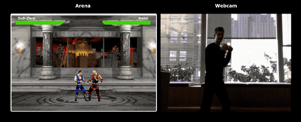

# Играем в Мортал Комбат с TensorFlow.js. Перенос обучения и дополнение данных 

*Перевод статьи [Minko Gechev](https://blog.mgechev.com/): [Playing Mortal Kombat with TensorFlow.js. Transfer learning and data augmentation](https://blog.mgechev.com/2018/10/20/transfer-learning-tensorflow-js-data-augmentation-mobile-net/).*

***

Во время экспериментов по улучшению предсказательной модели в [Guess.js](https://github.com/guess-js/guess) я начал обращать внимание на глубокое обучение. До этого я больше фокусировался на [рекуррентных нейронных сетях](https://ru.wikipedia.org/wiki/Рекуррентная_нейронная_сеть) (RNN), особенно на [долгой краткосрочной памяти](https://ru.wikipedia.org/wiki/Долгая_краткосрочная_память) LSTM, из-за их [«необъяснимой эффективности»](https://karpathy.github.io/2015/05/21/rnn-effectiveness/) в Guess.js домене. В то же время я начал смотреть в сторону [свёрточных нейронных сетей](https://ru.wikipedia.org/wiki/Свёрточная_нейронная_сеть) (CNN), которые хотя и менее традиционно, но также часто используются для временных рядов. CNN обычно используют для классификации и распознавания изображений.


_Управление [MK.js](https://github.com/mgechev/mk.js) с помощью TensorFlow.js_

> Исходный код для [этой статьи](https://github.com/mgechev/mk-tfjs) и [MK.js](https://github.com/mgechev/mk.js) вы можете найти на моём [GitHub аккаунте](https://github.com/mgechev). Там нет данных, на которых я тренировал модель, но вы можете создать свои собственные данные и натренировать модель на них, как это сделать написано ниже. Также, не стесняйтесь менять настройки виджетов, чтобы понять, как всё работает.

После того, как я наигрался с CNN, я вспомнил о [своём эксперименте](https://www.youtube.com/watch?v=0_yfU_iNUYo), который я сделал в прошлом году, когда браузеры представили `getUserMedia` API. В этом эксперименте я использовал пользовательскую камеру, чтобы играть в небольшую JavaScript копию игры Мортал Комбат 3. Вы можете найти игру на моём [GitHub аккаунте](https://github.com/mgechev/mk.js). Как часть этого эксперимента я разработал базовый алгоритм для определения позы, классифицирующий изображения по следующим классам:

* Удар правой или левой рукой
* Удар правой или левой ногой
* Проход вправо или влево
* Приседание 
* Ничего из вышеперечисленного

Алгоритм настолько простой, что его можно описать в несколько предложений:

> Алгоритм делает снимок фона за пользователем. Как только пользователь появляется на сцене, алгоритм находит разницу между оригинальным кадром с фоном и текущим кадром с пользователем. Таким образом мы можем определить как расположено тело пользователя. Следующим шагом алгоритм отрисовывает пользователя белым по чёрному холсту. Затем алгоритм создает вертикальную и горизонтальную гистограмму, суммируя значения всех пикселей. Основываясь на суммарных вычислениях, алгоритм определяет, в какой позе сейчас находится пользователь.

На видео - демонстрация работы этого алгоритма. Исходный код - на моём [GitHub аккаунте](https://github.com/mgechev/movement.js). [Видео](https://www.youtube.com/watch?v=0_yfU_iNUYo).

Несмотря на то, что у меня получилось успешно управлять моим MK клоном, алгоритм был всё ещё далёк от идеала. Ему требовался кадр с фоном, который позади пользователя. И для того, чтобы определение позы работало корректно, фон должен оставаться того же цвета на протяжении работы программы. Такое ограничение означало, что любые изменения в освещении, тенях и т. д. будут вносить погрешности в работу программы и приводить к неверным результатам. И, наконец, алгоритм не распознает действия, он классифицирует следующий кадр как одну позу из предопределённого набора.

И теперь, учитывая достижения в API веб-платформы, особенно [WebGL](https://ru.wikipedia.org/wiki/WebGL), я решил ещё раз попробовать решить эту проблему, используя TensorFlow.js.

## Вступление

В этом посте я поделюсь своим опытом построения алгоритма по распознаванию позы, используя [TensorFlow.js](https://js.tensorflow.org/) и [MobileNet](https://www.npmjs.com/package/@tensorflow-models/mobilenet). Мы рассмотрим несколько тем:

- Сбор тренировочных данных для распознания изображений
- Дополнение данных с помощью [imgaug](https://github.com/aleju/imgaug)
- Перенос обучения с MobileNet
- Бинарная классификация и n-арная классификация 
- Тренировка классификационной модели TensorFlow.js с Node.js и использование её в браузере
- Несколько слов об использовании классификации действий с LSTM

Для этой статьи я упрощу проблему до определения позы на основании одного кадра, в отличие от определения действия на основании нескольких последовательных кадров. Мы разработаем **контролируемую модель для глубоко обучения**, которая будет определять, что делает пользователь на основе изображения с пользовательской камеры.

К концу статьи вы сможете создать модель для игры в [MK.js](https://github.com/mgechev/mk.js):


**Статья будет наиболее полезной для читателей, которые знакомы с фундаментальными концепциями разработки программного обеспечения и JavaScript. Базовое понимание глубокого обучения будет полезным, но не обязательно.**

## Сбор данных

Точность модели глубокого обучения в значительной степени зависит от качества данных, на которых обучается модель. Нам надо стремиться получить разнообразный набор данных для обучения, похожий на тот, который мы будем получать в реальной системе. Наша модель должна быть способна распознавать удары руками и ногами. Это значит, что нам надо собрать изображения из трех различных категорий:

- Удары руками
- Удары ногами
- Всё остальное

Для этого эксперимента я, с помощью ещё двух волонтеров ([lili_vs](https://twitter.com/lili_vs) и [gsamokovarov](https://twitter.com/gsamokovarov)), сделал немного фотографий. Мы записали 5 видео на QuickTime с моего MacBook Pro, каждое из которых содержало 2 - 4 удара рукой и 2 - 4 удара ногой. 

Теперь у нас есть `mov` видео, но нужны изображения. Мы будем использовать приложение `ffmpeg`, чтобы разбить видео на кадры и сохранить их как `jpg`. 

```bash
ffmpeg -i video.mov $filename%03d.jpg
```

Прежде, чем запустить эту команду, [установите](https://www.ffmpeg.org/download.html) `ffmpeg` на ваш компьютер. 

Для обучения модели нам нужно сопоставить входные данные с ожидаемым результатом, но сейчас у нас есть только куча изображений трех людей в разных позах. Чтобы структурировать эти данные, мы должны распределить кадры из видео на три папки (перечисленные до этого): удары рукой, удары ногой и всё остальное.

Таким образом, в каждой папке у нас получится примерно по 200 изображений, похожих на эти:


Заметьте, что в папке «всё остальное» может быть гораздо больше изображений, чем в других, потому что изображений ударов меньше, чем изображений просто стоящих, ходящих или выключающих видеозапись людей. Если при обучении модели у нас в одном классе будет больше данных, чем в остальных, то мы рискуем сделать модель предвзятой к этому классу. Таким образом, даже если мы попытаемся классифицировать образ бьющего ногой человека, нейронная сеть классифицирует его как «всё остальное». Чтобы убрать предвзятость модели, мы можем уменьшить количество фотографий в «всё остальное» категории и сделать так, чтобы в каждой папке было примерно одинаковое количество изображений.

Для удобства, я пронумерую изображения в каждой папке от `1` до `190`, так что название первого изображения будет `1.jpg`, второго - `2.jpg` и т. д.

Если мы обучим модель только на 600 фотографиях, сделанных в одном и том же месте с одними и теми же людьми, то аккуратность этой модели будет не высокой. Чтобы «выжать» как можно больше из наших данных, мы их **дополним**.

## Дополнение данных

Дополнение данных — это техника, позволяющая увеличить количество данных, путем создания новых на основе существующего набора данных. Обычно, дополнение данных используется для увеличения количества данных и их разнообразия.  Мы сделаем функцию, которая на основании исходных изображений, будет создавать новые. Не стоит быть слишком агрессивными с преобразованиями: применяя их на изображения с ударами, у нас должны получиться тоже изображения с ударами. 

В нашем случае допустимыми преобразованими будут: вращения, инвертирование цветов, размытие изображения и т. д. В интернете есть отличные open source библиотеки для этого. На момент написания, я не нашёл такой библиотеки на JavaScript, поэтому я использовал библиотеку, написанную на Питоне - [imgaug](https://github.com/aleju/imgaug). Она содержит набор параметров, которые могу быть применены с какой-то долью вероятности.

Это логика для дополнения данных, которую я использовал в данном эксперименте:

```python
np.random.seed(44)
ia.seed(44)

def main():
    for i in range(1, 191):
        draw_single_sequential_images(str(i), "others", "others-aug")
    for i in range(1, 191):
        draw_single_sequential_images(str(i), "hits", "hits-aug")
    for i in range(1, 191):
        draw_single_sequential_images(str(i), "kicks", "kicks-aug")

def draw_single_sequential_images(filename, path, aug_path):
    image = misc.imresize(ndimage.imread(path + "/" + filename + ".jpg"), (56, 100))
    sometimes = lambda aug: iaa.Sometimes(0.5, aug)
    seq = iaa.Sequential(
        [
            iaa.Fliplr(0.5), # horizontally flip 50% of all images
            # crop images by -5% to 10% of their height/width
            sometimes(iaa.CropAndPad(
                percent=(-0.05, 0.1),
                pad_mode=ia.ALL,
                pad_cval=(0, 255)
            )),
            sometimes(iaa.Affine(
                scale={"x": (0.8, 1.2), "y": (0.8, 1.2)}, # scale images to 80-120% of their size, individually per axis
                translate_percent={"x": (-0.1, 0.1), "y": (-0.1, 0.1)}, # translate by -10 to +10 percent (per axis)
                rotate=(-5, 5),
                shear=(-5, 5), # shear by -5 to +5 degrees
                order=[0, 1], # use nearest neighbour or bilinear interpolation (fast)
                cval=(0, 255), # if mode is constant, use a cval between 0 and 255
                mode=ia.ALL # use any of scikit-image's warping modes (see 2nd image from the top for examples)
            )),
            iaa.Grayscale(alpha=(0.0, 1.0)),
            iaa.Invert(0.05, per_channel=False), # invert color channels
            # execute 0 to 5 of the following (less important) augmenters per image
            # don't execute all of them, as that would often be way too strong
            iaa.SomeOf((0, 5),
                [
                    iaa.OneOf([
                        iaa.GaussianBlur((0, 2.0)), # blur images with a sigma between 0 and 2.0
                        iaa.AverageBlur(k=(2, 5)), # blur image using local means with kernel sizes between 2 and 5
                        iaa.MedianBlur(k=(3, 5)), # blur image using local medians with kernel sizes between 3 and 5
                    ]),
                    iaa.Sharpen(alpha=(0, 1.0), lightness=(0.75, 1.5)), # sharpen images
                    iaa.Emboss(alpha=(0, 1.0), strength=(0, 2.0)), # emboss images
                    iaa.AdditiveGaussianNoise(loc=0, scale=(0.0, 0.01*255), per_channel=0.5), # add gaussian noise to images
                    iaa.Add((-10, 10), per_channel=0.5), # change brightness of images (by -10 to 10 of original value)
                    iaa.AddToHueAndSaturation((-20, 20)), # change hue and saturation
                    # either change the brightness of the whole image (sometimes
                    # per channel) or change the brightness of subareas
                    iaa.OneOf([
                        iaa.Multiply((0.9, 1.1), per_channel=0.5),
                        iaa.FrequencyNoiseAlpha(
                            exponent=(-2, 0),
                            first=iaa.Multiply((0.9, 1.1), per_channel=True),
                            second=iaa.ContrastNormalization((0.9, 1.1))
                        )
                    ]),
                    iaa.ContrastNormalization((0.5, 2.0), per_channel=0.5), # improve or worsen the contrast
                ],
                random_order=True
            )
        ],
        random_order=True
    )

    im = np.zeros((16, 56, 100, 3), dtype=np.uint8)
    for c in range(0, 16):
        im[c] = image

    for im in range(len(grid)):
        misc.imsave(aug_path + "/" + filename + "_" + str(im) + ".jpg", grid[im])
```

В этом коде есть `main` функция, внутри которой 3 цикла - по одному для каждой категории изображений. В каждом цикле на каждой итерации мы вызываем `draw_single_sequential_images` метод и передаем имя изображения первым аргументом, путь до изображения - вторым, а третьим - папку, в которой сохранять созданные дополненные изображения. 

После этого мы считываем изображения с диска и применяем к ним набор трансформаций. Я описал большую часть трансформаций во фрагменте выше, поэтому не буду останавливаться на этом здесь. 

Для каждого изображения из набора данных трансформация создаст еще 16 новых изображений. Это пример того, как выглядят изображения, которыми мы дополняем:


Заметьте, что в коде, приведённом выше, мы уменьшаем изображения до `100x56` пикселей. Мы делаем это для уменьшения объёма данных и, соответственно, для уменьшения количества вычислений, которые наша модель должна будет выполнять во время обучения и оценки.

## Создание модели

Теперь давайте создадим классификационную модель!

Так как мы работаем с изображениями, мы будем использовать свёрточную нейронную сеть (CNN). Эта сетевая архитектура известна тем, что лучше всего подходит для распознавания изображений, обнаружения объектов на них и их последующего классифицирования.

### Перенос обучения

На рисунке ниже показана VGG-16, популярная CNN, которая используется для классификации изображений. 


Сеть VGG-16 может распознавать до 1000 классов изображений. Она имеет 16 слоёв (мы не учитываем выходной и pooling слои). Такую многослойную сеть очень сложно тренировать на практике. Это потребует огромный набор данных и много часов обучения. 

Скрытые слои в обученной CNN распознают различные характеристики изображения из тренировочного набора: начиная с распознавания краёв объекта, заканчивая распознаванием отдельных характеристик объекта и распознаванием самого объекта. Обученная CNN, аналогичная VGG-16, которая распознает большой набор изображений, будет иметь скрытые слои, которые уже умеют распознавать многие характеристики изображений на основании предыдущего тренировочного сета. Такие характеристики будут общими между большинством изображений и, соответственно, могут использоваться для разных задач.

**Перенос обучения** позволяет повторно использовать уже обученные сети. Мы можем брать результат работы любого из слоёв существующей сети и передавать его как входные данные в новую нейронную сеть. Таким образом, новую нейрону сеть можно обучить распознавать новые характеристики более высокого уровня и классифицировать изображения из категорий, с которыми исходная сеть ранее не работала.


Для наших целей больше всего подходит **нейронная сеть MobileNet** из [@tensorflow-models/mobilenet](https://www.npmjs.com/package/@tensorflow-models/mobilenet). MobileNet настолько же хороша как и VGG-16, но она так же и намного меньше, что ускоряет прямое распространение и сокращает время загрузки в браузере. MobileNet была обучена на [ILSVRC-2012-CLS](http://www.image-net.org/challenges/LSVRC/2012/) наборе классифицированных изображений.

Вы можете попробовать как работает MobileNet сеть в виджете ниже (*доступен в [оригинальной статье](https://blog.mgechev.com/2018/10/20/transfer-learning-tensorflow-js-data-augmentation-mobile-net/), - прим. пер.*). Вы можете загрузить изображение со своей файловой системы или с камеры.

Когда мы разрабатываем модель с использованием перенесённого обучения нам надо принять два решения:

1. Результат с какого слоя будет входными данными для нашей модели
2. Сколько слоёв в нашей модели мы хотим обучать (и хотим ли мы вообще добавлять новые слои)

Первый выбор достаточно важен. В зависимости от выбранного слоя мы будем получать характеристики изображения разного уровня абстракции, которые, как вы помните, потом используются как входные данные для нашей нейронной сети.

В нашем случае мы не будем обучать ни один из слоев MobileNet. Мы будем использовать результат работы слоя `global_average_pooling2d_1` как входные данные для нашей модели. Как я выбрал именно этот слой? Эмпирическим путем. Я сделал несколько тестов и этот слой работал достаточно хорошо для моих целей.

### Определение модели

Первоначальная проблема состояла в том, чтобы классифицировать изображения по трём категориям: удары рукой, удары ногой и всё остальное. Давайте для начала решим упрощённую задачу: определим совершает ли пользователь удар в кадре или нет. Это типичная задача бинарной классификации. Для решения этой задачи мы можем создать следующую модель: 

```javascript
import * as tf from '@tensorflow/tfjs';

const model = tf.sequential();
model.add(tf.layers.inputLayer({ inputShape: [1024] }));
model.add(tf.layers.dense({ units: 1024, activation: 'relu' }));
model.add(tf.layers.dense({ units: 1, activation: 'sigmoid' }));
model.compile({
  optimizer: tf.train.adam(1e-6),
  loss: tf.losses.sigmoidCrossEntropy,
  metrics: ['accuracy']
});
```

Этот код определяет простую модель со слоем на `1024` юнитов и `ReLU` активацией, и одним выходным юнитом, который проходит через `sigmoid` активационную функцию. Функция `sigmoid` будет возвращать числа от `0` до `1` в зависимости от того, насколько вероятно, что человек в кадре делает удар. Почему я выбрал `1024` юнитов для второго слоя и `1e-6` для скорости обучения? Я просто попробовал несколько разных настроек и увидел, что `1024` и `1e-6` показали лучшие результаты. Возможно «попробовал и увидел» звучит не очень убедительно для вас, но именно так работает настройка гиперпараметров для нейронных сетей глубокого обучения: основываясь на наших знаниях о модели мы используем интуицию, чтобы менять параметры и потом на практике проверять, как работает модель. 

Метод `compile` объединяет слои модели и подготавливает модель для обучения и оценки. В нём мы обозначаем, что хотим использовать оптимизационный алгоритм `adam`. Мы так же определяем, что мы будем вычислять потери с сигмовидной [кросс-энтропией](https://ru.wikipedia.org/wiki/Перекрёстная_энтропия) и мы так же указываем, что хотим оценивать точность модели. TensorFlow.js использует следующую формулу для вычисления точности модели:

```
Точность = (истинно положительные + истинно отрицательные) / (положительные + отрицательные)
```

Если мы хотим применить перенесённое обучение c MobileNet в качестве исходной модели, мы сперва должны загрузить её. Так как это непрактично обучать нашу модель на трёх тысячах изображений в браузере, мы будем использовать Node.js и загружать сеть из файла.

Вы можете скачать MobileNet [от сюда](https://github.com/mgechev/mk-tfjs/tree/master/mobile-net). В папке вы найдёте `model.json` файл, который содержит описание архитектуры модели - слои, активации и т. д. Остальные файлы содержат параметра модели. Вы можете загрузить модель из файла, используя следующий код:

```javascript
export const loadModel = async () => {
  const mn = new mobilenet.MobileNet(1, 1);
  mn.path = `file://PATH/TO/model.json`;
  await mn.load();
  return (input): tf.Tensor1D =>
      mn.infer(input, 'global_average_pooling2d_1')
        .reshape([1024]);
};
```

Заметьте, что в методе `loadModel` мы возвращаем функцию, принимающую одномерный тензор как входной параметр и возвращает `mn.infer(input, Layer)`. `infer` - метод MobileNet, он принимает тензор и слой как входные параметры. Параметр `Layer` определяет, из какого скрытого слоя мы хотим получать результат. Если вы поищите `global_average_pooling2d_1` в [`model.json`](https://github.com/mgechev/mk-tfjs/blob/master/mobile-net/model.json), то вы увидите, что это название одного из слоёв. 

Теперь, для того чтобы обучить модель нам надо создать тренировочный набор данных. Для это нам нужно вызвать MobileNet метод `infer` для каждого изображения и присвоить изображению метку: `1` (если в кадре есть изображение удара) и `0` (если нет).

```javascript
const punches = require('fs')
  .readdirSync(Punches)
  .filter(f => f.endsWith('.jpg'))
  .map(f => `${Punches}/${f}`);

const others = require('fs')
  .readdirSync(Others)
  .filter(f => f.endsWith('.jpg'))
  .map(f => `${Others}/${f}`);

const ys = tf.tensor1d(
  new Array(punches.length).fill(1)
    .concat(new Array(others.length).fill(0)));

const xs: tf.Tensor2D = tf.stack(
  punches
    .map((path: string) => mobileNet(readInput(path)))
    .concat(others.map((path: string) => mobileNet(readInput(path))))
) as tf.Tensor2D;
```

В этом фрагменте кода мы сначала читаем файлы из папки с изображениями ударов, затем из папки, в которой ударов нет.  После этого мы создаем одномерный тензор, содержащий все метки, которые мы получили на выходе. Если у нас было `n` изображений с ударами и `m` изображений без ударов, то тензор будет содержать `n` элементов со значением `1` и `m` элементов со значением `0`. 

Результаты исполнения MobileNet метода `infer` для каждого изображения мы сохраняем в стеке `xs`. Обратите внимание, что для каждого изображения мы вызываем метод `readInput`. Давайте посмотрим на его реализацию:

```javascript
export const readInput = img => imageToInput(readImage(img), TotalChannels);

const readImage = path => jpeg.decode(fs.readFileSync(path), true);

const imageToInput = image => {
  const values = serializeImage(image);
  return tf.tensor3d(values, [image.height, image.width, 3], 'int32');
};

const serializeImage = image => {
  const totalPixels = image.width * image.height;
  const result = new Int32Array(totalPixels * 3);
  for (let i = 0; i < totalPixels; i++) {
    result[i * 3 + 0] = image.data[i * 4 + 0];
    result[i * 3 + 1] = image.data[i * 4 + 1];
    result[i * 3 + 2] = image.data[i * 4 + 2];
  }
  return result;
};
```

`readInput` сначала вызывает функцию `readImage` и после этого вызывает функцию `imageToInput`. `readImage` считывает изображение с диска и после этого декодирует буфер как изображение `jpg`, используя пакет [`jpeg-js`](https://www.npmjs.com/package/jpeg-js). В `imageToInput` мы преобразуем изображение в трёхмерный тензор. 

После выполнения этого кода, для каждого `i` от `0` до `TotalImages` значение `ys[i]` должно быть `1` (если изображение в `xs[i]` содержит удар) и `0` (если иначе).

## Обучение модели

Теперь мы готовы приступить к обучению модели. Для этой цели вызовите метод `fit` на экземпляре модели. 

```javascript
await model.fit(xs, ys, {
  epochs: Epochs,
  batchSize: parseInt(((punches.length + others.length) * BatchSize).toFixed(0)),
  callbacks: {
    onBatchEnd: async (_, logs) => {
      console.log('Cost: %s, accuracy: %s', logs.loss.toFixed(5), logs.acc.toFixed(5));
      await tf.nextFrame();
    }
  }
});
```

В коде выше мы вызываем `fit` с тремя параметрами: `xs`, `ys` и объект с настройками. В настройках мы определяем сколько эпох мы хотим тренировать модель, размер партии и колбэк, который будет вызываться после каждой партии. 

Размер партии определяет размер подмножеств из `xs` и `ys`, на которых мы будет тренировать нашу модель в течение одной эпохи. Для каждой эпохи TensorFlow.js будет выбирать подмножество из `xs` и соответствующие элементы из `ys`, затем он будет применять прямое распространение, получит результат из слоя с `sigmoid` активацией и затем, на основании потерь, TensorFlow.js выполнит оптимизацию, используя `adam` алгоритм.

После запуска кода для обучения вы увидите результат, аналогичный приведенному ниже:

```bash
Cost: 0.84212, accuracy: 1.00000
eta=0.3 >---------- acc=1.00 loss=0.84 Cost: 0.79740, accuracy: 1.00000
eta=0.2 =>--------- acc=1.00 loss=0.80 Cost: 0.81533, accuracy: 1.00000
eta=0.2 ==>-------- acc=1.00 loss=0.82 Cost: 0.64303, accuracy: 0.50000
eta=0.2 ===>------- acc=0.50 loss=0.64 Cost: 0.51377, accuracy: 0.00000
eta=0.2 ====>------ acc=0.00 loss=0.51 Cost: 0.46473, accuracy: 0.50000
eta=0.1 =====>----- acc=0.50 loss=0.46 Cost: 0.50872, accuracy: 0.00000
eta=0.1 ======>---- acc=0.00 loss=0.51 Cost: 0.62556, accuracy: 1.00000
eta=0.1 =======>--- acc=1.00 loss=0.63 Cost: 0.65133, accuracy: 0.50000
eta=0.1 ========>-- acc=0.50 loss=0.65 Cost: 0.63824, accuracy: 0.50000
eta=0.0 ==========>
293ms 14675us/step - acc=0.60 loss=0.65
Epoch 3 / 50
Cost: 0.44661, accuracy: 1.00000
eta=0.3 >---------- acc=1.00 loss=0.45 Cost: 0.78060, accuracy: 1.00000
eta=0.3 =>--------- acc=1.00 loss=0.78 Cost: 0.79208, accuracy: 1.00000
eta=0.3 ==>-------- acc=1.00 loss=0.79 Cost: 0.49072, accuracy: 0.50000
eta=0.2 ===>------- acc=0.50 loss=0.49 Cost: 0.62232, accuracy: 1.00000
eta=0.2 ====>------ acc=1.00 loss=0.62 Cost: 0.82899, accuracy: 1.00000
eta=0.2 =====>----- acc=1.00 loss=0.83 Cost: 0.67629, accuracy: 0.50000
eta=0.1 ======>---- acc=0.50 loss=0.68 Cost: 0.62621, accuracy: 0.50000
eta=0.1 =======>--- acc=0.50 loss=0.63 Cost: 0.46077, accuracy: 1.00000
eta=0.1 ========>-- acc=1.00 loss=0.46 Cost: 0.62076, accuracy: 1.00000
eta=0.0 ==========>
304ms 15221us/step - acc=0.85 loss=0.63
```

Обратите внимание, что с течением времени точность увеличивается, а потери уменьшаются. 

На моём наборе данных я достиг 92% точности к концу обучения модели. Ниже вы можете найти виджет, где вы можете поиграть с предварительно обученной моделью. (*доступен в [оригинальной статье](https://blog.mgechev.com/2018/10/20/transfer-learning-tensorflow-js-data-augmentation-mobile-net/), прим. пер.*). Вы можете выбрать изображение с вашего компьютера или сделать снимок с камеры и классифицировать содержится ли там удар.

Имейте в виду, что точность может быть не очень высокой из-за небольшого набора тренировочных данных, которые у меня были.

## Запускаем модель в браузере

В предыдущем разделе мы обучили модель для бинарной классификации. Теперь давайте запустим её в браузере и подключим к [MK.js](https://github.com/mgechev/mk.js)!

```javascript
const video = document.getElementById('cam');
const Layer = 'global_average_pooling2d_1';
const mobilenetInfer = m => (p): tf.Tensor<tf.Rank> => m.infer(p, Layer);
const canvas = document.getElementById('canvas');
const scale = document.getElementById('crop');

const ImageSize = {
  Width: 100,
  Height: 56
};

navigator.mediaDevices
  .getUserMedia({
    video: true,
    audio: false
  })
  .then(stream => {
    video.srcObject = stream;
  });
```

В приведённом выше фрагменте мы объявляем несколько переменных:

* `video` — содержит ссылку на HTML5 видео элемент на странице
* `Layer` — содержит имя слоя из MobileNet, результат работы которого мы будем передавать как входные данные в нашу модель
* `mobilenetInfer` — это функция, принимающая экземпляр MobileNet и возвращающая другую функцию; возвращённая функция принимает входные данные и возвращает соответствующий результат из указанного слоя MobileNet
* `canvas` — указывает на HTML5 элемент canvas, который мы будем использовать для извлечения кадров из видео
* `scale` — это ещё один canvas, который мы будем использовать для масштабирования отдельных кадров

После этого мы будем получать видео из камеры пользователя и использовать его как источник для видео элемента. Затем мы создадим фильтр для оттенков серого, который будет принимать canvas и преобразовывать его содержимое:

```javascript
const grayscale = (canvas: HTMLCanvasElement) => {
  const imageData = canvas.getContext('2d').getImageData(0, 0, canvas.width, canvas.height);
  const data = imageData.data;
  for (let i = 0; i < data.length; i += 4) {
    const avg = (data[i] + data[i + 1] + data[i + 2]) / 3;
    data[i] = avg;
    data[i + 1] = avg;
    data[i + 2] = avg;
  }
  canvas.getContext('2d').putImageData(imageData, 0, 0);
};
```

В качестве следующего шага соединяем модель вместе с MK.js:

```javascript
let mobilenet: (p: any) => tf.Tensor<tf.Rank>;
tf.loadModel('http://localhost:5000/model.json').then(model => {
  mobileNet
    .load()
    .then((mn: any) => mobilenet = mobilenetInfer(mn))
    .then(startInterval(mobilenet, model));
});
```

В приведённом коде мы сначала загружаем модель, которую мы обучили выше, и после этого загружаем MobileNet. Мы передаём MobileNet в `mobilenetInfer` метод, чтобы было удобнее вычислять результат скрытого слоя сети. После этого мы вызываем метод `startInterval` с обоими сетями в качестве аргументов. 

```javascript
const startInterval = (mobilenet, model) => () => {
  setInterval(() => {
    canvas.getContext('2d').drawImage(video, 0, 0);

    grayscale(scale
      .getContext('2d')
      .drawImage(
        canvas, 0, 0, canvas.width,
        canvas.width / (ImageSize.Width / ImageSize.Height),
        0, 0, ImageSize.Width, ImageSize.Height
      ));

    const [punching] = Array.from((
      model.predict(mobilenet(tf.fromPixels(scale))) as tf.Tensor1D)
    .dataSync() as Float32Array);

    const detect = (window as any).Detect;
    if (punching >= 0.4) detect && detect.onPunch();

  }, 100);
};
```

`startInterval`  - метод, в котором происходит всё самое интересное. Сначала мы создаем интервал, где каждые `100мс` мы вызываем анонимную функцию. В этой функции мы сначала отрисовываем видео поверх canvas, которая будет содержать наш текущий кадр. После этого мы масштабируем кадр до `100x56` и применяем к нему фильтр для оттенков серого.

Следующим шагом мы передаём кадр в MobileNet, получаем результат из желаемого скрытого слоя и передаём его как вход в `predict` метод прогнозирования нашей модели. Метод `predict` вернёт тензор с одним элементом. Используя `dataSync`, мы получаем значение из тензора и сохраняем его в постоянной `punching`.

Наконец, мы проверяем: если вероятность того, что пользователь делает удар в кадре больше `0.4`, мы вызываем метод `onPunch` у глобального объекта `Detect`. MK.js предоставляет глобальный объект с тремя методами: `onKick`, `onPunch` и `onStand`, которые мы можем использовать чтобы контролировать любого из персонажей. 

Вот и всё! :tada: Вот и результат!


## Распознавание ударов руками и ногами с помощью n-арной классификации

В этом разделе мы создадим нейронную сеть, которая будет отличать удары руками и удары ногами. Начнём с процесса подготовки данных для обучения:

```javascript
const punches = require('fs')
  .readdirSync(Punches)
  .filter(f => f.endsWith('.jpg'))
  .map(f => `${Punches}/${f}`);

const kicks = require('fs')
  .readdirSync(Kicks)
  .filter(f => f.endsWith('.jpg'))
  .map(f => `${Kicks}/${f}`);

const others = require('fs')
  .readdirSync(Others)
  .filter(f => f.endsWith('.jpg'))
  .map(f => `${Others}/${f}`);

const ys = tf.tensor2d(
  new Array(punches.length)
    .fill([1, 0, 0])
    .concat(new Array(kicks.length).fill([0, 1, 0]))
    .concat(new Array(others.length).fill([0, 0, 1])),
  [punches.length + kicks.length + others.length, 3]
);

const xs: tf.Tensor2D = tf.stack(
  punches
    .map((path: string) => mobileNet(readInput(path)))
    .concat(kicks.map((path: string) => mobileNet(readInput(path))))
    .concat(others.map((path: string) => mobileNet(readInput(path))))
) as tf.Tensor2D;
```
 
Как и для тренировки предыдущей модели, мы начнём с того, что загрузим папки с изображениями ударов ногой, ударов рукой и изображениями всего остального. После этого мы сформируем двухмерный тензор, а не одномерный как в предыдущем разделе. Если у нас есть `n` изображений с ударами рукой, `m` изображений с ударами ногой и `k` изображений со всем остальным, то тензор `ys` будет иметь `n` элементов `[1,0,0]`, `m` элементов `[0,1,0]` и `k` элементов `[0,0,1]`. Вектор `[1,0,0]` ассоциируется с изображениями, на которых есть удар рукой, вектор `[0,1,0]` - с изображениями, на которых есть удары ногой, вектор `[0,0,1]` - со всеми остальными изображениями. 

Вектор с `n` элементами, в котором `n - 1` элемент - это нули, а `1` элемент - это единица, будем называть унитарным кодом.

После этого мы формируем входной тензор `xs`, сохраняя результаты из MobileNet для каждого изображения. 

Для этой цели, нам надо обновить объявление модели:

```javascript
const model = tf.sequential();
model.add(tf.layers.inputLayer({ inputShape: [1024] }));
model.add(tf.layers.dense({ units: 1024, activation: 'relu' }));
model.add(tf.layers.dense({ units: 3, activation: 'softmax' }));
await model.compile({
  optimizer: tf.train.adam(1e-6),
  loss: tf.losses.sigmoidCrossEntropy,
  metrics: ['accuracy']
});
```

Есть только два отличия от предыдущей модели:

* Количество юнитов в выходной модели
* Активация в выходном слое

Причина, почему мы определили 3 юнита в выходном слое, состоит в том, что у нас есть три разные категории изображений:

* Удары рукой
* Удары ногой
* Всё остальное

Softmax активация вызывается поверх этих трёх юнитов и преобразует их параметры в тензор с тремя значениями. Почему у нас 3 юнита на выходном слое? Мы знаем, что мы можем представить `3` значения (по одному для каждого класса) с `2` битами: `00`, `01`, `10`. Сумма значений тензора, создаваемых `softmax`, равна `1`, что означает, что мы никогда не получим `00`, поэтому мы никогда не сможем классифицировать изображения одного из классов.

После 500 эпох обучения модели, я добился около 92% точности! Это неплохо, и не забывайте, что для обучения использовался небольшой набор данных. 

Следующий шаг - запустить модель в браузере! Поскольку логика для этого довольно похожа на то, что мы делали для бинарной модели, давайте посмотрим на последний шаг, на котором мы выбираем действие, основанное на результате работы модели:

```javascript
const [punch, kick, nothing] = Array.from((model.predict(
  mobilenet(tf.fromPixels(scaled))
) as tf.Tensor1D).dataSync() as Float32Array);

const detect = (window as any).Detect;
if (nothing >= 0.4) return;

if (kick > punch && kick >= 0.35) {
  detect.onKick();
  return;
}
if (punch > kick && punch >= 0.35) detect.onPunch();
```

Изначально, мы вызываем MobileNet модель и с уменьшенными изображениями после фильтрации оттенков серого, после чего мы передаем результат нашей обученной модели. Модель возвращает одномерный тензор, который мы приводим к `Float32Array` с помощью `dataSync`. Затем, используя `Array.from`, мы преобразуем типизированный массив к JavaScript массиву и получаем вероятности того, что на изображении удар рукой, удар ногой или что-то другое. 

Если вероятность того, что на изображении не удар рукой и не удар ногой выше `0.4`, мы останавливаем выполнение функции. В противном случае, если у нас более высокая вероятность того, что на изображении удар ногой и эта вероятность выше `0.32` мы вызывает команду `kick` из MK.js. Если вероятность удара рукой выше `0.36` и вероятность удара рукой выше вероятности удара ногой - мы вызываем `punch` действие. 

И это все! Вы можете увидеть результат ниже:


Теперь вы можете поиграть со следующим виджетом, который использует новую обученную модель, входное изображение может быть с компьютера или с вашей камеры. Попробуйте это с изображением, где вы бьёте рукой или ногой! (*доступен в [оригинальной статье](https://blog.mgechev.com/2018/10/20/transfer-learning-tensorflow-js-data-augmentation-mobile-net/), - прим. пер.*)

## Распознавание действия

Если мы соберём большой и разнообразный набор изображений с людьми, бьющими рукой или ногой, мы сможем создать модель, которая отлично работает на отдельных кадрах. Однако достаточно ли этого? Что делать, если мы хотим сделать ещё один шаг и выделить два разных типа ударов ногой: прямой удар и удар с разворотом. 

Как видно из приведенных ниже снимков, оба удара будут выглядеть одинаково в конкретный момент времени с определённого угла:


Но если мы посмотрим на выполнение, движения будут совсем другими:



Итак, как же мы научим нашу нейронную сеть изучать последовательность кадров, а не один?

Для этой цели мы можем исследовать другой класс нейронных сетей, называемый рекуррентными нейронными сетями (RNN). RNN отлично подходят для работы с временными рядами, например:

* [Обработка естественного языка](https://ru.wikipedia.org/wiki/%D0%9E%D0%B1%D1%80%D0%B0%D0%B1%D0%BE%D1%82%D0%BA%D0%B0_%D0%B5%D1%81%D1%82%D0%B5%D1%81%D1%82%D0%B2%D0%B5%D0%BD%D0%BD%D0%BE%D0%B3%D0%BE_%D1%8F%D0%B7%D1%8B%D0%BA%D0%B0) (NLP), где одно слово зависит от того, что до и после
* Предсказание, какую страницу посетит пользователь, в зависимости от истории навигации
* Распознавание действия из последовательности кадров

Реализация такой модели выходит за рамки этой статьи, но давайте взглянем на типовую архитектуру, чтобы мы могли получить представление о том, как всё работает вместе!

### Сила RNN

На диаграмме ниже изображена модель распознавания действий:


Мы берём последние `n` кадров из видео и передаём их в CNN. Результат работы CNN для каждого кадра, мы передаём в качестве входа в RNN. Рекуррентная нейронная сеть определит зависимости между отдельными кадрами и распознает, какое действие они кодируют.

## Заключение

В этой статье мы разработали модель классификации изображений. Для этой цели мы собрали набор данных, разбили видео на кадры и вручную разделили их на три категории. Затем мы дополнили данные с помощью [imgaug](https://github.com/aleju/imgaug).

После этого мы узнали что такое перенос обучения и как мы сможем с его помощью повторно использовать обученную модель MobileNet из [`@tensorflow-models/mobilenet`](https://www.npmjs.com/package/@tensorflow-models/mobilenet). Мы загрузили MobileNet из файла в Node.js процесс и обучили дополнительный слой, в который мы передавали выходные данные из скрытого слоя MobileNet. После обучения мы добились более чем 90-процентной точности!

Чтобы использовать модель, которую мы разработали, в браузере, мы загрузили её из файла вместе с MobileNet и затем классифицировали кадры с пользовательской камеры каждые `100мс`. Мы подключили модель к игре [MK.js](https://github.com/mgechev/mk.js) и использовали результат работы модели для управления одним из героев.

Наконец, мы рассмотрели, как мы можем улучшить нашу модель, объединив её с рекуррентной нейронной сетью для распознавания действий.

Надеюсь, вам понравился этот небольшой проект так же, как и мне! :bowing_man:

- - - -

*Слушайте наш подкаст в [iTunes](https://itunes.apple.com/ru/podcast/девшахта/id1226773343) и [SoundCloud](https://soundcloud.com/devschacht), читайте нас на [Medium](https://medium.com/devschacht), контрибьютьте на [GitHub](https://github.com/devSchacht), общайтесь в [группе Telegram](https://t.me/devSchacht), следите в [Twitter](https://twitter.com/DevSchacht) и [канале Telegram](https://t.me/devSchachtChannel), рекомендуйте в [VK](https://vk.com/devschacht) и [Facebook](https://www.facebook.com/devSchacht).*