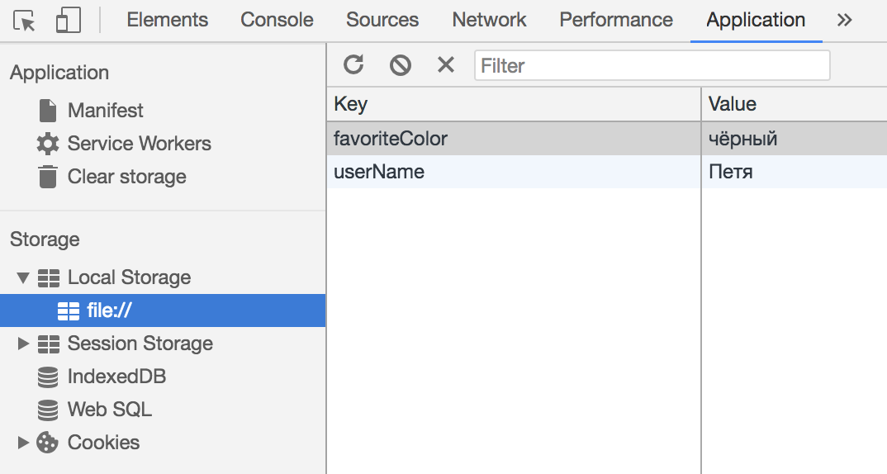

# Почему не стоит использовать localStorage
*Перевод статьи [Please stop using Local Storage](https://www.rdegges.com/2018/please-stop-using-local-storage/).
Опубликовано с разрешения автора.*


Все больше разработчиков используют [localStorage](https://developer.mozilla.org/en-US/docs/Web/API/Storage/LocalStorage) для хранения данных, в том числе и конфиденциальных, даже не подозревая, что тем самым подвергают свои сайты взлому. Именно поэтому я призываю отказаться от такой практики, и в этой статье постараюсь аргументированно обосновать свою точку зрения.

## Введение
Итак, localStorage - новая особенность HTML5, позволяющая хранить любую информацию в пользовательском браузере благодаря JavaScript. Это старый добрый JS-объект, в который можно добавлять и удалять пары ключ/значение. Давайте посмотрим на пример:
```js
// Два варианта добавления данных
localStorage.userName = "Петя";
localStorage.setItem("favoriteColor", "чёрный");

// После добавления в localStorage, они будут там
// до тех пор, пока их явно не удалить
alert(`${localStorage.userName} предпочитает ${localStorage.favoriteColor} цвет.`);

// А теперь удалим данные из хранилища
localStorage.removeItem("userName");
localStorage.removeItem("favoriteColor");
```

Запустив этот код на тестовой HTML-странице, мы увидим в alert-окне фразу "Петя предпочитает чёрный цвет". Если же зайти в инструменты разработчика, предварительно закомментировав строки с удалением данных, то можно убедиться, что оба значения сохранились в локальном хранилище вашего браузера.



Теперь вас может заинтересовать следующий вопрос: есть ли способ использовать локальное хранилище так, чтобы сохранённые данные автоматически удалялись? К счастью, разработчики HTML5 позаботились об этом, добавив глобальный объект sessionStorage, работающий точно так же, как и localStorage, за исключением одного: все хранящиеся в нем данные удаляются, когда пользователь закрывает вкладку браузера.

## Преимущества
Несмотря на то, что весь смысл этой статьи заключается в том, чтобы отговорить вас использовать localStorage, у него все же есть ряд преимуществ.

Во-первых, это чистый JavaScript! Одна из неприятных вещей, касающихся cookies (которые, по сути, являются единственной реальной альтернативой локальному хранилищу) заключается в том, что они должны быть созданы сервером. Ужас, ведь работа с веб-серверами скучна и трудоёмка. Если вы создаете статичный сайт (например, SPA), то использование localStorage позволит ему работать без какого-либо бекенда. Это довольно мощная концепция и одна из основных причин, по которым такая практика популярна среди разработчиков.

Ещё одно достоинство заключается в том, что localStorage располагает как минимум 5 Мб для хранения данных (этот размер поддерживается всеми основными веб-браузерами), что на порядок больше, чем у cookie-файлов (~ 4 Кб). Это дает весомое преимущество, если есть необходимость кэшировать относительно большой объём данных приложения в браузере для последующего использования.

## Недостатки
У localStorage очень простое API, многие разработчики даже не представляют, *насколько* оно простое. Рассмотрим подробнее:
-  Может содержать только строки, что делает его совершенно бесполезным, если речь идёт хоть о чем-то сложнее строк. Конечно, можно переводить все типы данных в строки, но это грязный хак.
- Оно синхронно. Это означает, что каждая операция, связанная с хранилищем, будет выполняться последовательно. Для сложных приложений это критично, поскольку может замедлить скорость его работы.
- Его не могут использовать [web workes](https://developer.mozilla.org/en-US/docs/Web/API/Web_Workers_API/Using_web_workers). То есть, если вы создаете приложение, использующее преимущества фоновой обработки для производительности, расширение для Chrome или прочие подобные вещи, то локальным хранилищем воспользоваться, увы, не выйдет.
- Ограничение размера хранимых данных (как выше было уже сказано, примерно 5 Мб). Это достаточно маленький лимит для приложений, которые должны хранить большой объём данных или нуждаются в возможности работы без подключения к интернету.
- Любой JavaScript-код на странице имеет доступ к хранилищу, поскольку никакой защиты, увы, не предусмотрено. Об этом, самом главном недостатке, мы поговорим чуть позже.

Выходит, что localStorage является хорошим инструментом только при соблюдении ряда условий.

## Безопасность
Дело вот в чем: большинство минусов локального хранилища незначительны. Но вопрос безопасности - решающий фактор, поэтому поговорим о нём более подробно.
Итак, localStorage **НЕБЕЗОПАСЕН**! Совсем! Каждый, кто использует его для хранения конфиденциальных данных, поступает неправильно.

Давайте разберемся, что понимается под конфиденциальными данными:
* Идентификаторы пользователей
* Идентификаторы сессий
* JWT (JSON Web Token)
* Персональная информация
* Информация о кредитной карте
* API-ключи
* Любая другая информация, которую вы бы не стали публиковать публично

LocalStorage разрабатывался не как безопасный механизм хранения данных в браузере, а как простое хранилище ключей и значений с целью облегчения создания небольших сайтов/веб-приложений. И все. 

Что, по вашему, самое опасное в мире? Верно! JavaScript.

 Поэтому, когда захотите сохранить что-нибудь важное в локальном хранилище, представьте, что собираетесь спрятать секретнейшую информацию в самом ненадёжном сейфе на планете. Не лучшая идея.

На самом деле проблема заключается в межсайтовом скриптинге ([XSS](https://www.owasp.org/index.php/Cross-site_Scripting_(XSS))). Не хочу грузить вас подробным объяснением этой уязвимости, поэтому постараюсь объяснить вкратце:
 если хакер сможет запустить JavaScript-код на вашем сайте, то он запросто вытащит всю информацию из localStorage и отправит её на свой сервер, тем самым заполучив, например, данные о пользовательской сессии.
Вы можете возразить: "Да ну? Мой сайт безопасен. Никто не сможет запустить какой-либо скрипт на моем сайте".

 И вот тут загвоздка. В теории вы абсолютно правы, однако на деле этого фактически невозможно достичь. Давайте разберемся, почему. 


Наверняка ваш сайт содержит скрипты, которые загружаются с других серверов. Cамыми распространенными вариантами являются ссылки на:
* Bootstrap
* jQuery
* Vue, React, Angular и прочие
* Google Analytics

Ну и так далее. Тогда есть вероятность того, что злоумышленник сможет запустить скрипт на вашем сайте. Представим, что он содержит следующий код:
```html
<script src="https://awesomejslibrary.com/minified.js"></script>
```
Предположим, что awesomejslibrary.com подвергся атаке, и minifed.js скрипт был так же изменен. В этом случае появляется риск того, что скрипт соберет все данные из localStorage и отправит их на специально созданный для хранения украденной информации API. Выходит, что хакеры украли данные пользователя, при этом ни он, ни вы (как разработчик), не узнаете об этом. Плохой вариант.



Мы все частенько задумываемся над тем, что все JS-скрипты нужно размещать локально у себя на сервере, однако на практике такое происходит редко. Во многих компаниях маркетологи могут напрямую вносить изменения на сайт через WYSIWYG-редакторы и прочие инструменты. Отсюда возникает вопрос: вы правда уверены, что нигде на вашем сайте не используется сторонний JS? Я отвечу за вас: нет. 

Поэтому, чтобы снизить риск утечки пользовательской информации, **не храните конфиденциальные данные в localStorage**.

## Про токены
Хоть мне и кажется, что я достаточно убедительно объяснил, почему не стоит хранить конфиденциальные данные в локальном хранилище, отдельно стоит разъяснить ситуацию с JSON Web Token (JWT). 

Многие разработчики, которые хранят JWT в localStorage, не понимают, что это, по сути, то же самое, что и имя пользователя / пароль.

Если хакеры [скопируют эти токены](https://stackoverflow.com/questions/34259248/what-if-jwt-is-stolen), то смогут отправлять запросы на ваш сервер, и вы об этом никогда не узнаете. Поэтому обращайтесь с ними так же, как с данными кредитной карты или паролем, а именно - не храните в localStorage, вопреки тысячам туториалов, видео на Youtube и даже курсам программирования в университетах. **Это неправильно**! Если кто-то советует вам хранить токены в локальном хранилище для аутентификации, покажите им эту статью.

## Альтернативы
Итак, после того, как мы убедились, что localStorage - далеко не самое идеальное решение для хранения информации, время познакомиться с альтернативными вариантами.



### Конфиденциальные данные
Для хранения таких данных единственным верным решением является сессия на стороне сервера. Алгоритм следующий:
- Когда пользователь логинится на вашем сайте, нужно создать уникальный индентификатор сессии и сохранить в криптографически зашифрованный куки-файл. Если вы используйте какой-либо веб-фреймворк, просто загуглите “how to create a user session using cookies” и следуйте этому руководству.
- Убедитесь, что у cookie-библиотеки, которую использует ваш фреймворк, в настройках включено `httpOnly`. Это сделает невозможным просмотр куки-файлов браузером, что необходимо для их безопасного использования на стороне сервера. Советую прочитать [статью Джеффа Этвуда](https://blog.codinghorror.com/protecting-your-cookies-httponly/) для получения дополнительной информации.
- Кроме того, нужно убедиться, что в настройках указано `SameSite = strict` (чтобы предотвратить [CSRF-атаки](https://www.owasp.org/index.php/Cross-Site_Request_Forgery_(CSRF))), а также `secure = true` (чтобы гарантировать передачу куки только через зашифрованное соединение)
- При запросе пользователем сайта, используйте его сессионный идентификатор (извлеченный из куки-файла) для получения информации об аккаунте. После чего можно свободно отправлять пользователю любые связанные с этой учетной записью конфиденциальные данные без повторной проверки идентификатора сессии (разумеется, если первая проверка была пройдена)

Эта простая и, что самое главное, безопасная модель. К тому же с её помощью можно масштабировать проект любого уровня.

### Данные, отличные от строк
Если вам необходимо хранить информацию, которая не является конфиденциальной и которая представляет собой что-то сложнее строк, то лучшее решение для этого - IndexedDB. Это транзакционная система БД с низкоуровневым API, являющаяся хорошим вариантом для хранения различных данных (включая файлы/блобы) прямиком в браузере. Более подробную информацию можно получить из [гайда от Google](https://developers.google.com/web/ilt/pwa/working-with-indexeddb).

### Оффлайн-данные
Для обеспечения работы приложения без подключения к интернету наилучшим решением будет связка IndexedDB с Cache API (является частью Service Workes), благодаря которой возможно кэширование всех необходимых для корректной работы ресурсов. Отличный туториал по использованию от Google - [здесь](https://developers.google.com/web/fundamentals/instant-and-offline/web-storage/cache-api).

## Вывод
Надеюсь, теперь вы понимаете (понимаете ведь?), почему далеко не всегда стоит использовать localStorage. Если вам нужно хранить данные, которые являются публичными, не используются в высокопроизводительных приложениях, точно не займут более 5 Мб и состоят только из строк, то локальное хранилище станет хорошим инструментом для ваших целей.
Во всех остальных случая - **не используйте локальное хранилище**! Используйте альтернативные решения.

И пожалуйста, я вас просто умоляю, не храните информацию о сессии (вроде JSON Web Token) в localStorage. Это сделает ваш сайт уязвимым для многочисленных атак, которые навредят пользователям.

**P.S.** Для тех, кто задался вопросом, почему я не упомянул [Content Sequiriy Policy](https://developer.mozilla.org/en-US/docs/Web/HTTP/CSP) (CSP) как способ защиты от XSS.
 Причина проста: это не поможет в ситуации, которую я описал. Даже если вы используете CSP для проверки всех сторонних доменов, откуда подключаете JavaScript, это не поможет, если сайт из белого списка будет взломан.

**P.P.S.** [Subresource integrity](https://developer.mozilla.org/en-US/docs/Web/Security/Subresource_Integrity), к сожалению, тоже не является решением проблемы. Для большинства маркетинговых инструментов, рекламных сетей и т.д. (которые являются наиболее распространёнными сторонними скриптами) subresource integrity почти никогда не используется, поскольку поставщикам этих скриптов необходимо частенько их менять для расширения функционала и прочих вещей.


----

*Слушайте наш подкаст в [iTunes](https://itunes.apple.com/ru/podcast/девшахта/id1226773343) и [SoundCloud](https://soundcloud.com/devschacht), читайте нас на [Medium](https://medium.com/devschacht), контрибьютьте на [GitHub](https://github.com/devSchacht), общайтесь в [группе Telegram](https://t.me/devSchacht), следите в [Twitter](https://twitter.com/DevSchacht) и [канале Telegram](https://t.me/devSchachtChannel), рекомендуйте в [VK](https://vk.com/devschacht) и [Facebook](https://www.facebook.com/devSchacht).*
