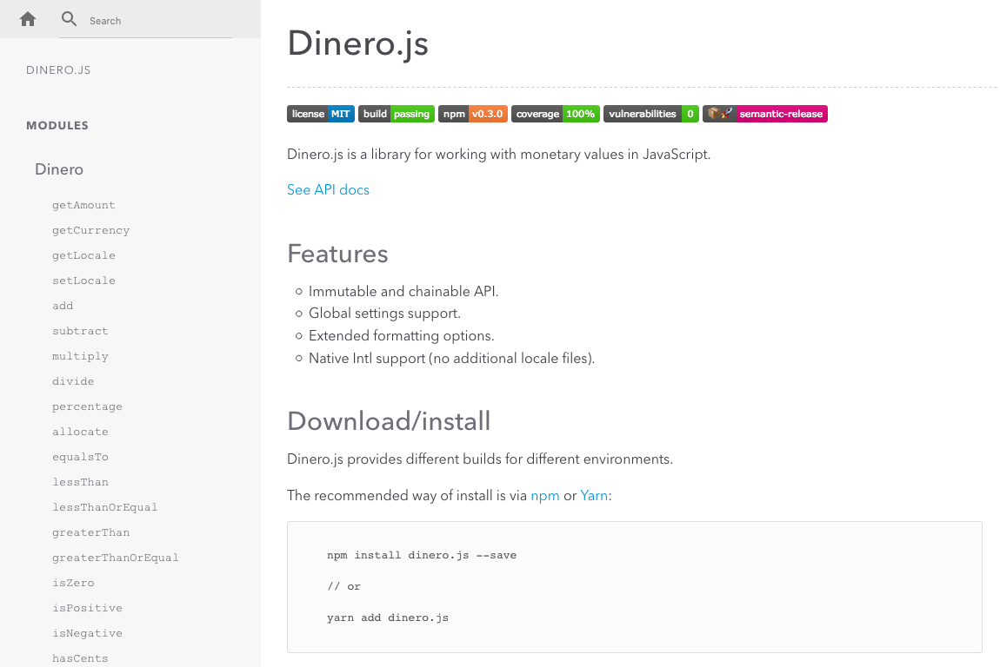

# Как работать с денежными значениями в JavaScript

*Перевод статьи Sarah Dayan: [How to Handle Monetary Values in JavaScript](https://frontstuff.io/how-to-handle-monetary-values-in-javascript).*

**Деньги везде**. Банковские приложения, интернет-магазины, платформы для фондовых бирж, мы встречаемся с деньгами каждый день. И все чаще мы доверяем работу с деньгами технологиям.

Но, все ещё нет единого стандарта по работе с денежными значениями. Деньги довольно распространены среди людей, но не имеют первоклассной поддержки в основных языках программирования (хотя даты поддерживаются хорошо). В результате, **каждая команда изобретает свой способ работы с деньгами, натыкаясь на все подводные камни**.

## Подводный камень №1: Деньги, как `Number`

Первой мыслью может быть хранить денежные значения как `Number`. Деньги ведь число, верно? Неверно.

Деньги — число только наполовину, на самом деле, они ещё включают валюту. Нет такого понятия, как 10 «денег». Может быть 10 долларов, 10 евро, 10 биткоинов... Если вам потребуется сложить две денежные величины, нужно сначала их конвертировать. То же самое и при сравнении: если у вас есть только сумма, вы не сможете выполнить точное сравнение. **Сумма и валюта неразрывно связаны**.

## Подводный камень #2: математика с плавающей точкой

Большая часть современных валют либо являются десятичными, либо вообще не имеют производных единиц. Это означает, что если у какой-то валюты есть производные единицы, то их число в основной валюте равно 10 в какой-нибудь степени. Например, в долларе 100 центов, то есть 10 во второй степени.

Использование десятичной системы удобно, но имеет серьёзные проблемы, если речь идёт о программировании. Компьютеры используют двоичную систему, потому [они не могут представлять десятичные числа в исходном формате](http://0.30000000000000004.com/). Некоторые языки предоставляют встроенные решения, такие как `BigDecimal` в Java или `decimal` в C#. В JavaScript есть только тип `Number`, который используется для представления как целых чисел, так и [чисел с плавающей запятой двойной точности](https://www.wikiwand.com/en/IEEE_754). Из-за того, что это двоичное представление десятичной системы, **при выполнении математических операций результаты получаются неточными**.

    0.1 + 0.2 // возвращает 0.30000000000000004 😧

**Использование чисел с плавающей точкой для хранения денежных значений — это плохая идея.** Когда вы проводите множество вычислений, незаметные погрешности накапливаются и становятся огромными. Это неизбежно приводит к ошибкам округления.

## Подводный камень №3: проценты против деления

Иногда вам нужно разделить деньги, но **взятие процента от суммы не может быть выполнено без добавления или потери копеек**.

Представьте, вам нужно выставить счёт на сумму 999,99 долларов с предоплатой 50%.  Это простая математическая задачка. Половина составит 499,995 долларов, но вы не можете разделить цент, потому округлите результат до 500 долларов. Проблема в том, что когда вы станете взимать вторую половину платежа, вы получите тот же результат, снова округлите и получите лишний цент.

Итак, вы не можете полагаться на проценты или деление при работе с деньгами, потому что **они не могут делиться до бесконечности**. Цена на бензин может содержать больше двух цифр после запятой, но это только символ: вы всегда платите округлённую цену.

## Инженерная помощь

Как видите деньги — это больше чем кажется, и намного больше чем тип `Number`.

К счастью, инженер-программист [Мартин Фаулер](https://martinfowler.com/) предложил решение. В [«Шаблонах корпоративных приложений»](https://martinfowler.com/books/eaa.html) он описывает [шаблон для денежных значений](https://martinfowler.com/eaaCatalog/money.html):

**Атрибуты**:

- количество
- валюта

**Методы**:

- математические: сложение, вычитание, умножение, деление
- сравнительные: равно, больше,  больше или равно, меньше, меньше или равно.

**На основе этого вы можете создавать объекты денежных единиц, которые удовлетворят большую часть ваших потребностей.**

## Деньги как структура данных

Деньги ведут себя не как обычное число, и потому должны быть представлены иначе. **Первое и самое важное правило — числовое значение всегда состоит из суммы и валюты.**

Вы можете сделать все что нужно, если знаете сумму и валюту. Вы можете сложить денежные значения, проверить их на равенство, отформатировать. Все эти операции могут быть определены как методы объекта. **В JavaScript можно использовать классы.**

## Сумма в центах

Есть несколько способов решить проблему с плавающей запятой в JavaScript.

Вы можете использовать библиотеки подобные [Decimal.js](https://mikemcl.github.io/decimal.js/), которые будут обрабатывать такие числа как строки. Это неплохое решение, оно пригодится когда вам придётся работать с [большими числами](https://developer.mozilla.org/ru/docs/Web/JavaScript/Reference/Global_Objects/Number/MAX_SAFE_INTEGER). **Но это приведёт к добавлению большой зависимости и снижению скорости работы приложения.**

Вы можете умножать числа с плавающей точкой до целых, прежде чем вычислять, а после выполнения всех операций делить их обратно.

    (0.2 * 100 + 0.01 * 100) / 100 // возвращает 0.21 🎉

Это отличное решение, но требует дополнительных действий либо для построения объекта, либо для каждой операции. Возможно, это не повлияет на производительность, но потребует дополнительной работы.

Третий вариант — хранить значение в центах. Если вам нужно сохранить 10 центов, вы не станете сохранять `0.1`, вы сохраните `10`. Это позволит работать с целыми числами, что **означает безопасные вычисления** (пока не доберётесь до [больших чисел](https://developer.mozilla.org/ru/docs/Web/JavaScript/Reference/Objets_globaux/Number/MAX_SAFE_INTEGER)) **и отличную производительность**.

## Dinero.js — библиотека для создания, расчёта и форматирования неизменяемых денежных величин

На основе этих наблюдений я создала JavaScript-библиотеку: [Dinero.js](https://github.com/sarahdayan/dinero.js).

Dinero.js реализует описанный Фаулером паттерн и даже расширяет его. Она позволяет создавать, вычислять и форматировать денежные значения в JavaScript. Можно выполнять математические операции, анализировать и форматировать объекты денег, производить проверки и **облегчить процесс разработки**.

Библиотека сконструирована так, чтобы все объекты были неизменяемыми и могли складываться в цепочки вызовов. Она поддерживает глобальные настройки, расширенные опции форматирования и предоставляет нативную поддержку интернационализации.

## Почему неизменяемые значения?

Библиотеки работающие с неизменяемыми значениями более безопасны и предсказуемы. Мутирующие операции и передача по ссылке — причины большей части багов. Выбор неизменяемости значений позволяет избежать их.

**С Dinero.js вы можете выполнять вычисления и не беспокоиться о происходящем с изначальным значением.** В следующем примере на Vue.js, `price` не поменяется, когда `priceWithTax` будет вызван. Если бы значение было изменяемым, оно бы поменялось.

    const vm = new Vue({
      data: {
        price: Dinero({ amount: 500 })
      },
      computed: {
        priceWithTax() {
          return this.price.add(this.price.percentage(10))
        }
      }
    })

## Цепочка вызовов

Любой хороший разработчик стремится сделать свой код более лаконичным и простым для чтения. Если вы хотите последовательно выполнить несколько операций над одним объектом, объединение их в цепочку вызовов обеспечивает элегантную и краткую запись. 

    Dinero({ amount: 500 })
      .add(Dinero({ amount: 200 }))
      .multiply(4)
      .setLocale('fr-FR')
      .toFormat() // возвращает "28,00 US$"

## Глобальные настройки

Когда вы работаете с большим количеством денежных значений, скорее всего, вы хотите, чтобы некоторые их них имели общие параметры. Если вы делаете сайты на немецком языке, вы, вероятно, захотите показывать все цены в немецкой валюте.

Именно для этого и нужны глобальные настройки. Вместо того, чтобы передавать опции каждому экземпляру, можно объявить их глобальными и они применяться ко всем объектам.

    Dinero.globalLocale = 'de-DE'
    Dinero({ amount: 500 }).toFormat() // возвращает "5,00 $"

## Нативная поддержка интернационализации

Обычно библиотеки используют файлы локалей для интернационализации. **Как можно догадаться, это увеличивает их размер.**

*Moment.js с файлами локали в три раза больше, чем без них.*

Ещё файлы локали тяжело поддерживать. Но, API интернационализации — встроенная возможность и [отлично поддерживается браузерами](https://caniuse.com/#feat=internationalization). Если вам не нужно поддерживать старые и/или непопулярные браузеры, `toFormat` безопасен в использовании.

## Форматирование

Объекты отлично подходят для хранения данных, но не очень удобны для их отображения. Dinero.js поставляется с множеством методов для форматирования, включая `toFormat`. Он предоставляет интуитивно понятный и лаконичный интерфейс для `Number.prototype.toLocaleString`. Используете его вместе с `setLocale` и **сможете выводить Dinero-объект в нужном формате на любом языке**. Это особенно удобно при разработке мульти-язычных интернет-магазинов.

## Что дальше?

Шаблон Фаулера для работы с денежными значениями широко признан как отличное решение. Им вдохновлены многие реализации на самых разных языках. Если вы хотите написать свою реализацию, я рекомендую обратить внимание на упомянутые в статье подводные камни и использовать шаблон Фаулера в качестве отправной точки. Или **вы можете выбрать [Dinero.js](https://github.com/sarahdayan/dinero.js) — современное, надёжное, полностью протестированное решение, которое уже работает**. Наслаждайтесь!

- - - -

*Слушайте наш подкаст в [iTunes](https://itunes.apple.com/ru/podcast/девшахта/id1226773343) и [SoundCloud](https://soundcloud.com/devschacht), читайте нас на [Medium](https://medium.com/devschacht), контрибьютьте на [GitHub](https://github.com/devSchacht), общайтесь в [группе Telegram](https://t.me/devSchacht), следите в [Twitter](https://twitter.com/DevSchacht) и [канале Telegram](https://t.me/devSchachtChannel), рекомендуйте в [VK](https://vk.com/devschacht) и [Facebook](https://www.facebook.com/devSchacht).*

*Если вам понравилась статья, внизу можно поддержать автора хлопками 👏🏻 Спасибо за прочтение!*
