# Vue-UI - первый взгляд

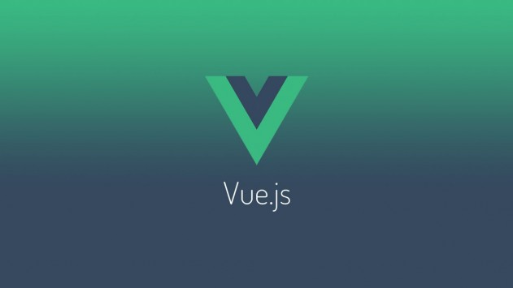

_Перевод статьи [Stéphane P. Péricat](https://medium.com/@sppericat.morningstar): [Vue UI: A First Look](https://morningstar.engineering/vue-ui-a-first-look-916600d9a918). С разрешения автора_

---

Благодаря [недавнему выпуску](https://github.com/vuejs/vue-cli/blob/dev/CHANGELOG.md) стабильного релиза утилиты [Vue CLI](https://cli.vuejs.org/) сейчас самое время взглянуть на некоторые из её новых возможностей. В результате полной переработки утилиты на основе отзывов, полученных от растущего сообщества [Vue.js](https://ru.vuejs.org/index.html), эта версия предоставляет новый набор инструментов, ориентированных на улучшение процесса разработки.

Одной из особенностей, которая без сомнения позволит улучшить рабочий процесс для каждого разработчика — это Vue UI, графический пользовательский интерфейс, позволяющий _создавать_, _обновлять_ и _управлять_ всеми аспектами рабочих проектов.

> Примечание переводчика: не стоит путать Vue UI c фреймворком [Vue UI Framework](https://www.telerik.com/kendo-vue-ui), который является разработкой компании [Telerik](https://www.telerik.com/) и предоставляет собой готовый набор UI-элементов под Vue.js наподобие другого популярного фреймворка — [Vuetify.js](https://vuetifyjs.com/ru/). Также стоит заметить, что Vue UI не является каким-либо отдельным продуктом. На самом деле это просто часть консольной утилиты `vue-cli` версии 3.

В данной статье я познакомлю читателей с некоторыми из основных возможностей, которые может предложить бета-версия Vue UI.

---

## Подготовка

Прежде всего, давайте проверим, установлена ​​ли на локальной машине _последняя_ версия утилиты `vue-cli`.

Вы можете проверить версию `vue-cli`, указав флаг `-V` в команде, примерный вывод которой показан ниже:

```bash
vue -V
# Примерный вывод команды
3.0.0-rc.3
```

> Примечание переводчика: версию консольной утилиты `vue-cli` можно определить двумя способами: `vue --version` или `vue -V`. С полным списком доступных команд утилиты `vue-cli` можно познакомиться, набрав в терминале: `vue --help` или `vue -h`.

Если на локальной машине не установлена утилита `vue-cli`, её можно установить одной из следующих команд (_в зависимости от того, какой менеджер пакетов вы предпочитаете_):

```bash
npm install -g @vue/cli
# или
yarn global add @vue/cli
```

> Примечание переводчика: если версия утилиты `vue-cli` является устаревшей (например — `3.0.0-beta.15`), её можно обновить до последней версии точно такими же командами, фактически переустановив эту утилиту в системе.

Важное замечание переводчика:

> Если обновить утилиту `vue-cli` до версии `3.0.0-rc.4`, то Vue UI перестанет запускаться и в консоли будет выдавать ошибку — `Error: Cannot find module 'read-pkg`. Проблема подробно описана в этом ишью — [Vue ui no longer runs after rc.4 update. Windows 10x64, Node 8.11.3](https://github.com/vuejs/vue-cli/issues/1846). Как видно из обсуждения данной проблемы, она одинакова для всех трех операционных систем - Linux, Windows, macOS. Решением проблемы является установка пакета `read-pkg` командой `npm install -g read-pkg`.

Чтобы инициализировать графический интерфейс Vue UI в текущем каталоге, введите следующую команду:

```bash
vue ui
```

Данная команда автоматически запустит браузер по умолчанию. Если предположить, что в текущем каталоге пока нет Vue-проектов, то в окне браузера отобразится вид, подобный показанному ниже — «Нет проектов» («No existing projects»):

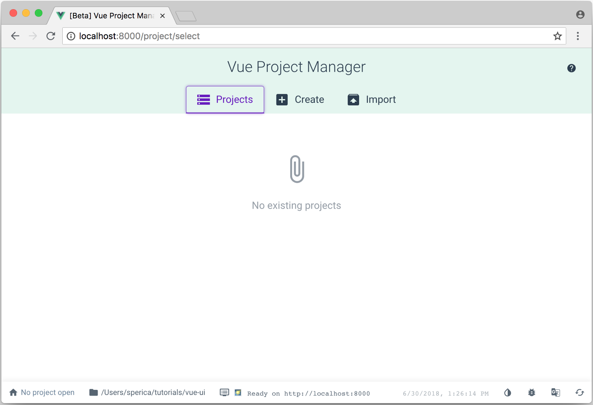

При запуске графический интерфейс Vue UI откроет окно «Диспетчер проектов» («Project Manager») для быстрого доступа к существующим проектам, как только вы их создадите.

## Создание первого проекта

Как показано на изображении выше, на основной панели навигации Vue UI располагаются три кнопки: «Проекты» («Projects»), «Создать» («Create») и «Импорт» («Import»). Чтобы создать новый Vue-проект, нажмите кнопку «Создать» («Create»):

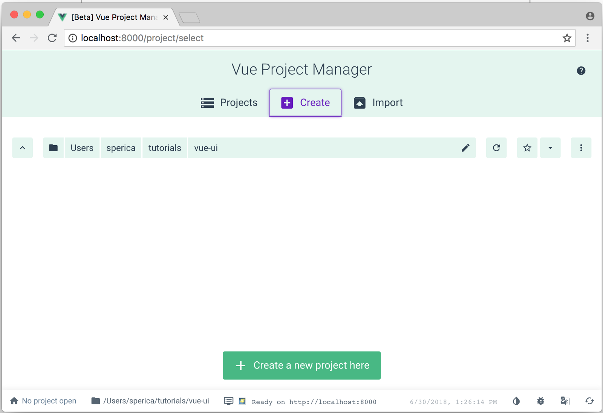

Инструмент создания проекта позволяет выбрать, в какой директории вы бы хотели создать свой новый проект:

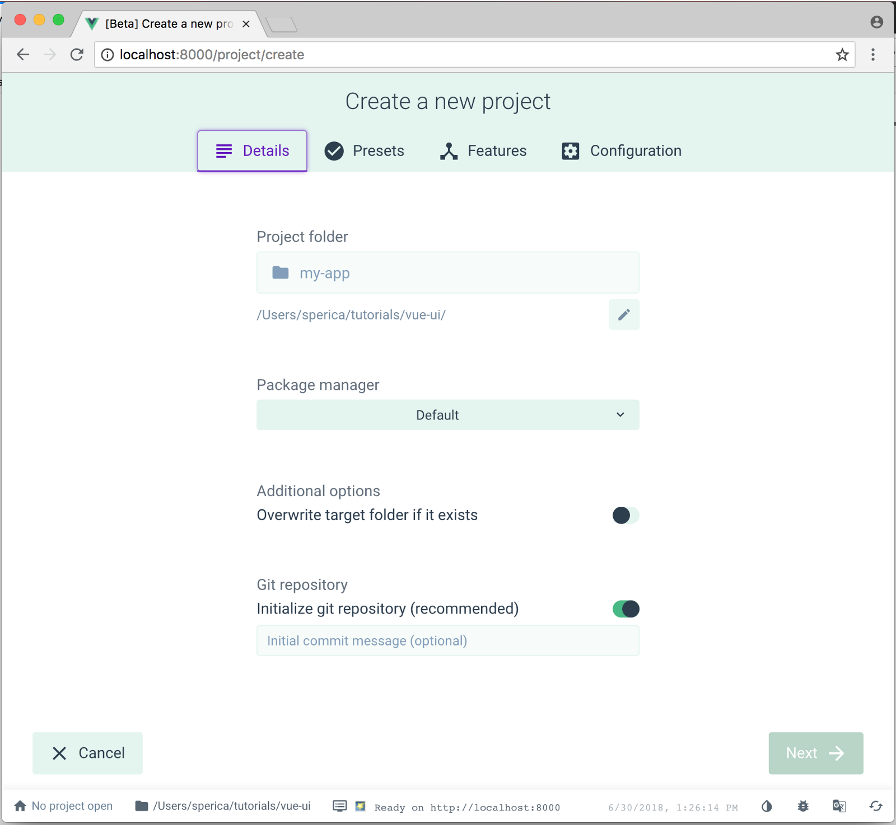

После выбора папки нажмите кнопку «Создать новый проект» («Create a new project here»), чтобы запустить пошаговое руководство:


На вкладке «Детали» («Details») введите _имя директории_, в которой будет размещен новый проект и предпочитаемый _менеджер пакетов_ ([npm](https://www.npmjs.com/) или [yarn](https://yarnpkg.com/en/)), а затем продолжите, нажав кнопку «Далее» («Next»):

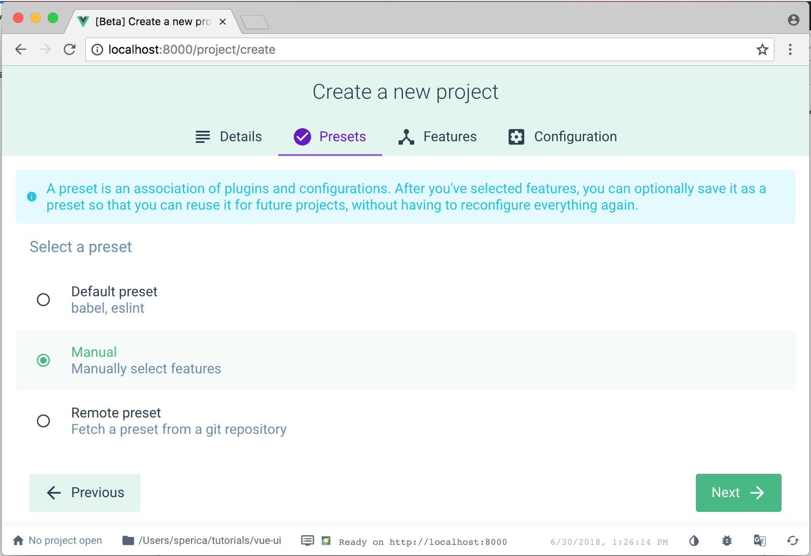

На шаге «Наборы настроек» («Presets») необходимо выбрать готовые настройки (`preset`) для будущего проекта. В большинстве случаев для начала работы будет более чем достаточно настроек по умолчанию («Default preset»).

Но в данном уроке мы усложним задачу и вручную создадим свой собственный набор настроек для нашего проекта.

Для этого выберите пункт «Ручной» («Manual») и нажмите кнопку «Далее» («Next»):

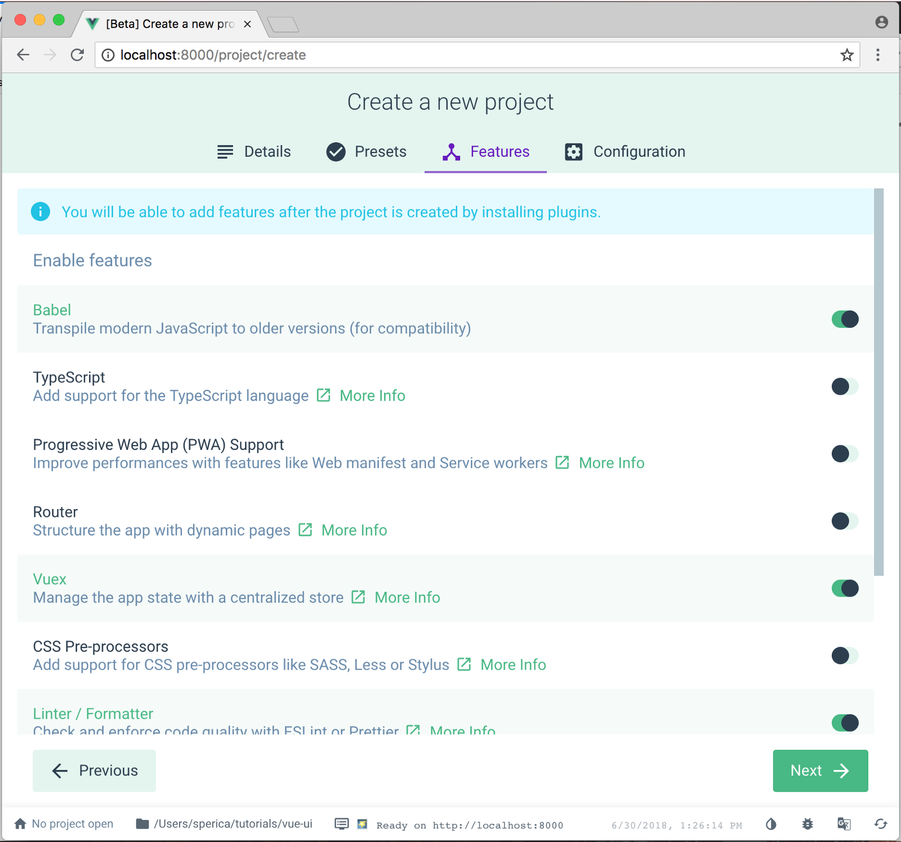

На вкладке «Дополнения» («Features») можно настроить различные параметры будущего проекта — от использования [Babel](https://babeljs.io/) и [TypeScript](https://www.typescriptlang.org/) до включения дополнительных компонентов Vue, таких как [Vuex](https://vuex.vuejs.org/ru/) или [Vue Router](https://router.vuejs.org/ru/).

Наконец, в зависимости от созданного набора параметров на предыдущем шаге будет отображен финальный экран «Конфигурация» («Configuration») для выбора дополнительных библиотек, которые можно добавить в будущий проект:

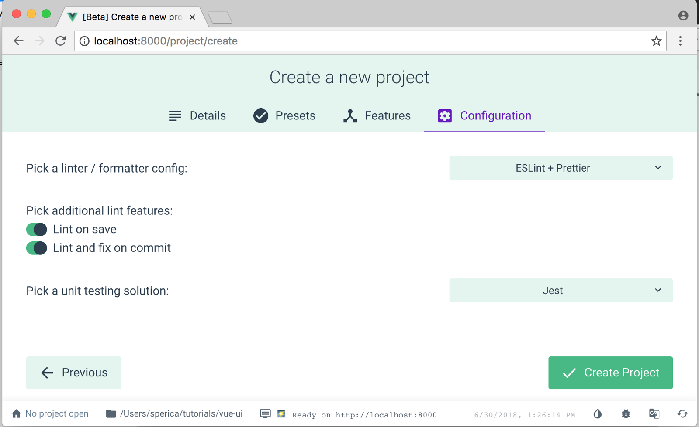

В моём случае я решил использовать проверку синтаксиса исходного кода и включить поддержку модульных тестов. Для этого я добавил такой популярный [линтер](https://ru.wikipedia.org/wiki/Lint) как [Prettier](https://prettier.io/) и не менее популярную библиотеку для тестирования [Jest](https://jestjs.io/ru/).

Наконец, нажмите кнопку «Создать проект» («Create Project»), чтобы сохранить свои настройки в качестве пресета (`preset`), которые вы сможете повторно использовать позже. И запустите созданный проект:

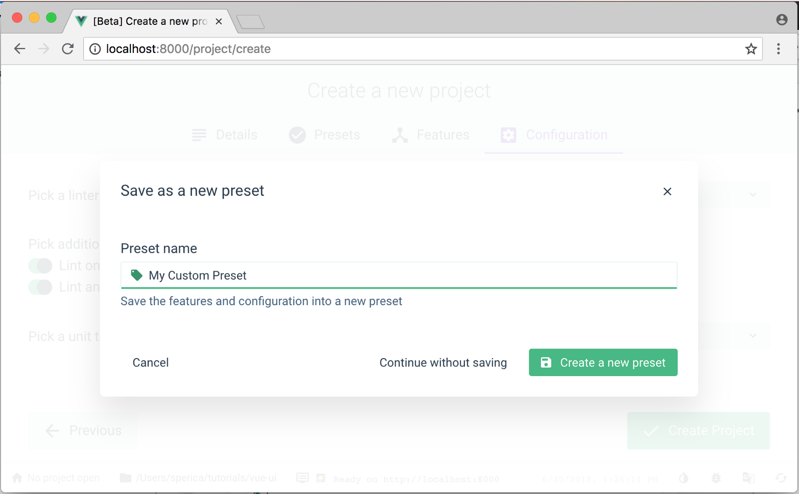

После создания проекта Vue UI сделает перенаправление в окно «Плагины проекта» («Project plugins»), в котором отобразится список установленных в проекте плагинов на основе вашего предыдущего выбора:

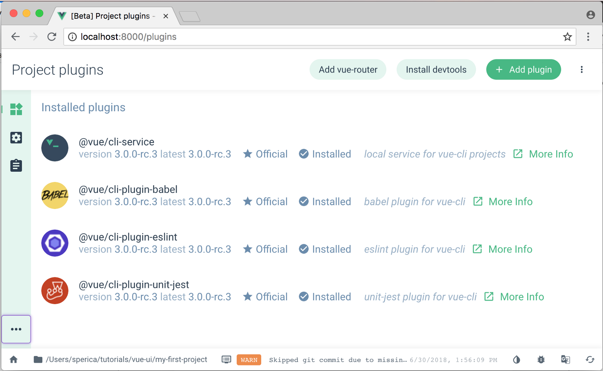

В этом окне вы можете _обновить_ установленные плагины, _добавить_ новые плагины, _включить_ инструмент отладки [Vue Devtools](https://github.com/vuejs/vue-devtools 'Vue Devtools') и многое другое.

## Добавление плагинов

Если необходимо установить дополнительные Vue-плагины _после_ создания проекта, то это легко сделать в данном окне. Для этого нажмите кнопку «Добавить плагин» («Add Plugin»), чтобы начать поиск («Search») того плагина, который вам необходим:

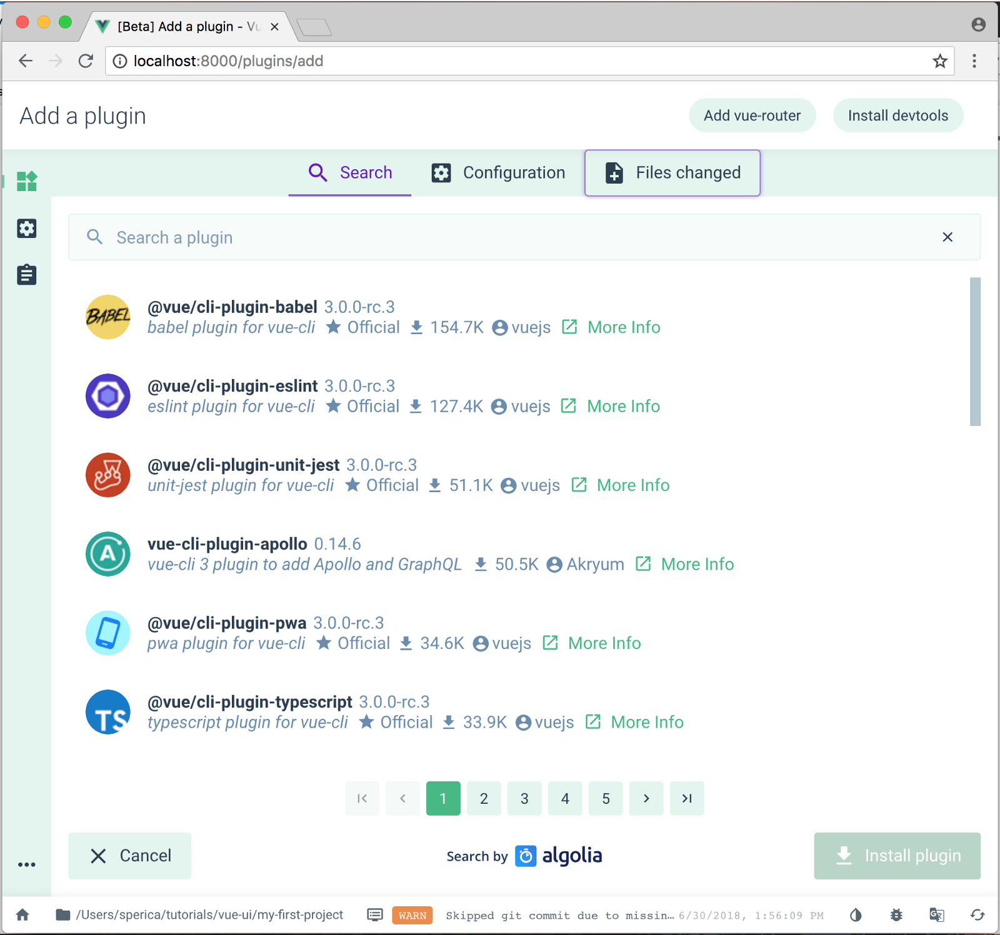

Обратите внимание, что некоторые плагины обозначены как «Официальный» («Official»). Это означает, что данные плагины или непосредственно разрабатываются [основной командой Vue.js](https://ru.vuejs.org/v2/guide/team.html) или официально одобрены этой командой.

Выберите интересующий вас плагин и нажмите кнопку «Установить» («Install»):

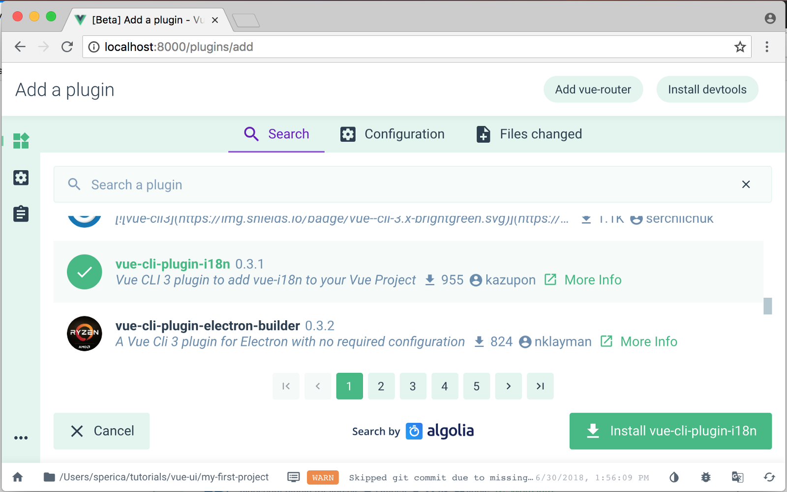

Обратите внимание, что в текущей версии Vue UI возможно установить _только один плагин за один шаг_.

В зависимости от выбранного плагина вам может потребоваться сделать различные _дополнительные настройки_, связанные с этим плагином.

После завершении установки выбранных плагинов будет показано окно «Изменения файлов» («Files changed»), в котором можно выполнить сохранение внесенных в проект изменений при помощи системы контроля версий [Git](https://git-scm.com/):

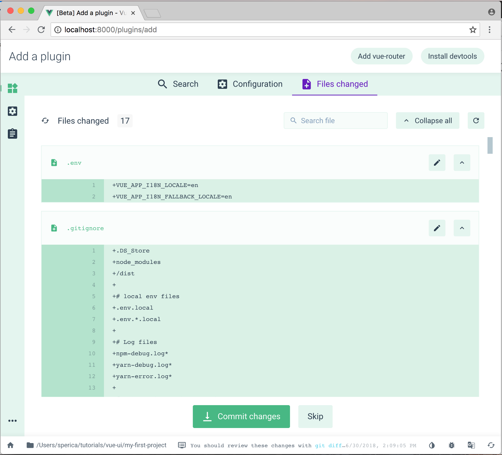

В обновленном окне «Плагины проекта» («Project plugins») в списке замечаем добавленный плагин `vue-i18n` наряду с плагинами, установленными во время первоначального создания проекта:

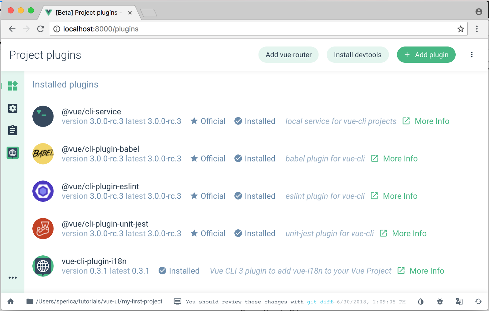

## Настройка проекта

Графический интерфейс Vue UI позволяет изменять конфигурацию проекта _после_ его создания. Для этого выберите значок конфигурации (_шестеренка_) в левом боковом меню. В результате отобразится ​​*текущая конфигурация* нашего Vue-проекта:

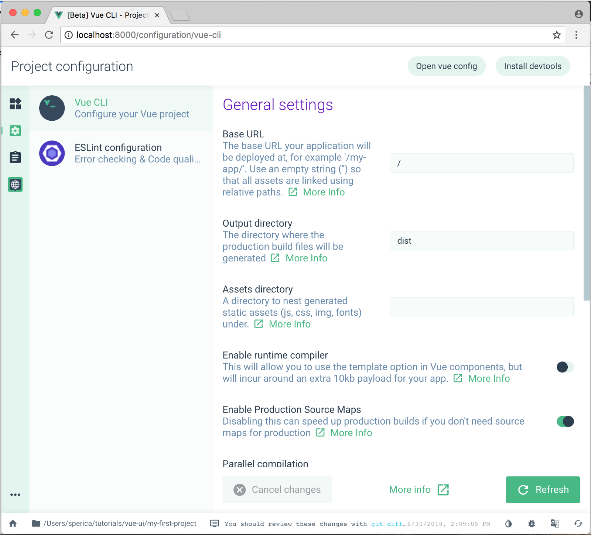

В этом окне можно легко отредактировать все доступные настройки проекта. Я рекомендую вам [ознакомиться с документацией](https://cli.vuejs.org/config/), чтобы узнать больше о возможных вариантах конфигурации проекта.

Обратите внимание, что поскольку мы решили использовать [ESLint](https://eslint.org/) для конкретного проекта, нам доступен _дополнительный элемент меню_ «Конфигурация ESLint» («ESLint configuration») для настройки правил плагина ESLint.

## Запуск скриптов проекта

Еще одна очень полезная функция Vue UI — возможность запускать и диагностировать задачи (`tasks`) проектов (`npm`-скрипты) непосредственно из пользовательского интерфейса Vue UI.

Например, мы можем запустить процесс сборки проекта в режиме разработки (`development`):

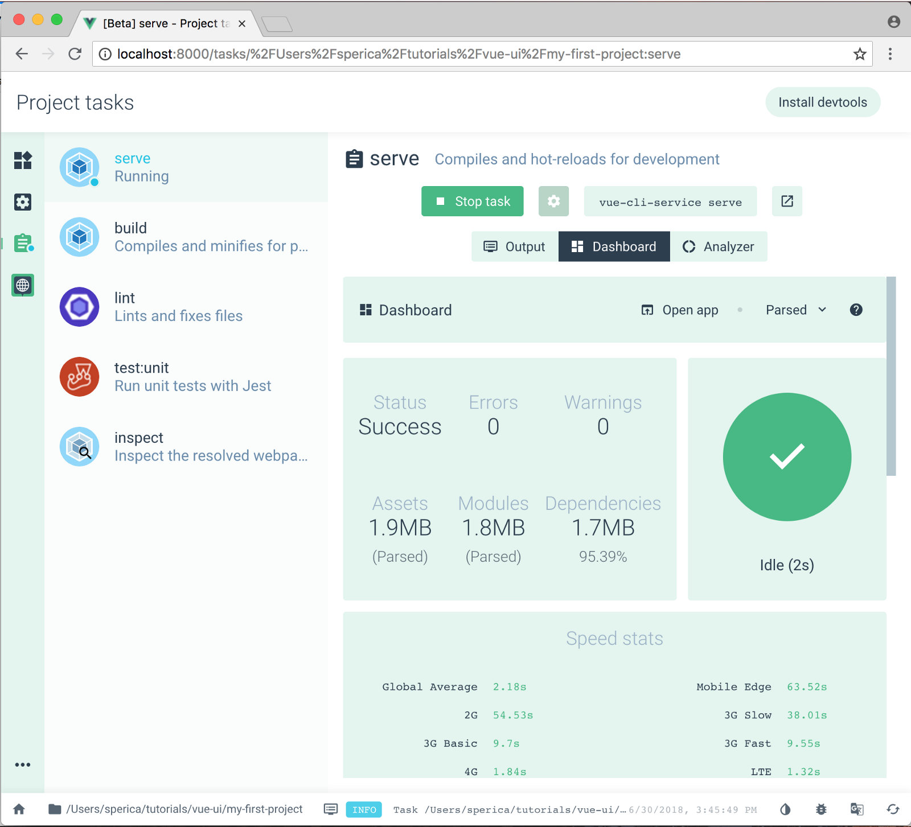

Интерфейс предоставляет нам дополнительные сведения о нашем приложении, такие как _размер сборки_, _индикаторы времени загрузки_ и подробное описание созданных наборов файлов.

Если вы хотите получить более подробную информацию о различных модулях вашего приложения и о том, как они влияют на общий размер сборки, вы можете перейти на вкладку «Анализатор» («Analyzer»):

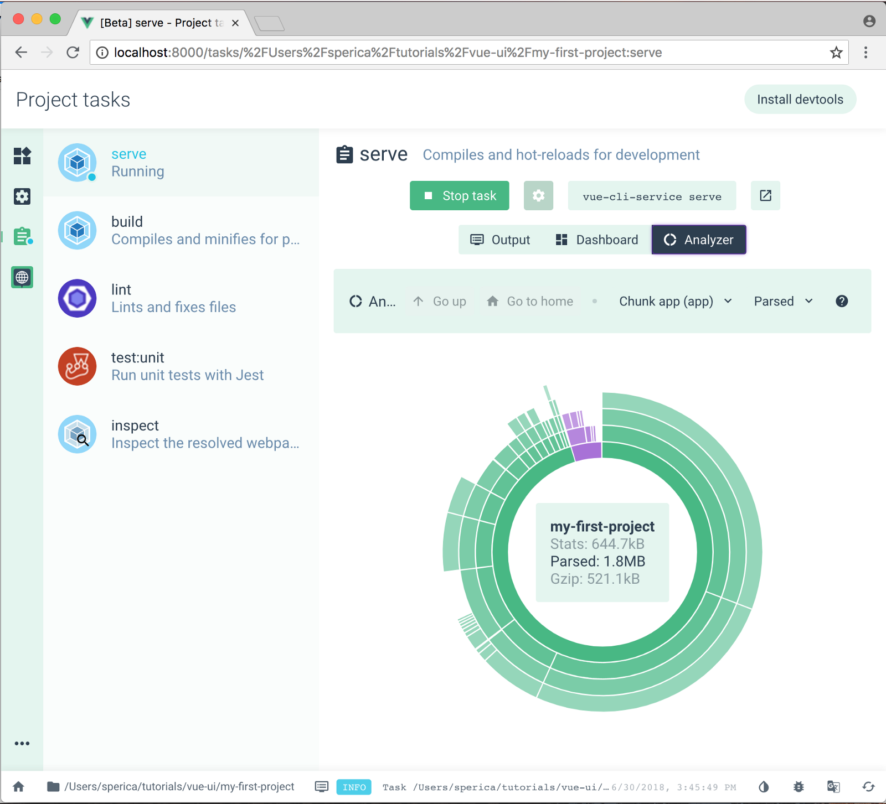

## Локализация приложения

Ранее в этом уроке мы установили плагин [vue-i18n](https://github.com/kazupon/vue-i18n) через интерфейс управления Vue UI.

Когда мы это сделали, то в боковом меню Vue UI автоматически был добавлен дополнительный элемент (_значок глобуса_), представляющий собой плагин `vue-i18n`.

Если выбрать этот значок, то откроется окно «Локализации проекта» («Project localizations») с графическим интерфейсом для настройки данного плагина. Здесь можно задать статический текстовый контент и соответствующую ему локализацию (_перевод этого контента_) на любых выбранных вами языках:

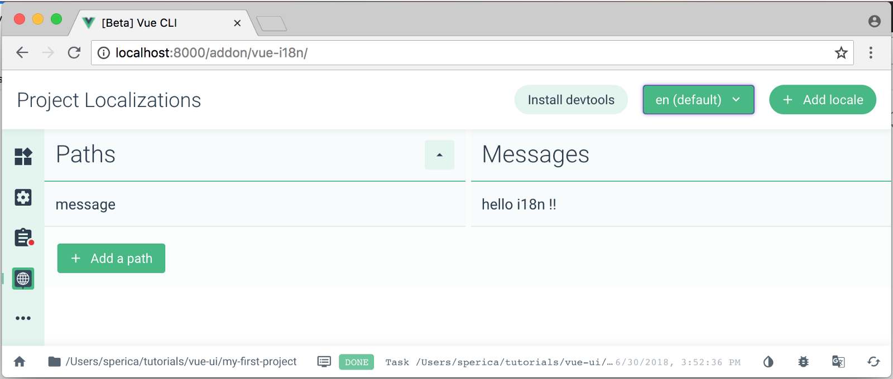

В данном случае мы видим, что «Английский» («English») уже определен как язык по умолчанию. Также присутствует тестовое сообщение «Привет i18n!» («hello i18n!»).

Чтобы приступить к локализации статического текстового контента приложения, сначала необходимо _добавить дополнительные языки_. Для этого нажмите кнопку «Добавить язык» («Add locale»):

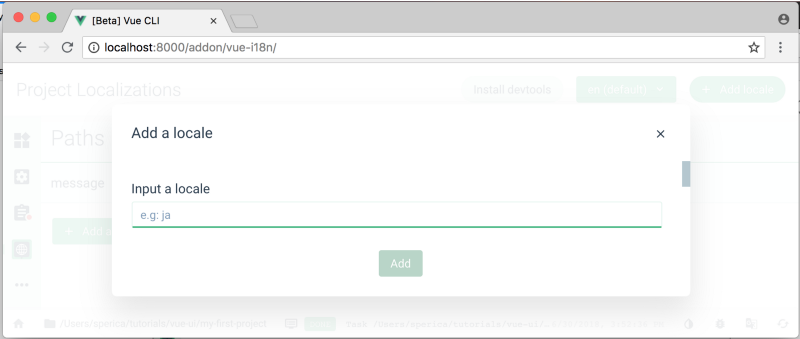

В данном примере я добавил поддержку французского языка «fr». Теперь я могу приступить к переводу оригинального английского текста на его французский эквивалент:

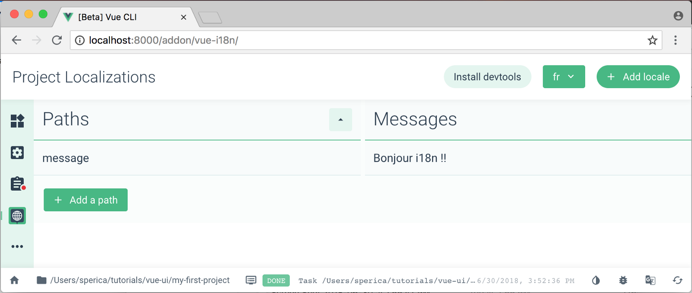

Если посмотреть на исходный код приложения в редакторе [Visual Studio Code](https://code.visualstudio.com/), то увидим, что интерфейс локализации автоматически сгенерировал соответствующий исходный код:

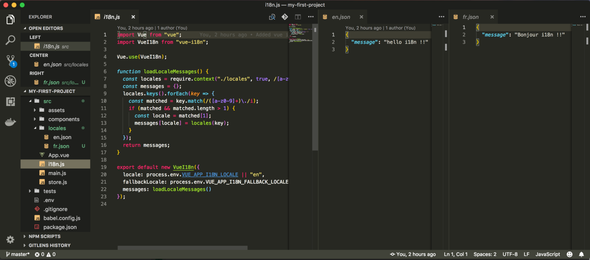

## Заключение

Как вы могли заметить, что хотя Vue UI находится все еще в бета-версии, это очень полезный и перспективный инструмент. Несомненно со временем он станет еще более полезным, как только разработчики начнут создавать свои собственные плагины для удовлетворения необходимых потребностей.

В следующей статье мы узнаем, как создавать собственные плагины, чтобы улучшить и оптимизировать процесс разработки приложений.

---

_Слушайте наш подкаст в [iTunes](https://itunes.apple.com/ru/podcast/девшахта/id1226773343) и [SoundCloud](https://soundcloud.com/devschacht), читайте нас на [Medium](https://medium.com/devschacht), контрибьютьте на [GitHub](https://github.com/devSchacht), общайтесь в [группе Telegram](https://t.me/devSchacht), следите в [Twitter](https://twitter.com/DevSchacht) и [канале Telegram](https://t.me/devSchachtChannel), рекомендуйте в [VK](https://vk.com/devschacht) и [Facebook](https://www.facebook.com/devSchacht)._
