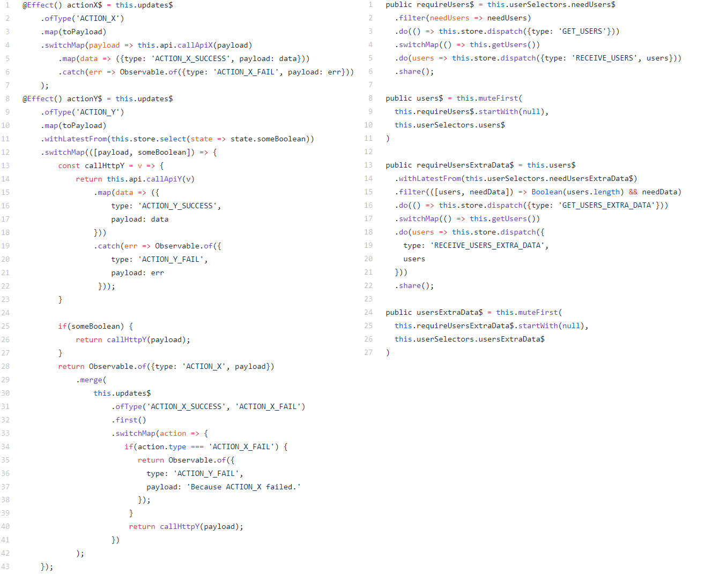

# Прекратите использовать ngrx/effects для этого

[Оригинал статьи](https://medium.com/@m3po22/stop-using-ngrx-effects-for-that-a6ccfe186399) [Документация ngrx](https://medium.com/r/?url=https%3A%2F%2Fngrx.io%2Fdocs) [Справочник RxJS](https://medium.com/r/?url=https%3A%2F%2Fstackblitz.com%2Fedit%2Frxjs-aj4vwd)

Иногда простейшая реализация функционала в конечном итоге создает больше сложности, чем экономит, только перекладывая сложность в другое место. Конечным результатом является глючная архитектура, которую никто не хочет трогать.

Ngrx/store - это библиотека Angular, которая помогает упаковывать сложность отдельных функций. Это происходит в том числе из-за использования в ngrx/store концепций функционального программирования, которые изолируют манипуляции с данными внутри функции. В хранилище (ngrx/store) редукторы(reducer), селекторы(select) и операторы RxJS являются чистыми функциями.

Чистые функции легче тестировать, отлаживать, анализировать, распараллеливать и комбинировать. Чистая функция при одинаковых входных данных всегда возвращает одни и те же результаты. Такой подход значительно сокращает ошибки и побочные эффекты.
Побочных эффектов невозможно избежать, но они изолированы в ngrx/store, так что остальная часть приложения может состоять из чистых функций.

## Побочные эффекты(side effects)

Когда пользователь отправляет форму, нам нужно внести изменения на сервере. Изменение на сервере и ответ клиенту порождает побочные эффекты. Это может быть обработано внутри компонента следующим образом:


Было бы здорово просто отправлять действие (dispatch action) внутри компонента, когда пользователь отправляет форму, и обрабатывать побочный эффект в другом месте.
Библиотека эффектов(Ngrx/Effects) - это промежуточный слой(middleware) для обработки побочных эффектов в хранилище (ngrx/store). Она прослушивает отправленные действия в наблюдаемом (Observable) потоке, выполняет побочные эффекты, и возвращает в поток новые действия последовательным или асинхронным образом. Возвращенные действия также передаются в редуктор.
Возможность обрабатывать побочные эффекты RxJS-дружественным способом делает код чище. После отправки из компонента первого действия с типом SAVE_DATA вы создаете класс эффектов для обработки остальных действий:

```
// добавляем $ для обозначения наблюдаемого потока RxJS
@Effect()
saveData$ = this.actions$
  // отфильтровываем действия сохранения данных
 .ofType('SAVE_DATA')
  // берём только свойство payload
 .pluck('payload')
  // для каждого входного значения payload делаем сохранение данных на сервер, возвращаем в поток ответ сервера
 .switchMap(data => this.saveData(data))
  // возвращаем в поток объект с типом действия
 .map(res => ({type: "DATA_SAVED", payload: res}))
```

Это упрощает работу компонента до отправки действий(dispatch actions) и подписки(subscribe) на наблюдаемые потоки(observables).

## Библиотекой Ngrx/Effects легко злоупотребить

Ngrx/Effects - очень мощное решение, поэтому его легко использовать. Вот некоторые распространенные ошибочные способы использования библиотеки эффектов для хранилища состояний:

### 1. Дублирующее/производное состояние

Допустим, вы работаете над каким-то проигрывателем, и у вас есть следующие свойства в дереве состояний:

```
export interface State {
 // проигрыватель запущен
 mediaPlaying: boolean;
 // проигрывается звук
 audioPlaying: boolean;
 // проигрывается видео
 videoPlaying: boolean;
}
```

Поскольку аудио является типом мультимедиа, то вне зависимости от значения audioPlaying, значение mediaPlaying может иметь значение true. Как же
убедиться, что mediaPlaying обновляется при обновлении audioPlaying?

Неверный ответ: используйте эффект!

```
// добавляем $ для обозначения наблюдаемого потока RxJS
@Effect()
playMediaWithAudio$ = this.actions$
  // отфильтровываем действия проигрывания звука
 .ofType("PLAY_AUDIO")
  // возвращаем в поток действие с типом запуска проигрывателя
 .map(() => ({type: "PLAY_MEDIA", payload: payload}))
```

Правильный ответ: если состояние mediaPlaying порождается другим состоянием, то это не истинное, а производное состояние. Оно должно быть в селекторе(select), а не в хранилище.

```
// создаём селектор для действия проигрывания звука
audioPlaying$ = this.store.select('audioPlaying');
// создаём селектор для действия проигрывания видео
videoPlaying$ = this.store.select('videoPlaying');
// создаём поток состояний проигрывателя(boolean) из двух потоков состояний селекторов
mediaPlaying$ = Observable.combineLatest(
 this.audioPlaying$,
 this.videoPlaying$,
 (audioPlaying, videoPlaying) => audioPlaying || videoPlaying
)
```

Теперь наше состояние может оставаться чистым и нормализованным, и мы не используем ngrx/Effects для чего-то, что не является побочным эффектом.

### 2. Связанные действия и редукторы

Допустим, у вас есть такие свойства в дереве состояний:

```
export interface State {
 // дерево(объект) записей
 items: {[index: number]: Item};
 // массив любимых записей
 favoriteItems: number[];
}
```

Когда пользователь удаляет элемент, то после завершения запроса на удаление, отправляется действие DELETE_ITEM_SUCCESS, чтобы обновить состояние нашего приложения. В редукторе запись удаляется из дерева. Но эта же запись в массиве FavoritesItems, будет ссылаться на удалённую запись в дереве. Как мы можем убедиться при отправке действия DELETE_ITEM_SUCCESS, что соответствующая запись удалена из FavoritesItems?

Неверный ответ: используйте эффект!

```
@Effect()
this.actions$
  // Отфильтровываем действие удаления записи из дерева
 .ofType("DELETE_ITEM_SUCCESS")
  // возвращаем в поток действие удаления записи из массива
 .map(() => ({type: "REMOVE_FAVORITE_ITEM_ID"}))
```

Теперь у нас будет два последовательных действия, и два редуктора, последовательно возвращающие новые состояния.

Правильный ответ: действие DELETE_ITEM_SUCCESS может обрабатываться и редуктором дерева записей, и редуктором массива записей FavoritesItems.

```
export function favoriteItemsReducer(state = initialState, action: Action) {
  // выбираем реакцию по типу действия
  switch(action.type) {
    case 'REMOVE_FAVORITE_ITEM':
      // при удалении любимых записей нет дополнительных действий
      return state;
    case 'DELETE_ITEM_SUCCESS':
      // берём из потока состояние массива любимых записей
      const itemId = action.payload;
      // возвращаем состояние(объект) массива любимых записей без удалённой из дерева
      return state.filter(id => id !== itemId);
    default: return state;
  }
}
```

Назначение действий - отделить то, что произошло, от того, как должно измениться состояние. После отправки действия DELETE_ITEM_SUCCESS вызвать соответствующее изменение состояния должен редуктор.

Удаление записи из массива FavoritesItems не является побочным эффектом удаления элемента. Весь процесс полностью синхронный, и может быть обработан редукторами самостоятельно. Библиотека эффектов не нужна.

### 3. Выборка данных для компонента

Вашему компоненту нужны данные из хранилища, но данные должны быть сначала получены с сервера. Вопрос в том, как мы можем получить данные в хранилище, чтобы компонент мог их выбрать?

Болезненный ответ: используйте эффект!

В компоненте мы инициируем запрос, отправив действие:

```
// функция вызывается при создании компонента
ngOnInit() {
  // отправляем действие получения списка пользователей
  this.store.dispatch({type: "GET_USERS"});
}
```

В классе эффектов мы слушаем действие GET_USERS:

```
@Effect()
getUsers$ = this.actions$
  // отфильтровываем действие получения списка пользователей
 .ofType('GET_USERS')
  // возвращает в поток текущее действие селектора необходимости обновить пользователей
 .withLatestFrom(this.userSelectors.needUsers$)
  // возвращаем в поток действие, где есть необходимость обновить список пользователей
 .filter(([action, needUsers]) => needUsers)
  // открывает новый поток с запросом на сервер
 .switchMap(() => this.getUsers())
  // возвращаем в поток действие с данными пользователей
 .map(users => ({type: 'RECEIVE_USERS', users}))
```

Теперь предположим, что пользователь решает, что загрузка страницы занимает слишком много времени, поэтому он уходит. Чтобы не загружать ненужные данные, мы хотим отменить этот запрос. Когда компонент будет уничтожен, мы отменим подписку на запрос, отправив действие:

```
// функция вызывается перед уничтожением компонента
ngOnDestroy() {
 // отправляем действие отмены запроса на сервер
 this.store.dispatch({type: "CANCEL_GET_USERS"})
}
```

В классе эффектов мы слушаем оба действия:

```
@Effect()
getUsers$ = this.actions$
  // отфильтровываем два типа действий
 .ofType('GET_USERS', 'CANCEL_GET_USERS')
  // возвращаем в поток текущее действие селектора необходимости обновить пользователей
 .withLatestFrom(this.userSelectors.needUsers$)
  // возвращаем в поток действие, когда есть необходимость обновить список пользователей
 .filter(([action, needUsers]) => needUsers)
  // возвращаем в поток действие без флага needUsers
 .map(([action, needUsers]) => action)
  // открывает новый поток с запросом на сервер
 .switchMap(action => action.type === 'CANCEL_GET_USERS' ?
    // отправляем пустой поток для отмены запроса
    Observable.of() :
    // отправляем наблюдаемый поток с запросом на сервер
    this.getUsers()
      .map(users => ({type: 'RECEIVE_USERS', users}))
 )
```

Теперь другой разработчик добавляет компонент, которому требуется тот же HTTP-запрос (опускаем предположения о других компонентах). Компонент отправляет те же действия в тех же местах. Если оба компонента станут активны одновременно, то первый компонент для инициализации отправит HTTP-запрос. Когда второй компонент инициализируется (ngOnInit), он не будет отправлять запрос, потому что needUsers будет false. Отлично!

Когда первый компонент будет уничтожен, он отправит CANCEL_GET_USERS. Но второй компонент все еще нуждается в этих данных. Как мы можем предотвратить отмену запроса? Может быть, есть счетчик подписчиков (subscribe)? Я не буду беспокоиться об этом, но вы уловили суть. Мы начинаем надеяться, что есть лучший способ управления этими зависимостями данных.

Теперь предположим, что в есть ещё один компонент, и он зависит от данных, которые невозможно получить до тех пор, пока пользовательские данные не появятся в хранилище. Это может быть соединение через веб-сокет для чата, дополнительная информация о некоторых пользователях или что-то еще. Мы не знаем, будет ли этот компонент инициализирован до или после того, как другие два компонента подпишутся на получение данных пользователей.

Лучшее решение, которое я нашел для этого конкретного сценария, - это следующий пример в [отличной статье](https://bertrandg.github.io/ngrx-effects-complex-stream-with-nested-actions/). Там callApiY требует, чтобы callApiX уже был завершен. Тут убраны комментарии, чтобы код выглядел менее пугающим, но лучше прочитать оригинальный пост, чтобы познакомиться с деталями:

```
@Effect() actionX$ = this.updates$
    .ofType('ACTION_X')
    .map(toPayload)
    .switchMap(payload => this.api.callApiX(payload)
        .map(data => ({type: 'ACTION_X_SUCCESS', payload: data}))
        .catch(err => Observable.of({type: 'ACTION_X_FAIL', payload: err}))
    );
@Effect() actionY$ = this.updates$
    .ofType('ACTION_Y')
    .map(toPayload)
    .withLatestFrom(this.store.select(state => state.someBoolean))
    .switchMap(([payload, someBoolean]) => {
        const callHttpY = v => {
            return this.api.callApiY(v)
                .map(data => ({
                    type: 'ACTION_Y_SUCCESS',
                    payload: data
                }))
                .catch(err => Observable.of({
                    type: 'ACTION_Y_FAIL',
                    payload: err
                 }));
        }

        if(someBoolean) {
            return callHttpY(payload);
        }
        return Observable.of({type: 'ACTION_X', payload})
            .merge(
                this.updates$
                    .ofType('ACTION_X_SUCCESS', 'ACTION_X_FAIL')
                    .first()
                    .switchMap(action => {
                       if(action.type === 'ACTION_X_FAIL') {
                          return Observable.of({
                            type: 'ACTION_Y_FAIL',
                            payload: 'Because ACTION_X failed.'
                          });
                        }
                        return callHttpY(payload);
                    })
            );
    });
```

Теперь усложним задачу: сделаем так, что HTTP-запросы должны быть отменены, когда компоненты больше не активны.


---

Почему же так много проблем с управлением зависимостями данных, когда RxJS должен сделать это действительно лёгким?
Хотя данные, поступающие с сервера, технически являются побочным эффектом, я не верю, что библиотека эффектов - лучший способ управлять зависимостями.
Компоненты - это интерфейсы ввода/вывода для пользователя. Они показывают данные и отправляют действия пользователей. Когда компонент загружается, он не отправляет действие пользователя. Он хочет показать данные. Это похоже на подписку, а не на побочный эффект действия.
Очень часто можно увидеть приложения, использующие действия для запуска запроса на получение данных. Эти приложения реализуют пользовательский интерфейс для наблюдаемых потоков(observables) через побочные эффекты. И, как мы видели, этот интерфейс может стать очень неудобным и громоздким. Подписываться, отписываться, и связывать в цепочки сами наблюдаемые объекты гораздо проще.


---

Менее болезненный ответ: компонент регистрирует свою заинтересованность в данных, подписываясь на наблюдаемые потоки.

Мы создадим наблюдаемые HTTP-запросы, и увидим насколько проще управлять несколькими подписками и цепочкой запросов разных компонентов используя чистый RxJS, чем библиотеку эффектов.

Создадим наблюдаемые потоки в сервисе:

```
public requireUsers$ = this.userSelectors.needUsers$
 .filter(needUsers => needUsers)
 .do(() => this.store.dispatch({type: 'GET_USERS'}))
 .switchMap(() => this.getUsers())
 .do(users => this.store.dispatch({type: 'RECEIVE_USERS', users}))
 .finally(() => this.store.dispatch({type: 'CANCEL_GET_USERS'}))
 .share();
public users$ = this.muteFirst(
 this.requireUsers$.startWith(null),
 this.userSelectors.users$
)
```

Подписки на users$ будут передаваться как для requireUsers$, так и для userSelectors.users$, но будут получать значения только от userSelectors.users$ (пример реализации muteFirst)

В компоненте:

```
ngOnInit() {
 this.users$ = this.userService.users$;
}
```

Поскольку эта зависимость данных теперь просто наблюдаемый поток, мы можем подписаться и отписаться в шаблоне, используя асинхронные операторы в pipe(), и нам больше не нужно отправлять действия. Если приложение переходит на url/route другого компонента, подписанного на данные, HTTP-запрос отменяется, а веб-сокет закрывается.

Цепочки зависимостей данных можно обрабатывать так:

```
public requireUsers$ = this.userSelectors.needUsers$
  .filter(needUsers => needUsers)
  .do(() => this.store.dispatch({type: 'GET_USERS'}))
  .switchMap(() => this.getUsers())
  .do(users => this.store.dispatch({type: 'RECEIVE_USERS', users}))
  .share();
public users$ = this.muteFirst(
  this.requireUsers$.startWith(null),
  this.userSelectors.users$
)
public requireUsersExtraData$ = this.users$
  .withLatestFrom(this.userSelectors.needUsersExtraData$)
  .filter(([users, needData]) => Boolean(users.length) && needData)
  .do(() => this.store.dispatch({type: 'GET_USERS_EXTRA_DATA'}))
  .switchMap(() => this.getUsers())
  .do(users => this.store.dispatch({ type: 'RECEIVE_USERS_EXTRA_DATA', users }))
  .share();
public usersExtraData$ = this.muteFirst(
  this.requireUsersExtraData$.startWith(null),
  this.userSelectors.usersExtraData$
)
```

Сравнение двух рассмотренных подходов:


Цепочка зависимостей данных в библиотеке эффектов эффектах по сравнению с обычным RxJS

Использование простых наблюдаемых потоков требует меньше строк кода, и автоматически отписывается от зависимостей данных по всей цепочке. (Здесь пропущены строки, приводящие решения в окончательно рабочий вид, чтобы сделать сравнение более понятным, но даже без них запросы по-прежнему отменяются соответствующим образом.)

Заключение

Ngrx/Effects - отличный инструмент! Однако необходимо ответить на следующие вопросы прежде чем принять решение о его использовании:
* Это действительно побочный эффект?
* Действительно ли ngrx/Effects - лучший способ справиться с этим?

Пожалуйста, поделитесь с нами своим мнением, особенно о любых ошибках. Моя следующая статья опирается на эту. Если я не допустил ошибок, она окажется ещё интереснее.

> Примечание переводчика: примеры кода дополнены комментариями, исправлены незначительные ошибки, текст незначительно сокращён для более литературно красивого перевода.
