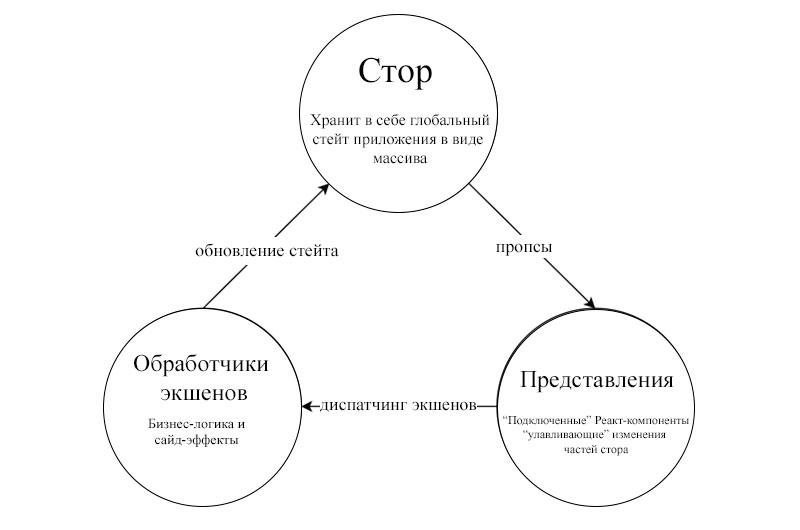
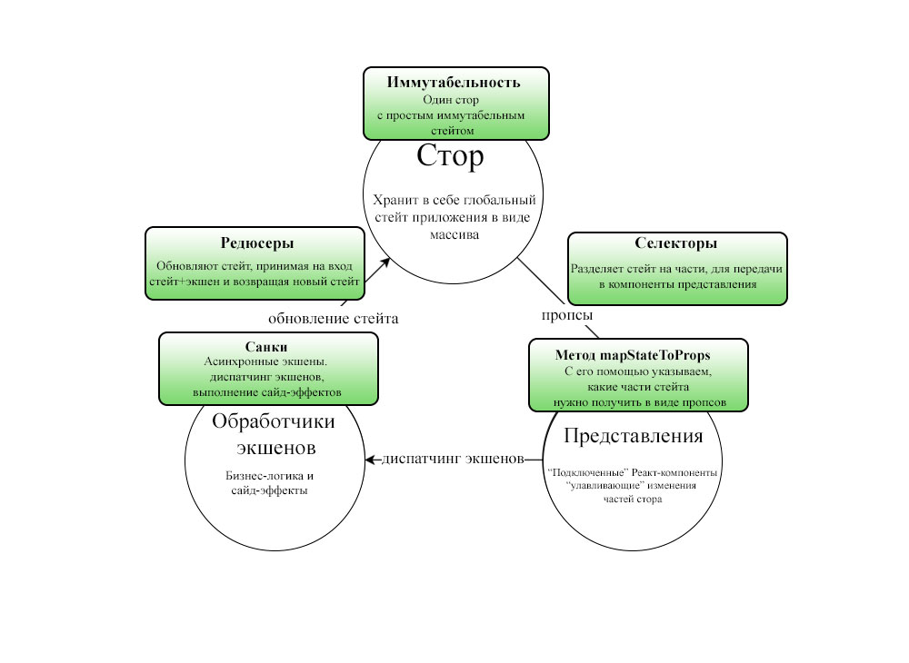

# Redux: шаг за шагом

*Перевод статьи [Tal Kol](https://hackernoon.com/@talkol): [Redux Step by Step: A Simple and Robust Workflow for Real Life Apps](https://hackernoon.com/redux-step-by-step-a-simple-and-robust-workflow-for-real-life-apps-1fdf7df46092).*


<p style="text-align: center;">никаких деревьев, только камни</p>

*Redux стал одной из самых популярных реализаций идей Flux для управления потоком данных в приложениях на React. Однако в процессе изучения Redux часто возникает ситуация, когда «из-за деревьев мы не видим леса». Далее будет представлен простой и продуманный подход к приложениям, использующих Redux. На примерах мы шаг за шагом реализуем рабочее приложение, попытаемся применить принципы Redux на практике и обосновать каждое решение.*

## Продуманная методология для идиоматического Redux

[Redux](https://github.com/reactjs/redux) - это не просто библиотека. Это целая экосистема. Одна из причин его популярности — это возможность применять различные паттерны проектирования и подходы к написанию кода. К примеру, если мне нужно совершить некоторые асинхронные действия, то мне стоит использовать [санки](https://github.com/gaearon/redux-thunk)? Или может быть [промисы](https://github.com/acdlite/redux-promise)? Или [саги](https://github.com/redux-saga/redux-saga)?

Какой подход верный? Единственного и чёткого ответа нет. И нет «лучшего» пути использования Redux. Стоит признать, что большой выбор подходов заводит в тупик. Я хочу продемонстрировать свой личный вариант использования библиотеки. Он понятный, применимый к самым разнообразным сценариям из жизни и, что самое главное, он прост в освоении.

## Итак, пора создать наше приложение!

Для продолжения нам нужен реальный пример. Давайте создадим приложение, показывающее самые популярные посты с Reddit.

На первом экране мы выясним у пользователя три наиболее интересные для него темы. После того, как пользователь сделает выбор, будем показывать список постов по выбранным темам (все посты либо посты по конкретной теме). По клику на пост в списке будем показывать его содержание.

## Установка

Поскольку мы используем React, то для начала работы возьмём [Create React App](https://github.com/facebookincubator/create-react-app) — официальный стартовый шаблон. Также установим [redux](https://www.npmjs.com/package/redux), [react-redux](https://www.npmjs.com/package/react-redux) и [redux-thunk](https://www.npmjs.com/package/redux-thunk). Результат должен быть похож на [этот](https://github.com/wix/react-dataflow-example/tree/998decf6277717ffcee61dea30005c1fe917ae2a).

Давайте изменим `index.js` и создадим в нем стор, подключим санки:

```javascript
import React from 'react';
import ReactDOM from 'react-dom';
import { createStore, applyMiddleware, combineReducers } from 'redux';
import { Provider } from 'react-redux';
import thunk from 'redux-thunk';
import App from './App';
import './index.css';

import * as reducers from './store/reducers';
const store = createStore(combineReducers(reducers), applyMiddleware(thunk));

ReactDOM.render(
  <Provider store={store}>
    <App />
  </Provider>,
  document.getElementById('root')
);
```

## Жизненный цикл Flux в Redux-приложении

Одна из главных вещей, которая часто упускается в различных Redux-учебниках: а где же место Redux в этом цикле? Redux является реализацией [Flux](https://facebook.github.io/flux/)-архитектуры — паттерна для организации передачи данных в React-приложениях.

В классическом Flux для хранения стейта приложения используется стор. Диспатчинг (*передача*) экшенов вызывает изменение этого стейта. После этого происходит перерендер представления в соответствии с изменённым стейтом:



Flux упрощает разработку, создавая однонаправленный поток данных. Это уменьшает [спагетти-эффект](http://whatis.techtarget.com/definition/spaghetti-code) по мере роста кодовой базы приложения.

Одна из сложностей в понимании работы Redux — это множество неочевидных терминов типа *редюсеров*, *селекторов* и *санков*. Для более чёткого понимания взглянем на расширенный Flux-цикл. Это просто различные Redux-инструменты:



Как вы могли заметить другие Redux-инструменты типа *middleware* или *саг* не показаны. Это сделано намеренно, эти инструменты не играют существенной роли в нашем приложении.

## Файловая структура проекта

Создадим корневую папку `/src` и в ней следующие подкаталоги:

* `/src/components` - «глупые» React-компоненты, несвязанные с Redux
* `/src/containers` - «умные» React-компоненты, подключаемые к Redux-стору
* `/src/services` - некоторые абстракции для внешнего API (например, для бэкенда)
* `/src/store` - весь специфичный для Redux код находится здесь, включая всю бизнес-логику нашего приложения

Папка `store` в свою очередь состоит из доменов, которые содержат:

* `/src/store/{domain}/reducer.js` - редюсеры, экспортируемые по умолчанию, и селекторы, экспортируемые с помощью именованного экспорта
* `/src/store/{domain}/actions.js` - все обработчики экшенов домена (санки и простые объекты)

## State-first подход

Наше приложение имеет две стадии. На первой мы предлагаем пользователю выбрать три темы. Мы можем начать с реализации любого элемента Flux-цикла, но для себя я выяснил, что проще всего начать со *стейта*.

Итак, какой стейт приложения требуется для первой стадии?

Нам нужно будет сохранить список тем, полученных с сервера. Также нужно будет сохранить id выбранных пользователем тем (максимум три id). Будет нелишним сохранить порядок выбора. Например, если, в нашем случае, уже выбрано три темы и пользователь выбирает ещё, то мы будем удалять самую старую из выбранных тем.

Каким образом будет структурно организован стейт приложения? В моей предыдущей статье есть список полезных советов — [Avoiding Accidental Complexity When Structuring Your App State](https://hackernoon.com/avoiding-accidental-complexity-when-structuring-your-app-state-6e6d22ad5e2a#.cn46edbo4). Руководствуясь этими советами, мы получим следующую структуру:

```javascript
{
  "topicsByUrl": {
    "/r/Jokes/": {
      "title": "Jokes",
      "description": "The funniest sub on reddit. Hundreds of jokes posted each day, and some of them aren't even reposts! FarCraft"
    },
    "/r/pics/": {
      "title": "pics",
      "description": "I bet you can figure it out by reading the name of the subreddit"
    }
  },
  "selectedTopicUrls": ["/r/Jokes/"]
}
```

URL каждой темы будет служить уникальным id.

Где мы будем хранить этот стейт? В Redux есть редюсер (*reducer*) — это конструкция, хранящая стейт и обновляющая его. Так как наш код будет организован по доменам, то редюсер будет лежать в: `/src/store/topics/reducer.js`.

Я подготовил шаблон для создания редюсера, вы можете посмотреть на него [здесь](https://github.com/wix/react-dataflow-example/blob/0ff3077d3de9a4b2c0f1174a3fa204fee05ed594/src/store/topics/reducer.js). Обратите внимание, что для обеспечения *иммутабельности* нашего состояния (как того требует Redux), я выбрал библиотеку [seamless-immutable](https://github.com/rtfeldman/seamless-immutable).

## Наш первый сценарий

После моделирования стейта, мы готовы продолжить реализовывать наше приложение. Давайте создадим компонент, выводящий на экран список тем, как только они появляются. Этот компонент будет подключён к редюсеру, а это означает, что компонент «умный», то есть он использует Redux. Создадим его в `/src/containers/TopicsScreen.js`.

Шаблон для создания умного компонента можно найти [здесь](https://github.com/wix/react-dataflow-example/blob/4151b3e702a002916f1d1579a2e33e0cf1cb0ba3/src/containers/TopicsScreen.js). Также нам будет нужно вызвать его внутри корневого компонента [App](https://github.com/wix/react-dataflow-example/blob/57d53f2901e46ab2d90f756fd8c5988a5521e8e8/src/App.js). Теперь, когда всё настроено, попробуем получить несколько тем с сервера Reddit.

> **Правило: умные компоненты не должны содержать никакой логики, кроме передачи действий (*диспатчинг экшенов*).**

Наш сценарий начинает работу с использования `componentDidMount` — метода представления. Исходя из правила выше, мы не можем запускать логику прямо из представления. Поэтому, для получения списка тем, мы будем диспатчить экшен. Это асинхронный экшен и он будет реализован с помощью [санков](https://github.com/gaearon/redux-thunk).

```javascript
import _ from 'lodash';
import * as types from './actionTypes';
import redditService from '../../services/reddit';

export function fetchTopics() {
  return async(dispatch, getState) => {
    try {
      const subredditArray = await redditService.getDefaultSubreddits();
      const topicsByUrl = _.keyBy(subredditArray, (subreddit) => subreddit.url);
      dispatch({ type: types.TOPICS_FETCHED, topicsByUrl });
    } catch (error) {
      console.error(error);
    }
  };
}
```

Для удобства работы с API Reddit мы создадим новый сервис, получающий актуальное состояние сети. Это асинхронный метод и для него мы будем использовать `await`. Мне нравится [async/await API](https://jakearchibald.com/2014/es7-async-functions/), по этой причине я уже давно не использую промисы.

*Сервис* возвращает нам массив, но наше приложение хранит список тем в виде `map`. Тело экшена — это хорошее место для преобразования массива в `map`. Чтобы сохранить данные в сторе, мы должны вызвать наш редюсер, передав в него объект — `TOPICS_FETCHED`.

Текущий исходный код нашего приложения можно увидеть [здесь](https://github.com/wix/react-dataflow-example/tree/a74d3607578c6ef65da738ab2f92b80789258b2b/src).

## Несколько слов о сервисах

Как уже отмечалось ранее, сервисы используются для работы с внешним API, в большинстве случаев с сервер-API, как API Reddit. Плюс от использования сервисов в том, что наш код становится более независимым от изменений API. Если в будущем Reddit решит что-то изменить (конечную точку, названия полей), то эти изменения затронут только наши сервисы, а не всё приложение целиком.

> **Правило: Сервисы должны быть stateless (то есть не должны иметь состояния).**

На самом деле, это довольно неочевидное правило в нашей методологии. Представим, что случилось бы, если бы наше API требовало пароль. Мы могли бы сохранить стейт для логина с помощью данных для входа в систему внутри сервиса.

Однако наша методология разработки не позволила бы сделать это. Потому что весь стейт приложения должен находиться в *сторе*. Подходящим  решением в этом случае будет передача каждого сервиса с данными для логина в виде аргумента и сохранения стейта логина в редюсере.

Реализация сервиса довольно проста, увидеть её можно [здесь](https://github.com/wix/react-dataflow-example/blob/f0e4a6bc4ccdec0b757e3cca7a76b6812f66f49b/src/services/reddit.js).

## Завершение сценария - редюсер и представление

Объект `TOPICS_FETCHED`, содержащий только что полученный список тем `topicsByUrl`, передаётся, как аргумент в редюсер. Редюсер не должен делать ничего, кроме сохранения этих данных в стейте:

```javascript
import * as types from './actionTypes';
import Immutable from 'seamless-immutable';

const initialState = Immutable({
  topicsByUrl: undefined,
  selectedTopicUrls: []
});

export default function reduce(state = initialState, action = {}) {
  switch (action.type) {
    case types.TOPICS_FETCHED:
      return state.merge({
        topicsByUrl: action.topicsByUrl
      });
    default:
      return state;
  }
}
```

Обратите внимание на использование `seamless-immutable`. Эта библиотека применяется для того, чтобы сделать наше изменение явным и понятным. Использование таких библиотек не является обязательным, я предпочитаю использовать приём со [спред-оператором](http://redux.js.org/docs/recipes/UsingObjectSpreadOperator.html).

После того, как стейт обновился, мы должны вызвать перерендер представления. Это значит, что представление должно улавливать изменения той части стейта, от которого оно зависит. Это делается с помощью [mapStateToProps](https://github.com/reactjs/react-redux).

```javascript
import React, { Component } from 'react';
import { connect } from 'react-redux';
import * as topicsActions from '../store/topics/actions';
import * as topicsSelectors from '../store/topics/reducer';

class TopicsScreen extends Component {
  // здесь находится реализация представления
}

// пропсы, которые мы хотим получить из глобального стора
function mapStateToProps(state) {
  return {
    rowsById: topicsSelectors.getTopicsByUrl(state),
    rowsIdArray: topicsSelectors.getTopicsUrlArray(state)
  };
}

export default connect(mapStateToProps)(TopicsScreen);
```

Я решил, что наше представление будет отображать список тем с помощью отдельного компонента `ListView`, принимающего пропсы `rowsById` и `rowsIdArray`. Внутри `TopicsScreen` я использую `mapStateToProps` для обработки этих пропсов (далее они будут передаваться непосредственно в `ListView`). Пропсы могут быть получены из нашего стейта. Обратите внимание, что я не обращаюсь к стейту напрямую...

> **Правило: умные компоненты должны обращаться к состоянию только с помощью селекторов.**

*Селекторы* один из самых главных инструментов Redux, про который обычно забывают. Селектор — это чистая функция, принимающая в качестве аргумента глобальный стейт и возвращающая его в преобразованном виде. Селекторы тесно связаны с редюсерами и расположены внутри `reducer.js`. Селекторы позволяют нам провести некоторые расчёты по данным, прежде чем данные попадут в представление. В будущем мы воспользуемся этим приёмом. Каждый раз, когда нам необходимо получить часть стейта (например в `mapStateToProps`), мы должны использовать селекторы.

Почему? Идея состоит в том, чтобы инкапсулировать внутренний стейт приложения и скрыть его от представления. Представьте, что позже мы решили изменить внутреннюю структуру. Без селекторов нам пришлось бы вносить изменения в каждый компонент представления, что нежелательно. Использование селекторов позволит проводить рефакторинг, изменяя только редюсер.

Сейчас `topics/reducer.js` выглядит так:

```javascript
import _ from 'lodash';

export default function reduce(state = initialState, action = {}) {
  // здесь реализация редюсера
}

// селекторы

export function getTopicsByUrl(state) {
  return state.topics.topicsByUrl;
}

export function getTopicsUrlArray(state) {
  return _.keys(state.topics.topicsByUrl);
}
```

Текущую стадию нашего приложения, включая `ListView`, можно увидеть [здесь](https://github.com/wix/react-dataflow-example/tree/6b115770ac82d6f78a9f209630d0e0165f359316/src).

## Несколько слов о глупых компонентах

`ListView` хороший пример глупого компонента. Он не подключён к стору и не использует Redux. В отличие от умных компонентов, глупые расположены в `/src/components`.

Глупые компоненты получают данные от родителя через пропсы и могут хранить локальный стейт.

Итак, когда же нам надо переходить от умного компонента к глупому?

> **Правило: вся логика представления в умных компонентах должна выноситься в глупые.**

Если вы посмотрите на реализацию [ListView](https://github.com/wix/react-dataflow-example/blob/6b115770ac82d6f78a9f209630d0e0165f359316/src/components/ListView.js), то вы можете увидеть некоторые скрипты представления, например итерацию строк. Мы должны избегать написания такой логики внутри умного [TopicsScreen](https://github.com/wix/react-dataflow-example/blob/6b115770ac82d6f78a9f209630d0e0165f359316/src/containers/TopicsScreen.js). Такой подход позволяет пользоваться умными компонентами только как прослойками. Другой плюс такого подхода в том, что `ListView` становится переиспользуемым.

## Следующий сценарий - выбор нескольких тем

Первый сценарий завершён. Переходим к следующему: пользователь может выбрать только три темы из списка.

Сценарий запускается, когда пользователь кликает по одной их тем. Это событие отлавливается в `TopicsScreen`, но так как умный компонент не может содержать никакой бизнес-логики, то мы должны диспатчить новый экшен — `selectTopic`. Этот экшен тоже будет реализован с помощью санка, разместим его в `topics/actions.js`. Как вы могли заметить, почти каждый экшен, который мы экспортируем (для диспатчинга), - это санк.

``` javascript
export function selectTopic(topicUrl) {
  return (dispatch, getState) => {
    const selectedTopics = topicsSelectors.getSelectedTopicUrls(getState());
    if (_.indexOf(selectedTopics, topicUrl) !== -1) return;
    const newSelectedTopics = selectedTopics.length < 3 ?
      selectedTopics.concat(topicUrl) :
      selectedTopics.slice(1).concat(topicUrl);
    dispatch({ type: types.TOPICS_SELECTED, selectedTopicUrls: newSelectedTopics  });
  };
}
```

Важно отметить, что санку нужно получить доступ к состоянию. Также обратите внимание, что соблюдается правило, по которому доступ к стейту осуществляется через селектор.

Нам нужно будет обновить редюсер таким образом, чтобы он мог обрабатывать `TOPICS_SELECTED` и сохранять новые выбранные темы. Возникает вопрос, а должен ли `selectTopic` быть санком? Ведь мы можем сделать `selectTopic` простым объектом действия и передать его внутрь редюсера. Это тоже правильный подход. Лично я предпочитаю хранить бизнес-логику в санках.

Обновив стейт, нам нужно вернуть список тем в наше представление. Это значит, что нужно добавить выбранные темы в `mapStateToProps`. Поскольку представление должно каждый раз запрашивать, выбран ли `rowId` или нет, то более разумным будет предавать эти данные в виде `map`. Так как данные будут проходить через селектор в любом случае, то именно там мы и выполним преобразование в `map`.

Реализуем вышеизложенную идею и добавим смену цвета фона при выборе темы внутри нового глупого компонента — `ListRow`. На этом этапе разработки наше приложение выглядит [так](https://github.com/wix/react-dataflow-example/tree/a279a45055370ef769e5f799cf44a2b034131ab3/src).

## Несколько слов о бизнес-логике

Один из принципов хорошей методологии является разделение представления и бизнес-логики. Где на данный момент у нас реализована бизнес-логика?

Вся бизнес-логика находится в папке `src/store/`. Большая часть реализована в виде санков в `actions.js` и часть реализована внутри селекторов в `reducer.js`. Фактически, из этого следует правило:

> **Правило: вся бизнес-логика должна находиться внутри обработчиков событий (*санков*), селекторов и редюсеров.**

## Переход к следующей стадии — список постов

Когда у нас больше одного экрана в приложении, то нам нужна навигация. Зачастую для навигации используется [react-router](https://github.com/ReactTraining/react-router). Я сознательно избегаю маршрутизации, чтобы не усложнять наше приложение. Выбор внешних зависимостей, таких как маршрутизатор, часто отвлекает от основного процесса разработки.

Вместо этого, давайте добавим переменную состояния `selectionFinalized`, уведомляющую нас о завершён.и выбора тем. Когда пользователь выберет три темы, мы покажем кнопку, кликнув по которой пользователь завершит выбор тем и перейдет к следующему экрану. Также при клике на кнопку му будем диспатчим экшен, который установит значение `selectionFinalized`.

Это все похоже на то, что мы уже делали ранее, за исключением одного: мы должны знать, когда именно показывать кнопку (как только будет выбрано минимум три темы). Возможно у вас возникнет желание добавить новую переменную для этих целей. Это избыточно: эквивалентное значение мы уже можем получить из данных, которые есть в стейте. Следовательно, эту часть бизнес-логики мы должны реализовать, как селектор.

```javascript
export function isTopicSelectionValid(state) {
  return state.topics.selectedTopicUrls.length === 3;
}
```

Полная реализация того, о чем говорилось выше, находится [здесь](https://github.com/wix/react-dataflow-example/blob/2884e36fb3549b7aeb405145bef9e5f75eefaa1b/src/containers/TopicsScreen.js). Далее, чтобы сделать переключатель экранов, нужно превратить `App` в подключенный компонент, и с помощью `mapStateToProps` отлавливать изменения `selectionFinalized`. Более подробно смотрите [здесь](https://github.com/wix/react-dataflow-example/blob/5c9504d7138dfa08f98a77fc56c906288e4047e3/src/App.js).

## Экран постов - снова state-first

Поскольку мы теперь хорошо разбираемся в методологии, мы можем немного ускорить реализацию второй стадии. Стадия работает с новым подкаталогом — `posts`. Чтобы сохранить модульность нашего приложения, создадим для `posts` новый редюсер и новый стейт.

Напоминание: задача второй стадии - отобразить список постов, которые можно отфильтровать в зависимости от выбранной темы. Пользователь может кликнуть на пост в списке и увидеть его содержание. Следуя обозначенной ранее [структуре](https://hackernoon.com/avoiding-accidental-complexity-when-structuring-your-app-state-6e6d22ad5e2a#.cn46edbo4), получаем следующее:

``` javascript
{
  "postsById": {
    "57jrtt": {
      "title": "My girlfriend left me because she couldn't handle my OCD.",
      "topicUrl": "/r/Jokes",
      "body": "I told her to close the door five times on her way out.",
    },
    "57l6oa": {
      "title": "Inception style vertical panoramas done with a quadcopter.",
      "topicUrl": "/r/pics",
      "thumbnail": "http://b.thumbs.redditmedia.com/h74JWprM3wljpdBOOpKDxt5sdZWPRtJBVULIobFfCBU.jpg",
      "url": "http://i.imgur.com/d1KUJI8.jpg"
    }
  },
  "currentFilter": "/r/Jokes",
  "currentPostId": "57jrtt"
}
```

И создаём новый редюсер [здесь](https://github.com/wix/react-dataflow-example/blob/29f7a950a3c51143c4df85d92952a771014fb4ba/src/store/posts/reducer.js).

## Первый сценарий — список постов без фильтрации

Наш стейт готов! Теперь реализуем упрощенную версию сценария без фильтра.

Нам нужен умный компонент для отображения постов, назовем его `PostsScreen`, также нам нужно будет диспатчить новый экшен `fetchPosts`, когда у компонента будет вызван `componentDidMount`. Экшен будет санком, создадим его в `posts/actions.js`.

Это все очень похоже на то, что мы делали ранее. Реализация, по традиции, [здесь](https://github.com/wix/react-dataflow-example/blob/1298dc958b5c4c1b01b8f3f187f127d0dc291694/src/store/posts/actions.js).

В конце санка мы диспатчим простой экшен `POSTS_FETCHED`, передающий данные в редюсер. Нужно будет доработать редюсер, чтобы он мог сохранять данные. Далее нужно будет отобразить список постов в `PostsScreen`, для этого мы должны подключить `mapStateToProps` к селектору, который отдаст нам нужную часть стейта. Далее мы можем отобразить список, повторно используя компонент `ListView`.

Впрочем, ничего нового: реализация на [месте](https://github.com/wix/react-dataflow-example/blob/5a521145eb3a49be1bf2d0c1c529db31f7841c3d/src/containers/PostsScreen.js).

## Следующий сценарий — фильтр постов

Сценарий начинается с показа пользователю доступных фильтров. Мы можем получить данные, используя стейт редюсера *тем* с помощью уже готового селектора. Когда фильтр будет выбран, мы диспатчим экшен, изменяющий стейт с помощью редюсера *постов*.

Особый интерес для нас представляет фильтрация списка постов. В стейте приложения мы сохраняем данные в виде `postsById` и `currentFilter`. Из этих данных можно получить отфильтрованный результат, поэтому сохранять в стейте приложения мы его не будем. Бизнес логика будет запускаться в селекторе перед передачей в представление в `mapStateToProps`. Следовательно, селектор будет выглядеть так:

``` javascript
export function getPosts(state) {
  const currentFilter = state.posts.currentFilter;
  const postsById = state.posts.postsById;
  const postsIdArray = currentFilter === 'all' ?
    _.keys(postsById) :
    _.filter(_.keys(postsById), (postId) => postsById[postId].topicUrl === currentFilter);
  return [postsById, postsIdArray];
}
```

Полная реализация этого шага [здесь](https://github.com/wix/react-dataflow-example/tree/938c0d6ef8cff2bdd66cdd8a5ad3693fd7ffaffa/src).

## Последний сценарий — содержание поста

По правде говоря, это самый простой сценарий. В стейте приложения есть переменная `currentPostId`. Все, что нам нужно, это обновить эту переменную: диспатчить экшен, когда пользователь кликнет по посту. Эта переменная стейта понадобится в `PostsScreen`, чтобы показывать содержание поста. Это значит, что нам необходимо создать новый селектор для управления этими данными в `mapStateToProps`.

Реализация [здесь](https://github.com/wix/react-dataflow-example/blob/ae35eaa20b798b34225240a13a52c3e2586a4208/src/containers/PostsScreen.js).


## Все готово

Код выше завершает реализацию нашего приложения. Полная версия приложения доступна на GitHub: [https://github.com/wix/react-dataflow-example](https://github.com/wix/react-dataflow-example).

Какие выводы мы сделали:

* *Стейт приложения — это фундаментальная основа, [структурирующая](https://hackernoon.com/avoiding-accidental-complexity-when-structuring-your-app-state-6e6d22ad5e2a#.cn46edbo4) приложение в виде базы данных.*
* *Умные компоненты не должны содержать никакой логики, кроме диспатчинга экшенов.*
* *Умные компоненты должны получать доступ к стейту только через селекторы.*
* *Логика представления в умных компонентах должна выноситься в глупые компоненты.*
* *Вся бизнес-логика должна находиться в обработчиках экшенов (санках), селекторах и редюсерах.*
* *Сервисы не должны зависеть от стейта.*

Помните, что Redux предоставляет большое поле для экспериментов. Существуют подходы отличные от того, что использовали мы. У меня есть друзья, предпочитающие использовать *[redux-promise-middleware](https://github.com/pburtchaell/redux-promise-middleware)* вместо санков и писать бизнес-логику только в редюсерах.

Если вы хотите поделиться своей собственной методологией для решения нашей задачи, не стесняйтесь: делайте PR в репозиторий проекта и мы рассмотрим его.

---

*Слушайте наш подкаст в [iTunes](https://itunes.apple.com/ru/podcast/девшахта/id1226773343) и [SoundCloud](https://soundcloud.com/devschacht), читайте нас на [Medium](https://medium.com/devschacht), контрибьютьте на [GitHub](https://github.com/devSchacht), общайтесь в [группе Telegram](https://t.me/devSchacht), следите в [Twitter](https://twitter.com/DevSchacht) и [канале Telegram](https://t.me/devSchachtChannel), рекомендуйте в [VK](https://vk.com/devschacht) и [Facebook](https://www.facebook.com/devSchacht).*

[Статья на Medium](https://medium.com/devschacht/redux-step-by-step-e6c42a9b00cd)
