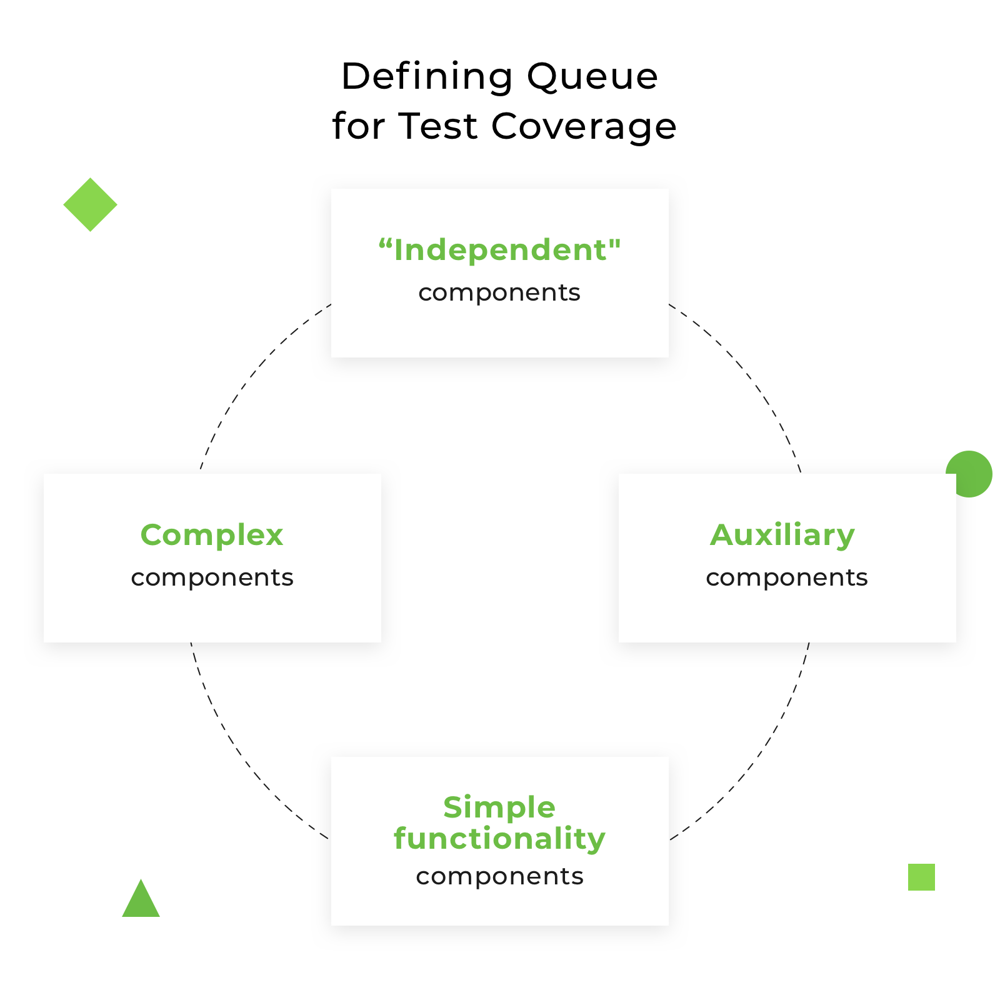
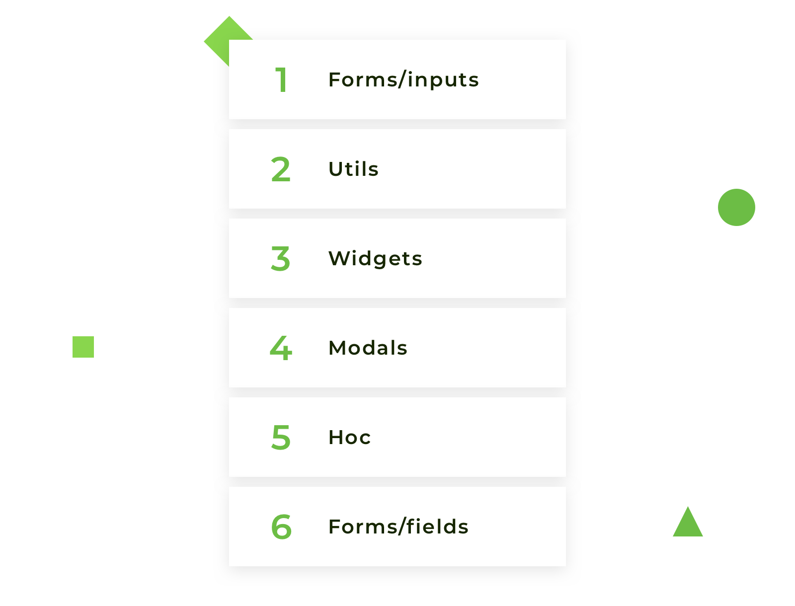
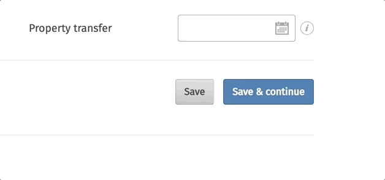
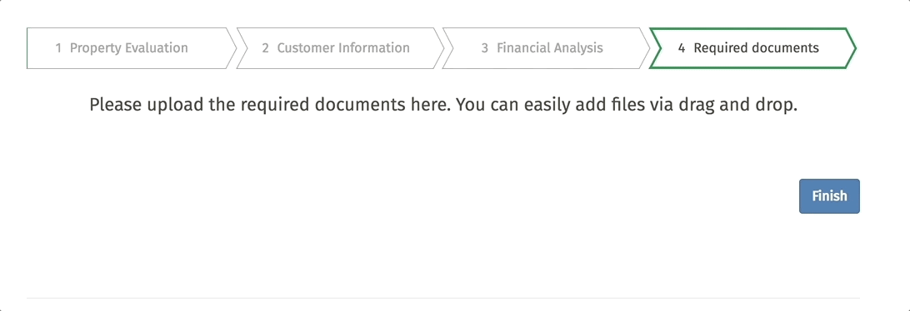
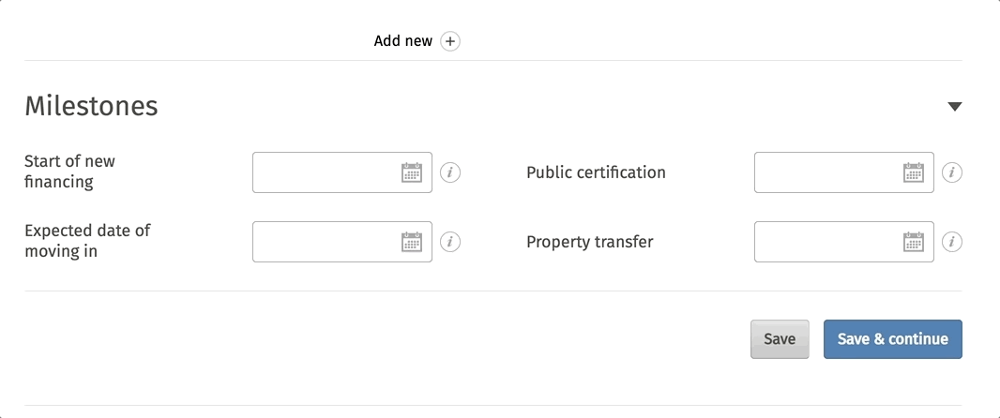

# Что и как тестировать с помощью Jest и Enzyme. Полная инструкция по тестированию React-компонентов

_Перевод статьи [Alona Pysarenko](https://djangostars.com/blog/author/alona-pysarenko/): [What and How to Test with Jest and Enzyme. Full Instruction on React Components Testing](https://djangostars.com/blog/what-and-how-to-test-with-enzyme-and-jest-full-instruction-on-react-component-testing/)._


Тестирование React-компонентов может оказаться сложной задачей как для начинающих, так и для опытных разработчиков, которые уже работали с тестами. Вам может быть интересно сравнить ваши собственные подходы с теми, которые мы используем в нашем проекте. Для покрытия тестами кодовой базы вам необходимо знать, какие компоненты должны быть протестированы и какой код точно должен быть покрыт тестами.

Во время чтения я расскажу о следующих темах:

-   Определение правильного порядка тестирования компонентов на основе структуры проекта.
-   Нахождение того, что можно опустить в покрытии тестами (что можно не тестировать).
-   Выявление необходимости использовать тестирование на основе снимков.
-   Определение, что тестировать в компоненте и в каком порядке.
-   Предоставление подробных примеров кода.

Статья требует, чтобы читатель уже знал о Jest и Enzyme. Информацию об установке и настройке можно легко найти в интернете или на официальных сайтах.

Представим следующую ситуацию: вам нужно покрыть кодовую базу проекта тестами, и так с чего вам начать и что вы должны получить в конце тестирования? 100% покрытие тестами? Это показатель, к которому вы должны стремиться, но в большинстве случаев вы его не получите. Почему? Потому что вы не должны тестировать весь код. Мы выясним, почему и что следует оставить без тестов. Более того, 100% покрытие не всегда гарантирует, что компонент будет полностью протестирован. Также, нет никакой гарантии, что он сообщит вам если что-то было изменено. Не стремитесь к процентам, избегайте написания фальшивых тестов и старайтесь не потерять основные детали компонента.

## Определение правильного порядка тестирования компонентов на основе структуры проекта

Давайте обсудим этот вопрос на следующей части структуры проекта:


Я взяла каталог `shared`, потому что он очень важен. Он состоит из компонентов, которые используются на нескольких разных страницах проекта. Они переиспользуемые и обычно маленькие и несложные. Но если тот или иной компонент выйдет из строя, это приведёт к сбою в других местах. Поэтому мы должны быть уверены, что они написаны правильно. Структура этого каталога разделена на несколько папок, каждая из которых содержит компоненты.



Как определить правильный порядок тестирования компонентов в каталоге `shared`:

-   Всегда следуйте правилу от простого к сложному. Проанализируйте каждый каталог и определите, какие компоненты являются независимыми, т.е. их отрисовка не зависит от других компонентов, они самодостаточны и могут использоваться отдельно как единое целое. Из структуры выше — это каталог `inputs` в папке `forms`. Он содержит компоненты ввода в `redux-forms`, такие, как `TextInput`, `SelectInput`, `CheckboxInput`, `DateInput` и др.
-   Затем нужно определить вспомогательные компоненты, которые часто используются в компонентах `inputs`, но их следует проверять отдельно. Это каталог `utils`. Компоненты в этой папке не сложные, но очень важные. Они часто переиспользуются и помогают с повторяющимися действиями.
-   Следующий шаг — определить, какие компоненты можно использовать независимо друг от друга. Если такие есть, возьмите их для тестирования. В нашей структуре — это `widgets`, небольшие компоненты с простой функциональностью. Они будут третьим пунктом в очереди на тестирование.
-   Далее проанализируйте остальные каталоги и определите более сложные компоненты, которые можно использовать независимо или в сочетании с другими компонентами. В нашем случае — это каталог `modals`, эти компоненты будут подробнее описаны ниже.
-   Самые сложные для тестирования компоненты останутся в конце. Это каталог `hoc` и `fields` из папки `forms`. Как вам определить, какой из них следует тестировать первым? Я беру каталог, компоненты которого уже встречались в тестируемых компонентах. Например, компоненты из `hoc` каталога присутствовали в компоненте `widgets`, поэтому я уже знаю, где и с какой целью используется этот каталог и его компоненты.
-   Последняя папка `fields` содержит компоненты, связанные с `redux-forms`.

Окончательный порядок компонентов (на основе нашего примера) будет выглядеть следующим образом:



Следуя этому порядку, вы постепенно увеличиваете сложность тестируемых компонентов, таким образом, когда дело доходит до работы с более сложными компонентами, вы уже знаете, как ведут себя самые маленькие. Не берите для тестирования, например, поле «массив» если вы не знаете, как проверить поле «текст»; не берите компонент с использованием `redux-forms`, если вы не тестировали само поле «форма». Будьте последовательны в своем выборе, не берите первый компонент, который приходит в голову и включите логику. Конечно, структура вашего проекта может отличаться; он может иметь другие имена каталогов или содержать дополнительные компоненты, действия или редьюсеры, но логика определения порядка тестирования компонентов одинаковая.

**Давайте определим, что следует пропустить при тестировании:**

1. **Сторонние библиотеки**. Не тестируйте функции, взятые из другой библиотеки; вы не несете ответственности за этот код. Пропустите его или имитируйте выполнение, если это нужно для тестирования вашего кода.
2. **Константы**. Название говорит само за себя. Они неизменяемые; это набор статического кода, который не предназначен для изменения.
3. **Встроенные стили** (если они используются в компоненте). Чтобы проверить встроенные стили, необходимо дублировать объект со стилями в тесте; если изменяется объект стилей, необходимо также изменить его в тесте. Не дублируйте код компонента в тестах, вы можете забыть изменить его в тестах. Более того, ваш коллега никогда не догадается о дублировании. В большинстве случаев встроенные стили не изменяют поведение компонента, следовательно, они не нуждаются в проверке. Возможно исключение, если ваши стили изменяются динамически.
4. **Всё, что не связано с тестируемым компонентом**. Пропустите покрытие тестами компоненты, которые были импортированы, будьте осторожны, если один компонент обернут в другой. В таком случае не тестируйте оболочку, анализируйте и тестируйте все отдельно.

Итак, как вы на самом деле пишете тесты? Я объединяю два подхода к тестированию:

-   Тестирование при помощи снимков (Snapshot-тестирование).
-   Тестирование логики компонентов.

Тестирование при помощи снимков — полезный инструмент тестирования, если вы хотите быть уверенным, что пользовательский интерфейс не изменился. Когда вы впервые сталкиваетесь с этим инструментом тестирования, возникают вопросы, связанные с организацией и управлением снимками. Принцип работы очень прост, но, к сожалению, он нигде подробно не описан; на официальном сайте [jestjs.io](https://jestjs.io/) очень плохо описана работа с тестирование при помощи снимков.

## Как тестировать при помощи снимков

**Шаг 1**. Напишем тест для компонента, и в функции `expect` используем метод `.toMatchSnapshot()`, который создаст снимок.

```js
it("render correctly text component", () => {
    const TextInputComponent = renderer.create(<TextInput />).toJSON();
    expect(TextInputComponent).toMatchSnapshot();
});
```

**Шаг 2**. При первом запуске теста на одном уровне с тестом будет создан каталог с именем `__snapshots__` с автоматически созданным файлом с расширением `.snap` внутри.

Снимок выглядит так:

```js
// Jest Snapshot v1, https://goo.gl/fbAQLP

exports[`Render TextInput correctly component 1`] = `  
<input  
  className="input-custom"
  disabled={undefined}
  id={undefined}
  name={undefined}
  onBlur={undefined}
  onChange={[Function]}
  pattern={undefined}
  placeholder={undefined}
  readOnly={false}
  required={undefined}
  type="text"
  value={undefined}
/>
`;
```

**Шаг 3**. Отправим снимок в репозиторий и сохраним его вместе с тестом.

Если компонент был изменен, то вам нужно обновить снимок с флагом `--updateSnapshot` или использовать короткий флаг `u`.

## Снимок создан; как это работает?

Рассмотрим две ситуации:

### 1. Компонент изменился

-   Запускаем тесты.
-   Создается новый снимок, который сравнивается с ранее созданным снимком, хранящимся в каталоге `__snapshots__`.
-   Не удалось выполнить тест, так как снимок отличается.


### 2.  Компонент не изменился

-   Запускаем тесты.
-   Создается новый снимок, который сравнивается с ранее созданным снимком, хранящимся в каталоге `__snapshots__`.
-   Тест пройден, так как снимки идентичны.


Все нормально, когда тестируются небольшие компоненты без логики, просто отрисовка UI, но, как показывает практика, на реальных проектах таких компонентов нет. А если они есть, то совсем в небольшом количестве.

Достаточно ли снимков для полного тестирования компонентов?

## Основные инструкции по тестирования компонентов

1. **Один компонент должен иметь один снимок**. Если один снимок завершается неудачей, скорее всего, остальные тоже потерпят неудачу, поэтому не создавайте и не храните кучу ненужных снимков, забивающих пространство и запутывающих разработчиков, которые будут читать ваши тесты после вас. Конечно, бывают исключения, когда необходимо проверить поведение компонента в двух состояниях, например, в компонент в состоянии перед открытием всплывающего окна и после открытия. Однако даже такой вариант можно заменить на такой: первый тест сохраняет снимок с состоянием компонента по умолчанию, без всплывающего окна, а второй тест имитирует событие и проверяет наличие определенного класса. Таким образом, вы можете легко обойти создание нескольких снимков.

2. **Тестирование свойств**. Как правило, тестирование свойств я разделяю на два шага. Во-первых, проверьте значение свойств по умолчанию; когда компонент отрисовывается, я ожидаю, что значение будет равно значению по умолчанию из `defaultProps` если оно там определенно. Во-вторых, я проверяю пользовательские свойства; я устанавливаю свое собственное значение и ожидаю, что оно будет получено после отрисовки компонента.

3. **Тестирование типов данных**. Чтобы проверить, какой тип данных приходит в свойства или какие данные получены после определенных действий, я использую специальную библиотеку `jest-extended` (Дополнительный вычислитель для Jest), она имеет расширенный набор вычислителей, которые отсутствуют в `Jest`. С помощью этой библиотеки тестировать типы данных намного проще и приятнее. Тестирование типов данных — спорный вопрос. Некоторые разработчики могут возразить против тестирования типов данных, потому что это сторонний пакет и он не должен тестироваться, но я настаиваю на тестировании типов данных для компонентов, потому что я не тестирую саму функциональность пакета, я просто гарантирую, что типы данных верны. Тип данных является очень важной частью программирования и не должен игнорироваться.

4. **Тестирование событий**. После создания снимков и покрытия свойств тестами можно быть уверенным в корректной отрисовке компонента, но этого недостаточно для полного покрытия при наличии событий в компоненте. Вы можете проверить события несколькими способами; наиболее широко используемые:

-   Создаете фиктивное событие => имитируете событие => ожидаете вызов события.
-   Создаете фиктивное событие => имитируете событие с передачей необходимых параметров => отрисовываете компонент => ожидаете вызов события с передаваемыми параметрами.
-   Передаете необходимые свойства => отрисовываете компонент => имитируете событие => ожидаете вызов события с передаваемыми параметрами.

5. **Тестирование условий**. Очень часто у вас могут быть условия для вывода определенного класса, отрисовки определенного раздела кода, передачи необходимых свойств и т.д. Не забывайте об этом, потому что со значениями по умолчанию будет пройдена только одна ветка, а вторая останется непроверенной. Так в сложных компонентах с вычислениями и множественными условиями можно пропустить несколько веток. Чтобы убедиться, что все части кода покрыты тестами используйте инструменты покрытия и визуально проверяйте, какие ветки покрыты тестами, а какие нет.

6. **Тестирование состояний**. Для проверки состояния в большинстве случаев необходимо написать два теста:

-   Первый проверяет текущее состояние.
-   Второй проверяет состояние после вызова события. Отрисовываете компонент => вызываете функцию непосредственно в тесте => проверяете, как изменилось состояние. Чтобы вызывать функцию компонента, вам необходимо получить экземпляр компонента и только после этого вызывать его методы (пример показан в следующем тесте).

После того, как вы пройдете через этот список инструкций, ваш компонент будет покрыт тестами от 90% до 100%. Я оставила 10% для особых случаев, которые не были описаны в статье, но могут встретиться в коде.

## Пример тестирования

Давайте перейдем к примерам и шаг за шагом покроем компоненты тестами, по описанной выше схеме.

### 1. Тестирование компонента из директории `forms/inputs`

Возьмем один компонент из директории `forms/inputs`; пусть это будет компонент `DateInput.js` для выбора даты.



Компонент `DateInput` использует библиотеку `react-datepicker` с двумя утилитами: `valueToDate` (преобразует значение в дату) и `dateToValue` - это метод для манипулирования датой и `PropTypes` для проверки свойств React.

По коду компонента мы видим список свойств по умолчанию, с помощью которых компонент должен быть отрисован:

```js
const defaultProps = {
    inputClassName: "input-custom",
    monthsShown: 1,
    dateFormat: "DD.MM.YYYY",
    showMonthYearsDropdowns: false,
    minDate: moment()
};
```

Все свойства подходят для создания снимков, за исключением одного `minDate: moment()`, `moment()` — будет давать нам текущую дату каждый раз, когда мы запускаем тест, и тест на основе снимков будет терпеть неудачу, потому что будет хранить устаревшую дату. Решение состоит в том, чтобы создать фиктивное значение:

```js
const defaultProps = {
    minDate: moment(0)
};
```

`minDate` — это свойство, которое мне нужно в каждом визуальном компоненте; чтобы избежать дублирования, я создаю `HOC`, который получит `defaultProps` и вернет компонент:

```js
import TestDateInput from "../DateInput";
const DateInput = props => <TestDateInput {...defaultProps} {...props} />;
```

Не забывайте о `moment-timezone`, особенно если ваши тесты будут выполняться разработчиками из других стран в другом часовом поясе. Они будут получать фиктивные значения, но со сдвигом часового пояса. Решение — установить часовой пояс по умолчанию:

```js
const moment = require
    .requireActual("moment-timezone")
    .tz.setDefault("America/Los_Angeles");
```

Теперь компонент ввода даты готов к тестированию:

**1. Создание снимка:**

```js
it("render correctly date component", () => {
    const DateInputComponent = renderer.create(<DateInput />).toJSON();
    expect(DateInputComponent).toMatchSnapshot();
});
```

**2. Тестирование свойств:**

Посмотрите свойства и найдите самый важные; первое свойство для тестирования — `showMonthYearsDropdowns`, если оно установлено в `true`, отображается раскрывающийся список для полей месяц и год:

```js
it("check month and years dropdowns displayed", () => {
    const props = {
            showMonthYearsDropdowns: true
        },
        DateInputComponent = mount(<DateInput {...props} />).find(
            ".datepicker"
        );
    expect(DateInputComponent.hasClass("react-datepicker-hide-month")).toEqual(
        true
    );
});
```

Проверим свойство `value` на `null`; эта проверка необходима для обеспечения отображения компонента без определённого значения:

```js
it("render date input correctly with null value", () => {
    const props = {
            value: null
        },
        DateInputComponent = mount(<DateInput {...props} />);
    expect(DateInputComponent.prop("value")).toEqual(null);
});
```

**3. Тестирование значения `PropTypes`, дата должна быть строкой:**

```js
it("check the type of value", () => {
    const props = {
            value: "10.03.2018"
        },
        DateInputComponent = mount(<DateInput {...props} />);
    expect(DateInputComponent.prop("value")).toBeString();
});
```

**4. Тестирование событий:**

**4.1** Проверим событие `onChange`, для этого создадим фиктивное событие `onChange` => отрисовываем компонент ввода даты => имитируем событие изменения даты с новым значением => и, наконец, проверим что событие `onChange` было вызвано с новым значением.

```js
it("check the onChange callback", () => {
    const onChange = jest.fn(),
        props = {
            value: "20.01.2018",
            onChange
        },
        DateInputComponent = mount(<DateInput {...props} />).find("input");
    DateInputComponent.simulate("change", {
        target: { value: moment("2018-01-22") }
    });
    expect(onChange).toHaveBeenCalledWith("22.01.2018");
});
```

**4.2** Убедимся, что всплывающее окно открывается после нажатия на поле с вводом даты, для этого найдем поле с вводом даты => имитируем событие клик => и проверим на наличие всплывающего окна с классом `.react-datepicker`.

```js
it("check DatePicker popup open", () => {
    const DateComponent = mount(<DateInput />),
        dateInput = DateComponent.find("input[type='text']");
    dateInput.simulate("click");
    expect(DateComponent.find(".react-datepicker")).toHaveLength(1);
});
```

**Полный список тестов:** [DateInput.test.js](https://github.com/ned-alyona/testing-jest-enzyme/blob/master/shared/forms/inputs/__tests__/DateInput.test.js)

## 2. Тестирование утилит

**Код тестируемой утилиты:** [valueToDate.js](https://github.com/ned-alyona/testing-jest-enzyme/blob/master/shared/utils/valueToDate.js)

Цель этой утилиты является преобразование значения даты в пользовательском формате. Прежде всего, давайте проанализируем данную утилиту и определим основные кейсы для тестирования:

**1.** Согласно назначению этой утилиты, она преобразует значение, поэтому нам нужно проверить это значение:

-   В случае, если значение не определено: мы должны быть уверены, что утилита не вернет исключение (ошибку).
-   В случае, если значение переопределено: нам нужно проверить, что утилита возвращает дату.

**2.** Возвращаемое значение должно принадлежать классу `moment`, поэтому он должен быть экземпляром `moment`.

**3.** Второй аргумент — `dateFormat`; установим его как константу перед тестами. Поэтому он будет передаваться в каждом тесте и возвращать значение в соответствии с форматом даты. Должны ли мы тестировать `dateFormat` отдельно? Полагаю, нет. Этот аргумент необязателен; если мы не зададим `dateFormat`, утилита не сломается, а просто вернет дату в формате по умолчанию; это работа `moment`, а мы не должны тестировать сторонние библиотеки. Как я уже упоминала, не стоит забывать о часовом поясе, это очень важный момент, особенно для разработчиков из разных часовых поясов.

**Давайте напишем код:**

**1. Напишем тест для первого случая; когда у нас нет значения, оно пустое.**

```js
const format = "DD.MM.YYYY";

it("render valueToDate utility with empty value", () => {
    const value = valueToDate("", format);
    expect(value).toEqual(null);
});
```

**2. Проверим, определено ли значение**

```js
const date = '21.11.2015',
      format = ‘DD.MM.YYYY’;

it("render valueToDate utility with defined value", () => {
    const value = valueToDate(date, format);
    expect(value).toEqual(moment(date, format));
});
```

**3. Проверим, принадлежит ли значение к классу `moment`**

```js
const date = "21.11.2015",
    format = "DD.MM.YYYY";

it("check value is instanceof moment", () => {
    const value = valueToDate(date, format);
    expect(value instanceof moment).toBeTruthy();
});
```

**Полный список тестов:** [valueToDate.test.js](https://github.com/ned-alyona/testing-jest-enzyme/blob/master/shared/utils/__tests__/valueToDate.test.js)

## 3. Тестирование виджетов

Для тестирования виджетов я взяла компонент `spinner`.

**Код виджета:** [Spinner.js](https://github.com/ned-alyona/testing-jest-enzyme/blob/master/shared/widgets/Spinner.js)

Выглядит так:



`Spinner` не нуждается в объяснении, так как почти все веб-ресурсы используют этот компонент.

Так что идем писать тесты:

**1. Первый шаг — создание снимка**

```js
it("render correctly Spinner component", () => {
    const SpinnerComponent = mount(<Spinner />);
    expect(SpinnerComponent).toMatchSnapshot();
});
```

**2. Тестирование свойст**

**2.1** Проверим свойство `title` по умолчанию на правильность отображения

```js
it("check prop title by default", () => {
    const SpinnerComponent = mount(<Spinner />);
    expect(SpinnerComponent.find("p").text()).toEqual("Please wait");
});
```

**2.2** Проверим, что правильно возвращается пользовательское значение для свойства `title`. Взгляните на код, `titel` завернут в `rawMarkup`, и выводится с помощью свойства `dangerouslySetInnerHTML`.

Код утилиты rawMarkup:

```js
export default function rawMarkup(template) {
    return { __html: template };
}
```

Нужно ли включать тесты `rawMarkup` в компонент `spinner`? Нет, это отдельная утилита и её нужно тестировать отдельно от `spinner`. Нам все равно, как это работает, нам просто нужно знать, что свойство `title` возвращает правильный результат.

Пояснение: причина использования свойства `dangerouslySetInnerHTML` в следующем: наш сайт многоязычный, за его перевод отвечает маркетинговая команда. Они могут перевести его просто сочетанием слов или дополнить HTML-тегами, такими как `<strong>`, `<i>`, `<s>` или даже разделить текст на список, используя теги `<ol>` или `<ul>`, но мы не знаем точно, как они переведут и что будут использовать в тексте. Нам просто нужно правильно всё это отобразить.

Я объединила два теста в один:

-   Возврат правильного пользовательского свойства.
-   Правильное отображение заголовка с HTML-тегами.

```js
it("check prop title with html tags", () => {
    const props = {
            title: "<b>Please wait</b>"
        },
        SpinnerComponent = mount(<Spinner {...props} />);
    expect(SpinnerComponent.find("p").text()).toEqual("Please wait");
});
```

Возьмем следующее свойство `subTitle`, оно необязательное и именно поэтому у него нет значения по умолчанию, поэтому пропустим шаг с тестированием значения по умолчанию и проверим пользовательское свойство:

-   Убедимся, что текст в `subTitle` отрисовывается корректно:

```js
const props = {
        subTitle: "left 1 minute"
    },
    SpinnerComponent = mount(<Spinner {...props} />);

it("render correct text", () => {
    expect(
        SpinnerComponent.find("p")
            .at(1)
            .text()
    ).toEqual(props.subTitle);
});
```

Мы знаем, что свойство `subTitle` необязательное, поэтому нам нужно проверить, не отображается ли оно с значением по умолчанию. Просто проверим количество тегов `<p>`:

```js
it("check subTitle is not rendered", () => {
    const SpinnerComponent = mount(<Spinner />);
    expect(SpinnerComponent.find("p").length).toEqual(1);
});
```

**3. Тестирование типов свойств**

-   Для свойства `title` ожидаемый тип — строка.

```js
it("check prop type for title is string", () => {
    const props = {
            title: "Wait"
        },
        SpinnerComponent = mount(<Spinner {...props} />);
    expect(SpinnerComponent.find("p").text()).toBeString();
});
```

-   Для свойства `subTitle` также ожидаемый тип — строка.

```js
const props = {
        subTitle: "left 1 minute"
    },
    SpinnerComponent = mount(<Spinner {...props} />);

it("type for subTitle is string", () => {
    expect(
        SpinnerComponent.find("p")
            .at(1)
            .text()
    ).toBeString();
});
```

**Полный список тестов:** [Spinner.test.js](https://github.com/ned-alyona/testing-jest-enzyme/blob/master/shared/widgets/__tests__/Spinner.test.js)

## 4. Тестирование модальных окон (ModalWrapper.js и ModalTrigger.js)

Выглядит так:



### Как тестировать модальные окна

Прежде всего, я хочу объяснить, как организованы модальные окна на нашем проекте. У нас есть два компонента: `ModalWrapper.js` и `ModalTrigger.js`.

`ModalWrapper.js` отвечает за макет модального окна. Он содержит контейнер, кнопку закрытия, заголовок и тело.

`ModalTrigger.js` отвечает за управление модальным окном. Он включает в себя шаблон `ModalWrapper.js` и содержит события для управления модальным окном (действия открытия, закрытия).

**1. Код для тестируемого компонента: [ModalWrapper.js](https://github.com/ned-alyona/testing-jest-enzyme/blob/master/shared/modals/ModalWrapper.js)**

**Давайте напишем код:**

**1.1** `ModalWrapper.js` получает компоненты и отображает их внутри себя. Прежде всего, убедимся, что `ModalWrapper.js` не сломается без компонента. Создадим снимок со значением по умолчанию:

```js
it("without component", () => {
    const ModalWrapperComponent = shallow(<ModalWrapper />);
    expect(ModalWrapperComponent).toMatchSnapshot();
});
```

**1.2** Следующим шагом будет имитирование его фактического состояния через отрисовку компонента с переданными ему свойствами:

```js
it("with component", () => {
    const props = {
            component: () => {}
        },
        ModalWrapperComponent = shallow(<ModalWrapper {...props} />);
    expect(ModalWrapperComponent).toMatchSnapshot();
});
```

**1.3** Проверяем свойства:

-   Получаем свойство `modalClassName`.

```js
it("render correct class name", () => {
    const props = {
            modalClassName: "custom-class-name"
        },
        ModalWrapperComponent = shallow(<ModalWrapper {...props} />).find(
            "Modal"
        );
    expect(ModalWrapperComponent.hasClass("custom-class-name")).toEqual(true);
});
```

-   Получаем свойство `title`.

```js
it("render correct title", () => {
    const props = {
            title: "Modal Title"
        },
        ModalWrapperComponent = shallow(<ModalWrapper {...props} />).find(
            "ModalTitle"
        );
    expect(ModalWrapperComponent.props().children).toEqual("Modal Title");
});
```

-   Получаем свойство `show`.

```js
it("check prop value", () => {
    const props = {
            show: true
        },
        ModalWrapperComponent = shallow(<ModalWrapper {...props} />).find(
            "Modal"
        );
    expect(ModalWrapperComponent.props().show).toEqual(true);
});
```

**1.4** Тестирование типов свойств:

-   Для свойства `show`.

```js
it("check prop type", () => {
    const props = {
            show: true
        },
        ModalWrapperComponent = shallow(<ModalWrapper {...props} />).find(
            "Modal"
        );
    expect(ModalWrapperComponent.props().show).toBeBoolean();
});
```

-   Для свойства `onHide`.

```js
it("render correct onHide prop type", () => {
    const props = {
            onHide: () => {}
        },
        ModalWrapperComponent = shallow(<ModalWrapper {...props} />).find(
            "Modal"
        );
    expect(ModalWrapperComponent.props().onHide).toBeFunction();
});
```

-   Для свойства `component`.

```js
it("render correct component prop type", () => {
    const props = {
            component: () => {}
        },
        ModalWrapperComponent = mount(<ModalWrapper {...props} />);
    expect(ModalWrapperComponent.props().component).toBeFunction();
});
```

**Полный список тестов:** [ModalWrapper.test.js](https://github.com/ned-alyona/testing-jest-enzyme/blob/master/shared/modals/__tests__/ModalWrapper.test.js)

**2. Код для тестируемого компонента: [ModalTrigger.js](https://github.com/ned-alyona/testing-jest-enzyme/blob/master/shared/modals/ModalTrigger.js)**

`ModalWrapper.js` покрыт тестами, теперь нужно сделать то же самое для `ModalTrigger.js`.

Обзор компонента: он основан на переключении состояния, которое указывает на видимость модального окна. Если переключатель в значение `false`, модальное окно скрыто. Функция `open()` открывает модальное окно из дочернего компонента, сделайте клик по кнопке закрытия и функция `close()` скроет модальное окно.

**2.1** Создадим снимок

```js
it("render ModalTrigger component correctly", () => {
    const ModalTriggerComponent = shallow(
        <ModalTrigger>
            <div />
        </ModalTrigger>
    );
    expect(ModalTriggerComponent).toMatchSnapshot();
});
```

Должны ли мы тестировать в `ModalTrigger.js` отрисовку свойств компонента? Нет, поскольку эти компоненты будут отрисованы внутри компонента `ModalWrapper.js`. А это уже было покрыто тестами в компоненте `ModalWrapper.js`.

**2.2** Тестирование свойств. У нас есть одно свойство `children` и мы хотим быть уверенны, что у нас есть только один дочерний элемент.

```js
it("ensure to have only one child (control element)", () => {
    expect(
        ModalTriggerComponent.findWhere(node => node.key() === "modal-control")
            .length
    ).toEqual(1);
});
```

**2.3** Тестирование типов. `children` должен быть объектом, проверим это в следующем тесте:

```js
const ModalTriggerComponent = mount(
    <ModalTrigger>
        <div />
    </ModalTrigger>
);

it("check children prop type", () => {
    expect(ModalTriggerComponent.props().children).toBeObject();
});
```

**2.4** Важной частью компонента `ModalTrigger.js` является проверка состояний.

У нас два состояния:

-   Модальное окно открыто. Чтобы узнать, что модальное окно открыто, нужно проверить его состояние. Для этого вызовите функцию `open` из экземпляра компонента и ожидать, что состояние `toggled` будет `true`.

```js
it("check the modal is opened", () => {
    const event = {
        preventDefault: () => {},
        stopPropagation: () => {}
    };
    ModalTriggerComponent.instance().open(event);
    expect(ModalTriggerComponent.state().toggled).toBeTruthy();
});
```

-   Модальное окно закрыто. Тестируем обратную ситуацию, нужно чтобы `toggled` был `false`.

```js
it("check the modal is closed", () => {
    ModalTriggerComponent.instance().close();
    expect(ModalTriggerComponent.state().toggled).toBeFalsy();
});
```

**Полный список тестов:** [ModalTrigger.test.js](https://github.com/ned-alyona/testing-jest-enzyme/blob/master/shared/modals/__tests__/ModalTrigger.test.js)

Теперь модальные окна полностью протестированы. Один совет для тестирования компонентов, который зависят друг от друга: сначала просмотрите компоненты и запишите план тестирования, определите, что вам нужно протестировать в каждом компоненте, проверьте тестовые примеры для каждого компонента и убедитесь, что вы не проверяете тот же тест в нескольких компонентах. Тщательно проанализируйте возможные и оптимальные варианты тестирования.

## 5. Тестирование HOC (компоненты высшего порядка)

Последние две части (тестирование HOC и полей формы) взаимосвязаны. Я бы хотела поделиться с вами, как правильно тестировать поля с HOC.

Объяснение того, что такое `BaseFieldLayout`, зачем нам нужен этот компонент и где мы его используем:

-   `BaseFieldLayout` — это обертка для компонентов ввода формы, таких как `TextInput`, `CheckboxInput`, `DateInput`, `SelectInput` и др. Их имена заканчиваются на `-Input`, потому что мы используем пакет `redux-form` и эти компоненты являются компонентами ввода в логике `redux-form`.
-   Нам нужен `BaseFieldLayout` для создание макетов для компонентов полей формы, то есть для отрисовки заголовков полей, всплывающих подсказок, префиксов (валют, аббревиатуры квадратных метров и т.д.), иконок, ошибок...
-   Мы используем его в `BaseFieldHOC` для обертывания `inputComponent`в макет поля и подключения его к `redux-form` с помощью компонента `<Field/>`.

**Код для тестируемого компонента: [BaseFieldHOC.js](https://github.com/ned-alyona/testing-jest-enzyme/blob/master/shared/hoc/BaseFieldHOC.js)**

Анализ HOC:

-   Этот компонент получает только одно свойство — компонент. Прежде всего нам нужно создать этот компонент и обернуть его в `BaseFieldHOC`.
-   Далее, нам нужно декорировать обертку HOC с `redux-form`, чтобы получить поле, связанное с `redux-form`.
-   Отрисовываем это поле внутри компонента `React Redux <Provider>`, чтобы сделать хранилище доступным для тестируемого компонента. Чтобы имитировать хранилище, просто сделайте:

```js
const store = createStore(() => ({}));
```

Теперь, перед каждым тестом, нужно сделать следующее:

```js
let BaseFieldHOCComponent;

beforeEach(() => {
    const TextInput = () => {
            return "text input";
        },
        BaseFieldHOCWrapper = BaseFieldHOC(TextInput),
        TextField = reduxForm({ form: "testForm" })(BaseFieldHOCWrapper);
    BaseFieldHOCComponent = renderer
        .create(
            <Provider store={store}>
                <TextField name="text-input" />
            </Provider>
        )
        .toJSON();
});
```

После этого компонент готов к использованию:

1. Создадим снимок

```js
it("render correctly component", () => {
    expect(BaseFieldHOCComponent).toMatchSnapshot();
});
```

2. Убедимся, что компонент ввода обернут в `BaseFieldLayout` после отрисовки:

```js
it("check input component is wrapped in BaseFieldLayout", () => {
    expect(BaseFieldHOCComponent.props.className).toEqual("form-group");
});
```

Вот и все, HOC покрыт тестами. Самое сложное в тестировании, связанном с компонентами `redux-form` — это подготовка поля (декорировать `redux-form` и настроить хранилище), остальное просто — следуйте инструкциям и больше ничего.

**Полный список тестов:** [BaseFieldHOC.test.js](https://github.com/ned-alyona/testing-jest-enzyme/blob/master/shared/hoc/__tests__/BaseFieldHOC.test.js)

## 6. Тестирование форм/полей

Поле HOC, было покрыто тестами, и мы можем перейти к компоненту `BaseFieldLayout`.

**Код для тестируемого компонента: [BaseFieldLayout.js](https://github.com/ned-alyona/testing-jest-enzyme/blob/master/shared/forms/fields/BaseFieldLayout.js)**

Давайте напишем тесты для `BaseFieldLayout` в соответствии с инструкциями выше:

**1. Прежде всего, создадим снимок.**

Этот компонент не будет отрисован без `defaultProps`:

-   `inputComponent`.
-   Свойства предоставляемые `redux-form`: объекты `input` и `meta`. `input` со свойством `name` и `meta` со свойствами `touched` и `error`.

```js
const defaultProps = {
    meta: {
        touched: null,
        error: null
    },
    input: {
        name: "field-name"
    },
    inputComponent: () => {
        return "test case";
    }
};
```

Чтобы использовать `defaultProps` в каждой тестируемой обертке, выполним следующие действия:

```js
import TestBaseFieldLayout from "../BaseFieldLayout";

const BaseFieldLayout = props => (
    <TestBaseFieldLayout {...defaultProps} {...props} />
);
```

Теперь мы готовы создать снимок:

```js
it("render correctly BaseFieldLayout component", () => {
    const BaseFieldLayoutComponent = renderer
        .create(<BaseFieldLayout />)
        .toJSON();
    expect(BaseFieldLayoutComponent).toMatchSnapshot();
});
```

**2. Тестирование свойств**

Этот компонент имеет множество свойств. Я покажу пример нескольких, остальные тестируются по аналогии.

-   Убедимся, что свойство `icon` корректно используется.

```js
it("render correctly icon prop", () => {
    const props = {
            icon: <span className="icon-exclamation" />
        },
        BaseFieldLayoutComponent = mount(<BaseFieldLayout {...props} />);
    expect(
        BaseFieldLayoutComponent.find("span").hasClass("icon-exclamation")
    ).toBeTruthy();
});
```

-   Убедимся, что свойство `tooltip` корректно используется.

```js
const props = {
        labelTooltipContent: "tooltip for label"
    },
    BaseFieldLayoutComponent = mount(<BaseFieldLayout {...props} />);

it("check prop is rendered", () => {
    expect(
        BaseFieldLayoutComponent.find("span").hasClass("tooltip-icon")
    ).toBeTruthy();
});
```

-   Тестирование `fieldLink` свойства, убедимся, что `fieldLink` имеет значение `null` по умолчанию.

```js
it("check prop is null by default", () => {
    const BaseFieldLayoutComponent = shallow(<BaseFieldLayout />);
    expect(BaseFieldLayoutComponent.props().fieldLink).toBe(null);
});
```

**3. Тестирование ошибок**

```js
it("check if field has error", () => {
    const props = {
            meta: {
                touched: true,
                error: "This field is required"
            }
        },
        BaseFieldLayoutComponent = mount(<BaseFieldLayout {...props} />);
    expect(BaseFieldLayoutComponent.find(".error")).toHaveLength(1);
});
```

**Полный список тестов:** [BaseFieldLayout.test.js](https://github.com/ned-alyona/testing-jest-enzyme/blob/master/shared/forms/fields/__tests__/BaseFieldLayout.test.js)

##  Подведем итоги

Теперь у вас есть подробное руководство о том, как выполнять полное тестирование компонентов на основе структуры проекта. По собственному опыту я попыталась объяснить, что и в каком порядке необходимо проверить, а что можно опустить при тестировании. Кроме того, я продемонстрировала примеры тестирования нескольких компонентов и определила последовательность покрытия кодовой базы. Я надеюсь, что вам будет полезна эта статья. Спасибо за чтение.

---

_Слушайте наш подкаст в [iTunes](https://itunes.apple.com/ru/podcast/девшахта/id1226773343) и [SoundCloud](https://soundcloud.com/devschacht), читайте нас на [Medium](https://medium.com/devschacht), контрибьютьте на [GitHub](https://github.com/devSchacht), общайтесь в [группе Telegram](https://t.me/devSchacht), следите в [Twitter](https://twitter.com/DevSchacht) и [канале Telegram](https://t.me/devSchachtChannel), рекомендуйте в [VK](https://vk.com/devschacht) и [Facebook](https://www.facebook.com/devSchacht)._
