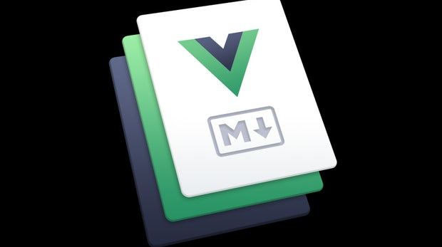
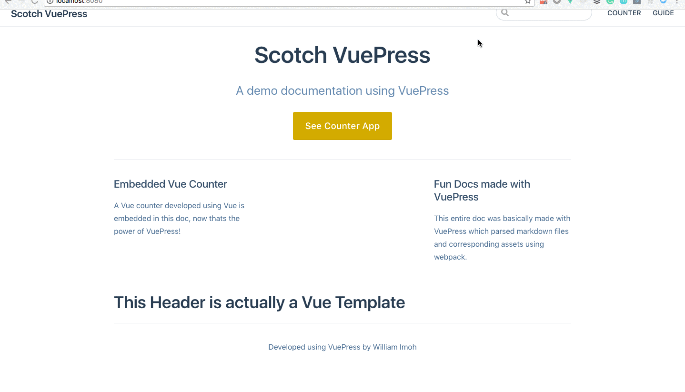

# От нуля до деплоя: разработка системы документации с помощью Vue и VuePress



*Перевод статьи [William Imoh](https://twitter.com/iChuloo): [Zero to Deploy: Build A Documentation System with Vue and VuePress](https://scotch.io/tutorials/zero-to-deploy-build-a-documentation-system-with-vue-and-vuepress). Опубликовано с разрешения автора.*

***

Документация для разработчика — это его хлеб насущный и очень часто случается так, что бывает трудно построить систему документации к разрабатываемым проектам. В этой статье будет создана статическая документации, которая одновременно является одностраничным приложением ([SPA](https://ru.wikipedia.org/wiki/%D0%9E%D0%B4%D0%BD%D0%BE%D1%81%D1%82%D1%80%D0%B0%D0%BD%D0%B8%D1%87%D0%BD%D0%BE%D0%B5_%D0%BF%D1%80%D0%B8%D0%BB%D0%BE%D0%B6%D0%B5%D0%BD%D0%B8%D0%B5)), в основе которого находится фреймворк [Vue](https://ru.vuejs.org/) и генератор статических сайтов [VuePress](https://vuepress.vuejs.org/).

> Примечание переводчика: на данный момент доступен [неофициальный перевод документации VuePress](https://vuepress-lrouuhpdsl.now.sh/ru), выполненный сообществом [Translation Gang](https://github.com/translation-gang/), которое также занимается переводом Vue-продуктов, включая VuePress. До тех пор пока VuePress находится в стадии разработки, официальные переводы не принимаются, но сообщество уже перевело документацию VuePress и после выхода стабильной версии этот перевод будет доступен на официальном сайте.

## Что такое статические сайты

В общих словах можно сказать, что статические сайты — это страницы, которые хранятся в том же виде, в котором будут показаны пользователю. У таких сайтов нет обычного прямого взаимодействия типа клиент-сервер, за исключением возможного варианта с подключенными сторонними приложениями. В интернете существует большое количество генераторов статических сайтов, которые различаются между собой отдельными характеристиками. У одних генераторов преимуществом является скорость работы и время загрузки; у других — гибкость настройки; третьи — обладают большим набором функциональности. Статические сайты предпочтительны в случаях, когда важна скорость работы веб-страницы и низкая вероятность утечки секретной информации из-за отсутствия сервера.

Особенностью недавно выпущенного VuePress как генератора статических сайтов является предустановленная тема оформления, которую можно использовать для создания документации тогда, когда для создания пользовательской темы нет времени. В этой статье будет использоваться тема по умолчанию.

## Почему именно VuePress?

Я хочу сказать — почему бы и не VuePress! По умолчанию VuePress генерирует из структурированных по папкам [markdown-файлов](https://ru.wikipedia.org/wiki/Markdown) HTML-файлы, которые будут использоваться в дальнейшем для показа пользователям. Генератор VuePress из коробки имеет в своем составе фреймворк [Vue](https://ru.vuejs.org/), библиотеку [VueRouter](https://router.vuejs.org/ru/) для создания маршрутизации и систему [webpack](https://webpack.js.org/) для сборки проекта. Во время сборки все markdown-файлы преобразуются в Vue-шаблоны, в то время как все дополнительные файлы обрабатываются системой сборки [webpack](https://webpack.js.org/). Преобразование markdown-файлов в Vue-шаблоны предоставляет нам возможность использовать нативные Vue-скрипты в том виде, в каком они используются в обычных [Vue-компонентах](https://ru.vuejs.org/v2/guide/single-file-components.html).

VuePress является системой, хорошо оптимизированной для [SEO](https://ru.wikipedia.org/wiki/%D0%9F%D0%BE%D0%B8%D1%81%D0%BA%D0%BE%D0%B2%D0%B0%D1%8F_%D0%BE%D0%BF%D1%82%D0%B8%D0%BC%D0%B8%D0%B7%D0%B0%D1%86%D0%B8%D1%8F) и предоставляющей инструменты [Google Analytics](https://ru.wikipedia.org/wiki/Google_Analytics) для анализа посещаемости страниц. Также VuePress имеет встроенную поддержку системы поиска по сайту при помощи индексации заголовков страниц и отображения их в процессе поиска.

VuePress имеет встроенную поддержку адаптивной разметки страниц, а также позволяет видоизменять или создавать свою собственную разметку. В рамках данной статьи мы создадим простую систему документации с поддержкой темы оформления по умолчанию; также мы воспользуемся такой возможностью, как **Vue in Markdown**, что позволит нам встроить простой счетчик внутри markdown-файла.

Окончательный вид проекта будет следующим:


## Необходимые условия

Для успешного освоения данного руководства необходимы хорошие знания HTML, CSS и JavaScript. Знания Vue.js не являются необходимыми, но будут существенным преимуществом.

## Установка

Для создания проекта нам понадобятся установленные [Node.js](https://nodejs.org/en/) и менеджер пакетов [npm](https://ru.wikipedia.org/wiki/NPM). Проверить их наличие и узнать их версии можно, набрав в терминале команду:

```bash
node -v && npm -v
```

Следующим шагом будет развертывание нового проекта. Для этого создадим директорию `scotch-vuepress` и перейдем в неё:

```bash
mkdir scotch-vuepress && cd $_
```

Затем выполним инициализацию проекта при помощи `npm`:

```bash
npm init -y
```

Эта команда выполнит предварительную настройку проекта — создаст файл `package.json`.

Теперь нужно локально установить VuePress:

```bash
npm install -D vuepress
```

> Примечание переводчика: На момент перевода данной статьи использовалась актуальная версия — VuePress `0.10.1` Автором перевода эта версия была опробована применительно к статье и приведена в примерах ниже. С исходным кодом примера, использующего данную версию, можно ознакомится по ссылке [VuePress Test](https://github.com/LaboratoryVue/vuepress-test). На момент написания статьи её автором William Imoh версия VuePress была `0.5.0`.

После установки VuePress нам будет доступна тема оформления документации, которая встроена в VuePress изначально; этой темой мы воспользуемся при построении нашего проекта. Однако нам потребуется внести изменения в саму структуру проекта — создать необходимые папки и файлы, для начала с произвольным содержимым.

## Создание папок и файлов

При создании папок в VuePress нужно принимать во внимание, что расположение файлов и директорий в структуре проекта имеет существенное значение. Каждый markdown-файл в любой из директорий компилируется в HTML-файл и маршрутом до этого файла будет являться родительская директория. Для начала давайте создадим папку `docs`, внутри которой будут размещаться все будущие папки и конфигурационные файлы нашего проекта:

```bash
mkdir docs && cd $_
```

В этой корневой директории нам нужно создать специальную папку `.vuepress` и две дополнительные папки проекта: `counter` и `guide`.

> Обратите внимание, чтобы все маршруты проекта работали, необходимо в каждой из папок создать по одному файлу README.md. Это служит домашним маршрутом для каждого конкретного подраздела.

Внутри директории `counter` расположены дополнительные markdown-файлы, которые будут сгенерированы в обычные HTML-файлы. Помимо этих файлов внутри папки `counter` расположен файл `README.md` для генерации маршрута до этой директории. Аналогичная структура файлов присутствует и в папке `guide`.

Директория `.vuepress` предназначена для служебных целей — внутри неё будет располагаться директория с компонентами; папка `dist`, которая будет сгенерирована автоматически в процессе сборки проекта; файл `config.js`, в котором будут храниться настройки проекта.

## Создание компонентов

Для учебных целей данного проекта нам потребуется создать очень простой счетчик при помощи Vue.js. Для этого в директории `.vuepress` создадим поддиректорию `components`, в которую поместим два файла — `counter.vue` и `my-header.vue`. Первый компонент будет являться счетчиком, а второй — простым заголовком.

Содержимое компонента `my-header.vue` следующее:

```js
<template>
  <div>
    <h1>This Header is actually a Vue Template</h1>
  </div>
</template>

<script></script>

<style scoped></style>
```

Содержимое компонента `counter.vue`:

```js
<template>
  <div class="counter">
    <h1 class="counter__title">{{ number }}</h1>
    <button class="counter__button" type="button" @click="increment()">increment</button>
    <button class="counter__button" type="button" @click="decrement()">decrement</button>
  </div>
</template>

<script>
  export default {
    data() {
      return{
        number: 0,
      }
    },
    methods:{
      increment() {
        if (this.number >= 0) {
          this.number += 1
        }
      },
      decrement() {
        if (this.number > 0) {
          this.number -= 1
        }
      }
    }
  }
</script>

<style scoped>

  .counter {
    display: inline-block;
    margin-left: 30%;
  }

  .counter__title {
    text-align: center;
  }

  .counter__button {
    display: inline-block;
    padding: 20px;
    margin: 10px;
    font-weight: 700;
    border-radius: 5px;
    box-shadow: 0px 0px 5px 0px rgb(11, 11, 114);
    text-transform: capitalize;
  }

</style>
```

Оба компонента готовы для использования в проекте и мы может двигаться дальше.

## Создание markdown-файлов

Продолжим создание проекта путем добавления markdown-файлов в папки `counter` и `guide`. По нижеследующим ссылкам можно увидеть, что из себя представляет содержимое обеих директорий и сами markdown-файлы — папка [counter](https://github.com/Chuloo/scotch-vuepress/tree/master/docs/counter) и папка [guide](https://github.com/Chuloo/scotch-vuepress/tree/master/docs/guide). [Frontmatter](https://vuepress.vuejs.org/guide/markdown.html#front-matter) используется для динамического создания заголовка каждой индивидуальной страницы. Обратите внимание, что компонент `counter` добавлен в содержимое файла `counter-app.md`.

Эти markdown-файлы при последующей сборке проекта будут преобразованы в статические страницы. Для создания маршрутов в проекте к этим директориям в каждой из папок расположен файл `README.md`. Frontmatter внутри markdown-файлов служит для создания динамических свойств страницы. Добавим файл `README.md` для корневой директории `docs`:

```md
---
home: true
actionText: See Counter App
actionLink: /counter/counter-app
features:
- title: Embedded Vue Counter
    details: A Vue counter developed using Vue is embedded in this doc, now that's the power of VuePress!
- title: Fun Docs made with VuePress
    details: This entire doc was basically made with VuePress which parsed markdown files and corresponding assets using webpack.
footer: Developed using VuePress by William Imoh
---
```

Исходя из логики нашего проекта, компонент `my-header` должен находится по корневому маршруту, поэтому нам нужно немного переделать файл `README.md` — добавить в него компонент `my-header`:

```md
---
home: true
actionText: See Counter App
actionLink: /counter/counter-app
features:
- title: Embedded Vue Counter
    details: A Vue counter developed using Vue is embedded in this doc, now that's the power of VuePress!
- title: Fun Docs made with VuePress
    details: This entire doc was basically made with VuePress which parsed markdown files and corresponding assets using webpack.
footer: Developed using VuePress by William Imoh
---
<my-header></my-header>
```

Таким образом, у нас есть все необходимые файлы для проекта. Можно двигаться дальше и приступить к настройке навигации и боковой панели сайта, используя файл конфигурации `.vuepress/config.js`.

## Настройка разметки

Файл `config.js` используется для настройки системы документации. В создаваемом нами проекте содержимое этого файла будет иметь вид объекта со следующими свойствами:

```js
module.exports = {
  title: 'Scotch VuePress',
  description: "A demo documentation using VuePress",
  themeConfig:{
    nav: [
      { text: 'COUNTER', link: '/counter/' },
      { text: 'GUIDE', link: '/guide/' },
    ],
    sidebar: [
      {
        title: 'Counter',
        collapsable: false,
        children: [
        '/counter/counter-app'
        ]
      },
      {
        title: 'API Guide',
        collapsable: false,
        children: [
          '/guide/guide',
          '/guide/api'
        ]
      }
    ]
  }
}
```

Поле `title` устанавливает заголовок проекта; в поле `description` задается описание проекта, что необходимо для [SEO](https://en.wikipedia.org/wiki/Search_engine_optimization). Этот заголовок и описание автоматически предоставляют индексированную поисковую систему на веб-сайте с помощью строки поиска.

Следующим свойством объекта является `themeConfig`, который в свою очередь является объектом и обладает свойствами для конфигурации темы оформления. Например, чтобы создать панель навигации на сайте, в объекте `themeConfig` мы добавляем свойство `nav`. Это свойство в свою очередь является массивом объектов, в которых устанавливается заголовок и маршрут для каждого из элементов навигации. Более подробно с вопросом настройки темы оформления можно ознакомиться здесь — [Default Theme Config](https://vuepress.vuejs.org/default-theme-config/).

В настройках файла `config.js` мы использовали сгруппированные боковые панели для того, чтобы в любой момент времени иметь быстрый доступ ко всей документации. Панель навигации можно сделать сворачиваемой при помощи свойства `collapsable` в каждой из групп боковой панели. Больше информации о настройке боковой панели можно найти здесь — [Sidebar](https://vuepress-lrouuhpdsl.now.sh/ru/default-theme-config/#%D0%B1%D0%BE%D0%BA%D0%BE%D0%B2%D0%B0%D1%8F-%D0%BF%D0%B0%D0%BD%D0%B5n%D1%8C).

На данный момент у нас выполнены все настройки проекта, поэтому можно запустить сборку при помощи команды:

```bash
vuepress dev docs
```

> Примечание переводчика: приведенная выше команда подразумевает, что пакет vuepress установлен глобально в системе, при помощи команды `npm install --global vuepress`. Если же пакет `vuepress` установлен только локально, то команда запуска должна выглядеть так — `npx vuepress dev docs`.

Локальный сервер запускается на порту `8080`. Хорошей новостью для нас является тот факт, что VuePress из коробки обладает возможностью [горячей перезагрузки](https://webpack.js.org/concepts/hot-module-replacement/), которая выполняется каждый раз при внесении любых изменений в разрабатываемом проекте.

> Обратите внимание на то, что перезагрузка сервера все же необходима в том случае, когда выполняется создание новых Vue-компонентов в момент работы запущенного сервера.


> Обратите внимание на заголовок, созданный при помощи Vue-компонента

На момент, когда запущен dev-сервер, основной целью является развёртывание проекта. Для того, чтобы немного привести всё в порядок, давайте отредактируем файл `package.json` и включим в него команду для запуска dev-сервера аналогично команде для сборки проекта.

Готовый вид файла `package.json` будет следующим:

```js
{
  "name": "scotch-vuepress",
  "version": "1.0.0",
  "description": "",
  "main": "index.js",
  "scripts": {
    "test": "echo \"Error: no test specified\" && exit 1",
    "docs:dev": "vuepress dev docs",
    "docs:build": "vuepress build docs"
  },
  "keywords": [],
  "author": "",
  "license": "MIT",
  "devDependencies": {
    "vuepress": "^0.5.0"
  }
}
```

Для того чтобы запустить процесс сборки статических страниц проекта, нужно выполнить команду:

```bash
npm run docs:build
```

Процесс генерации статических страниц может занять некоторое время, после которого готовые страницы будут располагаться по пути `.vuepress/dist`.

## Изменение стилей

VuePress имеет хорошую встроенную поддержку как статических файлов, так и webpack-файлов; благодаря этому VuePress осуществляет проверку правильности URL-адресов, прописанных в markdown-файлах, прежде чем будет выполнена сборка проекта. Такая особенность VuePress позволяет нам внести некоторые изменения в цветовую палитру базовой темы оформления проекта. Выполнять переопределение цветов темы мы будем при помощи CSS-препроцессора [Stylus](http://stylus-lang.com/).

Для этого в директории `docs/.vuepress` создадим файл `override.styl`. Именование переменных, для которых определены значения цветов, оставим так, как это сделано в официальной документации. В файле `override.styl` мы изменим значение переменной `accentColor`:

```styl
$accentColor = #cfa809
$textColor = #2c3e50
$borderColor = #eaecef
$codeBgColor = #282c34
```

Чтобы изменения вступили в силу, необходимо перезапустить сервер командой:

```bash
npm run docs:dev
```

> Обратите внимание, что изменения внутри файла `override.styl` немедленно отображаются в браузере.

Теперь мы полностью завершили создание системы документации нашего проекта:



## Размещение на Netlify

Заключительной частью процесса создания нашего проекта будет его размещение в интернет на бесплатном хостинге [Netlify](https://www.netlify.com/). Сервис Netlify предоставляет отличную возможность непрерывной интеграции с [GitHub](https://github.com/) или другими системами контроля версий для размещения готовых проектов на этом хостинге.

Нижеследующие шаги позволят разместить наш проект на хостинге Netlify:

* **Шаг 1** — необходимо создать учётные записи на GitHub и Netlify. Используя систему [Git](https://git-scm.com/), разместить готовый проект на GitHub.

* **Шаг 2** — под зарегистрированной учётной записью зайти на сервис Netlify и выбрать опцию "New site from Git". Выберите систему GitHub и в ней — репозиторий с проектом.

* **Шаг 3** — в репозитории выбираем ветку для размещения — **master** или же любую другую ветку, которую вы хотите разместить. В поле для задания команды сборки вводим строку `npm run docs:build`. В поле директории сборки указываем `docs/.vuepress/dist`. Нажимаем кнопку **Deploy Site**. Через некоторое время сайт будет размещен на сервере и у нас появится URL-ссылка для глобального доступа в Интернет.

По указанной ниже ссылке располагается размещенный на Netlify проект, который был создан автором данной статьи — [Scotch VuePress](https://scotch-vuepress.netlify.com/).

## Заключение

Преимуществом статических сайтов является скорость их работы, безопасность и легкость поддержки. В данном руководстве при помощи VuePress мы создали сайт статических файлов (документацию), который одновременно является одностраничным приложением ([SPA](https://en.wikipedia.org/wiki/Single-page_application)).

Система VuePress предоставляет гибкость при написании Vue-скриптов внутри markdown-файлов, что поднимает процесс создания статических файлов на новый уровень. В процессе создания документации можно легко изменять стандартную структуру проекта и соответствующих markdown-файлов.

В процессе чтения данного руководства можно воспользоваться [ссылкой на репозиторий автора с готовым проектом](https://github.com/Chuloo/scotch-vuepress), где вы можете оставлять свои комментарии и отклики.

> Примечание переводчика: пример с более актуальной версией расположен [здесь](https://github.com/LaboratoryVue/vuepress-test).

Приятного кодинга!

***

## Дополнительные ресурсы:

* [An Introduction to VuePress](https://alligator.io/vuejs/vuepress-introduction/)
* [VuePress vs Nuxt.js](https://medium.com/vue-mastery/vuepress-vs-nuxt-js-ffc46cc38756)
* [How to create a custom VuePress theme with Vuetify](https://medium.com/vue-mastery/how-to-create-a-custom-vuepress-theme-with-vuetify-651b7d7e5092)

- - - -

*Слушайте наш подкаст в [iTunes](https://itunes.apple.com/ru/podcast/девшахта/id1226773343) и [SoundCloud](https://soundcloud.com/devschacht), читайте нас на [Medium](https://medium.com/devschacht), контрибьютьте на [GitHub](https://github.com/devSchacht), общайтесь в [группе Telegram](https://t.me/devSchacht), следите в [Twitter](https://twitter.com/DevSchacht) и [канале Telegram](https://t.me/devSchachtChannel), рекомендуйте в [VK](https://vk.com/devschacht) и [Facebook](https://www.facebook.com/devSchacht).*
