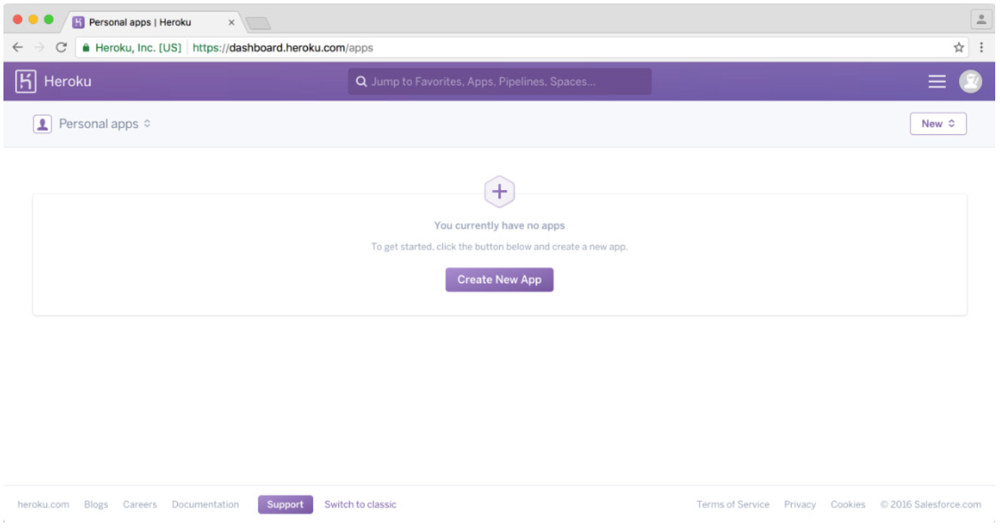
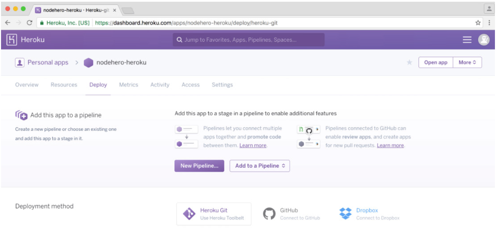
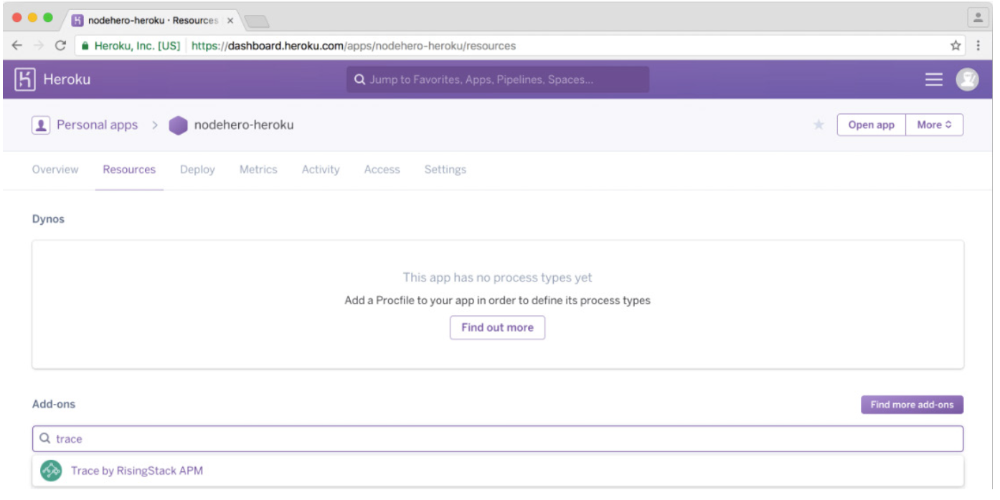

# Деплой вашего приложения
*Перевод книги [Node Hero](https://risingstack.com/resources/node-hero) от [RisingStack](https://risingstack.com/). Переведено с разрешения правообладателей.*

В этой главе о деплое Node.js вы узнаете, как развернуть Node.js-приложения на сервер PaaS-провайдера (Heroku), либо с помощью Docker.

## Деплой Node.js на PaaS

> Поставщики платформы как услуги (*Platform-as-a-Service, PaaS*) могут отлично подойти для команд, которые находятся на начальном этапе разработки или создают небольшие приложения.

В этой части учебника вы узнаете, как использовать Heroku для лёгкого развёртывания Node.js-приложений.

## Подготовка для Heroku

Для развертывания в Heroku нам нужно отправить код в удалённый git-репозиторий. Для этого добавьте свой публичный ключ в Heroku: после регистрации перейдите к [своей учётной записи](https://dashboard.heroku.com/account) и сохраните его там *(в качестве альтернативы вы можете сделать это с помощью CLI)*.

Нам также нужно будет загрузить и установить [Heroku toolbelt](https://devcenter.heroku.com/articles/heroku-command-line). Чтобы убедиться, что ваша установка прошла успешно, выполните следующую команду в своём терминале:

```
heroku --version
heroku-toolbelt/3.40.11 (x86_64-darwin10.8.0) ruby/1.9.3
```

После того, как toolbelt запущен и работает, пройдите процедуру логина:

```
heroku login
Enter your Heroku credentials.
Email: joe@example.com
Password:
```

*(Для получения большей информации о тулките, посетите [Heroku Devcenter](https://devcenter.heroku.com/articles/heroku-cli))*

## Деплой на Heroku



Нажмите «**Create New App**», добавьте новое приложение и выберите регион. Через несколько секунд ваше приложение будет готово, и вы увидите следующий экран:



Перейдите на страницу настроек приложения и скопируйте git-url. В своём терминале добавьте удаленный url-адрес Heroku:

```
git remote add heroku HEROKU_URL
```

Вы готовы развернуть свое первое приложение в Heroku, это действительно просто `git push`:

```
git push heroku master
```

Как только вы это сделаете, Heroku начинает собирать ваше приложение и развернёт его. После развертывания ваш сервис будет доступен на странице `https://YOUR-APP-NAME.herokuapp.com`.

## Heroku Add-ons

Одной из наиболее ценных частей Heroku является экосистема, поскольку десятки партнёров предоставляют базы данных, инструменты мониторинга и другие решения.

Чтобы опробовать работу с дополнениями, установите [Trace](https://trace.risingstack.com/), наше решение для мониторинга Node.js. Чтобы сделать это, найдите **Add-ons** на странице своего приложения и начните вводить Trace, затем кликните на ссылку для установки. Легко, правда?



*(Чтобы закончить интеграцию с Trace, следуйте [нашей инструкции](https://trace-docs.risingstack.com/docs/heroku))*

## Деплой Node.js-приложения с помощью Docker

> В последние годы Docker набирал мощный импульс и стал программным обеспечением для контейнеризации. В этой части учебника вы узнаете, как создавать образы из Node.js-приложений и запускать их.

> «Docker для Node.js - отличный выбор, если вы хотите большего контроля и уменьшения затрат»

## Основы Docker

Чтобы начать работу с Docker, загрузите и установите его с официального веб-сайта [Docker](https://www.docker.com/).

## Помещаем Node.js-приложение в Docker

Во-первых, мы должны выучить два понятия:

* **Dockerfile:** вы можете представить Dockerfile в качестве рецепта — он содержит инструкции по созданию Docker-образа
* **Docker-образ:** результат выполнения Dockerfile — это исполняемый юнит

Чтобы запустить приложение внутри Docker, мы должны сначала написать Dockerfile.

## Dockerfile для Node.js

В корневой папке вашего проекта создайте пустой текстовый файл `Dockerfile`, а затем вставьте в него следующий код:

```
FROM risingstack/alpine:3.3-v4.2.6-1.1.3

COPY package.json package.json
RUN npm install

# Add your source files
COPY . .
CMD ["npm", "start"]
```

Что можно здесь отметить:

* `FROM`: описывает базовый образ, используемый для создания нового образа — в данном случае он будет получен из публичного репозитория [Docker Hub](https://hub.docker.com/r/risingstack/alpine/)
* `COPY`: эта команда копирует файл `package.json` в Docker-образ, чтобы мы могли запускать `npm install` внутри
* `RUN`: это команда запуска, в данном случае она запускает `npm install`
* `COPY` снова: обратите внимание, что мы сделали копии в двух отдельных шагах. Причина в том, что Docker создаёт слои из результатов выполнения команд, поэтому, если наш `package.json` не меняется, он не будет вызывать `npm install` снова
* `CMD`: Docker-образ может иметь только одну команду `CMD` — она определяет, какой процесс должен быть запущен образом

После того, как вы создали `Dockerfile`, вы можете создать из него Docker-образ:

```
docker build .
```

> Используете приватные NPM-модули? Прочитайте нашу инструкцию по [установке приватных NPM-модулей в Docker](https://blog.risingstack.com/private-npm-with-docker/)!

После успешной сборки вы можете вывести список всех доступных образов с помощью:

```
docker images
```

Для запуска образа:

```
docker run IMAGE_ID
```

Поздравляю! Вы только что локально запустили докеризированное Node.js-приложение. Время развернуть его на сервере!

## Деплой Docker-образов

Одна из замечательных особенностей Docker заключается в том, что, когда у вас есть собранный образ, вы можете запускать его повсюду: в большинстве окружений достаточно вызвать `docker pull` вашего образа и запустить его.

Некоторые провайдеры, которые вы можете попробовать:

* AWSBeanStalk
* HerokuDockerSupport
* DockerCloud
* Kubernetes в Google Cloud (я очень рекомендую прочитать нашу [статью о переходе на Kubernetes](https://blog.risingstack.com/moving-node-js-from-paas-to-kubernetes-tutorial/) с PaaS-провайдера)

Настройка их очень проста. Если у вас возникнут проблемы, не стесняйтесь задать вопрос в разделе комментариев!

---

В следующей главе Node Hero вы узнаете, **как мониторить свои приложения Node.js**, так, чтобы они могли быть онлайн 24/7.

---

*Слушайте наш подкаст в [iTunes](https://itunes.apple.com/ru/podcast/девшахта/id1226773343) и [SoundCloud](https://soundcloud.com/devschacht), читайте нас на [Medium](https://medium.com/devschacht), контрибьютьте на [GitHub](https://github.com/devSchacht), общайтесь в [группе Telegram](https://t.me/devSchacht), следите в [Twitter](https://twitter.com/DevSchacht) и [канале Telegram](https://t.me/devSchachtChannel), рекомендуйте в [VK](https://vk.com/devschacht) и [Facebook](https://www.facebook.com/devSchacht).*

[Глава на Medium](https://medium.com/devschacht/node-hero-chapter-12-6c392f4e3c0f)
