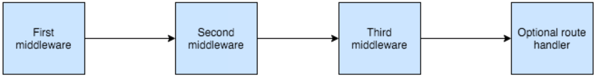

# Ваш первый сервер на Node.js
*Перевод книги [Node Hero](https://risingstack.com/resources/node-hero) от [RisingStack](https://risingstack.com/). Переведено с разрешения правообладателей.*

В этой главе я расскажу вам о том, как вы можете запустить простой HTTP-сервер на Node.js и начать обрабатывать запросы.

## Модуль `http` для вашего Node.js-сервера

Когда вы начинаете создавать HTTP-приложения в Node.js, встроенные модули `http/https` - это то, с чем вы будете взаимодействовать.

Давайте создадим ваш первый HTTP-сервер на Node.js! Нам будет нужно подключить модуль `http` и привязать наш сервер к порту `3000`.

```javascript
// содежимое index.js
const http = require('http')
const port = 3000

const requestHandler = (request, response) => {
    console.log(request.url)
    response.end('Hello Node.js Server!')
}

const server = http.createServer(requestHandler)

server.listen(port, (err) => {
    if (err) {
        return console.log('something bad happened', err)
    }

    console.log(`server is listening on ${port}`)
})
```

Затем запускаем этот скрипт:

```javascript
$ node index.js
```

Что нужно здесь отметить:
* `requestHandler`: **эта функция будет вызываться каждый раз, когда на сервер придёт запрос**. Если вы откроете в своём браузере адрес `localhost:3000`, два сообщения появятся в консоли: одно для `/` и одно для `favicon.ico`.
* `if (err)`: обработка ошибок: если порт уже занят или есть какие-то другие причины, по которым сервер не может быть запущен, мы получим уведомление об этом.

Модуль `http` крайне низкоуровневый: создание сложного веб-приложения с использованием вышеприведенного фрагмента кода очень трудоемко. Именно по этой причине мы обычно выбираем фреймворки для работы над нашими проектами. Есть множество фреймворков, вот самые популярные:
* [express](http://expressjs.com/)
* [hapi](https://hapijs.com/)
* [koa](http://koajs.com/)
* [restify](http://restify.com/)

*В этой и следующих главах мы будем использовать Express, так как именно для него вы можете найти множество модулей в NPM.*

## Express

> Быстрый, гибкий, минималистичный веб-фреймворк для Node.js — [http://expressjs.com/](http://expressjs.com/)

Добавление Express в ваш проект - это просто установка через NPM:

```javascript
$ npm install express --save
```

После того, как вы установили Express, давайте посмотрим, как создать приложение аналогичное тому, что мы написали ранее:

```javascript
const express = require('express')
const app = express()
const port = 3000

app.get('/', (request, response) => {
    response.send('Hello from Express!')
})

app.listen(port, (err) => {
    if (err) {
        return console.log('something bad happened', err)
    }

    console.log(`server is listening on ${port}`)
})
```

Самое большое различие, которое вы можете здесь заметить, заключается в том, что Express по умолчанию даёт вам роутер. Вам не нужно вручную разбирать URL, чтобы решить, что делать, вместо этого вы определяете маршрутизацию приложения с помощью `app.get`, `app.post`, `app.put` и так далее, а они уже транслируются в соответствующие HTTP-запросы.

Одна из самых мощных концепций, которую реализует Express — это паттерн Middleware.

## Middleware — промежуточный обработчик

Вы можете думать о промежуточных обработчиках как о конвейерах Unix, но для HTTP-запросов.



На диаграмме вы можете увидеть, как запрос идёт через условное Express-приложение. Он проходит через три промежуточных обработчика. Каждый обработчик может изменить этот запрос, а затем, основываясь на вашей бизнес-логике, третий middleware отправит ответ, либо запрос попадёт в обработчик соответствующего роута.

На практике вы можете сделать это следующим образом:

```javascript
const express = require('express')
const app = express()

app.use((request, response, next) => {
    console.log(request.headers)
    next()
})

app.use((request, response, next) => {
    request.chance = Math.random()
    next()
})

app.get('/', (request, response) => {
    response.json({
        chance: request.chance
    })
})

app.listen(3000)
```

Что следует здесь отметить:

* `app.use`: это то, как вы можете описать middleware. Этот метод принимает функцию с тремя параметрами, первый из которых является запросом, второй — ответом, а третий — коллбеком `next`. Вызов `next` сигнализирует Express о том, что он может переходить к следующему промежуточному обработчику.
* Первый промежуточный обработчик только логирует заголовки и мгновенно вызывает следующий.
* Второй добавляет дополнительное свойство к запросу - **это одна из самых мощных функций шаблона middleware**. Ваши промежуточные обработчики могут добавлять дополнительные данные к объекту запроса, который могут считывать/изменять middleware, расположенные ниже.

## Обработка ошибок

Как и во всех фреймворках, правильная обработка ошибок имеет решающее значение. В Express вы должны создать специальный промежуточный обработчик - middleware с четырьмя входными параметрами:

```javascript
const express = require('express')
const app = express()

app.get('/', (request, response) => {
    throw new Error('oops')
})

app.use((err, request, response, next) => {
    // логирование ошибки, пока просто console.log
    console.log(err)
    response.status(500).send('Something broke!')
})

app.listen(3000)
```

Что следует здесь отметить:

* Обработчик ошибок должен быть последней функцией, добавленной с помощью `app.use`.
* Обработчик ошибок принимает коллбек `next`. Он может использоваться для объединения нескольких обработчиков ошибок.

## Рендеринг HTML

Ранее мы рассмотрели, как отправлять JSON-ответы. Пришло время узнать, как отрендерить HTML простым способом. Для этого мы собираемся использовать пакет [handlebars](http://handlebarsjs.com/) с обёрткой [express-handlebars](https://www.npmjs.com/package/express-handlebars).

Сначала создадим следующую структуру каталогов:

```
├── index.js
└── views
    ├── home.hbs
    └── layouts
        └── main.hbs
```

После этого заполните `index.js` следующим кодом:

```javascript
// index.js
const path = require('path')
const express = require('express')
const exphbs = require('express-handlebars')

const app = express()
app.engine('.hbs', exphbs({
    defaultLayout: 'main',
    extname: '.hbs',
    layoutsDir: path.join(__dirname, 'views/layouts')
}))
app.set('view engine', '.hbs')
app.set('views', path.join(__dirname, 'views'))

app.listen(3000)
```

Приведенный выше код инициализирует движок handlebars и устанавливает каталог шаблонов в `views/layouts`. Это каталог, в котором будут храниться ваши шаблоны.

После того, как вы сделали эту настройку, вы можете поместить свой начальный `html` в `main.hbs`. Чтобы всё было проще, давайте сразу перейдём к этому:

```html
<html>
    <head>
        <title>Express handlebars</title>
    </head>
    <body>
        {{{body}}}
    </body>
</html>
```

Вы можете заметить метку `{{{body}}}` — здесь будет размещен ваш контент. Давайте создадим `home.hbs`!

```html
<h2>Hello {{name}}</h2>
```

Последнее, что мы должны сделать, чтобы заставить всё это работать, - добавить обработчик маршрута в наше приложение Express:

```javascript
app.get('/', (request, response) => {
    response.render('home', {
        name: 'John'
    })
})
```

Метод `render` принимает два параметра:
* Первый — это имя шаблона.
* Второй — данные, необходимые для рендеринга.

Как только вы сделаете запрос по этому адресу, вы получите что-то вроде этого:

```html
<html>
    <head>
        <title>Express handlebars</title>
    </head>
    <body>
        <h2>Hello John</h2>
    </body>
</html>
```

Это всего лишь верхушка айсберга. Чтобы узнать, как добавить больше шаблонов (и даже частичных), обратитесь к официальной документации [express-handlebars](https://www.npmjs.com/package/express-handlebars).

## Отладка Express

В некоторых случаях вам может потребоваться выяснить, что происходит с Express, когда приложение работает. Для этого вы можете передать следующую переменную окружения в Express: `DEBUG=express*`.

Вы должны запустить свой Node.js HTTP-сервер, используя:

```
$ DEBUG=express* node index.js
```

## Резюме

Вот как вы можете настроить свой первый HTTP-сервер на Node.js с нуля. Я рекомендую Express для начала, а затем поэкспериментируйте.

---

В следующей главе вы узнаете, **как получать информацию из баз данных**.

---

*Слушайте наш подкаст в [iTunes](https://itunes.apple.com/ru/podcast/девшахта/id1226773343) и [SoundCloud](https://soundcloud.com/devschacht), читайте нас на [Medium](https://medium.com/devschacht), контрибьютьте на [GitHub](https://github.com/devSchacht), общайтесь в [группе Telegram](https://t.me/devSchacht), следите в [Twitter](https://twitter.com/DevSchacht) и [канале Telegram](https://t.me/devSchachtChannel), рекомендуйте в [VK](https://vk.com/devschacht) и [Facebook](https://www.facebook.com/devSchacht).*

[Глава на Medium](https://medium.com/devschacht/node-hero-chapter-4-c2ebcd12565c)
